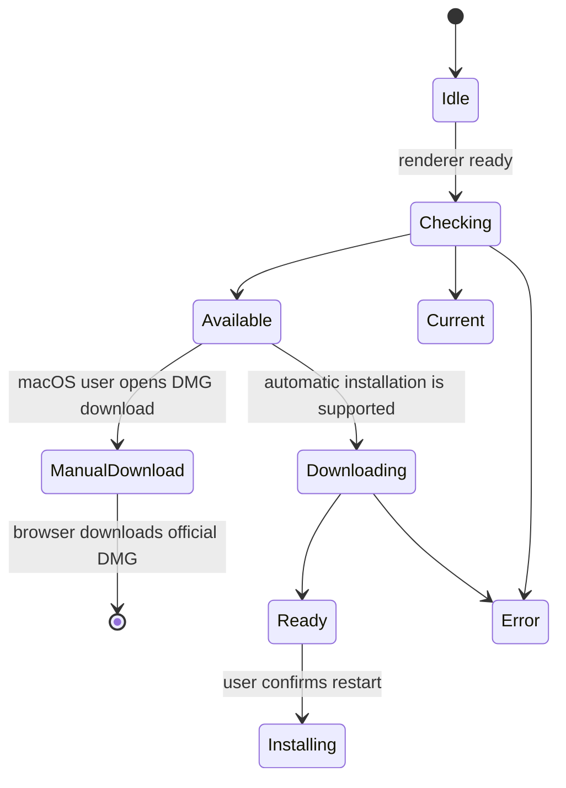

# Aplicación de escritorio y clientes complementarios

## Aplicación de escritorio Electron

Electron empaqueta Gnosi como aplicación de escritorio. El proceso principal gestiona el arranque y la parada del backend, las ventanas, los recursos del paquete, las actualizaciones y las acciones privilegiadas. La interfaz utiliza una API limitada de preload, no acceso directo a Node.js.

Los menús y el aviso de actualización de la interfaz pertenecen a `app/desktop/`. Las notas de versión pertenecen a la funcionalidad del centro de control y consumen el mismo JSON de releases. Se conservan los métodos de preload, los eventos y los destinos de descarga.

## Arranque del proceso propio y recursos revisados

El lanzador espera al proceso que ha creado, no a cualquier servicio del puerto
5002. Cada arranque sustituye `GNOSI_DESKTOP_INSTANCE` por un marcador nuevo.
`/api/health` lo devuelve en `x-gnosi-desktop-instance` solo si la respuesta es
correcta; el JSON y la API pública no cambian. El marcador identifica el proceso,
no autentica al usuario. Se exige un proceso vivo y una respuesta completa,
limitada y coincidente. Las redirecciones, respuestas HTTP 200 ajenas, JSON
incorrecto, tiempos agotados o salidas prematuras abortan el arranque y detienen
el proceso propio. Si falta el ejecutable empaquetado, no se usa Python del sistema.

La activación, Nueva ventana, Configuración y las comprobaciones de actualización
no pueden eludir esta espera ni la parada. Salir durante el arranque no puede
abrir una ventana tardía. El diálogo previo a React ofrece instrucciones en
inglés, catalán, castellano y francés según el idioma del sistema; los detalles
técnicos quedan en el registro de la aplicación.

Siete gestores IPC tienen contratos de petición y respuesta comprobados y
validan al emisor antes de leer argumentos o ejecutar acciones privilegiadas.
El gestor de autocompletado permanece en `main.js`: la extracción no implica
cobertura de tipado de todo el proceso principal.

`backend_resources.py` selecciona archivos de runtime revisados y descubre
módulos Python sin importar la aplicación. Conserva migraciones y plantillas
de Alembic, instrucciones del agente, habilidades de traducción dinámicas,
complementos de ejemplo y estilos de citas. No copia recursivamente configuración
local, vaults, bases de datos, secretos ni herramientas generadas. Los recursos
ausentes o modificados, archivos no revisados en los árboles seleccionados,
rutas inseguras o contenido prohibido hacen fallar el empaquetado.

La política comprueba el análisis real de PyInstaller antes de recopilar archivos,
el resultado antes y después de copiarlo y los recursos `python/` finales de
Electron antes de firmar. Las rutas con espacios se pasan como argumentos
separados. Estas comprobaciones no certifican instaladores: antes de publicar
hay que probar el arranque congelado, la instalación y la actualización desde
2.x en cada plataforma, además de la matriz nativa y Docker.

El generador de OpenAPI también activa `GNOSI_VALIDATION_ROOT` antes de importar
la configuración de la aplicación. Los mismos selectores temporales validados
impiden leer archivos de entorno, configuración del repositorio y credenciales
durante este paso del build; generar el esquema no debe consultar datos personales.

## Máquina de estados de las actualizaciones

Las comprobaciones están deshabilitadas en desarrollo. Las descargas solo comienzan por una acción explícita. En macOS, las firmas ad hoc actuales requieren abrir el DMG oficial de la arquitectura correspondiente; no se ofrece reinicio e instalación automáticos hasta disponer de firma Developer ID estable y notarización. Windows y Linux conservan el flujo automático con confirmación. El estado más reciente puede recuperarse por IPC aunque la interfaz se suscriba tarde. Ni el arranque ni un cambio de versión abren las notas automáticamente; están disponibles en el centro de control.

Los artefactos de lanzamiento incluyen instaladores y metadatos de actualización para macOS, Windows y Linux. La preparación de la versión mantiene alineados los frontend y los manifiestos de Electron; las etiquetas se crean sólo a partir de la revisión `main` se compromete.

El workflow canónico de release empaqueta macOS Intel y Apple Silicon en jobs
separados de una matriz. Cada job se ejecuta sobre la arquitectura
correspondiente de macOS 15 y construye un único backend nativo con PyInstaller
antes de invocar electron-builder para el mismo objetivo. Así se evita copiar
un ejecutable Python nativo del host dentro de la aplicación de la otra
arquitectura.
La matriz de macOS está cerrada por arquitectura: cada runner local pasa una
única arquitectura por CLI y los objetivos compartidos de macOS de
electron-builder no pueden declarar una lista de arquitecturas. Esto evita
empaquetar un backend Python congelado nativo del host dentro de una aplicación
Electron para la arquitectura contraria.
Las releases manuales hacen checkout del commit de la ejecución (`github.sha`);
la etiqueta solicitada solo aporta la versión semántica y el destino de la
release pública. Así los binarios incorporan las correcciones de empaquetado
fusionadas después de preparar la versión sin mover una etiqueta inmutable. El
job de Windows expone la instalación estándar `Program Files\\Git\\cmd` antes
del checkout si el servicio del runner no la hereda mediante `PATH`, evitando
el fallback al ZIP REST.
Los scripts generados del job usan una excepción de política de ejecución de
PowerShell limitada al job. Así, los valores restrictivos del servicio no
rechazan los `.ps1` efímeros y no se debilita la política global de la VM.
La release de Linux también queda cerrada por arquitectura: el runner local y
el backend de PyInstaller son ARM64, y electron-builder recibe `--arm64`
explícitamente. Este runner no puede generar ningún paquete etiquetado como x64,
porque contendría un ejecutable de backend de la arquitectura contraria.
Los runners de release están fijados en lugar de usar
`macos-latest`, cuya migración a macOS 26 cambió la creación del DMG a APFS y
rompió la fase de montaje y personalización de electron-builder.
Cada job de release también pasa explícitamente al constructor del backend el
comando Python proporcionado por `actions/setup-python`. Esto mantiene las
extensiones binarias y las bibliotecas OpenSSL recopiladas sobre un único ABI
de intérprete y evita que un Python más nuevo del runner sustituya el entorno
de release.
Como `cryptography` 49 y posteriores ya no publican wheels macOS x86_64, el
paquete Intel usa la última línea universal2 compatible (`48.0.1`) y las demás
plataformas conservan el requisito actual. El instalador del backend congelado
exige una distribución binaria de `cryptography`: debe fallar en lugar de
compilar contra un OpenSSL del runner que pueda colisionar con la biblioteca
recopilada por PyInstaller.

La lista de archivos del constructor de Electron es un límite explícito del
runtime. El hook multiplataforma `afterPack` inspecciona el `app.asar` final y
rechaza un paquete que omita el proceso principal, el preload, el módulo del
menú nativo, el iniciador del backend o la política de actualización. Esta comprobación del artefacto
instalado complementa las pruebas de código fuente e impide que un árbol de
fuentes válido produzca una aplicación que falle antes de abrir la primera
ventana.

La ruta del backend empaquetado resuelve el propio ejecutable de PyInstaller en
macOS y Linux, y su equivalente `.exe` en Windows. El proceso principal ejecuta
directamente ese archivo resuelto y no lo trata como otro nivel de directorio.
La construcción limpia instala los requisitos canónicos del runtime E2E,
incluidas las dependencias de proveedores y API, e inicia el ejecutable
congelado como prueba de humo multiplataforma antes de continuar con el paquete
de escritorio.

El proceso de escritorio usa `GNOSI_DATA_DIR` dentro de la carpeta de datos del
usuario de Electron por defecto; `GNOSI_LOCAL_DATA` es un alias compatible en 3.x.
Se conservan las sobrescrituras explícitas. Así se evita el valor por defecto
de Docker `/data`. La comprobación de arranque consulta el endpoint
público `/api/health` y no queda bloqueada por un endpoint protegido. El backend
congelado desactiva el observador de recarga de archivos de Uvicorn; el
desarrollo nativo desde código fuente conserva la recarga.

## Preparación de versiones

`frontend/src/features/control-center/releases/releases.json` es el historial canónico de versiones
incluido en el paquete. La herramienta de versiones mantiene alineados los
manifiestos raíz, frontend y desktop, los metadatos Python y los locks pnpm/uv.
Una entrada estable preparada antes de
publicarse omite expresamente `downloadUrl`; este campo solo se añade cuando
existen la etiqueta inmutable y los artefactos de cada plataforma.
Como la versión del manifiesto del frontend es un límite de escritorio de alto
impacto, cada pull request de preparación de una release también actualiza este
contrato revisado y sus espejos localizados, aunque el patch no cambie el
comportamiento en tiempo de ejecución.
La validación del changelog normaliza los finales de línea antes de compararlos,
de modo que un checkout Windows con CRLF equivalente no haga fallar el gate de
empaquetado multiplataforma.

Antes de crear la etiqueta, la PR de release debe superar la validación del
frontend, los tests backend, la QA nativa en el navegador y la puerta de
documentación de ingeniería. Tras la integración, el workflow público canónico
construye el commit revisado. El workflow de release es el único responsable
de las etiquetas oficiales, los artefactos multiplataforma, los catálogos
firmados, las notas y los borradores. No interviene un sincronizador de
repositorios. Los artefactos de macOS, Windows y Linux se revisan antes de publicarlos.

La preparación de la v2.0.0 sigue este límite: las notas localizadas incluidas
y el changelog generado se publican con los manifiestos sincronizados, mientras
que la etiqueta inmutable y el enlace de descarga de cada plataforma solo se
añaden después de que el commit revisado de main supere el workflow oficial de
release.

El parche v2.0.1 mantiene completas las dependencias canónicas del backend
congelado y envía las etiquetas oficiales a la matriz de runners locales
configurada. Así el workflow valida los mismos entornos que generan los
artefactos.

La preparación de la v2.0.5 añade una comprobación obligatoria de metadatos
antes del empaquetado por plataforma. Rechaza una etiqueta si los manifiestos
de Electron y del frontend, el lockfile del monorepo, los cuatro catálogos de
release localizados y el changelog generado no describen la misma versión.

## Cortapapeles web

La extensión del navegador extrae el título de la página actual, URL, contenido seleccionado o legible, y metadatos soportados, luego envía una solicitud limitada a la API de Gnosi. El motor realiza autenticación, desinfección, deduplicación y Vault escribe. La extensión no recibe acceso arbitrario al sistema de archivos Vault.

## Clientes de citación de libreOffice y Word

La extensión LibreOffice registra un controlador de protocolo y llama a los puntos finales de citación de Gnosi desde el proceso de oficina. El ayudante de Word mantiene el estado de tarea/panel/adición requerido para acceder al mismo servicio local. Ambos clientes tratan la inserción de citación y la actualización de bibliografía como mutaciones explícitas de documentos.

Las API específicas de la oficina se aíslan detrás de ayudantes de traversal e inserción para que las pruebas puedan falsificar el UNO o agregar límite sin requerir la aplicación completa de la oficina para cada prueba de unidad.

## Invariantes

- El código de renderizador no tiene capacidad ilimitada de Node.js o sistema de archivos.
- IPC expone operaciones nombradas con entradas validadas.
- Actualizar la descarga y la instalación requieren acciones explícitas del usuario.
- Los caminos de recursos combinados difieren de los caminos de desarrollo y se resuelven en
tiempo de ejecución.
- Los clientes acompañantes autentican el motor y permanecen dentro de su estrecho
captura o alcance de citación.
- Los borradores de la versión se inspeccionan antes de su publicación.

## Aceptación local de la distribución

La prueba del backend empaquetado exige una respuesta HTTP 200 de `/api/health`
con `status: ok`, `mode: FastAPI` y la identidad única de la prueba en `gnosi_mode`.
Un proceso vivo, un puerto ocupado, una redirección u otra instancia de Gnosi
no pueden superarla. Utiliza directorios temporales de vault y datos, un puerto
local y un entorno filtrado; desactiva tareas programadas y detiene y recoge el
proceso hijo tanto si funciona como si falla. `GNOSI_VALIDATION_ROOT` es exclusivo
de estas pruebas: todas las rutas de datos deben quedar dentro de esa raíz;
se desactivan los archivos de entorno locales y compartidos y todo acceso a los
gestores de credenciales. No debe configurarse en desarrollo normal ni en instalaciones.

Las pruebas con subprocesos ficticios y FastAPI ejecutado desde el código fuente
validan este contrato, pero no certifican el ejecutable empaquetado ni su
instalador. Cada plataforma todavía necesita sus propias pruebas reales.

El control documental de las PR utiliza dependencias congeladas y modo de
comprobación contra el commit base exacto, con permisos de solo lectura.
No repara catálogos ni despliega documentación; la publicación sigue separada en main.

## Enfoque de verificación

Antes de publicar, el workflow instala las dependencias de producción de desktop
según el lock, sin ejecutar scripts de instalación, descarga cada arquitectura
en una carpeta separada y ejecuta `release-artifacts.cjs collect`. Este paso
comprueba que el tag coincide con la versión del código, verifica referencias y
hashes SHA-512, rechaza archivos ausentes o duplicados y reúne ambas arquitecturas
de Mac en un único `latest-mac.yml`. Los índices públicos y la publicación solo
se ejecutan si esta comprobación pasa. Las pruebas locales con datos ficticios
no sustituyen la matriz real de construcción y actualización por plataforma.

Ejecute comprobaciones de sintaxis/construcción de electrones, pruebas de humo de backend empaquetados, pruebas de estado del actualizador, validación de compilación de extensiones, pruebas de transmisión de citas y CI de la plataforma.
