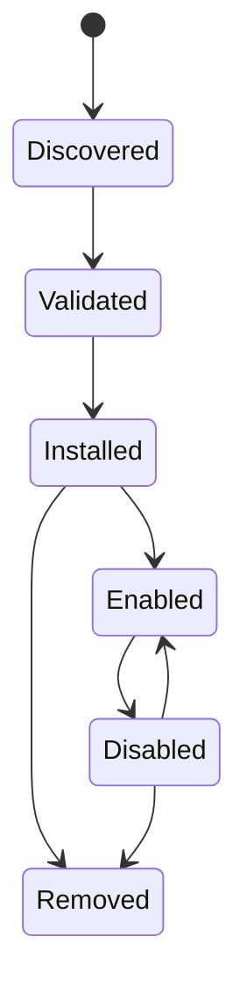

# Integraciones y complementos

## Responsabilidad

Las integraciones conectan cuentas de usuario y sistemas externos. Los complementos extienden Gnosi con contribuciones declarativas y comportamiento ejecutable limitado. Los servidores MCP aportan herramientas de agente a través de un límite de protocolo separado.

La frontera HTTP de integraciones está tipada estrictamente sin cambiar los
payloads públicos. Las pruebas de conexión Mail y DAV validan las credenciales
de texto obligatorias antes de abrir sockets. Las URL DAV pueden apuntar a
redes privadas autoalojadas como Nextcloud, pero se bloquean loopback,
link-local, multicast, direcciones reservadas y no especificadas.

## Persistencia en la integración

El administrador de integración almacena la configuración de la cuenta no secreta y las referencias a secretos bajo datos locales. Cada máquina reconecta las cuentas de forma independiente. Configura APIs listan el estado de conexión enmascarado, validar la configuración, probar la conectividad, elegir por defecto y desconectar proveedores sin exponer tokens brutos.

Los callbacks de Google y Microsoft OAuth crean o actualizan registros de proveedores. IMAP, SMTP, CalDAV, Drupal, Notion y adaptadores similares normalizan sus propios ajustes en el registro de integración común cuando es posible.

## Propiedad y compatibilidad del motor

El dominio de configuración posee las 23 operaciones HTTP de plugins incorporados y de terceros. `backend/domains/configuration/api/plugins.py` traduce peticiones HTTP, `plugin_lifecycle.py` posee una activación con conocimiento de dependencia y transiciones en tiempo de ejecución, `plugin_models.py` es propietario de los contratos Pydantic, y `plugin_state.py` es el único propietario de los bloqueos por proceso y la tienda estatal por vault normalizado.

El paquete tipado `backend/domains/plugins/` es responsable de validar los
manifiestos, contener las rutas de instalación, preparar y revertir los ZIP,
exportar paquetes de forma determinista, normalizar permisos y ejecutar el
sandbox de Node con JSON por líneas. Los módulos históricos
`backend/services/plugin_system.py` y `plugin_sandbox.py` siguen siendo fachadas
delgadas. Son los únicos propietarios de las constantes compatibles, el
registro de controladores del host inyectados, la ruta del runner y los puntos
de sustitución tardía; el estado del ciclo de vida y del sandbox no se duplica
entre las capas.

`backend/api/vault_routes.py` Sigue siendo una fachada de composición temporal para las importaciones heredadas. Inyecta trayectoria, persistencia, tiempo de ejecución, selección de modelos y colaboradores de bloqueo de mutaciones y reexporta los modelos y manipuladores históricos. Las costuras de carga, ahorro, ciclo de vida, modelo resumen y bloqueo de mutaciones permanecen remplazadas dinámicamente para plugins y pruebas. Los módulos de dominio nunca importan la fachada. El orden de ruta, rutas, métodos, códigos de estado, esquemas de carga útil, identificadores de operación y el contrato OpenAPI generado permanecen congelados durante esta migración estructural.

La integración de Notion pertenece a `backend/domains/notion`. Sus módulos
tipados separan la conversión de la importación REST, la recreación de vistas
incrustadas, las fases del clon exacto, el descubrimiento del workspace, la
persistencia de archivos y del registro de rutas, y la verificación de solo
lectura. `backend/api/notion_routes.py` conserva la traducción HTTP y el estado
de progreso del clon. Las tres rutas históricas
`backend/services/notion_{importer,clone,view_recreator}.py` son fachadas de
compatibilidad explícitas: los imports, globals y puntos de `monkeypatch` con
resolución tardía siguen disponibles. El orden, métodos, paths, payloads,
descripciones y documento OpenAPI de Notion permanecen idénticos byte a byte.

El dispatcher y la fachada del sandbox comparten un contrato tipado de host
handler con dos argumentos: argumentos acotados e identificador del plugin. Los
RPC de Vault importan de forma perezosa los propietarios canónicos de páginas,
registro y configuración, evitando ciclos y llamadas a la fachada dinámica.

## Ciclo de vida del complemento

Los paquetes de complementos declaran identidad, versión, compatibilidad, permisos, contribuciones e información de integridad. La instalación valida rutas, estructura de manifiesto, firmas cuando sea necesario y efectos declarados. Habilitar reconcilia ídempotentemente configuraciones administradas, perfiles de IA, habilidades o herramientas. Desactivar suspende las contribuciones administradas mientras se preservan las sobreposiciones de propiedad del usuario.

Las capacidades secundarias incorporadas utilizan el mismo límite del ciclo de vida por vault. El registro autorizado declara dependencias, rutas, superficies de interfaz de usuario y destinos de configuración. `.gnosi/plugins.json` esquema versión 2 registros explícitos `enabled_builtin` y `enabled_third_party` listas mientras se mantiene `disabled` La migración de un esquema antiguo o que falta es atómica e idempotente: cada capacidad opcional comienza deshabilitada y se conservan todos los ajustes, permisos y registros compatibles con el avance desconocidos.

Los cambios en el ciclo de vida pasan por el `POST /api/vault/plugins/{id}/lifecycle` un cambio con requisitos previos o dependientes habilitados primero devuelve un conflicto estructurado; un administrador confirma la activación agrupada o cascada. Las rutas desactivadas fallan antes de que su implementación de funciones se ejecute, y el trabajo externo programado comprueba el mismo registro. Mantenimiento básico, Markdown, vistas del calendario de la base de datos, campos de contacto, archivos adjuntos de medios y dibujos no dependen de estos plugins.

Plugins Settings posee instalación, activación, permisos, actualizaciones y eliminación. La configuración de capacidades activas se expone en Conexiones, Conocimiento o Avanzado. Una acción de configuración abre ese destino directamente y las capacidades sin configuración global no crean páginas vacías.

El comportamiento del complemento ejecutable se ejecuta a través de un límite de sandbox con un entorno restringido y tiempo de espera. Los complementos no reciben el entorno host completo o acceso secreto arbitrario.

La red directa permanece desactivada en ambos tiempos de ejecución de plugins. `network` capacidad expone sólo el RPC host, que rechaza los destinos privados y los métodos de límites, redireccionamientos, tiempo y tamaño de respuesta. `connect-src 'none'`; el padre llama al mismo límite de backend después de comprobar los permisos declarados y concedidos del plugin.

Los complementos de terceros pueden declarar el aditivo `ui:settings` permiso y llamada `gnosi.registerSettingsPanel(...)`. Los paneles activos y concedidos aparecen en el grupo de Extensiones dinámicas, se renderizan dentro del sandbox de origen opaco existente y desaparecen tan pronto como el plugin es desactivado, revocado o eliminado. Leer o escribir la propia configuración del plugin requiere adicionalmente el existente `settings` permiso. La API de host permanece en la versión principal 2.

## Distribución en el mercado

El índice oficial de plugin y su firma independiente se publican como activos GitHub Release. La instalación remota del catálogo requiere un índice firmado de confianza y cada paquete seleccionado requiere tanto la integridad SHA-256 y una firma independiente Ed25519. La procedencia instalada registra la URL fuente, la suma de comprobación y el editor verificado. La instalación ZIP local sigue disponible para el desarrollo, pero comienza deshabilitada sin subvenciones.

Los plugins instalados se pueden exportar como ZIP deterministas. La sumisión pública es una operación de administrador enviada a un bróker de moderación explícitamente configurado; Gnosi nunca incrusta un token de escritura GitHub. El bróker pone en cuarentena el paquete y lo publica sólo después de CI y revisión humana.

## Límite MCP

Los servidores MCP configurados son procesos independientes o puntos finales remotos. Startup descubre sus esquemas de herramientas y los normaliza en el catálogo de agentes. `Retry-After` El manejo está limitado. Un servidor fallido se registra sin descartar herramientas de servidores sanos.

## Ejemplo y acompañamiento de integraciones

El repositorio incluye un paquete de plugins, un proxy Drupal MCP, la extensión de citación LibreOffice y un ayudante de citación Word. Estos son clientes separados con contratos de backend estrechos; no comparten automáticamente el sistema de archivos backend o el acceso de credenciales.

## Invariantes

- Los secretos de integración viven fuera de Git y la bóveda sincronizada.
- Desconectar elimina o revoca la referencia de credencial local y seleccionada
por defecto de forma consistente.
- Los valores administrados por plugins y usuarios siguen siendo distinguibles.
- La extracción de archivos y las rutas de plugin no pueden escapar de su raíz de instalación.
- La compatibilidad y la validación de permisos se producen antes de la activación.
- Los índices oficiales y los paquetes remotos fallan cuando faltan metadatos de integridad.
- Los enchufes de plugin directo y las conexiones del navegador nunca pasan por alto el RPC del host.
- Una capacidad deshabilitada no puede iniciar una nueva ruta, sincronización, automatización o efecto externo.
- Desactivar o migrar nunca elimina datos, configuraciones, credenciales o perfiles del plugin.
- El origen y efecto de la herramienta MCP permanece visible después de la normalización del catálogo.

## Enfoque de verificación

Ejecute pruebas de manifiesto, firma, sandbox, carrera de estado, contribución de IA, enrutamiento MCP, reintento y conector. Una prueba de integración en vivo utiliza una cuenta de prueba dedicada y no debe mutar los datos de producción de forma no intencional.
