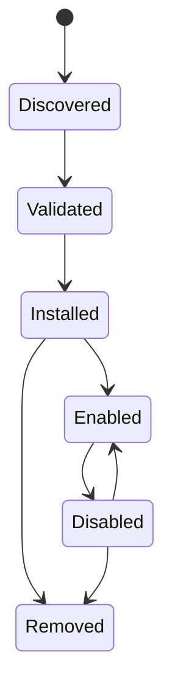

# Integraciones y complementos

## Responsabilidad

Las integraciones conectan cuentas de usuario y sistemas externos. Los complementos extienden Gnosi con contribuciones declarativas y comportamiento ejecutable limitado. Los servidores MCP aportan herramientas de agente a través de un límite de protocolo separado.

La frontera HTTP de integraciones está tipada estrictamente sin cambiar los
payloads públicos. Las pruebas de conexión Mail y DAV validan las credenciales
de texto obligatorias antes de abrir sockets. Las URL DAV pueden apuntar a
redes privadas autoalojadas como Nextcloud, pero se bloquean loopback,
link-local, multicast, direcciones reservadas y no especificadas.

## Persistencia de las integraciones

El gestor de integraciones almacena la configuración no secreta de las cuentas y las referencias a secretos en los datos locales. Cada máquina reconecta las cuentas de forma independiente. Las API de configuración muestran el estado de conexión enmascarado, validan los ajustes, prueban la conectividad, seleccionan valores predeterminados y desconectan proveedores sin exponer tokens en bruto.

Los callbacks de Google y Microsoft OAuth crean o actualizan registros de proveedores. IMAP, SMTP, CalDAV, Drupal, Notion y adaptadores similares normalizan sus propios ajustes en el registro de integración común cuando es posible.

Google OAuth conserva los verificadores PKCE pendientes en un mapa de estados
acotado y con caducidad, y rechaza los callbacks cuyo estado falta o ha caducado
antes del intercambio de tokens. Los payloads de configuración y cuenta están
tipados en la frontera del adaptador. Los diccionarios de estado y salud se
validan mediante modelos Pydantic antes de devolver su estructura histórica de
mapeo; los handlers de redirección exponen tipos de respuesta explícitos.
`response_model=None` conserva los esquemas OpenAPI byte a byte, y las excepciones
de tipado se limitan a las llamadas sin tipado del SDK de Google.

El adaptador Google People restringe las respuestas de descubrimiento a registros
de contacto de Gnosi, renueva y guarda tokens de acceso mediante el gestor de
integraciones, conserva las actualizaciones con ETag y normaliza nombres principales,
direcciones, organizaciones, fotos y marcas temporales del proveedor. Los objetos
del SDK sin tipado quedan confinados al adaptador y no atraviesan sus funciones
de servicio tipadas.

Microsoft OAuth aplica el mismo límite de estado: los estados de autorización
generados caducan a los diez minutos y se consumen antes del intercambio de tokens.
El JSON de tokens y perfiles Graph se restringe dentro del adaptador de ruta;
su mapeo de estado se valida con Pydantic y los handlers de redirección tienen
tipos explícitos. Así se rechazan configuraciones obsoletas antes de las llamadas
de red y se conserva la estructura histórica de la cuenta de correo sin cambiar
las redirecciones ni OpenAPI.

El MCP alojado de Notion utiliza registro dinámico de clientes OAuth 2.1 y PKCE.
Su frontera tipada valida los objetos de descubrimiento y registro, exige que
se devuelva un identificador de cliente, conserva el origen del frontend que
inició la operación y almacena los valores de acceso, renovación, cliente y estado
pendiente únicamente mediante las operaciones de IntegrationManager que gestionan
secretos. La desconexión elimina los tres registros OAuth de Notion.

## Responsabilidades y compatibilidad del backend

El dominio de configuración gestiona las 23 operaciones HTTP de plugins integrados y de terceros. `backend/domains/configuration/api/plugins.py` traduce peticiones HTTP; `plugin_lifecycle.py` gestiona la activación según dependencias y las transiciones en ejecución; `plugin_models.py` define los contratos Pydantic; y `plugin_state.py` es el único responsable de los bloqueos por proceso y del almacén de estado normalizado de cada vault.

El paquete tipado `backend/domains/plugins/` es responsable de validar los
manifiestos, contener las rutas de instalación, preparar y revertir los ZIP,
exportar paquetes de forma determinista, normalizar permisos y ejecutar el
sandbox de Node con JSON por líneas. Los módulos históricos
`backend/services/plugin_system.py` y `plugin_sandbox.py` siguen siendo fachadas
delgadas. Son los únicos propietarios de las constantes compatibles, el
registro de controladores del host inyectados, la ruta del runner y los puntos
de sustitución tardía; el estado del ciclo de vida y del sandbox no se duplica
entre las capas.

La integración de Notion pertenece a `backend/domains/notion`. Sus módulos
tipados separan la conversión de la importación REST, la recreación de vistas
incrustadas, las fases del clon exacto, el descubrimiento del workspace, la
persistencia de archivos y del registro de rutas, y la verificación de solo
lectura. `backend/api/notion_routes.py` conserva la traducción HTTP y el estado
de progreso del clon. Las tres rutas históricas
`backend/services/notion_{importer,clone,view_recreator}.py` son fachadas de
compatibilidad explícitas: los imports, las variables globales y los puntos de monkeypatch con
resolución tardía siguen disponibles, mientras la implementación canónica reside
en el paquete del dominio. Las preferencias de importación de Notion requieren
la raíz `LOCAL_DATA` configurada; las dependencias de clonación y verificación
consumen directamente el accesor tipado del vault activo opcional, sin volver
a convertir su resultado en cada frontera de ruta. El orden, métodos, paths, payloads,
descripciones y documento OpenAPI de Notion permanecen idénticos byte a byte.

`backend/api/vault_routes.py` sigue siendo una fachada temporal de composición
para los imports heredados. Inyecta colaboradores de rutas, persistencia,
entorno de ejecución, selección de modelos y bloqueo de modificaciones, y
reexporta los modelos y handlers históricos. Los puntos de sustitución de carga,
guardado, ciclo de vida, modelo de resumen y bloqueo de modificaciones siguen
siendo reemplazables dinámicamente para plugins y pruebas. Algunos módulos de
páginas extraídos todavía importan esa fachada dinámicamente, y las fronteras de
páginas y registro conservan excepciones al tipado. Eliminar estas dependencias
heredadas sigue pendiente; superar una comprobación estricta de tipos no demuestra
una separación tipada completa. El orden de rutas, los paths, métodos, códigos de estado,
esquemas de payload, identificadores de operación y contrato OpenAPI generado
permanecen congelados durante esta migración estructural.

El dominio de plugins y el dispatcher comparten un contrato tipado de handler
del host con dos argumentos: argumentos acotados e identificador del plugin.
La fachada histórica del sandbox conserva su anotación pública introspectable
de un argumento por compatibilidad y la adapta una sola vez en el punto interno
de inyección. Las pruebas de contrato congelan esa firma de la fachada. Los
RPC de Vault importan de forma perezosa los propietarios canónicos de páginas,
registro y configuración, evitando ciclos y llamadas a la fachada dinámica.

El web clipper integrado mantiene pura su lógica de mapeo. Las columnas de destino
se resuelven por identificador inmutable, nombre actual o alias histórico; las
exclusiones explícitas siguen diferenciándose de la detección automática de roles.
Solo se aceptan campos almacenados que puedan solicitarse al usuario, los valores
de la extensión se convierten según el tipo del esquema y se descartan las columnas
obsoletas o derivadas antes del límite normal de escritura del vault.

## Ciclo de vida del complemento

Los paquetes de plugins declaran identidad, versión, compatibilidad, permisos, contribuciones e información de integridad. La instalación valida rutas, estructura del manifiesto, firmas cuando se exigen y efectos declarados. La activación reconcilia de forma idempotente los ajustes gestionados, los perfiles de IA, las habilidades o las herramientas. La desactivación suspende las contribuciones gestionadas y conserva los valores sobrescritos por el usuario.

La capa de composición de configuración del vault consume directamente los tipos
de retorno estrictos de los servicios de estado de plugins, ciclo de vida y resumen.
Mantiene los puntos de sustitución tardía de la fachada para pruebas y extensiones,
pero ya no convierte estados que están tipados; los contratos de persistencia y
actualización del entorno de ejecución tienen así un único responsable autoritativo.
Las transiciones de plugins integrados no resuelven rutas del sistema de archivos.
La validación del manifiesto de terceros resuelve de forma diferida el directorio
de plugins del vault actual, solo después de identificar el destino como externo;
esto mantiene deterministas la selección del vault por petición y las llamadas
aisladas al ciclo de vida.

Las capacidades secundarias integradas utilizan el mismo límite de ciclo de vida por vault. El registro autoritativo declara dependencias, rutas, áreas de interfaz y destinos de Configuración. La versión 2 del esquema de `.gnosi/plugins.json` registra listas explícitas `enabled_builtin` y `enabled_third_party`, y conserva `disabled` para clientes antiguos. La migración desde un esquema anterior o ausente es atómica e idempotente: todas las capacidades opcionales comienzan desactivadas y se conservan los ajustes, permisos y registros desconocidos compatibles con versiones futuras.

Los cambios de ciclo de vida pasan por el contrato general `POST /api/vault/plugins/{id}/lifecycle`. Un cambio con requisitos previos o dependientes activos devuelve primero un conflicto estructurado; después, un administrador confirma la activación agrupada o en cascada. Las rutas desactivadas fallan antes de ejecutar la implementación de la funcionalidad, y el trabajo externo programado comprueba el mismo registro. El mantenimiento básico, Markdown, las vistas de calendario de bases de datos, los campos de contacto, los adjuntos multimedia y los dibujos no dependen de estos plugins.

La sección de plugins de Configuración gestiona la instalación, la activación, la concesión de permisos, las actualizaciones y la eliminación. La configuración de capacidades activas se expone en Conexiones, Conocimiento o Avanzado. La acción de configurar abre ese destino directamente; las capacidades sin configuración global no crean páginas vacías.

El comportamiento ejecutable de los plugins pasa por un sandbox con un entorno restringido y un tiempo máximo de ejecución. Los plugins no reciben el entorno completo del host ni acceso arbitrario a secretos.

El acceso directo a la red permanece desactivado en ambos entornos de ejecución de plugins. La capacidad `network`, cuando se concede, expone solo el RPC del host, que rechaza destinos privados y acota métodos, redirecciones, tiempo y tamaño de respuesta. Los frames de interfaz conservan `connect-src 'none'`; el padre llama al mismo límite del backend después de comprobar los permisos declarados y concedidos al plugin.

Los plugins de terceros pueden declarar el permiso adicional `ui:settings` y llamar a `gnosi.registerSettingsPanel(...)`. Los paneles activos con permiso concedido aparecen en el grupo dinámico Extensiones, se renderizan dentro del sandbox iframe existente de origen opaco y desaparecen al desactivar, revocar o eliminar el plugin. Leer o escribir la configuración propia del plugin requiere además el permiso existente `settings`. La API del host permanece en la versión principal 2.

El puente de interfaz se divide en un host tipado, adaptadores de métodos sujetos
a permisos, gestión del ciclo de vida de frames y un entorno sandbox independiente
en TypeScript. Este entorno se serializa solo después de compilarse; las pruebas
también ejecutan la salida minificada de Vite para evitar que dependencias
capturadas del host rompan el iframe. Ambos extremos verifican la ventana emisora,
no solo el marcador del mensaje o el origen opaco. Se descartan respuestas de frames
retirados o de generaciones anteriores del documento; las modificaciones nunca
se reproducen sobre un documento sustituto.

Mover un iframe activo mediante una inserción DOM ordinaria recarga su documento.
El host de Configuración utiliza un movimiento que conserva el estado cuando está
disponible o espera a que el panel solicitado vuelva a registrarse antes de
renderizarlo. La limpieza del montaje pertenece a una sola instancia del panel,
y actualizar las instantáneas de contribuciones no vuelve a montar un panel que
no ha cambiado. Las pruebas cubren ambas formas de movimiento, la denegación de
permisos, las respuestas obsoletas y el registro repetido. La QA en navegador real
debe comprobar además la apertura, el cierre, la reapertura y la sustitución del
plugin contra una API de prueba aislada.

## Distribución mediante el marketplace

El índice oficial de plugins y su firma separada se publican como recursos de GitHub Release. La instalación desde un catálogo remoto exige un índice firmado de confianza; cada paquete seleccionado requiere integridad SHA-256 y una firma separada Ed25519 de confianza. La procedencia de la instalación registra la URL de origen, la suma de comprobación y el publicador verificado. La instalación de ZIP locales sigue disponible para desarrollo, pero comienza desactivada y sin permisos concedidos.

El JSON del catálogo, el estado de cada vault, los permisos concedidos y el almacén
local de confianza se normalizan en sus límites dinámicos antes de llegar a los
servicios tipados de ciclo de vida y firmas. Los campos desconocidos compatibles
con versiones futuras se conservan; los mapas de claves malformados se recuperan
como una colección vacía de claves del usuario sin reemplazar la confianza incluida.

Los plugins instalados pueden exportarse como ZIP deterministas. El envío público es una operación de administrador dirigida a un servicio intermediario de moderación configurado explícitamente; Gnosi nunca incluye un token de escritura de GitHub. El intermediario pone el paquete en cuarentena y solo lo publica después de la CI y la revisión humana.

## Límite MCP

Los servidores MCP configurados son procesos independientes o endpoints remotos. Durante el arranque se descubren sus esquemas de herramientas y se normalizan en el catálogo del agente. Los reintentos y el tratamiento de `Retry-After` están acotados. Se registra el fallo de un servidor sin descartar las herramientas de los servidores operativos.

## Ejemplos e integraciones complementarias

El repositorio incluye ejemplos de empaquetado de plugins, un proxy MCP para Drupal, la extensión de citas de LibreOffice y un asistente de citas de Word. Son clientes independientes con contratos limitados con el backend; no comparten automáticamente su sistema de archivos ni el acceso a credenciales.

## Invariantes

- Los secretos de integración permanecen fuera de Git y del vault sincronizado.
- La desconexión elimina o revoca de forma coherente la referencia local a credenciales
  y las selecciones predeterminadas.
- Los valores administrados por plugins y usuarios siguen siendo distinguibles.
- La extracción de archivos y las rutas de plugin no pueden escapar de su raíz de instalación.
- La compatibilidad y la validación de permisos se producen antes de la activación.
- Los índices oficiales y los paquetes remotos se rechazan si faltan metadatos de integridad.
- Los sockets directos de plugins y las conexiones del navegador nunca eluden el RPC del host.
- Una capacidad deshabilitada no puede iniciar una nueva ruta, sincronización, automatización o efecto externo.
- Desactivar o migrar nunca elimina datos, configuraciones, credenciales o perfiles del plugin.
- El origen y efecto de la herramienta MCP permanece visible después de la normalización del catálogo.

## Enfoque de verificación

Ejecute las pruebas de manifiestos, firmas, sandbox, condiciones de carrera del estado, contribuciones de IA, enrutamiento MCP, reintentos y conectores. Una prueba de integración real utiliza una cuenta de pruebas dedicada y no debe modificar involuntariamente datos de producción.
