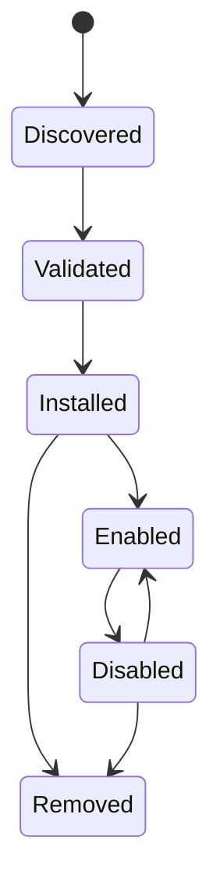

# Integraciones y complementos

## Responsabilidad

Las integraciones conectan cuentas de usuario y sistemas externos. Los complementos extienden Gnosi con contribuciones declarativas y comportamiento ejecutable limitado. Los servidores MCP aportan herramientas de agente a través de un límite de protocolo separado.

## Persistencia en la integración

El administrador de integración almacena la configuración de la cuenta no secreta y las referencias a secretos bajo datos locales. Cada máquina reconecta las cuentas de forma independiente. Configura APIs listan el estado de conexión enmascarado, validar la configuración, probar la conectividad, elegir por defecto y desconectar proveedores sin exponer tokens brutos.

Los callbacks de Google y Microsoft OAuth crean o actualizan registros de proveedores. IMAP, SMTP, CalDAV, Drupal, Notion y adaptadores similares normalizan sus propios ajustes en el registro de integración común cuando es posible.

## Ciclo de vida del complemento

Los paquetes de complementos declaran identidad, versión, compatibilidad, permisos, contribuciones e información de integridad. La instalación valida rutas, estructura de manifiesto, firmas cuando sea necesario y efectos declarados. Habilitar reconcilia ídempotentemente configuraciones administradas, perfiles de IA, habilidades o herramientas. Desactivar suspende las contribuciones administradas mientras se preservan las sobreposiciones de propiedad del usuario.

El comportamiento del complemento ejecutable se ejecuta a través de un límite de sandbox con un entorno restringido y tiempo de espera. Los complementos no reciben el entorno host completo o acceso secreto arbitrario.

Los complementos API v2 pueden declarar `contributes.academicRepositories` para proporcionar un complejo adaptador de búsqueda académica. La contribución requiere la `network` permiso, se ejecuta en el arenero existente, y devuelve el `AcademicWork` Las definiciones de repositorios incorporados y personalizados usan la misma superficie de catálogo, por lo que la activación por búsqueda, origen de origen y errores parciales no dependen del origen del conector.

Los administradores también pueden definir repositorios HTTPS OAI-PMH o repositorios de declaración GET/JSON REST. OAI admite conjuntos, tokens de reanudación, cosechas incrementales y lápidas. Las definiciones de REST tienen página limitada, desplazamiento, cursor o `Link` paginación más asignación de campos JSON explícita. No se aceptan métodos arbitrarios ni código de asignación ejecutable.

La red directa permanece desactivada en ambos tiempos de ejecución de plugins. `network` capacidad expone sólo el RPC host, que rechaza los destinos privados y los métodos de límites, redireccionamientos, tiempo y tamaño de respuesta. `connect-src 'none'`; el padre llama al mismo límite de backend después de comprobar los permisos declarados y concedidos del plugin.

## Distribución en el mercado

El índice oficial de plugin y su firma independiente se publican como activos GitHub Release. La instalación remota del catálogo requiere un índice firmado de confianza y cada paquete seleccionado requiere tanto la integridad SHA-256 y una firma independiente Ed25519. La procedencia instalada registra la URL fuente, la suma de comprobación y el editor verificado. La instalación ZIP local sigue disponible para el desarrollo, pero comienza deshabilitada sin subvenciones.

Los plugins instalados se pueden exportar como ZIP deterministas. La sumisión pública es una operación de administrador enviada a un bróker de moderación explícitamente configurado; Gnosi nunca incrusta un token de escritura GitHub. El bróker pone en cuarentena el paquete y lo publica sólo después de CI y revisión humana.

## Límite MCP

Los servidores MCP configurados son procesos independientes o puntos finales remotos. Startup descubre sus esquemas de herramientas y los normaliza en el catálogo de agentes. `Retry-After` El manejo está limitado. Un servidor fallido se registra sin descartar herramientas de servidores sanos.

## Ejemplo y acompañamiento de integraciones

El repositorio incluye un paquete de plugins, un proxy Drupal MCP, la extensión de citación LibreOffice y un ayudante de citación Word. Estos son clientes separados con contratos de backend estrechos; no comparten automáticamente el sistema de archivos backend o el acceso de credenciales.

## Invariantes

- Los secretos de integración viven fuera de Git y la bóveda sincronizada.
- Desconectar elimina o revoca la referencia de credencial local y seleccionada
por defecto de forma consistente.
- Los valores administrados por plugins y usuarios siguen siendo distinguibles.
- La extracción de archivos y las rutas de plugin no pueden escapar de su raíz de instalación.
- La compatibilidad y la validación de permisos se producen antes de la activación.
- Los índices oficiales y los paquetes remotos fallan cuando faltan metadatos de integridad.
- Los enchufes de plugin directo y las conexiones del navegador nunca pasan por alto el RPC del host.
- Las URLs de repositorio académico pasan HTTPS, DNS/IP, redirigir, timeout, tamaño de respuesta,
y validación XML segura antes de que los datos lleguen a un conector.
- Los servicios externos nunca se exponen como conectores automatizados.
- El origen y efecto de la herramienta MCP permanece visible después de la normalización del catálogo.

## Enfoque de verificación

Ejecute el manifiesto, firma, sandbox, state-race, contribución de IA, enrutamiento MCP, reintento, permiso de repositorio académico, SSRF, XML, paginación y pruebas de conectores. Una prueba de integración en vivo utiliza una cuenta de prueba dedicada, una página de resultados limitada, y no debe mutar los datos de producción de forma no intencional.
