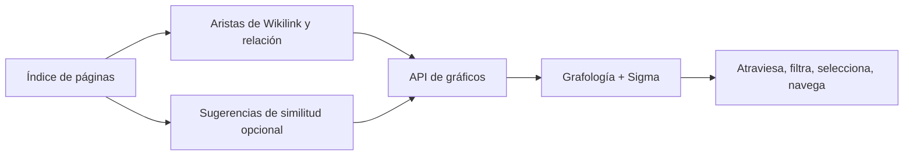

# Gráfico de conocimientos

## Responsabilidad

`backend/domains/graph/` gestiona el escaneo, los nodos, las aristas, la
proyección, los adaptadores y la orquestación. `graph_service.py` es la fachada
estable utilizada por la API, el agente y el planificador.

El gráfico proyecta relaciones de conocimiento explícitas y sugerencias semánticas opcionales en una red interactiva. Soporta navegación y descubrimiento; se deriva de la Bóveda y no es una fuente separada de verdad.

La feature tipada `features/graph/` gestiona estado de ruta, filtros y
composición de página mediante una entrada pública de carga diferida.
Los paneles y modelos internos son privados. `shared/graph/` gestiona el renderer,
el minimapa, la geometría, el teclado, las aristas y la capa semántica reutilizables.
Las rutas de grafos y los grafos incrustados del Vault importan el mismo renderer
directamente, sin agregador de carga inmediata. El traslado revisado sitúa los
filtros reutilizables de grafos en `shared/graph/filtering/` y los filtros de
Vault en `shared/filtering/`. El código compartido no depende de features ni de
app, tampoco mediante imports de tipos. Se conservan proyecciones, configuración,
navegación, controles de cámara y estilos; el traslado requiere verificación
de integración.

## Construcción de gráficos

Los bordes se originan en los enlaces wiki, relaciones, etiquetas u otros metadatos configurados, y los resultados opcionales de similitud. El servicio de gráficos lee prefiere los metadatos de índice y protege el acceso directo a archivos para que un directorio no disponible produzca un gráfico parcial en lugar de un fallo total.

Los objetivos wikilink no resueltos permanecen representables como nodos distintos. No se descartan silenciosamente o se fusionan con la etiqueta de visualización porque hacerlo ocultaría relaciones de conocimiento rotas.

## Revestimiento semántico

Las sugerencias semánticas comparan las representaciones de documentos y producen candidatos anotados. Las sugerencias son una superposición: aceptar o materializar una relación debe usar un flujo explícito de escritura de contenido. La falta de disponibilidad del modelo desactiva la superposición sin cambiar el gráfico explícito.

## Renderizado de la interfaz

`GraphViewer` mapea los datos gráficos en Graphology y Sigma. La disposición de los ajustes controla la simulación de fuerza, la repulsión, la atracción, la gravedad, la evitación de colisiones, los umbrales de etiqueta, el espesor de los bordes, los colores de racimo y la colocación de nodos aislados.

El énfasis en el hover se limita intencionalmente a un lúpulo. El énfasis en el multi-hop hace que los gráficos densos sean ilegibles y oscurece el barrio seleccionado.

## Invariantes

- Identidad del nodo utiliza identidad de página estable, no solo título.
- Las etiquetas de visualización pueden chocar; los identificadores no pueden chocar.
- Los bordes semánticos derivados son distinguibles de las relaciones explícitas.
- El estado de diseño no puede modificar el contenido de Vault.
- Los escaneos parciales están etiquetados y no están en caché como completos.
- Nivel de directorio `EDEADLK` y `EAGAIN` Los fracasos son aislados.

## Enfoque de verificación

Prueba nodos no resueltos, nodos aislados, consistencia de la leyenda de cluster, retroceso de la materia frontal, umbrales de sugerencia semántica, fallas en el directorio de la nube, comportamiento de un solo salto de la suspensión y navegación gráfica de vuelta a la página correcta.
