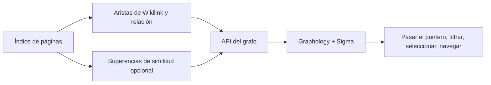

# Grafo de conocimiento

## Responsabilidad

`backend/domains/graph/` gestiona el escaneo, los nodos, las aristas, la
proyección, los adaptadores y la orquestación. `graph_service.py` es la fachada
estable utilizada por la API, el agente y el planificador.

El grafo proyecta relaciones de conocimiento explícitas y sugerencias semánticas opcionales en una red interactiva. Permite navegar y descubrir relaciones; se deriva del vault y no es una fuente de verdad independiente.

La feature estrictamente tipada `features/graph/` gestiona estado de ruta, filtros y
composición de página mediante una entrada pública de carga diferida.
Los paneles y modelos internos son privados. `shared/graph/` gestiona el renderer,
el minimapa, la geometría, el teclado, las aristas y la capa semántica reutilizables.
Las rutas de grafos y los grafos incrustados del Vault importan el mismo renderer
directamente, sin agregador de carga inmediata. El traslado revisado sitúa los
filtros reutilizables de grafos en `shared/graph/filtering/` y los filtros de
Vault en `shared/filtering/`. El código compartido no depende de features ni de
app, tampoco mediante imports de tipos. Se conservan proyecciones, configuración,
navegación, controles de cámara y estilos; el traslado requiere verificación
de integración.

## Construcción del grafo

Los nodos proceden de las páginas indexadas. Las aristas proceden de wikilinks, relaciones, etiquetas u otros metadatos configurados y de los resultados opcionales de similitud. Las lecturas del servicio de grafos priorizan los metadatos del índice y protegen el acceso directo a archivos para que un directorio no disponible produzca un grafo parcial en lugar de un fallo total.

Los objetivos wikilink no resueltos permanecen representables como nodos distintos. No se descartan silenciosamente o se fusionan con la etiqueta de visualización porque hacerlo ocultaría relaciones de conocimiento rotas.

## Capa semántica

Las sugerencias semánticas comparan representaciones de documentos y producen candidatos con puntuaciones. Forman una capa superpuesta: aceptar o materializar una relación exige un flujo explícito de escritura de contenido. Si el modelo no está disponible, se desactiva esa capa sin cambiar el grafo explícito.

## Renderizado de la interfaz

`GraphViewer` mapea los datos del grafo a Graphology y Sigma. Los ajustes de disposición controlan la simulación de fuerzas, la repulsión, la atracción, la gravedad, la prevención de colisiones, los umbrales de etiquetas, el grosor de las aristas, los colores de grupos y la colocación de nodos aislados.

El resaltado al pasar el puntero se limita intencionalmente a un salto. Resaltar varios saltos vuelve ilegibles los grafos densos y oculta el entorno del nodo seleccionado. Los nodos aislados reciben espacio suficiente y una posición estable para permanecer visibles.

## Invariantes

- La identidad del nodo utiliza la identidad estable de la página, no solo el título.
- Las etiquetas visibles pueden coincidir; los identificadores no.
- Las aristas semánticas derivadas se distinguen de las relaciones explícitas.
- El estado de diseño no puede modificar el contenido de Vault.
- Los escaneos parciales están etiquetados y no están en caché como completos.
- Los fallos de directorio `EDEADLK` y `EAGAIN` se aíslan.

## Enfoque de verificación

Pruebe los nodos no resueltos y aislados, la coherencia de la leyenda de grupos, el uso del frontmatter como alternativa, los umbrales de sugerencias semánticas, los fallos de directorios en la nube, el resaltado de un solo salto al pasar el puntero y la navegación desde el grafo hasta la página correcta.
