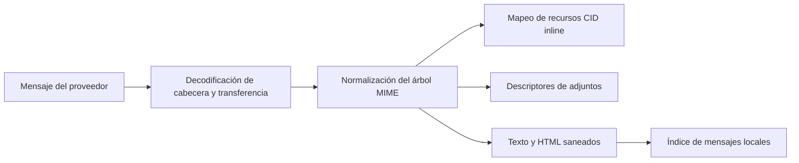

# Correo

## Responsabilidad

Correo integra cuentas IMAP/SMTP, indexación local de mensajes, carpetas, búsqueda, etiquetas, vistas guardadas, borradores, adjuntos, respuestas, búsqueda de contactos, redacción asistida por IA y extracción de entidades. Las credenciales de proveedores permanecen en el almacenamiento local de cada máquina.

El dominio `frontend/src/features/mail/`, estrictamente tipado, gestiona la
composición de la página del buzón, los componentes de correo, los hooks de
etiquetas y vistas guardadas, y sus pruebas. Las rutas de la aplicación consumen
su entrada pública de carga diferida sin cargar anticipadamente el buzón ni el
editor de mensajes. Los adaptadores HTTP compartidos conservan los contratos
API existentes. El editor de correo BlockNote y su adaptador pertenecen a este
dominio. Configuración consume el editor mediante su entrada pública revisada
explícitamente; no hay implementaciones copiadas ni fachadas de compatibilidad. El traslado de
responsabilidades no cambia el envío, el guardado de borradores, la identidad
de carpetas, la privacidad ni las operaciones de proveedores.

## Sincronización

Las integraciones de cuentas describen el protocolo y las referencias a OAuth o credenciales. Una sincronización completa o incremental lee mensajes del proveedor, normaliza identificadores y contenido MIME, y escribe filas en el índice local. Los workers IMAP IDLE mantienen una conexión por cuenta apta y activan una actualización incremental cuando el servidor anuncia cambios.

Los adaptadores de Google y Microsoft exponen los mismos límites tipados de
mensajes, adjuntos, borradores, etiquetas y envío. Los payloads dinámicos de los
SDK se validan dentro de cada adaptador; las únicas excepciones locales de
tipado son las llamadas concretas de descubrimiento de terceros sin tipado,
nunca la API del servicio que consume Gnosi.
La renovación OAuth solo acepta un token concreto y no vacío antes de guardarlo.
El constructor de credenciales y la llamada de renovación de Google sin tipado
están aislados y documentados dentro del adaptador; IMAP y SMTP reciben tipos
de conexión de la biblioteca estándar en la frontera XOAUTH2.

La ingesta por lotes utiliza savepoints para que un mensaje malformado no revierta los mensajes anteriores. La identidad de mensajes e hilos debe permanecer estable entre sincronizaciones. Los metadatos de interfaz de cada hilo se guardan como un objeto JSON validado dentro del límite local de secretos y datos. Las operaciones de lectura, modificación y escritura comparten un bloqueo para impedir que las pestañas concurrentes descarten silenciosamente los campos de otras; las entradas raíz o de hilo malformadas se rechazan sin afectar a los registros válidos. Los nombres de carpetas son valores del proveedor; la interfaz traduce las carpetas de significado conocido sin cambiar los valores persistidos que se utilizan para compararlas.

El exportador heredado de Gmail al vault restringe los payloads de descubrimiento
en la frontera del servicio, exige un directorio Mail configurado antes de cualquier
acceso al sistema de archivos y deduplica por identificador de mensaje del proveedor.
El texto multipart, el HTML, las categorías, las etiquetas y la presencia de adjuntos
conservan su representación histórica en Markdown y frontmatter; si falta el vault,
la operación se rechaza sin crear archivos en otro lugar. Cada nota sincronizada
conserva `database_table_id: mail`, y el frontmatter se serializa mediante `yaml.dump`
en lugar de construir manualmente cadenas con escapes.

## MIME y seguridad de contenidos

El HTML se sanea antes de renderizarlo. Las imágenes CID inline se resuelven contra la parte MIME correcta y se conservan al incluir contenido citado en las respuestas. Las imágenes remotas y los adjuntos siguen siendo recursos explícitos y no permiten acceder arbitrariamente a rutas locales desde el HTML.

La frontera de imágenes inline utiliza descriptores MIME tipados y una raíz
`Message` común para los árboles de texto, related y mixed. Solo acepta payloads
decodificados en bytes, normaliza tipos de contenido opcionales y conserva las
URL de assets si no hay Vault activo o el archivo no está materializado.
Los mismos contratos `MimeAsset` e `InlineImage` pasan sin cambios por los
servicios de envío de Gmail, Microsoft Graph y SMTP. Los recursos citados se
convierten en imágenes inline completando explícitamente todos los campos
obligatorios y generando un Content-ID nuevo.

## Preparar y enviar

El editor por bloques crea un borrador que se convierte en HTML y texto seguros para correo. La identidad del remitente, los destinatarios, las cabeceras de respuesta, las citas, los adjuntos y la cuenta del proveedor se validan en el servidor. Guardar un borrador y enviarlo son efectos distintos; el envío cruza un límite externo y devuelve diagnósticos del proveedor si falla.

## Estado relacional local

La base de datos de correo almacena mensajes, etiquetas, asociaciones entre mensajes y etiquetas, y vistas guardadas. Las vistas guardadas contienen campos visibles, filtros tipados, lógica, agrupación, ordenación y acciones disponibles como JSON dentro de filas SQLite.
Los esquemas de creación y actualización parcial siguen siendo contratos Pydantic
independientes: una actualización puede omitir el nombre sin debilitar el requisito
de creación. Sus estructuras HTTP y OpenAPI siguen siendo compatibles con los
clientes 2.x.

## Invariantes

- La sincronización es idempotente para cada identificador de mensaje del proveedor.
- Un mensaje fallido utiliza un savepoint y no aborta el lote de la cuenta.
- Las etiquetas y vistas guardadas son estado local de la aplicación, no etiquetas
  del proveedor, salvo que exista un mapeo explícito.
- Las cabeceras de respuesta conservan la identidad del hilo.
- Las referencias CID apuntan a la parte en línea correcta después de citar o reenviar.
- Eliminar o mover un mensaje del proveedor requiere la cuenta autenticada y
  un destino de carpeta y mensaje validado.
- Los secretos nunca se incluyen en las filas de mensajes ni en las respuestas de configuración del frontend.

## Enfoque de verificación

Pruebe la decodificación MIME, el saneamiento HTML, el renderizado y las respuestas con CID, los savepoints de ingesta, las etiquetas, los filtros de vistas, los borradores, la resolución de identidad y el envío mediante un proveedor real o un stub. Playwright verifica el pegado, la redacción y el comportamiento de las respuestas con citas.
