# Cuadernos fundamentados en fuentes

## Responsabilidad

Los cuadernos fundamentados ofrecen un espacio `/notebooks` dedicado a
preguntar sobre los adjuntos y las URL de los registros seleccionados en la
tabla Referencias configurada. Combinan una biblioteca consultable, un panel de
fuentes paginado, la configuración y el mismo transporte de conversación en
streaming que el asistente flotante.

El cuerpo, el título, las etiquetas y los demás metadatos del registro no son
evidencia. Gnosi solo lee los metadatos para localizar campos definidos como
adjunto/archivo o URL. Un cuaderno nunca modifica ni elimina el registro fuente,
el adjunto o la URL original.

La primera versión no incluye resúmenes de audio, Studio, notas generadas ni
edición de las fuentes.

## Actores y acceso

| Actor | Cuaderno privado | Cuaderno de workspace |
| --- | --- | --- |
| Creador | Descubrir, leer, conversar y gestionar fuentes y configuración | Descubrir, leer, conversar y gestionar fuentes y configuración |
| Editor del workspace | No visible | Descubrir, leer y conversar |
| Lector del workspace | No visible | Descubrir y leer la conversación y las fuentes |

Cada petición queda limitada al Vault y al workspace activos. El acceso privado
no se extiende implícitamente a administradores con otro principal de usuario.
Solo el creador puede modificar miembros, configuración o eliminar el cuaderno.

## Flujo de fuentes y revisiones

```mermaid
flowchart LR
    Selection["Tabla Referencias configurada\nidentificadores seleccionados"] --> Fields["Campos de adjunto y URL\nexclusivamente"]
    Fields --> Fingerprint["Huellas del registro\ny de las fuentes"]
    Fingerprint --> Queue["Trabajo durable\nde ingestión"]
    Queue --> Extract["Extractores seguros\nexistentes"]
    Extract --> Draft["Revisión SQLite\ninactiva"]
    Draft --> Index["FTS5 y vectores locales\ndeterministas"]
    Index --> Switch["Activación atómica\nde la revisión"]
    Switch --> Tools["Herramientas del cuaderno\nde solo lectura"]
    Tools --> Chat["Respuesta fundamentada\ncon citas"]
```

Al crear un cuaderno se guarda la identidad de la tabla Referencias activa. Las
creaciones y adiciones posteriores utilizan la tabla configurada actualmente,
mientras que un cuaderno existente sigue vinculado a su tabla original.

Abrir el cuaderno, formular una pregunta o pedir una actualización manual
compara las fuentes actuales con la revisión activa. La cola durable fusiona
los disparadores repetidos. Las fuentes sin cambios reutilizan fragmentos; solo
se vuelven a extraer las modificadas. Una revisión incompleta nunca se hace
visible. Tras la primera revisión correcta, la conversación sigue utilizando
la última revisión completa mientras se ejecuta la actualización.

Las fuentes URL solo se revalidan después de
`GNOSI_NOTEBOOK_URL_REFRESH_TTL_SECONDS` (seis horas por defecto). Gnosi envía
los validadores ETag y Last-Modified guardados mediante el mismo descargador
protegido contra SSRF y con redirecciones validadas. Si el servidor no ofrece
validadores, compara un hash acotado del contenido. Una comprobación sin
cambios queda registrada, pero no activa una revisión nueva de evidencia.

YouTube, Vimeo y los demás adaptadores de streaming compatibles realizan una
comprobación de metadatos sin descargar el contenido. Gnosi compara una huella
determinista de identidad, duración, marcas temporales, estado en directo y
tamaño; solo vuelve a descargar y transcribir cuando cambia. Un reintento por
Recurso fuerza únicamente el Recurso seleccionado y copia el resto de la
revisión activa.

Retirar un Recurso elimina inmediatamente su pertenencia. La recuperación y el
análisis global comprueban los miembros actuales, de modo que la evidencia
retirada queda excluida antes de que una revisión nueva esté preparada.

## Persistencia y recuperación

El estado es local a la instancia en `LOCAL_DATA/system/notebooks.sqlite3`.
El repositorio contiene definiciones, ACL, pertenencia de Recursos, revisiones,
fuentes, fragmentos, filas FTS5, análisis durables y los principales de
conversación de cada modo. Las filas se aíslan mediante un hash de la ruta del
Vault y el identificador del workspace.

El worker durable registra `notebook_ingest` y `notebook_analysis`. Los
trabajos pendientes o con el arrendamiento caducado se reanudan tras reiniciar
el proceso. La activación de una revisión es transaccional. Si falla la
actualización de una fuente ya indexada, su última versión válida sigue
disponible con estado `stale`; una fuente nueva fallida muestra el error y
queda excluida.

La limpieza conserva la revisión activa, las tres revisiones completas y los
veinte resultados de auditoría más recientes por defecto, todas las revisiones
fijadas por conversaciones y las usadas por análisis durables. Las revisiones
anteriores a esta política se protegen de forma conservadora. Los límites se
ajustan con `GNOSI_NOTEBOOK_COMPLETED_REVISION_RETENTION` y
`GNOSI_NOTEBOOK_AUDIT_REVISION_RETENTION`.

Los adjuntos reutilizan la materialización, el precalentamiento de OneDrive, la
contención de rutas, los límites de tamaño y los extractores de documentos, OCR
y multimedia. La recuperación web mantiene la protección SSRF, valida cada
redirección y trata el contenido como datos no fiables, nunca como instrucciones
para el modelo.

## Recuperación, análisis y citas

Cada turno queda fijado en el servidor a una revisión positiva y completa. El
workflow solo permite inspeccionar fuentes, buscar fragmentos con FTS5 y el
vector local determinista, leer evidencia exacta y ejecutar un análisis
jerárquico durable sobre la revisión fijada.

Las preguntas dependientes de fuentes deben efectuar una búsqueda real antes de
que el modelo responda. No se exponen herramientas de mutación del Vault, MCP,
cambios de habilidades ni acciones externas. El análisis jerárquico procesa
lotes acotados en vez de colocar cientos de fuentes en un único prompt.

Las citas incluyen el Recurso, la revisión, la fuente, el fragmento y el
localizador. Cada afirmación fundamentada del chat se vincula desde su
`chunk_id`, validado por el servidor, a un enlace visible. Los adjuntos utilizan
`gnosi-cite` y el endpoint autorizado de la revisión fijada para abrir el
adjunto, la página o el fragmento exactos incluso después de una actualización;
los enlaces de adjuntos antiguos se actualizan al leerlos para que los cuadernos
existentes no tengan que reindexarse. Las fuentes web enlazan con la URL original
validada.

## Espacios de nombres de conversación

El modo privado por miembro deriva un principal de checkpoint por usuario. El
modo compartido deriva un principal común autorizado y serializa turnos
concurrentes. Los mensajes compartidos incluyen al autor y el historial es
append-only; solo el creador puede vaciarlo. Cambiar de modo no fusiona
historiales: volver a un modo anterior restaura su espacio de nombres.

Eliminar un cuaderno borra los threads de checkpoint derivados antes de
eliminar en cascada índices, revisiones y análisis. Los datos originales del
Vault quedan fuera de este límite.

## Contratos HTTP

| Endpoint | Finalidad |
| --- | --- |
| `GET/POST /api/notebooks` | Biblioteca paginada y creación desde identificadores de Recursos |
| `GET/PATCH/DELETE /api/notebooks/{id}` | Detalle, configuración y eliminación de datos derivados |
| `GET /api/notebooks/resources` | Selector paginado alfabético con facetas de tipo, autor y etiquetas de la tabla Referencias |
| `GET/POST /api/notebooks/{id}/sources` | Inspeccionar o añadir Recursos |
| `DELETE /api/notebooks/{id}/sources/{resource_id}` | Excluir inmediatamente un Recurso |
| `POST /api/notebooks/{id}/sources/{resource_id}/refresh` | Reintentar solo un Recurso |
| `POST /api/notebooks/{id}/refresh` | Actualización explícita fusionada del cuaderno |
| `POST /api/notebooks/{id}/refresh/cancel` | Cancelar cooperativamente la ingesta activa |
| `GET /api/notebooks/{id}/evidence/{chunk_id}?revision={revision}` | Resolver una cita autorizada dentro de su revisión inmutable |
| `GET /api/notebooks/{id}/conversation` | Conversación canónica del modo activo |
| `POST /api/chat` | Conversación en streaming con contexto de cuaderno autorizado |

El servidor deriva la revisión, el principal de checkpoint y el espacio de
nombres tras la autorización. Rechaza contextos mixtos, adjuntos, menciones y
sustituciones de habilidades.

## Comportamiento de la interfaz de usuario

La acción múltiple solo aparece cuando la identidad de la tabla abierta
coincide con la de Referencias; nunca por un nombre o ID fijo. El diálogo
acepta título, visibilidad, modo de conversación y hasta mil identificadores de
Recursos. Los selectores de creación y adición ordenan alfabéticamente todo el
catálogo antes de paginar y ofrecen filtros de tipo, autor y etiquetas
derivados del esquema. Estos metadatos solo sirven para seleccionar y nunca
entran en la evidencia. Las páginas marcadas como plantillas de tabla se
excluyen del selector, de la validación de peticiones y de las instantáneas de
ingesta.

También se excluyen los registros sin adjuntos ni URL HTTP públicas; el
selector indica cuántos se han omitido en lugar de ofrecer una opción
inutilizable.

En escritorio, fuentes, conversación integrada y configuración se muestran
juntas. En móvil se convierten en pestañas. Solo se sondea el cuaderno activo y
visible: un intervalo corto sigue la ingestión y otro acotado actualiza la
conversación colaborativa.

El progreso muestra el Recurso actual y permite al creador cancelar la
indexación. Cada Recurso muestra la última comprobación y el motivo acotado del
error; las fuentes fallidas también muestran su propio motivo. El reintento
individual se desactiva mientras hay otra revisión en curso.

Los lectores del workspace ven la conversación canónica en un chat claramente
de solo lectura, sin compositor ni acciones de reintento, edición o rebobinado.
Solo los editores pueden enviar turnos y solo el creador ve la actualización
manual y los demás controles de gestión.

## Errores, operaciones y verificación

La primera conversación queda bloqueada hasta que una revisión activa completa
contiene una fuente. Los estados son `pending`, `indexing`, `available`,
`stale` y `error`; la actualización manual permite reintentar. Un error
nunca sustituye una revisión completa.

La cancelación es cooperativa y durable: el worker comprueba el estado antes de
cada Recurso y antes de la activación atómica. La transacción en curso se
revierte y la última revisión completa sigue disponible; si se cancela la
primera ingesta, la conversación queda bloqueada hasta que una actualización
termine correctamente.

El repositorio SQLite y la cola durable permanecen bajo `LOCAL_DATA`, nunca
dentro de un Vault compartido. Las mismas rutas funcionan en despliegues
nativos y Docker.

Las pruebas cubren exclusión de campos no fuente, reutilización incremental,
retirada inmediata, citas, ACL, checkpoints, herramientas de solo lectura,
filtros del selector y análisis durable. También cubren PDF, URL, OCR,
fragmentos grandes, recuperación de arrendamientos caducados, validación web
condicional y una ingesta real de 300 Recursos. Vitest y Playwright verifican
los permisos de solo lectura, la exclusión de Recursos vacíos, la conversación
fundamentada, una cita navegable y la actualización automática. Los límites
actuales son mil Recursos por petición,
doscientas filas de selector por página, cincuenta resultados de recuperación y
lotes de análisis acotados. La configuración y los índices son locales a una
instancia y no se sincronizan entre instalaciones.
