# Cuadernos con base

## Responsabilidad

Los cuadernos con tierra proporcionan un `/notebooks` espacio de trabajo para hacer preguntas sobre los archivos adjuntos y URL que contienen los registros seleccionados en la tabla de referencias configurada. Combinan una biblioteca portátil de búsqueda, un panel fuente paginado, ajustes y el mismo transporte de chat de streaming utilizado por el asistente flotante.

El cuerpo del registro, título, etiquetas y otros metadatos no son evidencia. Gnosi lee metadatos del registro sólo para localizar valores en campos cuyo esquema de tabla es un archivo adjunto o tipo URL. Un portátil nunca edita o elimina su registro fuente, adjunto o URL original.

La primera versión no proporciona resúmenes de audio, Studio, notas generadas o edición de fuentes.

## Actores y acceso

| Actor | Cuaderno privado | Cuaderno de trabajo |
| --- | --- | --- |
| Creador | Descubra, lea, converse, administre fuentes y configuraciones | Descubra, lea, converse, administre fuentes y configuraciones |
| Editor de espacios de trabajo | No se puede descubrir | Descubrir, leer, conversar |
| Visor del espacio de trabajo | No se puede descubrir | Descubra y lea la transcripción y las fuentes |

Cada solicitud también está dirigida a la bóveda activa y el espacio de trabajo. El acceso privado no se extiende implícitamente a los administradores en un principio de usuario diferente. Sólo el creador puede cambiar la membresía, la configuración o eliminar el cuaderno.

## Flujo de fuentes y revisión

```mermaid
flowchart LR
    Selection["Tabla de referencias configuradas\identes de registro seleccionados"] --> Fields["Sólo adjunto y URL\nfields"]
    Fields --> Fingerprint["Grabación y fuentes de impresión"]
    Fingerprint --> Queue["Trabajo duradero de notebook\ningestion"]
    Queue --> Extract["Existiendo seguros\nextractores"]
    Extract --> Draft["SQLite\nrevision inactiva"]
    Draft --> Index["FTS5 y vectores determinísticos\nlocales"]
    Index --> Switch["Revision atómica activa\nswitch"]
    Switch --> Tools["Notebook\ntools de solo lectura"]
    Tools --> Chat["Respuesta fundamentada\nwith citations"]
```

La creación de cuadernos almacena la identidad de la tabla de referencias que estaba activa en ese momento. Las adiciones posteriores de creación y origen utilizan la tabla actualmente configurada, mientras que un cuaderno existente permanece unido a su tabla original.

Abrir un cuaderno, hacer una pregunta con respaldo de cuaderno o solicitar una actualización manual compara los valores de fuente actuales con la revisión activa. Los disparadores repetidos se combinan con la cola de trabajo duradera. Las fuentes sin cambios reutilizan sus trozos; las fuentes cambiadas se reextraen. Una revisión incompleta nunca se hace visible. Después de la primera revisión exitosa, el chat continúa contra la última revisión completa mientras se ejecuta un refresco.

Eliminar un recurso elimina la membresía de notebook inmediatamente. El análisis de recuperación y de todo el libro de notas se unen a la membresía actual, por lo que se excluye la evidencia eliminada antes de que una revisión de reemplazo esté lista.

## Persistencia y recuperación

El estado del cuaderno es instancia-local bajo `LOCAL_DATA/system/notebooks.sqlite3`El repositorio contiene definiciones de notebook, entradas ACL, membresía de recursos, revisiones, fuentes, trozos, filas FTS5, análisis duraderos y los principios de conversación creados por cada modo. Las filas están visionadas por un hash de la ruta de Vault y el identificador del espacio de trabajo.

Los registros de trabajadores duraderos `notebook_ingest` y `notebook_analysis` halders. Trabajos alquilados en cola o caducados reanudar después de reiniciar el proceso. La activación de la revisión es transaccional. Si una fuente previamente indexada no actualiza, su última representación válida permanece disponible con `stale` estado; se informa y excluye una nueva fuente fallida.

Los adjuntos utilizan la materialización existente, calentamiento de OneDrive, contención de rutas, límites de tamaño, extracción de documentos, OCR y límites de extracción de medios. La recuperación web mantiene la protección SSRF, valida cada redireccionamiento y trata el contenido de la página como datos no confiables en lugar de instrucciones de modelo.

## Recuperación, análisis y citas

Cada turno de chat se fija en una revisión positiva y completa en el servidor. El flujo de trabajo del notebook expone sólo estas operaciones contextuales:

- inspeccionar los metadatos de origen limitado;
- buscar trozos de cuaderno con FTS5 y el vector local determinista existente;
- leer las pruebas exactas mediante identificador de trozo estable;
- iniciar, inspeccionar y leer un análisis jerárquico duradero sobre el
revisión.

Las preguntas dependientes de la fuente deben realizar una búsqueda real de la libreta antes de que el modelo pueda sintetizar una respuesta. El flujo de trabajo no recibe mutación de Vault, MCP, mutación de habilidades o herramientas de acción externa. El análisis jerárquico mapea los lotes de evidencia limitada y reduce sus resúmenes en lugar de colocar cientos de fuentes en un solo aviso.

Citaciones llevan el cuaderno Recursos, revisión, fuente, trozo y localizador. `gnosi-cite` contrato de navegación para que el lector pueda abrir la página o fragmento citado.

## Espacios de nombres de conversación

El modo privado por miembro deriva un principal de control por usuario. El modo compartido deriva un principal de notebook autorizado y serializa turnos simultáneos con el bloqueo de hilo existente. Los mensajes compartidos incluyen a su autor y el historial es sólo adjunto; sólo el creador puede borrarlo. Cambiar modos no fusiona historias: volver a un modo anterior restaura ese espacio de nombres.

La eliminación de cuadernos enumera todos los principales derivados registrados y elimina sus hilos de control antes de cascadas índices de cuaderno, revisiones y filas de análisis. Los datos originales de la bóveda están fuera de este límite de eliminación.

## Contratos HTTP

| Punto final | Finalidad |
| --- | --- |
| `GET/POST /api/notebooks` | Biblioteca paginada y creación de ID de recursos |
| `GET/PATCH/DELETE /api/notebooks/{id}` | Detalle, configuración y eliminación de datos derivados |
| `GET /api/notebooks/resources` | Selector paginado de la tabla de referencias configurada |
| `GET/POST /api/notebooks/{id}/sources` | Inspeccionar o agregar membresía de recursos |
| `DELETE /api/notebooks/{id}/sources/{resource_id}` | Excluir un recurso inmediatamente |
| `POST /api/notebooks/{id}/refresh` | Refrescamiento o reintentación explícitos coalesados |
| `GET /api/notebooks/{id}/conversation` | Transcripción canónica del modo activo |
| `POST /api/chat` | Transmitiendo conversación con un contexto de notebook autorizado |

El chat respaldado por el cuaderno ignora los intentos del cliente de elegir la revisión, el principal de la cuenta de control o el espacio de nombres de la sesión. El servidor deriva los tres después de la autorización y rechaza los contextos de notebook mixtos, los adjuntos, las menciones y las sobreescrituras de habilidades.

## Comportamiento de la interfaz de usuario

La acción multiselecciona aparece sólo cuando la identidad de la tabla abierta es igual a la identidad de la tabla de referencias configurada. Nunca está habilitada por un nombre o ID fijo. El diálogo de creación acepta un título, visibilidad, modo de conversación y hasta mil ID de recursos seleccionados.

El diseño de escritorio muestra fuentes, chat integrado y configuraciones juntas. El diseño móvil presenta los mismos paneles que las pestañas. La interfaz de usuario solo muestra el cuaderno activo visible: el progreso de ingestión usa un intervalo corto mientras un trabajo está activo, y la transcripción utiliza un intervalo limitado para actualizaciones colaborativas.

## Comportamiento y operaciones de fallo

La primera conversación permanece bloqueada hasta que al menos una fuente existe en una revisión activa completa. `pending`, `indexing`, `available`, `stale`, y `error`; manual refresca proporciona reintentar. Los errores no reemplazan una revisión activa completa.

Los operadores pueden inspeccionar el repositorio SQLite portátil y la cola de trabajo duradera debajo `LOCAL_DATA`, pero no debe moverse a una bóveda compartida. Recarga de código de motor en el desarrollo nativo; los cambios de dependencia todavía requieren un reinicio de backend LaunchAgent. Las mismas rutas derivadas de la configuración se utilizan en implementaciones nativas y Docker.

## Límites de verificación

La cobertura de la unidad demuestra la exclusión de campo fuente, reutilización incremental, eliminación inmediata de membresía, identidad de cita, aislamiento de ACL, espacios de nombres de puntos de control, validación de revisiones positivas, herramientas de cuaderno de sólo lectura y análisis clavificado duradero. La cobertura de Frontend prueba el predicado de acción a granel configurado y el contrato de creación de ID seleccionado exacto.

Los límites de carga actuales son mil Recursos por petición de creación/agregación, doscientos filas de selectores por página, cincuenta resultados de recuperación y lotes de análisis delimitados. La configuración del cuaderno de notas y los índices derivados son locales a una instancia de Gnosi y no se sincronizan entre las instalaciones.
