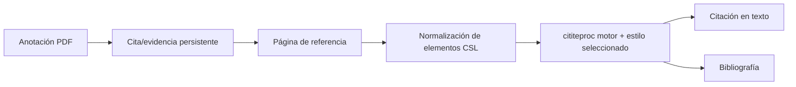

# Lector, referencias y citas

## Responsabilidad

Este dominio combina la lectura de feed/newsletter con un gestor de referencia compatible con Zotero, renderizado de citas CSL, identificador e importación web, lectura PDF/EPUB y anotaciones que pueden convertirse en evidencia citable.

## Ingestión de referencia

Las referencias ingresan a través de DOI, ISBN, arXiv, PMID, BibTeX, RIS, archivos o URLs web. Los solucionadores de identificadores y el servidor de traducción Zotero producen metadatos específicos del proveedor. Normalizadores lo asignan al esquema de referencia configurado, generan una clave de cita estable, deduplican candidatos y escriben un registro de Vault.

Translation-server es un sidecar opcional. La operación nativa puede ejecutarse sin ella; los solucionadores específicos de identificador y las referencias existentes continúan funcionando. Los fallos de traducción web devuelven errores procesables en lugar de un registro vacío exitoso.

## Descubrimiento académico federal

El complemento de recursos incorporado posee configuración de repositorio mientras `/api/vault/reference-table` sigue siendo la única fuente de verdad para la tabla de recursos objetivo. `/literature` ejecuta cada conector seleccionado de forma independiente y emite resultados parciales; una cuota o fallo del proveedor se adjunta a esa fuente sin descartar resultados saludables.

`AcademicWork` Las uniones deterministas utilizan, en orden, DOI normalizado, PMID o PMCID, identificador arXiv sin versión, ISBN-13, y título normalizado más año más apellido de primer autor. Un partido de título borroso es sólo una advertencia. Las obras fusionadas conservan cada ocurrencia de fuente, ubicación abierta, número de citas específico del proveedor, procedencia de campo y variante en conflicto.

La vista previa es de sólo lectura. El adjunto de texto completo es una acción manual separada y se ofrece sólo para una ubicación abierta verificada. Importar mapea el trabajo combinado a través del mapeador de recursos compatible con Zotero compartido y repite la identidad que coincide dentro de un bloqueo atómico. Cuando existe un registro de recursos correspondiente, la API devuelve ese registro en lugar de crear un duplicado.

## Reseñas de literatura

El estado de revisión sistemática se almacena en cuatro tablas de Vault administradas de forma impresionada: `Literature Reviews`, `Literature Activities`, `Literature Candidates`, y añadir sólo `Literature Decisions`. Estrategias de búsqueda, consultas exactas del proveedor, errores parciales, operaciones de IA, decisiones de selección y exportaciones, por lo tanto, siguen siendo auditables y sincronizados con la bóveda principal.

En el modo ciego, la decisión de un revisor se oculta hasta que ambos revisores se someten; los conflictos se mueven hacia un consenso explícito. AI puede proponer consultas editables, recalificar, pantalla o sintetizar metadatos recuperados, pero no puede excluir a un candidato o reclamar pruebas más allá del título, resumen o texto completo realmente suministrado.

Los índices de la OAI y el estado de búsqueda temporal son reconstructibles y viven por debajo `LOCAL_DATA`; protocolos, historias, candidatos, decisiones y artefactos de auditoría permanecen en la bóveda principal. Las credenciales de repositorio utilizan el entorno nativo de Keychain o implementación y nunca se escriben en la bóveda o estado de plugin.

## Ruta de citación

Los valores CSL se derivan de la materia frontal de referencia utilizando asignaciones de campo explícitas. Listas de nombres, fechas, tipos de elementos, BibTeX/LaTeX escapados y Zotero `extra` Los metadatos requieren normalización. El esquema fijado protege los tipos y campos de elementos compatibles de la deriva de aguas arriba.

`backend/domains/vault/citations/exporting.py` gestiona la limpieza del Markdown,
el subconjunto de citas, los marcadores de bibliografía, la ejecución de Pandoc
y el empaquetado de la descarga. La ruta de compatibilidad conserva su firma
pública e inyecta los puertos de archivos, CSL y procesos.

## Lector y anotaciones

El lector Zotero incluido muestra contenido PDF y EPUB. Gnosi posee el puente que localiza archivos, sirve rangos de bytes seguros, recibe anotaciones y enlaza la evidencia seleccionada de nuevo a registros de Vault. Las filas de anotación incluyen URI de origen, página, tipo, geometría, texto, comentario, etiquetas, clave administrada estable y marcas de tiempo.

Los puntos finales de archivo validan la contención y manejan la hidratación de la nube. Los identificadores de anotación persistentes impiden que una cotización generada se duplique cada vez que se reabre un documento.

## Fuentes y boletines informativos

Los modelos de lectores almacenan fuentes, artículos, leen state, extraen contenido completo y una cuenta de boletín. La ingestión de alimento utiliza los puntos de ahorro de transacción para que una entrada mal formada no pueda rehacer todo el lote. Los extractos y la extracción de texto completo son separados; la truncación al ingerir no debe descartar permanentemente el contenido de fuente recuperable.

## Invariantes

- Las claves de citación permanecen estables a menos que el usuario cambie explícitamente los datos de identidad.
- La importación se deduplica mediante identificadores autorizados y metadatos normalizados.
- Un fallo de fuente federada no puede invalidar los resultados ya devueltos por otras fuentes.
- La similitud difusa nunca fusiona las obras académicas automáticamente.
- Las métricas de citas permanecen separadas por proveedor y nunca se suman.
- Las sugerencias de AI nunca se convierten en decisiones finales de detección sin una acción humana.
- Las rutas de archivos del lector no pueden escapar de las raíces permitidas.
- La identidad de documento y la geometría de página de una anotación sobreviven reinicia.
- Los internos de los lectores vendidos se consideran código ascendente; integración local
las modificaciones son explícitas y reproducibles.
- Las contraseñas de la configuración de boletín de noticias legado se tratan como secretos incluso
cuando un modelo viejo aún expone un campo de compatibilidad.

## Enfoque de verificación

Ejecute la clave de cita, PubMed, tipo de artículo, estilo CSL, escape BibTeX, referencia E/S, anotación, contención de ruta, deduplicación de importación y pruebas de puntos de ahorro de alimentación. Añada normalización de conectores, token de OAI y lápida, SSRF/XML, error parcial, pruebas de revisión-ceguera, importación concurrente y recuento de PRISMA. La validación del navegador debe abrir un documento de fijación real y ejercer una cita o anotación ida y vuelta, luego realice una búsqueda progresiva de literatura, inspeccione la procedencia e importe un resultado deduplicado.
