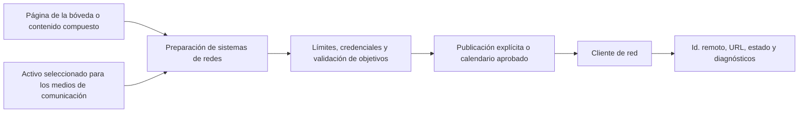

# Publicaciones y medios de comunicación sociales

## Responsabilidad

Este dominio prepara, programa, publica y observa contenidos en redes sociales configuradas. El centro de medios proporciona activos visuales y metadatos reutilizables. La publicación siempre es un efecto externo.

## Adaptadores de red

Los clientes de servicio aíslan a Mastodon, Bluesky, Telegram y otras semánticas de red configuradas: autenticación, límites de texto, carga de medios, identificadores de correos, hilos, normalización de respuestas y reportes de errores.

La API expone redes configuradas, flujos, acciones de publicación y configuraciones relacionadas. Las pestañas de interfaz de usuario están keyed por identificadores de red estables mientras que los nombres y etiquetas de visualización utilizan cadenas localizadas.

El JSON de proveedores se valida y normaliza en la frontera del adaptador. Las
rutas HTTP están tipadas estrictamente y conservan el contrato OpenAPI
existente; el JSON de mensajes almacenado se decodifica con helpers tipados
antes de usar vistas previas, URL o publicaciones programadas.

## Publicar flujo

La preparación puede traducir o remodelar el contenido pero no lo publica por sí sola. La publicación inmediata requiere una acción explícita del usuario; la publicación programada requiere un calendario almacenado cuya política de ejecución autoriza el mismo objetivo.

## Manejo de medios de comunicación

Carga valida el tipo de archivo, tamaño, raíces permitidas y nombres generados. Los medios de comunicación ven los activos de índice sin tratar cachés o miniaturas como originales. Una miniatura faltante puede regenerarse; perder el activo fuente no puede.

## Invariantes

- Una credencial de red se resuelve sólo en el motor en el momento de la ejecución.
- La vista previa/preparación y publicación son estados distintos.
- Los límites de texto y medios se validan por objetivo antes de la llamada externa.
- Un fallo parcial de múltiples redes informa de cada resultado y no reclama global
éxito.
- La publicación programada e interactiva utiliza el mismo contrato de adaptador.
- Los identificadores de post remotos y URLs se almacenan para las acciones de auditoría y seguimiento.

## Enfoque de verificación

Prueba la contención de carga de medios, alineación de programación/conexión, normalización de la respuesta de red, límites de reintento, fallo parcial multi-objetivo y publicación de un arenero o tablón.
