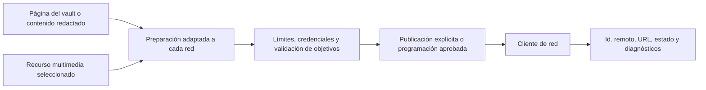

# Publicación en redes sociales y recursos multimedia

## Responsabilidad

Este dominio prepara, programa, publica y supervisa contenido en las redes sociales configuradas. El centro multimedia proporciona recursos visuales y metadatos reutilizables. Publicar siempre es un efecto externo.

Las instrucciones históricas de publicación en Drupal específicas del mantenedor
no forman parte de la aplicación pública. Retirar aquel paquete del pipeline no
elimina la publicación social: las rutas y los adaptadores indicados arriba
siguen siendo la vía compatible.

La feature social gestiona su panel, el editor de publicaciones, el calendario
de contenido programado, el historial y los componentes privados de interfaz.
La feature multimedia gestiona por separado la exploración de recursos, los
filtros, las vistas guardadas y los metadatos. Ambas exponen entradas de ruta de
carga diferida; importar la entrada social no evalúa ninguna de las dos pantallas.
El icono de red sigue compartido con Configuración. Los adaptadores HTTP y los
permisos de publicación no cambian, y los consumidores de otras features nunca
importan archivos privados de implementación.

## Adaptadores de red

Los clientes de servicio aíslan la semántica de Mastodon, Bluesky, Telegram y las demás redes configuradas: autenticación, límites de texto, subida de recursos multimedia, identificadores de publicaciones, hilos, normalización de respuestas e informes de errores. Las entradas de redes almacenadas hacen referencia a credenciales locales; las respuestas nunca devuelven secretos.

La API expone las redes configuradas, los flujos, las acciones de publicación y sus ajustes. Las pestañas de la interfaz utilizan identificadores estables de red como claves, mientras los nombres y etiquetas visibles utilizan cadenas traducidas.

El JSON de proveedores se valida y normaliza en la frontera del adaptador. Las
rutas HTTP están tipadas estrictamente y conservan el contrato OpenAPI
existente; el JSON de mensajes almacenado se decodifica con helpers tipados
antes de usar vistas previas, URL o publicaciones programadas.

El historial de publicación se almacena como filas Markdown ordinarias en la
tabla estable `Publicacions Socials` del vault. El servicio conserva nombres
de campo legibles y fusiona los resultados de cada red con el texto original.
Los puertos tipados del vault con vinculación tardía aíslan las operaciones de
registro, páginas y frontmatter, de modo que los imports circulares de
compatibilidad puedan sustituirse sin propagar tipos dinámicos al dominio social.

## Flujo de publicación

La preparación puede traducir o adaptar el contenido, pero no lo publica por sí sola. La publicación inmediata exige una acción explícita del usuario; la programada requiere una programación guardada cuya política de ejecución autorice el mismo destino.

## Gestión de recursos multimedia

Las subidas validan el tipo de archivo, el tamaño, las raíces permitidas y los nombres generados. Las vistas multimedia indexan recursos sin tratar las cachés ni las miniaturas como originales. Una miniatura ausente puede regenerarse; la pérdida del recurso original no puede repararse así.

## Invariantes

- Una credencial de red se resuelve únicamente en el backend durante la ejecución.
- La vista previa/preparación y publicación son estados distintos.
- Los límites de texto y medios se validan por objetivo antes de la llamada externa.
- Un fallo parcial en varias redes informa de cada resultado y no declara un éxito global.
- La publicación programada e interactiva utiliza el mismo contrato de adaptador.
- Los identificadores de post remotos y URLs se almacenan para las acciones de auditoría y seguimiento.

## Enfoque de verificación

Pruebe el confinamiento de las subidas multimedia, la coherencia entre programaciones y conexiones, la normalización de respuestas de redes, los límites de reintentos, los fallos parciales entre varios destinos y la publicación en un sandbox o mediante un stub. La publicación real nunca se utiliza como efecto secundario incidental de una prueba unitaria.
