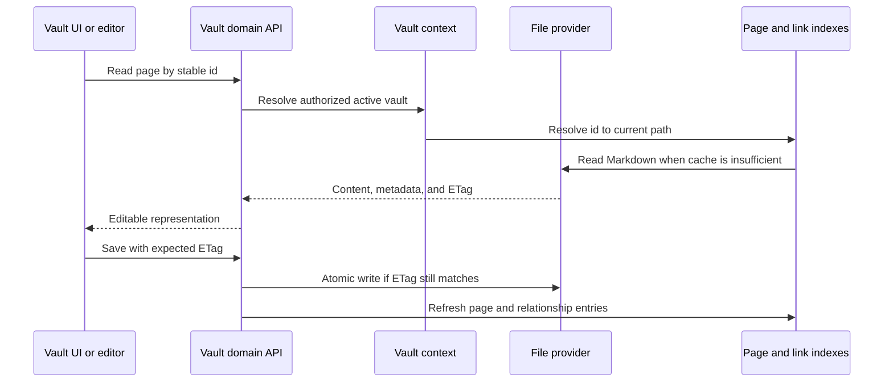

# Vault y archivos

## Responsabilidad

El dominio Vault relaciona el Markdown portátil y los recursos con páginas,
carpetas, adjuntos, búsquedas, esquemas, historiales, papelera, exportaciones,
citas y selección entre varios Vaults. Es el dominio más grande y el principal
responsable de la soberanía de los datos.

El reconocimiento local de escritura manuscrita es un adaptador opcional de
ingestión en la capa del Vault. Los objetos de modelo y procesador permanecen
aislados como valores de terceros en tiempo de ejecución; el servicio expone un
resultado tipado que contiene el texto, el reconocimiento sin procesar, los
valores por línea, la identidad del modelo y el estado de corrección, sin cambiar
el contrato público de subida. Los diccionarios de estado, preparación y
reconocimiento se validan mediante modelos de respuesta Pydantic específicos,
conservando después su estructura histórica de diccionario para las llamadas
directas y la interfaz OpenAPI estable byte a byte.

## Ciclo de vida de las páginas

La identidad de una página es independiente de su título y su ruta. El frontmatter
se normaliza en los puntos de escritura, conservando las claves creadas por el
usuario. El estado exclusivamente interno debe almacenarse en archivos auxiliares
de `.gnosi` cuando exponerlo en el frontmatter contaminaría o desestabilizaría el
contenido portátil.

Las lecturas y escrituras de archivos auxiliares utilizan un único contrato
explícito de correspondencia de metadatos, incluidos los resultados de separación,
fusión y persistencia portátil. El mecanismo compartido y tolerante de recuperación
del frontmatter devuelve los valores escalares de primer nivel como objetos
tipados cuando es necesario recuperar YAML; el contenido anidado mal formado se
sigue ignorando deliberadamente. Estos contratos no fuerzan la conversión de los
valores del usuario ni cambian las protecciones existentes para archivos en la nube.

`pages/markdown_writer.py` es la capa canónica de serialización: recupera o crea
un ID estable cuando falta, asigna las claves del esquema a los nombres de
almacenamiento, elimina los campos virtuales, escribe el estado interno en el
archivo auxiliar, decora las relaciones portátiles y materializa las instantáneas
de vistas antes de escribir el archivo de forma atómica.
`services/field_resolver.py` es responsable de ese contrato de correspondencia de
claves del esquema. Acepta ID de campo inmutables, nombres actuales y alias
históricos, resuelve los conflictos de forma determinista y emite únicamente los
nombres actuales legibles para las personas en las capas de almacenamiento y
respuesta, conservando los metadatos locales ajenos a esa correspondencia.

`pages/save_helpers.py` se encarga de preparar los metadatos de guardado completo,
seleccionar el destino, reutilizar los ID existentes y crear una versión antes
de escribir. `pages/patch_helpers.py` se encarga de las lecturas que tienen en
cuenta el ETag, la preparación de metadatos PATCH, la reubicación de archivos y
las actualizaciones coordinadas de las cachés de páginas, cuerpos, citas y
documentos analizados. Los ocho nombres históricos de funciones auxiliares
privadas siguen siendo fachadas ligeras de compatibilidad, y cada colaborador
sustituible o caché mutable se resuelve mediante un puerto tipado en el momento de uso.

## Límites del backend

Las lecturas y escrituras de páginas, las vistas previas, la duplicación, el
historial y la papelera se implementan en `backend/domains/vault/pages`, mientras
que las subidas de recursos, los iconos y el servicio de imágenes están en
`backend/domains/vault/assets`. El servicio de archivos dentro de las rutas
permitidas, las rutas Library/raw/thumbnail, los tokens de archivos locales, las
subidas de propiedades, los enlaces portátiles y la eliminación física están en
`backend/domains/vault/files`. Estos paquetes separan los esquemas de solicitud
estrictos, los adaptadores de rutas, los servicios de aplicación, los repositorios
y los responsables únicos de los bloqueos mutables, las cachés y los almacenes
de tokens. El comportamiento nuevo del Vault debe incorporarse a la capa del
dominio que corresponda.

La capa transitoria `pages/runtime.py` conserva el estado dinámico del módulo
histórico de rutas, pero exige un Vault activo antes de construir rutas del
sistema de archivos o motores de reglas. Sus modelos de solicitud ahora se
vinculan directamente a Pydantic, evitando clases base dependientes del tiempo
de ejecución sin cambiar la identidad pública de su módulo ni el contrato HTTP generado.

`backend/domains/media` se encarga de resolver las raíces multimedia, del recorrido
recursivo adaptado al proveedor y su caché derivada persistente, de los archivos
auxiliares sincronizados de metadatos y vistas guardadas, los filtros, la
paginación, el árbol de carpetas de carga diferida, las subidas dentro de las
rutas permitidas, la extracción EXIF y la serialización estable de archivos.
`backend/services/media_service.py` sigue siendo la fachada Python compatible:
conserva la clase histórica, el singleton, la forma de invocación, los
descriptores, el estado y los errores, resolviendo el estado mutable y los
colaboradores sustituibles en el momento de uso. Su constructor interno ahora
tiene una anotación explícita de retorno `None`, lo que elimina la antigua
excepción de tipado de ese constructor sin cambiar el comportamiento
de construcción. La fachada valida que exista un Vault activo antes de acceder
al sistema de archivos y utiliza los contratos multimedia tipados para raíces,
recorridos, consultas, subidas, datos EXIF e información serializada de archivos.
Los módulos de dominio nunca importan el router HTTP ni la fachada de compatibilidad.

Las rutas HTTP multimedia importan directamente el router compartido y los
servicios estables. `media/composition.py` conserva la resolución tardía del
servicio y los callbacks de duplicación mediante interfaces con nombre; los
tokens de archivo y bloqueos conservan sus propietarios canónicos. El servicio
concreto se comprueba contra el contrato de las rutas sin conversiones de
resultados. Los valores JSON del proveedor no cambian para los clientes Python;
los modelos HTTP existentes validan la respuesta pública. La conversión única
de fachada y las anotaciones heredadas de metadatos siguen siendo deuda explícita.

Las rutas de dibujos importan directamente el router compartido y los servicios
tipados de dibujos e historial. `drawings/composition.py` limita los colaboradores
con resolución tardía a `DrawingVaultPort`: rutas, papelera, serialización y
callbacks del historial. El puerto no tiene miembros `Any`; su única conversión
de compatibilidad es transitoria hasta separar la composición de los proveedores
heredados. No acredita el tipado completo de la fachada ni del modelo de petición
histórico compartido. No se normalizan resultados solo para tiparlos: las llamadas
directas conservan los datos originales y los modelos HTTP imponen el contrato
existente. Se preservan copias, recuperación, permisos, momento de resolución de
callbacks, valores de metadatos y orden de rutas.

La composición de la vista previa y el guardado de páginas también comparte un
único router de tipo acotado para la resolución de títulos y el registro delegado
de vistas previas y escrituras. La identidad de las cachés, la correspondencia
de alias, las comprobaciones del Vault activo y los esquemas de rutas generados
permanecen sin cambios.

Las rutas de traducción y sincronización con Drupal también acotan en la capa
del módulo el tipo de su router resuelto en el momento de uso. Las operaciones
de traducción de una fila, masivas, por correspondencia, de botones generados y
de páginas conservan las comprobaciones de roles, el trabajo en segundo plano
y la correspondencia de errores externos, y siguen siendo visibles para el
tipado estricto.

El almacenamiento asociado a tablas tiene responsables explícitos.
`assets/table_paths.py` se encarga de las rutas de recursos confinadas, los
directorios por propiedad, las revisiones y las funciones auxiliares de cambio
de nombre que evitan colisiones; `assets/persistence.py`, de la ingestión
recursiva de metadatos y la eliminación de recursos de registros dentro de las
rutas permitidas; `assets/quarantine.py`, de la eliminación de tablas resistente
a fallos y la recuperación al iniciar. `tables/folders.py` se encarga de crear
y migrar el directorio físico `BD/<database>/<table>` de la tabla. Estos módulos
reciben puertos acotados del sistema de archivos y del registro de configuración
desde la fachada de compatibilidad y nunca importan el router HTTP.

`tables/routes.py` ahora es responsable de las 23 operaciones históricas de
bases de datos, tablas, catálogos de opciones, vistas guardadas y esquemas de
carpetas, en su orden original. Sus manejadores estrictos delegan en los servicios
existentes de filas, ciclo de vida, propiedades, opciones y vistas;
`tables/composition.py` es el conjunto inmutable de dependencias para esas rutas
y para las consultas de filas y el enriquecimiento de metadatos.
`tables/security.py` expone únicamente las dos fábricas tipadas de autorización
del espacio de trabajo, evitando una dependencia estática del dominio de tablas
respecto a la amplia composición heredada de autenticación. El router heredado
registra las rutas del dominio en una estructura plana por compatibilidad con
los consumidores del inventario de rutas y reexporta los objetos invocables de
Python admitidos.

`backend/api/vault_routes.py` es ahora un módulo de inicialización de
compatibilidad, sin asumir la implementación del dominio.
Los módulos tipados de `backend/domains/vault` se encargan del comportamiento
restante de API, anotaciones, citas, dibujos, Drupal, archivos, conocimiento,
enlaces, multimedia, páginas, registro de configuración, tablas y traducción.
El módulo de inicialización carga y registra esos responsables en el orden
histórico del código fuente, mientras que `facade_bridge.py` conserva las
importaciones admitidas, las variables globales mutables y los puntos de
sustitución dinámica mediante monkeypatch resueltos en el momento de uso. El
router padre sigue exponiendo el mismo inventario plano de `APIRoute` y un
OpenAPI determinista idéntico byte a byte. Por tanto, la fachada no necesita
ninguna excepción en los controles del código fuente.

El comportamiento del ciclo de vida de las traducciones es responsabilidad de
`backend/domains/vault/translation`: la carga opcional de proveedores, la
recuperación de archivos en la nube, la traducción de filas y páginas completas,
los efectos mínimos sobre los metadatos y la propagación de obsolescencia a los
hijos son servicios tipados separados. La capa compartida de funciones auxiliares
puras normaliza las identidades de origen a su forma canónica, detecta cambios
traducibles y campos de idioma, reutiliza etiquetas de opciones existentes y
traduce únicamente los subcampos textuales de las imágenes, conservando el
recurso de origen.
La publicación de filas en Drupal es responsabilidad de
`backend/domains/vault/drupal`, que separa la correspondencia de campos e
identidades, la preparación de recursos multimedia locales, la conversión de
Markdown y wikilinks, las cachés de idiomas, la correspondencia de títulos y la
sincronización idempotente de nodos. El router de compatibilidad conserva los
decoradores FastAPI originales, los docstrings de las rutas y los puntos de
sustitución Python resueltos en el momento de uso, mientras que el conector de
Drupal sigue siendo la capa de transporte externo. Estos cambios de ubicación
no alteran rutas, datos intercambiados, códigos de estado, tareas en segundo
plano ni el orden de las rutas.

## Índices y cachés

El índice de páginas acelera los listados, la resolución de identificadores,
el acceso al frontmatter y las búsquedas. El índice de wikilinks resuelve los
enlaces entrantes para poder actualizar las referencias al renombrar páginas.
Las cachés de cuerpos y documentos analizados evitan lecturas repetidas. Todas
las cachés son derivadas y deben admitir una reconstrucción desde cero.

`links/document_inventory.py` se encarga del inventario con TTL por Vault que
utilizan los enlaces globales. Excluye el historial y la papelera, aísla los
archivos que no se pueden leer, incluye los paneles JSON y recurre a un recorrido
del disco mientras el índice del proveedor no está disponible.
`links/document_cache.py` se encarga de las cachés persistentes del cuerpo de
Markdown y del frontmatter analizado, cuya clave se basa en mtime. El router solo
proporciona las rutas de caché activas, el analizador y el escritor JSON seguro,
por lo que el comportamiento de las cachés es independiente del proveedor de archivos.
`links/relation_sync.py` se encarga de las actualizaciones idempotentes del
sistema de archivos y las cachés cuando cambian las relaciones directas y sus
inversas. La correspondencia pura de esquemas permanece en un puerto de reglas
tipado separado: resuelve los campos de relación mediante nombres actuales y
alias normalizados, exige un único campo inverso sin ambigüedades y emite
únicamente operaciones de adición y eliminación sobre ID canónicos de relaciones.
El router de compatibilidad proporciona la entrada y salida de páginas resuelta
en el momento de uso.

El inicio carga primero las instantáneas válidas del disco y después pone en
marcha la actualización. Un recorrido parcial del proveedor de archivos se
marca como parcial y no puede reemplazar una caché que se sabe completa. Los
fallos de cada archivo se aíslan para que un marcador de posición disponible
solo en línea o huérfano no elimine el resto del Vault de una respuesta.

`pages/index_entries.py` se encarga de las lecturas acotadas del frontmatter,
los reintentos ante bloqueos de la nube y la normalización de las entradas de
caché. `pages/index_service.py` se encarga del descubrimiento, la actualización,
los mapas inversos de ID y las instantáneas deduplicadas. `pages/resolver.py` se
encarga de la resolución por ID estable, UUID canónico, título indexado y
recorridos acotados sin caché.
`pages/tags.py` se encarga de agregar las etiquetas del frontmatter y las
etiquetas semánticas de tablas de forma independiente del proveedor, incluida
la deduplicación por página. El router de compatibilidad inyecta los puertos del
Vault activo, el registro de configuración, el calendario y las cachés, de modo
que ninguno de estos servicios importa la fachada HTTP.

El entorno de ejecución del registro de configuración acota una sola vez el
tipo de su router resuelto en el momento de uso, utiliza el decorador estándar
tipado de gestores de contexto para los ciclos de modificación y trata la
falta de un Vault activo como ausencia de una raíz de adjuntos en la nube.
El orden de las rutas de registro y tablas, los bloqueos, las cachés y los
candidatos a adjuntos específicos de cada proveedor permanecen sin cambios.

La API principal del Vault importa directamente el router y los servicios y
limita sus colaboradores de resolución tardía a `CoreVaultPort`. La creación de
páginas admite metadatos abiertos sin coerciones; la inserción en el índice
actualiza el propietario existente de la caché. Los nombres de usuario conservan
las alternativas de nombre, correo e identificador. La creación de notas diarias
pasa el usuario del espacio de trabajo ya autorizado al servicio canónico, en
vez de llamar a un manejador HTTP con una dependencia pendiente de resolver.
Los callbacks explícitos de plugins conservan sus dos argumentos históricos.
Los permisos, controles de plugins, recuperación de notas existentes, bloqueo
de creación y esquemas HTTP públicos no cambian.

La composición de formato, búsqueda, catálogo y exportación de citas utiliza
contratos explícitos de registros y callbacks sin conversiones de resultados.
Las propiedades del registro conservan su identidad; los consumidores de lectura
admiten interfaces de mapeo y secuencia. Las referencias importadas reciben el
contexto del usuario autorizado cuando usan el manejador canónico de páginas;
los callbacks tardíos de dos argumentos siguen admitidos. La deduplicación,
formatos, descargas y errores de Pandoc no cambian. Todos los entornos guardan la
designación bibliográfica en `GNOSI_DATA_DIR/config/references.json`. La configuración
antigua requiere `scripts/migrate-reference-config.py`: su migración explícita sin
sobrescritura conserva los bytes, campos desconocidos y el original, con diario
privado y reversión recuperable. El arranque comprueba este requisito antes de
migrar bases de datos o iniciar tareas. La validación temporal nunca consulta archivos antiguos.

La consulta de metadatos, el reconocimiento de PDF, la traducción de URL, la
promoción de Zotero, las actualizaciones masivas y el registro del catálogo y
la búsqueda de citas comparten esa misma capa HTTP de tipo acotado. Los
mecanismos alternativos de proveedores, los permisos del editor y la unicidad
de las claves de cita siguen resolviéndose en el momento de uso y conservan
su comportamiento.

La consulta bibliográfica importa los servicios directamente y declara bajo
`TYPE_CHECKING` alias comprobados de los propietarios reales de los callbacks,
sin conversiones de módulos ni resultados. La sustitución tardía sigue vigente.
Las pruebas cubren ambos órdenes de importación, los esquemas HTTP exactos y
la identidad de los metadatos desconocidos. `citations/title_regex.py` conserva
los errores nativos de Python: la única excepción documentada del verificador
valida entradas incorrectas y nunca afecta a los datos devueltos. Los tipos
heredados de proveedores de registro y páginas siguen siendo deuda separada.

La importación de Markdown, los comentarios en línea, los bloques sincronizados,
la navegación por enlaces y las menciones sin enlazar comparten un router tipado
de sincronización de páginas. Los modelos de solicitud utilizan Pydantic
directamente y mantienen la identidad histórica de su módulo, conservando los
nombres de los esquemas, el comportamiento SSE y la salida OpenAPI.

El CRUD de anotaciones PDF importa directamente el router compartido y las
dependencias de autorización y persistencia. Los payloads `TypedDict` con nombre
describen los diccionarios devueltos a los consumidores Python sin conversiones
de tipo ni `Any`. Los rectángulos guardados conservan la decodificación JSON
original; los modelos HTTP siguen validando su forma. No cambian las identidades
de los esquemas, el filtrado por URI, el orden por página y fecha de creación,
los permisos, las actualizaciones con campos nulos u omitidos ni el esquema
SQLite. Las pruebas aisladas SQLite y HTTP cubren ambos órdenes de importación:
primero la fachada o primero el dominio.

La administración del Vault ahora falla explícitamente con una respuesta de
servicio no disponible cuando falta la ruta principal del Vault, en lugar de
construir una ruta a partir de `None`. Las anotaciones heredadas de respuesta
permanecen congeladas, y el cambio de nombre lógico cruza la antigua capa de
descriptores del ORM sin cambiar carpetas en disco, slugs, reglas de purga ni
comprobaciones de confinamiento de rutas.

El catálogo de plantillas del Vault, la instalación, la exportación y el envío
moderado exponen contratos tipados de solicitud y respuesta. Los manejadores
validan cada diccionario antes de devolverlo y deshabilitan la publicación del
modelo de respuesta en las rutas de compatibilidad, para que no varíen los
esquemas FastAPI congelados ni el contrato de diccionarios de las llamadas
directas. Las comprobaciones de firmas, los hallazgos de privacidad, los
paquetes deterministas y la reversión ante fallos de registro no cambian.

## Proveedores de archivos

La abstracción de proveedores selecciona el comportamiento local, genérico de
macOS File Provider, o adaptado a OneDrive, iCloud Drive, Google Drive, Nextcloud
o Dropbox. El código habitual del dominio sigue trabajando con `Path`; el
adaptador añade detección de marcadores de posición, hidratación, disponibilidad
y correspondencia de rutas. Configurar `GNOSI_FILES_PROVIDER` explícitamente
cuando la detección automática de rutas sea ambigua.

El entorno de ejecución de archivos bajo demanda es independiente del proveedor.
Google Drive, iCloud y Nextcloud no heredan el comportamiento de recuperación de
OneDrive; solo `OneDriveProvider` puede reiniciar el cliente de OneDrive tras un
fallo de hidratación con límites definidos. Los proveedores nativos de macOS
utilizan por defecto una acción `open` en la sesión gráfica. Los despliegues
Docker pueden utilizar un auxiliar configurado en el host porque las lecturas
desde el contenedor cruzan una capa adicional.

Las rutas de Dropbox File Provider se detectan explícitamente. Un servicio
desconocido en `~/Library/CloudStorage` de macOS utiliza el adaptador
`fileprovider`, que no tiene efectos secundarios; cualquier carpeta totalmente
sincronizada o montada de forma ordinaria utiliza `local`. Solo hace falta un
nuevo adaptador con nombre propio para una señal de marcador de posición distinta
o un mecanismo de hidratación específico del proveedor. `GNOSI_DATA_DIR` sigue
siendo local independientemente del proveedor del Vault.

Solo el Markdown portátil del Vault y los adjuntos pueden residir en un árbol
sincronizado. Las bases de datos SQLite, los bloqueos, las cachés derivadas, los
secretos y `GNOSI_DATA_DIR` permanecen en el almacenamiento local de la aplicación.
Una carpeta de Nextcloud totalmente sincronizada se comporta como `local`; los
despliegues con archivos virtuales utilizan el proveedor correspondiente o el
adaptador genérico `fileprovider`. WebDAV y las API directas de la nube son
transportes de transferencia o copia de seguridad, no almacenamiento activo
para SQLite. El destino de las copias de seguridad y el proveedor del Vault se
configuran de forma independiente.

## Adjuntos y propiedades de tipo archivo

Las escrituras eligen un destino permitido dentro del Vault activo, normalizan
los nombres, evitan colisiones y devuelven metadatos portátiles. La raíz de los
enlaces a archivos se adapta al host actual en el momento de la lectura. Las
operaciones de subida y eliminación validan el confinamiento de las rutas;
una ruta proporcionada por el cliente nunca constituye autorización suficiente.

Los manejadores de rutas de recursos y archivos son exportaciones canónicas del
dominio. El router heredado del Vault los registra en sus posiciones históricas
e inyecta puertos acotados para consultas al registro de configuración, resolución
de rutas y selección de proveedores. No debe mantener un segundo mapa de tokens
locales, bloqueo de iconos personalizados o semáforo de flujos de archivos. Los
decoradores repetidos de `/local-file/{token}` conservan su orden original de
rutas de abajo arriba, y cada cambio estructural debe preservar las cabeceras
de transmisión y el documento OpenAPI exacto.

Los metadatos de tipo archivo se normalizan recursivamente sin cambiar su
estructura de lista u objeto. Las rutas `Assets/` existentes y las URL HTTP
remotas siguen siendo referencias; las URL de datos y los archivos locales
aprobados se copian de forma atómica al directorio de recursos de la propiedad.
La limpieza física resuelve cada candidato dentro de la raíz `Assets` del Vault
activo antes de desvincularlo, por lo que una cadena de recorrido de directorios
en el frontmatter no puede salir del Vault.

## Papelera y operaciones destructivas

`drawings/service.py` se encarga del descubrimiento de dibujos Tldraw y Excalidraw
heredados, las lecturas, las instantáneas del historial con un intervalo mínimo
entre ellas, las escrituras atómicas y la eliminación recuperable. El trabajo
sobre el sistema de archivos se ejecuta fuera del bucle de eventos, y la
eliminación reutiliza el mismo contrato de archivos auxiliares de la papelera
del Vault que las páginas.

La eliminación ordinaria es recuperable: las páginas y los recursos relacionados
pasan por el modelo de papelera del Vault. La purga es una operación distinta y
elimina el contenido junto con los metadatos derivados y las relaciones inversas.
`trash/purge.py` se encarga de la fase irreversible sobre el sistema de archivos
y de la limpieza del historial, los archivos auxiliares de metadatos y los
comentarios, mediante puertos de la fachada resueltos en el momento de uso.
La eliminación de un Vault del registro borra por defecto la fila lógica del
registro; eliminar físicamente la carpeta requiere una señal explícita separada
y comprobaciones de confinamiento más estrictas.

Al eliminar una tabla, primero se mueve de forma atómica cada árbol de recursos
perteneciente a la tabla a `.gnosi/pending-cleanup/table-assets/in-progress-*`
y se escribe un manifiesto dentro de los límites permitidos. Después, la
confirmación de la transacción del registro renombra ese directorio a `ready-*`
antes de una purga en segundo plano. La recuperación al iniciar restaura una
cuarentena en curso si la tabla todavía existe, la purga cuando el registro
persistente demuestra la eliminación y deja intactas las entradas que no se
pueden leer o son desconocidas. Las revisiones de recursos incluyen los enlaces
simbólicos sin seguir sus destinos e impiden la eliminación tras una vista
previa desactualizada.

## Plantillas de Vault

El repositorio de plantillas es un catálogo firmado que se utiliza en tiempo de
ejecución; los recursos de los paquetes no se versionan en el repositorio Git
de la aplicación. La creación a partir de una plantilla verifica la firma
separada del índice, el SHA-256 del paquete, la firma del publicador, el manifiesto,
el inventario de archivos, los límites del archivo comprimido, las rutas, los
tipos de archivo y los enlaces antes de escribir. La extracción se realiza en
un directorio de preparación hermano dentro de la raíz de Vaults. El directorio
completado se mueve a su ubicación definitiva de forma atómica y solo entonces
se registra en la base de datos de gestión, de modo que un fallo no pueda
exponer un Vault parcial.

La validación del archivo comprimido se divide en validación acotada de entradas,
decodificación del manifiesto, comparación del inventario y comprobaciones de
integridad del contenido. Estos pasos puros y tipados conservan el mismo contrato
de paquetes que rechaza la operación ante fallos y mantienen cada función
auxiliar por debajo del límite de complejidad del backend.

La exportación se basa en una lista de elementos permitidos y es determinista.
Excluye `.gnosi`, plugins, almacenes de confianza, correo, papelera, historial,
contenido ejecutable, archivos de entorno, enlaces, archivos que no se pueden
leer y contenido de tamaño excesivo. Una vista previa enumera todos los archivos
incluidos y excluidos y analiza archivos de texto con límites definidos para
buscar valores que parezcan credenciales. Los hallazgos requieren una aceptación
explícita. Los plugins recomendados son identificadores en el manifiesto; el
código ejecutable de plugins nunca se incluye en una plantilla de Vault.

El envío público es independiente de la exportación y requiere acceso de
administrador. Utiliza un intermediario opcional de moderación en lugar de una
credencial de GitHub incorporada en Gnosi. Los campos adicionales del acuse de
recibo específicos del intermediario se conservan sin pérdida mediante un modelo
de respuesta que permite campos adicionales; los datos de error del catálogo
mantienen su estructura heredada para la recuperación sin conexión y ante
errores de firma.

## Invariantes de concurrencia

`daily/service.py` se encarga, de forma independiente del proveedor, del
descubrimiento de carpetas y tablas, la normalización de fechas, la creación
inicial a partir de plantillas, los listados y el flujo atómico de obtención o
creación de notas diarias. El router de compatibilidad conserva los decoradores
públicos de FastAPI e inyecta comandos de página resueltos en el momento de uso
para que los plugins y las pruebas existentes mantengan sus puntos de sustitución.

- Los ETags desactualizados impiden las sobrescrituras.
- La creación de registros de configuración y notas diarias utiliza nuevas
  comprobaciones seguras frente a condiciones de carrera.
- Las actualizaciones de páginas, registros de configuración, índices de enlaces
  y archivos auxiliares mantienen la coherencia tras un cambio de nombre o una
  eliminación.
- Las rutas absolutas recibidas de un cliente se resuelven dentro de raíces aprobadas.
- Los enlaces simbólicos y el recorrido de directorios no pueden salir de los
  límites del Vault seleccionado.
- La extracción de plantillas no puede publicar un directorio parcial ni
  registrarlo antes de tiempo.
- Las exportaciones de plantillas no pueden incluir estado de ejecución ni
  contenido ejecutable de plugins.
- Las conversiones de ida y vuelta de Markdown conservan el contenido sensible
  al uso de caracteres de escape y la sintaxis de wikilinks.

## Frontend

`VaultDashboard` se encarga del historial de navegación y selecciona las
interfaces de página, tabla, dibujo, galería, tablero, calendario, línea temporal,
feed o lector. `VaultShell` proporciona la estructura; los componentes
especializados implementan los editores y las vistas. El frontend almacena en
caché el estado de interacción, pero considera autoritativos el contenido de
las páginas y los ETags del backend.

El traslado revisado sitúa `VaultDashboard.tsx` en la raíz de la feature y
su orquestación en `features/vault/dashboard/`. La composición de tablas y la
edición de celdas están en `features/vault/views/vault-table/`; los campos y las
opciones del esquema, en `features/vault/schema/schema-config/`; y las propiedades
de página, los documentos enriquecidos, los efectos y la persistencia, en
`features/vault/editor/block-editor/`. El renderizado, los hooks de registros
y los controles de vista reutilizables pertenecen a `shared/editor/`,
`shared/records/` y `shared/record-views/`; nunca importan UI del Vault.
Un módulo solo es público mediante la raíz de la feature o su entrada exacta
revisada en el manifiesto; ser un archivo de composición no lo hace público.
Los cambios de propiedad conservan rutas API y formatos de almacenamiento;
la verificación de integración sigue siendo un paso separado.

Las transiciones de Markdown al modo visual publican los borradores pendientes
antes de montar el editor enriquecido, evitando que el contenido desactualizado
del componente padre reemplace una edición sin guardar. Los guardados de solo
metadatos omiten el cuerpo; las fórmulas de valores predeterminados conservan los
valores anidados de relaciones y plugins. Las pruebas de regresión cubren estos
traspasos, además de los identificadores de opciones del esquema, la identidad
de las filas de las tablas y las extensiones de metadatos desconocidas.

## Aspectos que verificar

Ejecutar pruebas de concurrencia con ETag, confinamiento de rutas, entrada y
salida seguras, condiciones de carrera del registro, cambios de nombre,
papelera y purga, numeración de adjuntos, relaciones, actualización de índices
y flujos representativos del Vault con Playwright. Los incidentes de proveedores
en la nube también requieren leer un marcador de posición real, porque las
pruebas con datos locales de prueba no pueden reproducir el comportamiento de
File Provider.
