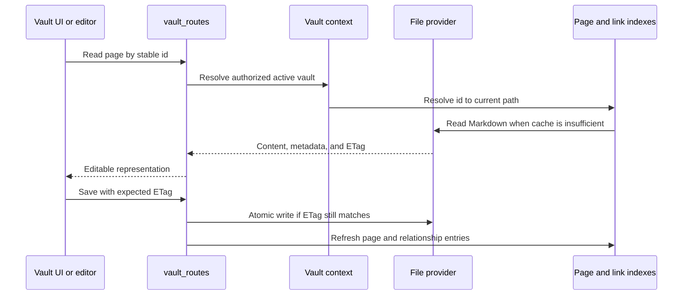

# Bóveda y archivos

## Responsabilidad

El dominio Vault mapea Markdown portátil y activos a páginas, carpetas, archivos adjuntos, búsquedas, esquemas, historias, basura, exportaciones, citas y selección de múltiples saltos. Es el dominio más grande y el propietario principal de la soberanía de datos.

## Ciclo de vida de la página

La identidad de página está separada del título y la ruta. La materia frontal se normaliza en los límites de escritura mientras se conservan las claves de usuario. `.gnosi` sidecars cuando se expone en la materia delantera contaminaría o desestabilizaría el contenido portátil.

## Índices y cachés

El índice de páginas acelera el listado, la resolución de identificadores, el acceso a la materia frontal y la búsqueda. El índice de enlaces wiki resuelve los enlaces entrantes para que los renombrados de página puedan actualizar las referencias. Los cachés de cuerpo y documentos analizados evitan las lecturas repetidas.

Iniciar primero carga instantáneas de disco válidas, luego comienza el trabajo de actualización. Un análisis parcial de proveedor de archivos está marcado parcial y no puede reemplazar una caché completa conocida. Los fallos por archivo están aislados de modo que un marcador de posición solo en línea o huérfano no elimina el resto del almacén de una respuesta.

## Proveedores de archivos

La abstracción del proveedor selecciona local, OneDrive, iCloud Drive, Google Drive o comportamiento con conocimiento de Nextcloud. `Path`; el adaptador añade detección de marcadores de posición, hidratación, disponibilidad y asignación de rutas.

Native OneDrive operation delega la hidratación en una GUI-sesión `open` acción cuando el LaunchAgent no puede materializar un archivo en línea. Las implementaciones Docker pueden utilizar un punto final de calentamiento del host porque el contenedor lee cruzar otro límite.

## Adjuntos y propiedades valoradas por archivos

Los escritos eligen un objetivo permitido bajo el almacén activo, normalizan los nombres, evitan colisiones y devuelven metadatos portátiles. Los enlaces de archivos se re-raoted en el momento de lectura del host actual. Las operaciones de carga y eliminación validan la contención; una ruta proporcionada por el cliente nunca es suficiente autorización.

## Papelera y operaciones destructivas

La eliminación ordinaria es recuperable: las páginas y los activos relacionados se mueven a través del modelo de basura Vault. Purga es distinta y elimina el contenido más metadatos derivados y relaciones inversas. La eliminación del registro de Vault elimina la fila de registro lógica por defecto; la eliminación de carpetas físicas requiere una señal explícita separada y comprobaciones de contención más fuertes.

## Variantes de la moneda

- Los Etags rancios rechazan sobrescrituras.
- Registro y creación de notas diarias utilizan recheques de carrera-seguros.
- Página, registro, índice de enlaces y actualizaciones de sidecar siguen siendo consistentes después de un
renombrar o borrar.
- Las rutas absolutas recibidas de un cliente se resuelven bajo raíces aprobadas.
- Los enlaces de Symlinks y la trayectoria transversal no pueden escapar del límite de bóveda seleccionado.
- Los viajes de ida y vuelta de Markdown preservan contenido sensible a la fuga y sintaxis wikilink.

## Interfaz

`VaultDashboard` Posee historial de navegación y selecciona superficies de página, tabla, dibujo, galería, tablero, calendario, línea de tiempo, fuente o lector. `VaultShell` proporciona el marco; los componentes especializados implementan editores y vistas. La interfaz de cachés de estado de interacción, pero trata el contenido de página de backend y Etags como autoritative.

## Fondos de bloque en el editor

`BlockEditor` asigna las propiedades de fondo de los bloques a Markdown portable mediante un envoltorio `
`. BlockNote renderiza la propiedad obtenida al analizar el Markdown dentro del contenido del bloque, y su hoja de estilos principal pinta el fondo en el contenedor `.bn-block`. Por tanto, el color ocupa todo el bloque del editor, también cuando el bloque está dentro de una columna.

Al importar, el mapper de Markdown extrae estos envoltorios con estilo y los
convierte en propiedades del bloque antes de analizar el Markdown interior. Así
se mantienen el color de fondo y el color de texto durante el ciclo de guardado
y recarga. Los encabezados coloreados también eliminan el desplazamiento vertical
predeterminado para evitar espacio innecesario dentro del fondo de ancho completo.

La hoja de estilos del editor no debe restablecer a transparente los fondos de bloque no predeterminados ni mover el color a `.bn-inline-content`. Eso convierte el fondo del bloque en un chip del tamaño del texto y hace que el resultado dependa de la longitud del encabezado. Los fondos en línea siguen siendo adecuados para los resaltados de texto; los fondos de bloque pertenecen al contenedor del bloque.

Al cambiar este comportamiento, compruebe tanto un encabezado independiente como un encabezado dentro de una `column-list`. Después haga un recorrido de ida y vuelta del Markdown y confirme que la propiedad del bloque y la representación a ancho completo se mantienen intactas. La implementación está en `frontend/src/components/Vault/BlockEditor.jsx`; la conversión de Markdown, en `frontend/src/components/Vault/markdown-mapper.js`.

La vista de código Markdown utiliza un área de texto accesible y localizada que crece automáticamente con el documento. Un documento vacío conserva una superficie mínima de edición de 500 px para que el modo de código siempre proporcione un objetivo visible para el foco y la escritura; los documentos no vacíos continúan creciendo según la altura medida del contenido.

## Enfoque de verificación

Ejecute Etag condition, contención de rutas, E/S seguro, carrera de registro, renombrar, basura/purga, numeración de adjuntos, relación, actualización de índices y flujos representativos de Playwright Vault. Los incidentes de proveedores de nube también requieren un marcador de posición real porque las pruebas de fijación locales no pueden reproducir el comportamiento del proveedor de archivos.
