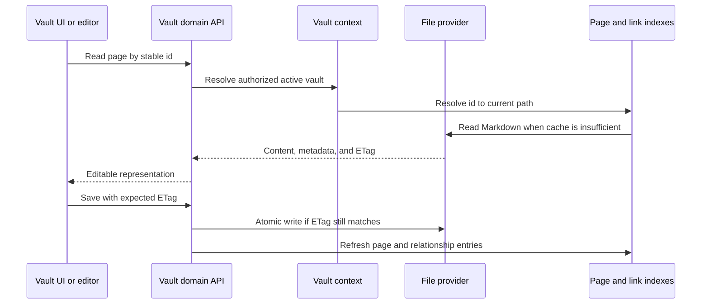

# Bóveda y archivos

## Responsabilidad

El dominio Vault mapea Markdown portátil y activos a páginas, carpetas, archivos adjuntos, búsquedas, esquemas, historias, basura, exportaciones, citas y selección de múltiples saltos. Es el dominio más grande y el propietario principal de la soberanía de datos.

## Ciclo de vida de la página

La identidad de página está separada del título y la ruta. La materia frontal se normaliza en los límites de escritura mientras se conservan las claves de usuario. `.gnosi` sidecars cuando se expone en la materia delantera contaminaría o desestabilizaría el contenido portátil.

## Límite del motor

Página lee y escribe, previsualiza, duplica, historia y basura se implementan bajo `backend/domains/vault`. Este paquete separa esquemas de petición estrictos, adaptadores de ruta, servicios de aplicación, repositorios y el propietario único de cachés de página y bloqueos. El comportamiento de la nueva bóveda pertenece a ese límite de dominio.

`backend/api/vault_routes.py` sigue siendo una fachada de compatibilidad y composición temporal mientras el resto del router heredado se divide. Inyecta operaciones de plataforma existentes y reexporta símbolos de Python compatibles, pero no es el propietario de los manejadores de páginas extraídos. La migración preserva rutas HTTP, códigos de estado, cargas útiles, dependencias, callbacks de fondo y el documento OpenAPI determinista. Cada extracción debe reducir la asignación de barandilla fuente de la fachada; nunca puede añadir una nueva excepción para el código bajo `backend/domains`.

## Índices y cachés

El índice de páginas acelera el listado, la resolución de identificadores, el acceso a la materia frontal y la búsqueda. El índice de enlaces wiki resuelve los enlaces entrantes para que los renombrados de página puedan actualizar las referencias. Los cachés de cuerpo y documentos analizados evitan las lecturas repetidas.

Iniciar primero carga instantáneas de disco válidas, luego comienza el trabajo de actualización. Un análisis parcial de proveedor de archivos está marcado parcial y no puede reemplazar una caché completa conocida. Los fallos por archivo están aislados de modo que un marcador de posición solo en línea o huérfano no elimina el resto del almacén de una respuesta.

`pages/index_entries.py` es responsable de las lecturas acotadas del
frontmatter, los reintentos ante bloqueos del proveedor y la normalización de
entradas de caché. `pages/index_service.py` gestiona el descubrimiento, la
actualización, el mapa inverso de identificadores y los snapshots deduplicados.
`pages/resolver.py` resuelve identificadores estables, UUID canónicos, títulos
indexados y análisis en frío acotados. `pages/tags.py` agrega las etiquetas del
frontmatter y de las columnas semánticas de tablas, deduplicadas por página. La
fachada inyecta los puertos de bóveda
activa, registro, calendario y caché; estos servicios no importan las rutas
HTTP.

## Proveedores de archivos

La abstracción del proveedor selecciona el proveedor de archivos macOS local, genérico, OneDrive, iCloud Drive, Google Drive, Nextcloud o el comportamiento de Dropbox. El código de dominio normal todavía funciona con `Path`; el adaptador añade detección de marcadores de posición, hidratación, disponibilidad y asignación de rutas. `GNOSI_FILES_PROVIDER` explícitamente cuando la detección automática de trayectoria es ambigua.

El tiempo de ejecución de archivos a la carta es neutral para el proveedor. Google Drive, iCloud y Nextcloud no heredan el comportamiento de recuperación de OneDrive; sólo `OneDriveProvider` puede reiniciar el cliente OneDrive después de un fallo de hidratación limitada. Los proveedores nativos de macOS utilizan una sesión de interfaz gráfica `open` Las implementaciones Docker pueden usar un ayudante de host configurado porque el contenedor lee cruzar otro límite.

Las rutas de Dropbox File Provider se detectan explícitamente. Un servicio desconocido bajo macOS `~/Library/CloudStorage` utiliza el producto sin efectos secundarios `fileprovider` adaptador; cualquier carpeta montada totalmente sincronizada u ordinaria utiliza `local`. Un nuevo adaptador llamado es necesario sólo para una señal de marcador de posición diferente o un mecanismo de hidratación específico del proveedor. `GNOSI_DATA_DIR` sigue siendo local independientemente del proveedor de la bóveda.

Solo el Markdown portátil y los adjuntos de la bóveda pueden residir en un
árbol sincronizado. Las bases SQLite, los bloqueos, las cachés derivadas, los
secretos y `GNOSI_DATA_DIR` permanecen en el almacenamiento local de la
aplicación. Una carpeta Nextcloud totalmente sincronizada funciona como
`local`; los archivos virtuales requieren el adaptador correspondiente o
`fileprovider`. WebDAV y las API directas de nube son transportes de
importación, exportación o copia de seguridad, no almacenamiento activo para
SQLite. El destino de las copias es independiente del proveedor de la bóveda.

## Adjuntos y propiedades valoradas por archivos

Los escritos eligen un objetivo permitido bajo el almacén activo, normalizan los nombres, evitan colisiones y devuelven metadatos portátiles. Los enlaces de archivos se re-raoted en el momento de lectura del host actual. Las operaciones de carga y eliminación validan la contención; una ruta proporcionada por el cliente nunca es suficiente autorización.

## Papelera y operaciones destructivas

La eliminación ordinaria es recuperable: las páginas y los activos relacionados se mueven a través del modelo de basura Vault. Purga es distinta y elimina el contenido más metadatos derivados y relaciones inversas. `trash/purge.py` gestiona el paso irreversible sobre archivos y la limpieza de historial, metadatos laterales y comentarios mediante puertos inyectados. La eliminación del registro de Vault elimina la fila de registro lógica por defecto; la eliminación de carpetas físicas requiere una señal explícita separada y comprobaciones de contención más fuertes.

## Plantillas de vault

El repositorio de plantillas es un catálogo de tiempo de ejecución firmado; los activos de paquete no se rastrean en el repositorio Git de aplicaciones. Crear a partir de una plantilla verifica la firma de índice separada, paquete SHA-256, firma de editor, manifiesto, inventario de archivos, límites de archivo, rutas, tipos de archivo y enlaces antes de escribir. La extracción ocurre en un directorio de escenificación de hermanos bajo la raíz Vaults. El directorio completado se mueve atómicamente y sólo entonces se registra en la base de datos de gestión, por lo que un fallo no puede exponer una bóveda parcial.

La exportación se basa en listas de permisos y determinista. `.gnosi`, plugins, tiendas de confianza, correo, basura, historial, contenido ejecutable, archivos de entorno, enlaces, archivos ilegibles y contenido sobredimensionado. Una vista previa lista todos los archivos incluidos y excluidos y escanea archivos de texto delimitados para valores de credencial. Los hallazgos requieren reconocimiento explícito. Los complementos recomendados son identificadores en el manifiesto; el código de complemento ejecutable nunca viaja dentro de una plantilla Vault.

La presentación pública es independiente de la exportación y requiere acceso del administrador. Utiliza un bróker de moderación opcional en lugar de una credencial GitHub incrustada en Gnosi.

## Variantes de la moneda

- Los Etags rancios rechazan sobrescrituras.
- Registro y creación de notas diarias utilizan recheques de carrera-seguros.
- Página, registro, índice de enlaces y actualizaciones de sidecar siguen siendo consistentes después de un
renombrar o borrar.
- Las rutas absolutas recibidas de un cliente se resuelven bajo raíces aprobadas.
- Los enlaces de Symlinks y la trayectoria transversal no pueden escapar del límite de bóveda seleccionado.
- La extracción de plantillas no puede publicar un directorio parcial ni registrarlo antes.
- Las exportaciones de plantillas no pueden incluir contenido de plugins en tiempo de ejecución o estado de ejecución.
- Los viajes de ida y vuelta de Markdown preservan contenido sensible a la fuga y sintaxis wikilink.

## Interfaz

`VaultDashboard` Posee historial de navegación y selecciona superficies de página, tabla, dibujo, galería, tablero, calendario, línea de tiempo, fuente o lector. `VaultShell` proporciona el marco; los componentes especializados implementan editores y vistas. La interfaz de cachés de estado de interacción, pero trata el contenido de página de backend y Etags como autoritative.

## Enfoque de verificación

Ejecute Etag condition, contención de rutas, E/S seguro, carrera de registro, renombrar, basura/purga, numeración de adjuntos, relación, actualización de índices y flujos representativos de Playwright Vault. Los incidentes de proveedores de nube también requieren un marcador de posición real porque las pruebas de fijación locales no pueden reproducir el comportamiento del proveedor de archivos.
