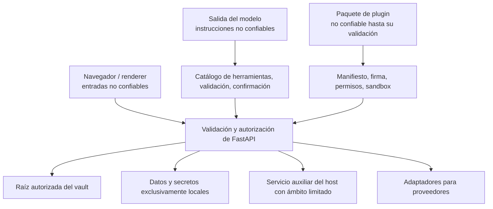

# Modelo de confianza

## Activos protegidos

- Páginas del vault, adjuntos, metadatos internos, historiales y papelera.
- Identidades de usuario, membresías, roles, permisos de acceso al vault, hashes de PAT y enlaces compartidos.
- Tokens de renovación OAuth, credenciales de correo, claves de IA, claves de firma
  y secretos de plugins.
- Bases de datos locales, índices, puntos de control de agentes, registros y acciones programadas.
- El sistema de archivos del host y las aplicaciones de escritorio accesibles mediante API auxiliares.
- Cuentas externas capaces de enviar, publicar, suprimir o modificar
  datos remotos.

## Límites de confianza

Las entradas del navegador, las salidas de modelos, los archivos importados, el HTML remoto, las respuestas de proveedores, los paquetes de plugins y las descripciones MCP no son confiables. Que un usuario haya iniciado sesión no convierte las rutas, el HTML, los argumentos de herramientas ni los identificadores de workspace en datos seguros.

## Autenticación y autorización

Las sesiones JWT utilizan una cookie HttpOnly; los mecanismos bearer permiten el acceso de clientes API. En los despliegues expuestos se comprueba al arrancar la seguridad del secreto de firma. Las contraseñas se almacenan mediante hashes; los PAT nunca se guardan en texto plano.

La autorización combina la identidad efectiva, la pertenencia al workspace, la jerarquía de roles, el permiso de acceso al vault y la operación. Las dependencias de las rutas imponen requisitos generales; los servicios repiten las comprobaciones de confinamiento y propiedad cuando el propio recurso determina el ámbito.

## Confinamiento del sistema de archivos

Las rutas se resuelven antes de compararlas y se comprueban contra las raíces permitidas. Las subidas, importaciones, exportaciones, peticiones del lector, accesos a archivos de herramientas generadas, aperturas nativas, búsquedas y operaciones de papelera utilizan límites específicos. Los enlaces simbólicos, `..`, las URL de archivos, los mapeos de rutas de nube y la codificación porcentual no deben permitir salir de la raíz autorizada.

Se prefiere la eliminación recuperable. La purga permanente y la eliminación física de un vault son operaciones explícitas e independientes.

## Seguridad de las redes

La ingesta de URL y la recuperación de contexto externo utilizan una protección SSRF. Se restringen los hosts resueltos, las redirecciones, los esquemas y los tamaños de respuesta; se rechazan los destinos privados o link-local salvo que una integración de confianza específica sea responsable del endpoint. El HTML remoto se sanea antes de renderizarlo o convertirlo.

Los clientes proveedores utilizan tiempos de espera y reintentos limitados. Las respuestas de error mostradas al navegador excluyen credenciales y rutas internas detalladas.

## Seguridad de la IA y las herramientas

La salida del modelo se trata como datos hasta que se acepta una invocación de herramienta validada. Se catalogan el origen, el esquema, el efecto, la compatibilidad con habilidades y la política de confirmación de cada herramienta. Las herramientas generadas pasan una validación del código fuente y no pueden acceder a valores de entorno, importaciones arbitrarias, escrituras sin restricciones en el sistema de archivos ni mecanismos de introspección peligrosos.

Cada registro de confirmación queda vinculado a los argumentos exactos y tiene caducidad. El sistema no reutiliza la confirmación si cambian los argumentos, no coincide el usuario o la sesión, o se agota el plazo.

## Ciclo de vida de los secretos

Los secretos se almacenan en el gestor de credenciales del sistema operativo o en el directorio de secretos de los datos locales. Se admiten variables de entorno para el arranque del despliegue y la migración de configuraciones heredadas. Las respuestas de la API enmascaran el estado de los secretos; la documentación cataloga sus nombres y consumidores, pero oculta los valores predeterminados.

Los secretos no deben guardarse en Git, el vault Markdown, la documentación generada, capturas de pantalla, logs, fixtures de pruebas ni paquetes de plugins compartidos.

## Principales controles frente a amenazas

| Amenaza | Controles primarios |
| --- | --- |
| Acceso a datos de otro workspace | Dependencia de autenticación, comprobación de pertenencia, contexto del vault, comprobaciones de propiedad en los servicios. |
| Escape mediante recorrido de rutas o enlaces simbólicos | Resolución canónica, raíces permitidas, mapeo de proveedores, pruebas de confinamiento. |
| XSS desde correo, web o contenido importado | Saneamiento HTML, escape de React, recursos restringidos del lector. |
| SSRF | Validación de esquema/host/IP, comprobación de redirecciones, límites de tamaño y tiempo. |
| Exposición de credenciales | Almacenamiento local de secretos, enmascaramiento, errores genéricos, disciplina de logging. |
| El agente realiza acciones no deseadas | Lista de herramientas permitidas, clasificación de efectos, validación de argumentos, confirmaciones. |
| Plugin malicioso | Comprobación de manifiesto/firma, permisos, raíz de instalación delimitada, sandbox, tiempo máximo de ejecución. |
| Paquete malicioso del marketplace | Índice firmado, suma de comprobación, firma del publicador, extracción delimitada en un área temporal, publicación atómica. |
| Filtración de datos privados mediante una plantilla | Lista de exportación permitida, exclusiones obligatorias, detección de posibles secretos, vista previa, confirmación y envío por un administrador. |
| Sobrescritura con datos obsoletos | ETags, revisiones de esquema, escrituras atómicas, respuestas de conflicto. |
| Corrupción SQLite | Almacenamiento local; no hay sincronización en la nube. |

## Verificación de la seguridad

Los cambios sensibles a la seguridad requieren pruebas de autenticación central, workspace, PAT, enlaces compartidos, confinamiento de rutas, XSS, SSRF, herramientas generadas, sandbox de plugins y concurrencia. Cuando cambian las áreas públicas, la QA en el navegador utiliza tanto una sesión autenticada como un contexto anónimo limpio.
