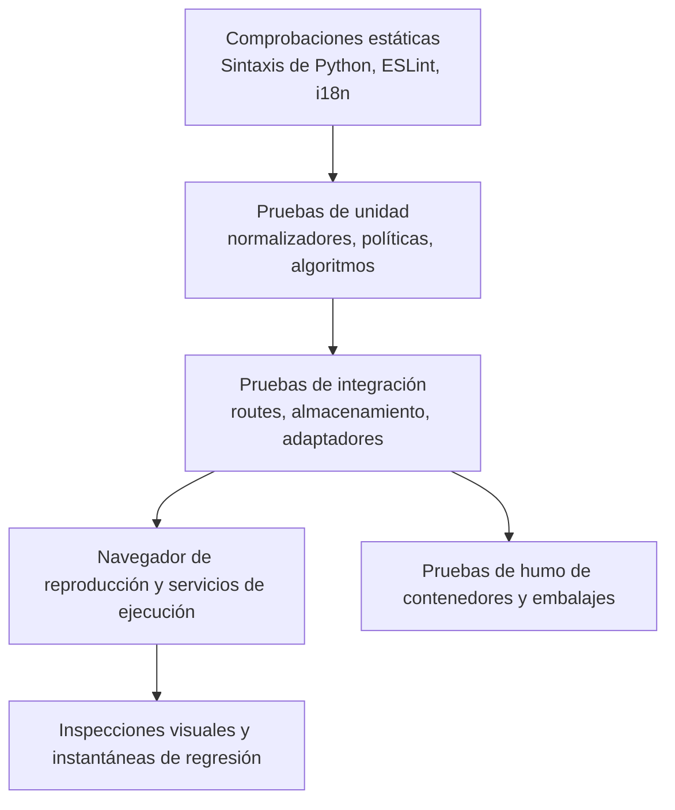

# Estrategia de ensayo

## Capas de calidad

Una compilación de frontend captura importaciones y sintaxis pero no una interacción rota. Una prueba de unidad de ruta no prueba la integración del navegador. Una captura de pantalla no prueba persistencia o autorización.

## Ensayos de motor

Pytest cubre servicios, dependencias de rutas, normalización, almacenamiento, seguridad, concurrencia y casos de regresión. Las pruebas utilizan directorios de almacén temporal y de datos locales. Los proveedores externos son anodados a menos que una prueba esté marcada explícitamente como live/E2E.

Las suites importantes incluyen:

- Auth, PAT, bootstrap de espacio de trabajo, roles y superficies públicas.
- Contención de caminos, escrituras seguras, Etags, razas, registro y comportamiento de sidecar.
- Fórmulas, rollups, filtros mecanografiados, relaciones, planificación y programación.
- Enviar MIME/CID, contactos fusionar/vCard, contención de calendario y recordatorios.
- Enrutamiento de IA, habilidades, resiliencia MCP, confirmaciones y herramientas generadas.
- Complementos, importaciones, citas, normalización de lectores, XSS y SSRF.

## Ensayos de la interfaz

Vitest cubre componentes, ganchos, registros, formatos de utilidades, lógica de vista tecleada y comportamiento de estado. ESLint y la producción Vite build son obligatorios. `check:i18n` verifica que las claves referenciadas orientadas al usuario existen en cada localización.

La compilación debe terminar con cero errores. Las advertencias existentes no son permiso para añadir nuevas advertencias sin revisión.

## Pruebas visuales y de extremo a extremo

Playwright se ejecuta como un proyecto a nivel de host contra la aplicación nativa. Una configuración anónima cubre el arranque y el comportamiento público; la configuración autenticada cubre la funcionalidad del espacio de trabajo.

Las instantáneas visuales cubren páginas de escritorio y móviles representativas. Para un cambio de interfaz de usuario, inspeccione la página real renderizada, haga clic en el control cambiado, vea la consola y tome una captura de pantalla. Confirme que los modos, superposiciones, tostadas y menús utilizan el sistema registrado de índice z y no atrapan la interacción.

## Puerta de accesibilidad

El proyecto `accessibility` de Playwright es una puerta bloqueante de WCAG 2.2
AA. Ejecuta axe sobre una ruta representativa de cada dominio principal en los
temas claro y oscuro, incluidos el contraste de color, las etiquetas, las
regiones y las relaciones ARIA. El marcado propio de la aplicación siempre
permanece dentro de la auditoría. Los datos de prueba deterministas activan los
módulos opcionales de la matriz de rutas, y cada ruta también falla si el
navegador genera un error de página no controlado; una superficie rota no
puede superar axe.

Las pruebas de interacción complementan axe con navegación de salto, foco
visible y ordenado, teclado completo, foco roving de las pestañas móviles,
Escape en diálogos cancelables, focus trap y retorno del foco, nombres
accesibles y anuncios de cambio de ruta.

El estilo global de foco utiliza el atributo `data-focus-modality` en la raíz
del documento. La activación con puntero elimina los contornos genéricos; con
teclado se aplican indicadores contextuales: el borde existente en los campos,
subrayado en los enlaces y contorno en los controles sin borde. Los títulos
editables del Vault conservan únicamente el cursor de escritura. Las pruebas
unitarias cubren los cambios de modalidad y las pruebas de navegador, el foco
con puntero y teclado en los temas claro y oscuro.

## Ensayos de despliegue

Docker CI construye imágenes de backend y frontend, valida Composi, y ejerce el punto final de salud con almacenamiento local. Elecron release CI posee un paquete multiplataforma; una compilación local de macOS no puede validar artefactos de Windows y Linux.

## Mapeo de cambio a ensayo

| Cambio | Pruebas mínimas |
| --- | --- |
| Documentación revisada pura | Verificación del generador, validador, construcción de documentos estrictos, humo de documentos del navegador. |
| Lógica de catálogo generada | Pruebas de unidades generadoras, determinismo de dos carreras, validador, construcción de documentos estrictos. |
| Comportamiento del motor | Regresión de pisteles estrecha más suite de integración afectada. |
| Comportamiento de la interfaz | Vitest cuando sea posible, comprobación i18n, producción, acción del navegador y captura de pantalla. |
| Accesibilidad o token compartido de interfaz | Vitest de la primitiva, paridad de los cuatro idiomas, matriz axe en claro y oscuro, pruebas de teclado y captura del navegador. |
| Auth/seguridad/comportamiento de la ruta | Pruebas negativas e intentos de alcance cruzado, no sólo el camino dorado. |
| Despliegue/dependencia | Verificación nativa más Docker o paquete CI según proceda. |

## Catálogo de pruebas

Los generados [catálogo de pruebas](../generated/tests.md) lista archivos de prueba y señales de navegación. La colección Runner sigue siendo autorizada para los recuentos de pruebas ejecutables.
