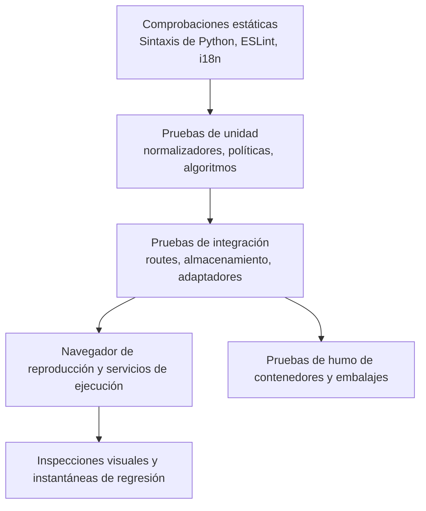

# Estrategia de ensayo

## Capas de calidad

Una compilación de frontend captura importaciones y sintaxis pero no una interacción rota. Una prueba de unidad de ruta no prueba la integración del navegador. Una captura de pantalla no prueba persistencia o autorización.

## Comprobación unificada de tipos

Ejecute `pnpm typecheck` desde la raíz del repositorio. Comprueba, en este
orden, TypeScript del frontend, mypy estricto de todo el backend (excepto las
pruebas), mypy estricto de todos los archivos Python públicos indexados del
pipeline y, finalmente, la sintaxis Python de backend, pipeline, scripts y
extensiones. Cada error detiene las etapas siguientes y conserva el código de salida.

Las órdenes individuales `typecheck:backend-boundaries` y
`typecheck:pipeline` siguen disponibles. Es una comprobación estática:
no sustituye lint, pruebas unitarias, builds, flujos de navegador ni validación
del despliegue. Superarla no acredita la eliminación de todos los límites
con `Any` explícito. La regresión comprueba los ámbitos completos y utiliza
ejecutables simulados aislados en POSIX para verificar el orden y la propagación
de errores; no acredita la ejecución en Windows.

## Ensayos de motor

Pytest cubre servicios, dependencias de rutas, normalización, almacenamiento, seguridad, concurrencia y casos de regresión. Las pruebas utilizan directorios de almacén temporal y de datos locales. Los proveedores externos son anodados a menos que una prueba esté marcada explícitamente como live/E2E.

Las suites importantes incluyen:

- Auth, PAT, bootstrap de espacio de trabajo, roles y superficies públicas.
- Contención de caminos, escrituras seguras, Etags, razas, registro y comportamiento de sidecar.
- Fórmulas, rollups, filtros mecanografiados, relaciones, planificación y programación.
- Enviar MIME/CID, contactos fusionar/vCard, contención de calendario y recordatorios.
- Enrutamiento de IA, habilidades, resiliencia MCP, confirmaciones y herramientas generadas.
- Complementos, importaciones, citas, normalización de lectores, XSS y SSRF.

## Ensayos de la interfaz

Vitest cubre componentes, ganchos, registros, formatos de utilidades, lógica de vista tecleada y comportamiento de estado. ESLint y la producción Vite build son obligatorios. `check:i18n` verifica que las claves referenciadas orientadas al usuario existen en cada localización.

La compilación debe terminar con cero errores. Las advertencias existentes no son permiso para añadir nuevas advertencias sin revisión.

Los límites de propiedad se comprueban con `gnosi/feature-boundaries` en ESLint.
La ampliación revisada prevé un manifiesto de entradas públicas exactas en
`frontend/feature-public-entries.json`, con un motivo por ruta.
Los consumidores externos a una feature usan su raíz/`index` o una entrada
explícitamente revisada; los archivos vecinos no listados siguen siendo privados.
Se comprueban imports estáticos, reexports, imports diferidos literales e imports
de tipos TypeScript. El manifiesto no debe crear un agregador de carga inmediata
ni alterar los límites de carga diferida.

Las reglas `shared` → ninguna feature/`app` y features → ningún `app` son
incondicionales, también para tipos y entradas del manifiesto. Los módulos
internos de una feature pueden usar imports locales. Los contratos globales de
código están en `frontend/tests/contracts/`; el guardrail complementa el lint AST.
Se debe verificar la implementación después del traslado; esta documentación
no acredita que la verificación global haya pasado.

## Límites de tamaño de producción

El build del frontend ejecuta `scripts/check-bundle-size.ts` después de Vite.
Los límites fijos, en bytes JavaScript sin comprimir, son: archivo de entrada
1.400.000; fragmento mayor 1.800.000; editor vendor 1.550.000; tldraw vendor
1.350.000; ruta de configuración 600.000. Un fragmento revisado ausente o
duplicado hace fallar la comprobación. Las pruebas cubren URL de despliegue
relativas, de raíz y con prefijo, crecimiento y fragmentos ausentes. El tamaño
del archivo de entrada no mide todo el grafo inicial de dependencias, la
transferencia comprimida ni el tiempo de arranque. El aviso existente de Vite
de 1.500 kB sigue visible; estos límites evitan crecimiento, no acreditan un
rendimiento óptimo.

## Pruebas visuales y de extremo a extremo

Playwright se ejecuta como un proyecto a nivel de host contra la aplicación nativa. Una configuración anónima cubre el arranque y el comportamiento público; la configuración autenticada cubre la funcionalidad del espacio de trabajo.

Las instantáneas visuales cubren páginas de escritorio y móviles representativas. Para un cambio de interfaz de usuario, inspeccione la página real renderizada, haga clic en el control cambiado, vea la consola y tome una captura de pantalla. Confirme que los modos, superposiciones, tostadas y menús utilizan el sistema registrado de índice z y no atrapan la interacción.

## Puerta de accesibilidad

El proyecto `accessibility` de Playwright es una puerta bloqueante de WCAG 2.2
AA. Ejecuta axe sobre doce rutas seleccionadas del producto en los
temas claro y oscuro, incluidos el contraste de color, las etiquetas, las
regiones y las relaciones ARIA. El marcado propio de la aplicación siempre
permanece dentro de la auditoría. Los datos de prueba deterministas activan los
módulos opcionales de la matriz de rutas, y cada ruta también falla si el
navegador genera un error de página no controlado; una superficie rota no
puede superar axe.

Antes del análisis, cada caso exige la URL canónica esperada y una superficie
visible propia de la funcionalidad, sin esqueleto de carga ni aviso de
complemento desactivado. No recarga la página para reintentar un arranque
fallido. La prueba del enlace de salto verifica el borde visible de dos píxeles
y el subrayado de teclado; la navegación al grafo sigue el enlace del vault.
Las capturas de multimedia y del centro de control conservan evidencia del
contraste en claro y oscuro. Un resultado verde cubre estos casos y estados,
no todas las interacciones, tecnologías de asistencia, datos personales ni la
conformidad completa con WCAG.

Las pruebas de interacción complementan axe con navegación de salto, foco
visible y ordenado, teclado completo, foco roving de las pestañas móviles,
Escape en diálogos cancelables, focus trap y retorno del foco, nombres
accesibles y anuncios de cambio de ruta.

El estilo global de foco utiliza el atributo `data-focus-modality` en la raíz
del documento. La activación con puntero elimina los contornos genéricos; con
teclado se aplican indicadores contextuales: el borde existente en los campos,
subrayado en los enlaces y contorno en los controles sin borde. Los títulos
editables del Vault conservan únicamente el cursor de escritura. Las pruebas
unitarias cubren los cambios de modalidad y las pruebas de navegador, el foco
con puntero y teclado en los temas claro y oscuro.

## Ensayos de despliegue

Actualmente, la CI de Docker valida Compose y construye las imágenes de backend
y frontend; no arranca contenedores ni verifica su estado y persistencia.
Estas pruebas de ejecución siguen siendo necesarias antes de una release.

La CI de Electron configura paquetes para macOS arm64/x64, Linux arm64 y
Windows x64. Configurar esa matriz, pasar pruebas unitarias desktop o comprobar
una migración sintética del perfil del navegador no valida los instaladores
ni el backend congelado. Cada arquitectura requiere evidencia de instalación,
arranque, persistencia y actualización desde 2.x. Actualmente, macOS utiliza
actualizaciones manuales mediante el instalador. Una ejecución local en macOS
no acredita las otras plataformas: no publique 3.0 antes de superar toda
la matriz de release.

## Mapeo de cambio a ensayo

| Cambio | Pruebas mínimas |
| --- | --- |
| Documentación revisada pura | Verificación del generador, validador, construcción de documentos estrictos, humo de documentos del navegador. |
| Lógica de catálogo generada | Pruebas de unidades generadoras, determinismo de dos carreras, validador, construcción de documentos estrictos. |
| Comportamiento del motor | Regresión de pisteles estrecha más suite de integración afectada. |
| Comportamiento de la interfaz | Vitest cuando sea posible, comprobación i18n, producción, acción del navegador y captura de pantalla. |
| Accesibilidad o token compartido de interfaz | Vitest de la primitiva, paridad de los cuatro idiomas, matriz axe en claro y oscuro, pruebas de teclado y captura del navegador. |
| Auth/seguridad/comportamiento de la ruta | Pruebas negativas e intentos de alcance cruzado, no sólo el camino dorado. |
| Despliegue/dependencia | Verificación nativa más Docker o paquete CI según proceda. |

## Catálogo de pruebas

Los generados [catálogo de pruebas](../generated/tests.md) lista archivos de prueba y señales de navegación. La colección Runner sigue siendo autorizada para los recuentos de pruebas ejecutables.
