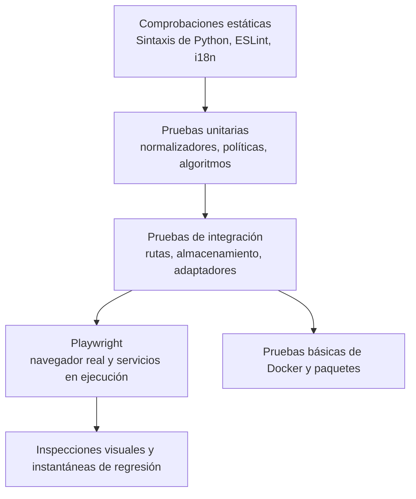

Los trabajos pesados de CI siguen este orden: backend, frontend y Docker. El Mac y la MV Linux comparten recursos físicos; el frontend utiliza un solo proceso de pruebas. Un fallo anterior no omite las comprobaciones siguientes, pero se mantienen la cancelación y las restricciones de los forks. Las suites aisladas de dibujos y citas disponen de cinco minutos por proceso, incluidas las importaciones iniciales y todas las aserciones. Las pruebas integradas de herramientas generadas utilizan el límite de producción sin modificarlo; una regresión separada verifica el límite explícito.

Las pull requests públicas del mismo repositorio ejecutan `backend` en una MV
nueva `ubuntu-24.04-arm` alojada en GitHub, añadiendo capacidad Linux ARM64 sin
compartir la CPU, la memoria, los puertos de servicios ni el motor Docker del
anfitrión nativo. `native-smoke` y `docker` conservan el ejecutor Linux ARM64
autoalojado existente. Las subidas de commits, la validación de versiones, los
repositorios privados y la ausencia de metadatos de visibilidad pública utilizan
el ejecutor autoalojado del backend; las asignaciones de ejecutores de
documentación y empaquetado no cambian.

La misma condición de PR pública del mismo repositorio también asigna `frontend`
a un nuevo ejecutor ARM64 `macos-15` alojado en GitHub, evitando las descargas
lentas del anfitrión nativo. Los repositorios privados, la ausencia de metadatos
de visibilidad, las subidas y la validación de versiones conservan el ejecutor
macOS ARM64 autoalojado. Se mantienen el heap de Node de 4 GiB, un solo proceso
de pruebas, todas las comprobaciones y el orden backend-frontend. Ambas
etiquetas alojadas son ejecutores estándar, gratuitos para repositorios públicos;
no se introducen ejecutores ampliados de pago ni acceso a datos de la aplicación
nativa o servicios del anfitrión.

Los grupos de `concurrency` del flujo de trabajo utilizan un prefijo específico
de CI, el nombre del flujo y el número de PR. Un commit nuevo cancela los trabajos
anteriores en ejecución y en cola solo de esa PR. La cancelación se activa
únicamente para eventos `pull_request`; los demás utilizan el `github.run_id`
único, de modo que las subidas y las comprobaciones reutilizables de versiones
no se cancelan entre sí ni entran en conflicto con el bloqueo de versiones del
flujo que las invoca. Los nombres de las comprobaciones obligatorias, los ámbitos
completos de pruebas, los permisos de solo lectura y las restricciones de forks
se mantienen. Añadir capacidad no elimina las dependencias existentes entre trabajos.

El trabajo de frontend desactiva la caché remota de dependencias en
`setup-node`: omite `cache` y establece explícitamente
`package-manager-cache: false`. Esto evita esperar restauraciones opcionales
atascadas y omite las subidas de caché remota, conservando el almacén local de
pnpm. `pnpm install --frozen-lockfile` sigue instalando y verificando las
dependencias, y todas las comprobaciones de frontend y escritorio siguen siendo
obligatorias. Esto no elimina el acceso a la red necesario para obtener las
dependencias que falten.

El trabajo de frontend nativo solicita explícitamente Python 3.11 gestionado
para macOS ARM64 con `UV_PYTHON=cpython-3.11-macos-aarch64-none` y verifica
`platform.machine()` antes de instalar dependencias. Un intérprete Intel
instalado no debe seleccionar silenciosamente las dependencias x86_64 mediante
Rosetta. Las descargas Python utilizan un límite de lectura HTTP de 120 segundos,
tres reintentos HTTP, un máximo de cuatro descargas simultáneas y dos hilos de
instalación. La comprobación previa del intérprete tiene un presupuesto de cinco
minutos; `uv sync --frozen`, sin cambios, tiene cuarenta y cinco para admitir
descargas sin caché en el ejecutor local alternativo. Estos límites conservan
los entornos nuevos por trabajo, el aislamiento de la caché y todas las pruebas;
no ocultan errores de instalación ni garantizan la disponibilidad de la red.
La configuración de empaquetado de versiones y de los demás trabajos no cambia.

# Estrategia de pruebas

## Capas de calidad

Ninguna capa es suficiente por sí sola. La compilación del frontend detecta errores de importación y sintaxis, pero no una interacción rota. Una prueba unitaria de ruta no demuestra la integración con el navegador. Una captura de pantalla no demuestra persistencia ni autorización.

## Comprobación unificada de tipos

Ejecute `pnpm typecheck` desde la raíz del repositorio. Comprueba, en este
orden, TypeScript del frontend, mypy estricto de todo el backend (excepto las
pruebas), mypy estricto de todos los archivos Python públicos indexados del
pipeline y, finalmente, la sintaxis Python de backend, pipeline, scripts y
extensiones. Cada error detiene las etapas siguientes y conserva el código de salida.

Las órdenes individuales `typecheck:backend-boundaries` y
`typecheck:pipeline` siguen disponibles. Es una comprobación estática:
no sustituye lint, pruebas unitarias, builds, flujos de navegador ni validación
del despliegue. Superarla no acredita la eliminación de todos los límites
con `Any` explícito. La regresión comprueba los ámbitos completos y utiliza
ejecutables simulados aislados en POSIX para verificar el orden y la propagación
de errores; no acredita la ejecución en Windows.

## Pruebas del backend

Pytest cubre servicios, dependencias de rutas, normalización, almacenamiento, seguridad, concurrencia y regresiones. Las pruebas utilizan directorios temporales para vaults y datos locales. Los proveedores externos se sustituyen por stubs salvo que la prueba esté marcada explícitamente como live/E2E.

Las suites importantes incluyen:

- Autenticación, PAT, inicialización del workspace, roles e interfaces públicas.
- Confinamiento de rutas, escrituras seguras, ETags, condiciones de carrera, registro y sidecars.
- Fórmulas, rollups, filtros tipados, relaciones, planificación y tareas programadas.
- MIME/CID del correo, fusión de contactos y vCard, confinamiento de calendario y recordatorios.
- Enrutamiento de IA, habilidades, resiliencia MCP, confirmaciones y herramientas generadas.
- Complementos, importaciones, citas, normalización de lectores, XSS y SSRF.

## Pruebas del frontend

Vitest cubre componentes, hooks, registros, utilidades de formato, lógica tipada de vistas y comportamiento del estado. ESLint y la compilación de producción con Vite son obligatorios. `check:i18n` verifica que las claves referenciadas de textos visibles para el usuario existan en todos los idiomas.

La compilación debe terminar con cero errores. Las advertencias existentes no son permiso para añadir nuevas advertencias sin revisión.

Los límites de propiedad se comprueban con `gnosi/feature-boundaries` en ESLint.
La ampliación revisada prevé un manifiesto de entradas públicas exactas en
`frontend/feature-public-entries.json`, con un motivo por ruta.
Los consumidores externos a una feature usan su raíz/`index` o una entrada
explícitamente revisada; los archivos vecinos no listados siguen siendo privados.
Se comprueban imports estáticos, reexports, imports diferidos literales e imports
de tipos TypeScript. El manifiesto no debe crear un agregador de carga inmediata
ni alterar los límites de carga diferida.

Las reglas `shared` → ninguna feature/`app` y features → ningún `app` son
incondicionales, también para tipos y entradas del manifiesto. Los módulos
internos de una feature pueden usar imports locales. Los contratos globales de
código están en `frontend/tests/contracts/`; el guardrail complementa el lint AST.
Se debe verificar la implementación después del traslado; esta documentación
no acredita que la verificación global haya pasado.

En máquinas con recursos limitados, ejecute las comprobaciones de compilación y
tipado que consumen mucha CPU por separado de la suite completa con DOM real.
Si el trabajo en paralelo provoca que las pruebas agoten sus plazos, repita la
suite afectada de forma aislada y después la suite completa con un número acotado
de workers (por ejemplo, `pnpm --filter @gnosi/frontend exec vitest run
--maxWorkers=2 --minWorkers=2`). Mantenga intactas las aserciones y los plazos;
superar una ejecución aislada no demuestra que la suite completa pase.

## Límites de tamaño de producción

El build del frontend ejecuta `scripts/check-bundle-size.ts` después de Vite.
Los límites fijos, en bytes JavaScript sin comprimir, son: archivo de entrada
1.400.000; fragmento mayor 1.800.000; editor vendor 1.550.000; tldraw vendor
1.350.000; ruta de configuración 600.000. Un fragmento revisado ausente o
duplicado hace fallar la comprobación. Las pruebas cubren URL de despliegue
relativas, de raíz y con prefijo, crecimiento y fragmentos ausentes. El tamaño
del archivo de entrada no mide todo el grafo inicial de dependencias, la
transferencia comprimida ni el tiempo de arranque. El aviso existente de Vite
de 1.500 kB sigue visible; estos límites evitan crecimiento, no acreditan un
rendimiento óptimo.

## Pruebas visuales y de extremo a extremo

Playwright se ejecuta como un proyecto del host contra la aplicación nativa. La configuración anónima cubre el arranque y el comportamiento público; la autenticada cubre la funcionalidad del workspace. Las pruebas de dominio ejercitan Vault, paneles, correo, calendario, contactos, dibujos, automatización, chat del agente y navegación.

Las instantáneas visuales cubren páginas representativas de escritorio y móvil. Ante un cambio de interfaz, inspeccione la página renderizada, pulse el control modificado, observe la consola y tome una captura. Confirme que los modales, las capas superpuestas, las notificaciones emergentes y los menús utilizan el sistema registrado de z-index y no bloquean la interacción.

## Control de accesibilidad

El proyecto `accessibility` de Playwright es un control bloqueante de WCAG 2.2
AA. Ejecuta axe sobre doce rutas seleccionadas del producto en los
temas claro y oscuro, incluidos el contraste de color, las etiquetas, las
regiones y las relaciones ARIA. El marcado propio de la aplicación siempre
permanece dentro de la auditoría y la suite no mantiene una lista permanente de
infracciones permitidas. Los datos de prueba deterministas activan los
módulos opcionales de la matriz de rutas, y cada ruta también falla si el
navegador genera un error de página no controlado; una superficie rota no
puede superar axe.

Antes del análisis, cada caso exige la URL canónica esperada y una superficie
visible propia de la funcionalidad, sin esqueleto de carga ni aviso de
complemento desactivado. No recarga la página para reintentar un arranque
fallido. La prueba del enlace de salto verifica el borde visible de dos píxeles
y el subrayado de teclado; la navegación al grafo sigue el enlace del vault.
Las capturas de multimedia y del centro de control conservan evidencia del
contraste en claro y oscuro. Un resultado verde cubre estos casos y estados,
no todas las interacciones, tecnologías de asistencia, datos personales ni la
conformidad completa con WCAG.

Las comprobaciones de interacción complementan axe en aspectos que el análisis
estático no puede demostrar: navegación de salto, foco visible y orden lógico,
manejo completo por teclado, desplazamiento del foco entre pestañas móviles,
Escape en diálogos cancelables, confinamiento y restauración del foco, nombres
accesibles y anuncios de cambio de ruta. Los cambios compartidos de foco,
modales, navegación o tokens de color deben superar este proyecto antes de una release.

El estilo global de foco utiliza el atributo `data-focus-modality` en la raíz
del documento. La activación con puntero elimina los contornos genéricos; con
teclado se aplican indicadores contextuales: el borde existente en los campos,
subrayado en los enlaces y contorno en los controles sin borde. Los títulos
editables del Vault conservan únicamente el cursor de escritura. Las pruebas
unitarias cubren los cambios de modalidad y las pruebas de navegador, el foco
con puntero y teclado en los temas claro y oscuro.

## Pruebas de despliegue

Actualmente, la CI de Docker valida Compose y construye las imágenes de backend
y frontend; no arranca contenedores ni verifica su estado y persistencia.
Estas pruebas de ejecución siguen siendo necesarias antes de una release.
El trabajo de frontend aplica el presupuesto revisado de 4 GiB de
heap de Node a todo el trabajo para que lint, comprobación de tipos, pruebas y
build de producción compartan el mismo contrato de memoria previsible.
Las pruebas de política de versiones de escritorio deben validar las condiciones
exactas de los ejecutores alojados para PR públicas, las alternativas locales
para versiones y todo el entorno de recursos Node/Python. Las pruebas de mutación
rechazan la ausencia de controles de visibilidad o evento, alternativas cambiadas,
presupuestos ausentes y sobrescrituras por paso. Un cambio de CI también requiere
toda la suite de escritorio, no solo los contratos de planificación Python.

La CI de Electron configura paquetes para macOS arm64/x64, Linux arm64 y
Windows x64. Configurar esa matriz, pasar pruebas unitarias desktop o comprobar
una migración sintética del perfil del navegador no valida los instaladores
ni el backend congelado. Cada arquitectura requiere evidencia de instalación,
arranque, persistencia y actualización desde 2.x. Actualmente, macOS utiliza
actualizaciones manuales mediante el instalador. Una ejecución local en macOS
no acredita las otras plataformas: no publique 3.0 antes de superar toda
la matriz de release.

## Correspondencia entre cambios y pruebas

| Cambio | Pruebas mínimas |
| --- | --- |
| Solo documentación revisada | Comprobación del generador, validador, compilación estricta de documentación y prueba básica del portal en el navegador. |
| Lógica de generación de catálogos | Pruebas unitarias del generador, determinismo entre dos ejecuciones, validador y compilación estricta de documentación. |
| Comportamiento del backend | Regresión acotada con pytest y suite de integración afectada. |
| Comportamiento del frontend | Vitest cuando sea viable, comprobación i18n, compilación de producción, acción en el navegador y captura. |
| Accesibilidad o token compartido de interfaz | Vitest de la primitiva, paridad de los cuatro idiomas, matriz axe en claro y oscuro, pruebas de teclado y captura del navegador. |
| Autenticación, seguridad o comportamiento de rutas | Pruebas negativas e intentos de acceso entre ámbitos, además del caso correcto. |
| Despliegue o dependencias | Verificación nativa y CI de Docker o empaquetado, según corresponda. |

## Catálogo de pruebas

El [catálogo de pruebas](../generated/tests.md) generado enumera los archivos de pruebas propios y las señales de navegación. La recopilación del ejecutor sigue siendo la fuente autoritativa del número de pruebas ejecutables.
