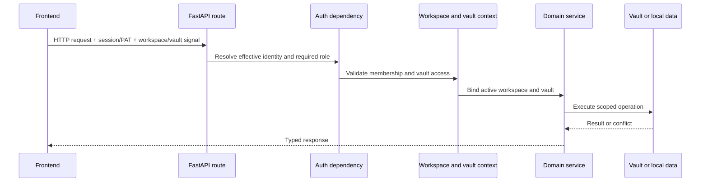

# Flux transversaux

## Demande de contexte et d'autorisation

Le mode personnel peut résoudre un utilisateur efficace local sans connexion. Le mode organisation nécessite une session valide ou un mécanisme de porteur accepté. Le moteur de commande est le propriétaire de la décision; le portail d'authentification frontal améliore UX mais n'est pas une limite de sécurité.

Les variables de contexte transportent la voûte active à travers les appels de service nichés sans transformer le chemin en un réglage mutable global. Le code en dehors d'une requête doit fournir une voûte explicite ou utiliser le chemin de résolution par défaut documenté.

## Routage par Vault

`ActiveVaultMiddleware` résout d'abord la route canonique puis applique la
priorité en-tête → requête → cookie. Des helpers typés partagent cette résolution
entre HTTP et WebSocket, et le contexte est toujours restauré à la fin.

## Flux de configuration

1. Les fichiers d'environnement et les valeurs de bootstrap de l'offre du magasin de titres OS.
2. Base d'application YAML fournit des versions par défaut.
3. Les paramètres de la maison ou de la valle active ont persisté dans la configuration de l'utilisateur.
4. Les variables d'environnement surpassent les chemins et les politiques sensibles au déploiement.
5. Les itinéraires de configuration valident et persistent les changements pris en charge.

Les fournisseurs d'IA supprimés utilisent une pierre tombale pour qu'une variable d'environnement historique ne puisse pas recréer un fournisseur silencieusement pendant une charge de configuration ultérieure.

## Gestion des erreurs

Les routes traduisent les erreurs de domaine connues en codes d'état explicites. Un gestionnaire global enregistre des exceptions inattendues avec un identifiant d'erreur et retourne une réponse générique afin que les chemins de fichiers, fragments SQL ou jetons ne soient pas divulgués au client.

Les opérations optionnelles de longue durée rapportent l'état ou le progrès et se dégradent sans bloquer les domaines non liés. Les tâches de fond doivent posséder leurs sessions de base de données et leurs limites de boucle d'événements; les sessions à envergure de requête ne peuvent pas être réutilisées après le cycle de vie de la réponse.

## Observabilité

Les logs d'exécution natifs sont capturés dans le répertoire de journal Gnosi de l'utilisateur par LaunchAgents. Les notifications opérationnelles et l'historique des tâches sont en direct dans les données locales. Les paramètres de santé rapportent un comportement efficace, pas seulement les valeurs d'environnement brut.

Les journaux sont orientés vers le développeur et rédigés en anglais. Ils ne doivent pas contenir d'identifiants, de réponses non éditées du fournisseur ou de contenu utilisateur sensible.

## Internationalisation

Les chaînes frontales visibles par l'utilisateur passent par `react-i18next` et existent dans les quatre catalogues locaux: catalan, anglais, espagnol et français. Les commentaires de code, les documents, les journaux de développeur, la documentation technique publique et les identificateurs sont anglais à moins qu'un identifiant ou une valeur de compatibilité ne persiste déjà.

## Accessibilité

La structure de l’application porte l’unique région principale, la navigation
d’évitement, les jetons de focus visible et les annonces discrètes de changement
d’itinéraire. Les domaines héritent de ces primitives et conservent les noms
accessibles dans les mêmes quatre catalogues de langue que les étiquettes
visuelles.

Les dialogues annulables utilisent la couche clavier partagée : seul le
dialogue supérieur gère Échap, Tab reste à l’intérieur et le focus revient à
l’élément déclencheur. Les onglets adaptatifs exposent des relations complètes
avec leurs panneaux et un focus roving. Playwright combine axe WCAG 2.2 AA avec
des assertions clavier explicites.

## Politique des effets externes

Les outils d'agent et les actions d'application classent les effets tels que la lecture, l'écriture, la communication externe ou les changements destructeurs. Les vérifications de rôle, les services mis en oeuvre, les dossiers de confirmation et les opérations récupérables sont appliqués selon l'effet.
