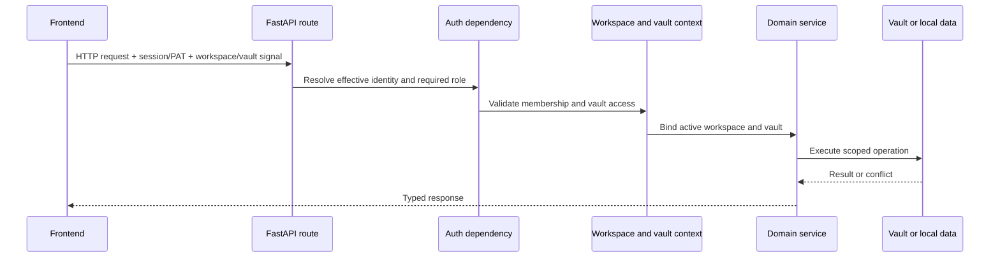

# Flux transversaux

## Contexte de requête et autorisation

Le mode personnel peut déterminer un utilisateur effectif local sans connexion. Le mode organisation exige une session valide ou un mécanisme bearer accepté. Le backend prend cette décision ; le contrôle d'authentification du frontend améliore l'expérience utilisateur, mais ne constitue pas une frontière de sécurité.

Les variables de contexte transmettent le vault actif aux appels de services imbriqués sans faire de son chemin un paramètre global mutable. Le code exécuté hors d'une requête doit fournir un vault explicite ou utiliser la résolution par défaut documentée.

## Routage par Vault

Les liens profonds privés du navigateur identifient le slug stable du vault avant
l'application et la ressource : `/@{vaultSlug}/{app}/{resourceType}/{resourceId}`.
Les pages d'accueil des applications s'arrêtent au segment de l'application.
Les noms de vault restent modifiables ; leurs slugs sont persistés séparément
et ne changent pas lors d'un renommage. Les partages publics et les interfaces
globales de compte ou de gestion des vaults restent hors de cet espace de noms.

Les API de données des vaults suivent le même périmètre sous
`/api/v1/vaults/{vaultSlug}/{app}/...`. `ActiveVaultMiddleware` résout le slug
avant la répartition normale de FastAPI, lie l'identifiant immuable et le chemin
du vault, puis réutilise l'implémentation existante de l'endpoint. Le chemin
canonique prévaut sur un ancien en-tête, paramètre de requête ou cookie
contradictoire, mais les dépendances de workspace et d'accès au vault prennent
toujours la décision d'autorisation.

L'analyse des signaux est isolée dans des helpers typés pour les en-têtes,
paramètres de requête et cookies. Le middleware réécrit uniquement le périmètre
canonique, installe le jeton de contexte, transmet la requête puis le réinitialise.
HTTP et WebSocket partagent ainsi une seule frontière de propagation.

Le frontend sépare la construction des routes du transport réseau. Le HTTP
ordinaire passe par le client typé `openapi-fetch` ou par l’adaptateur de
compatibilité ; tous deux délèguent à `transportFetch`, qui ajoute le contexte
workspace, utilisateur et Vault et canonicalise les requêtes sous forme de
chaîne ou d'URL sans remplacer `window.fetch`. TanStack Query gère le cache
serveur et son invalidation au niveau du fournisseur de l'application. SSE,
streaming, téléchargements et WebSockets de collaboration utilisent des
adaptateurs spécialisés explicites, car OpenAPI ne décrit pas entièrement
leurs contrats dans le navigateur.

L'artefact OpenAPI et les opérations TypeScript sont générés de façon
déterministe depuis l'application FastAPI canonique dans un runtime éphémère.
Un contrôle du code interdit Axios, `fetch` direct en production, les
monkeypatches globaux de fetch et les transports spéciaux non révisés ; sa petite
liste d'exceptions justifiées ne couvre que les frontières du navigateur qui
ne peuvent pas importer le client de l'application. Les anciens liens stockés
sont toujours remplacés par des URL canoniques du navigateur, et les anciens
chemins API restent des alias de compatibilité pour les clients plus anciens.

## Flux de configuration

1. Les fichiers d'environnement et le magasin d'identifiants du système fournissent les valeurs d'amorçage.
2. Le YAML de base de l'application fournit les valeurs par défaut versionnées.
3. Les paramètres du répertoire personnel ou du vault actif fournissent la configuration utilisateur persistée.
4. Les variables d'environnement imposent les chemins et politiques sensibles au déploiement.
5. Les routes de paramètres valident et persistent les modifications prises en charge.

Les fournisseurs d'IA supprimés laissent un marqueur de suppression afin qu'une ancienne variable d'environnement ne puisse pas les recréer silencieusement lors d'un chargement ultérieur de la configuration.

## Gestion des erreurs

Les routes traduisent les erreurs de domaine connues en codes d'état explicites. Un gestionnaire global enregistre des exceptions inattendues avec un identifiant d'erreur et retourne une réponse générique afin que les chemins de fichiers, fragments SQL ou jetons ne soient pas divulgués au client.

Les opérations facultatives de longue durée signalent leur état ou leur progression et se dégradent sans bloquer les autres domaines. Les tâches d'arrière-plan doivent gérer leurs propres sessions de base de données et frontières de boucle d'événements ; les sessions limitées à une requête ne peuvent pas être réutilisées après le cycle de vie de la réponse.

## Observabilité

Les modules backend utilisent la journalisation standard. Les LaunchAgents capturent les journaux d'exécution natifs dans le répertoire de journaux Gnosi de l'utilisateur. Les notifications opérationnelles et l'historique des tâches résident dans les données locales. Les endpoints de santé indiquent le comportement effectif, pas seulement les valeurs brutes de l'environnement.

Les journaux sont destinés aux développeurs et rédigés en anglais. Ils ne doivent contenir ni identifiants secrets, ni réponses de fournisseurs non expurgées, ni contenu utilisateur sensible complet.

## Internationalisation

Les chaînes du frontend visibles par l'utilisateur passent par `react-i18next` et existent dans les quatre catalogues linguistiques : catalan, anglais, espagnol et français. Les commentaires de code, docstrings, journaux de développement, documentation technique publique et identifiants sont en anglais, sauf lorsqu'un identifiant ou une valeur de compatibilité est déjà persisté.

## Accessibilité

La structure de l’application porte l’unique région principale, la navigation
d’évitement, les jetons de focus visible et les annonces discrètes de changement
d’itinéraire. Les domaines héritent de ces primitives et conservent les noms
accessibles dans les mêmes quatre catalogues de langue que les étiquettes
visuelles.

Les dialogues annulables utilisent la couche clavier partagée : seul le
dialogue supérieur gère Échap, Tab reste à l’intérieur et le focus revient à
l’élément déclencheur. Les onglets adaptatifs exposent des relations complètes
avec leurs panneaux et un déplacement du focus au clavier. Playwright combine
les analyses axe WCAG 2.2 AA sur la matrice des routes du produit avec des
assertions clavier explicites, car aucune de ces deux couches ne prouve l'autre.

## Politique des effets externes

Les outils de l'agent et les actions de l'application classent les effets : lecture, écriture, communication externe ou modification destructive. Les contrôles de rôle, services à périmètre limité, enregistrements de confirmation et opérations récupérables s'appliquent selon l'effet. La confirmation du client ne suffit pas à autoriser l'action dans le backend.
