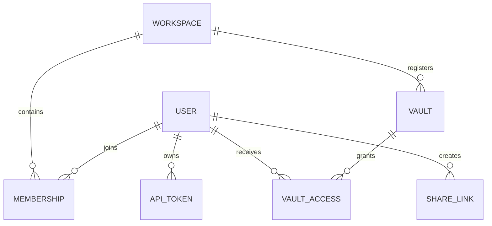

# Données et stockage

## Configuration bibliographique

`GNOSI_DATA_DIR/config/references.json` contient la désignation de la table
bibliographique, sa désactivation explicite et les paramètres des pièces jointes
liées. Les copies dans le code sont migrées explicitement avec
`scripts/migrate-reference-config.py`, jamais par une requête API ou une copie
implicite au démarrage. Le migrateur préserve l'original et les champs inconnus,
vérifie les octets JSON UTF-8, publie sans remplacer un autre fichier et conserve
un journal privé de récupération. Le démarrage refuse les anciennes configurations
non migrées avant les mises à niveau des bases et les tâches en arrière-plan.

## Responsabilité des données

| Données | Stockage persistant responsable | Règle de reconstruction ou de récupération |
| --- | --- | --- |
| Contenu de page et frontmatter | Vault Markdown | Sauvegarder et versionner comme des fichiers ordinaires. |
| Pièces jointes et fichiers de bibliothèque | Vault actif | Préserver les références relatives ou portables. |
| Métadonnées internes des pages | Fichiers auxiliaires `.gnosi` du vault | Migrer avec la page ; garder les champs internes hors du contenu rédigé par l'utilisateur. |
| Index des pages et wikilinks | Caches de données locales | Reconstruire depuis le vault ; les analyses partielles ne doivent pas remplacer les caches complets. |
| Utilisateurs, espaces de travail, membres, accès aux vaults, PAT et partages | SQLite de gestion | Sauvegarder comme état local de l'application ; ne jamais synchroniser la base active dans le cloud. |
| Index de courrier, lecteur, notifications, annotations et exécutions | SQLite local | Selon le domaine, récupérer depuis les fournisseurs ou les données sources lorsque possible. |
| Jetons OAuth et secrets d'intégration | Secrets locaux ou gestionnaire d'identifiants du système | Reconnecter chaque machine en cas de perte ; ne pas copier dans un vault partagé. |
| Points de contrôle de l'agent | Données locales | Mémoire d'exécution propre à chaque instance, pas contenu du vault. |

## Format du vault

Une page est un fichier Markdown avec frontmatter YAML. Les identifiants stables
permettent aux liens et relations de survivre aux changements de titre. Les liens
visibles utilisent la syntaxe wikilink ; les pièces jointes et propriétés de type
fichier utilisent des chemins portables ou des métadonnées structurées, pas des
chemins absolus propres à une machine.

Les vues de type base de données sont des projections sur les pages et registres.
Elles ne remplacent pas Markdown par un stockage relationnel opaque. La couche de
services du vault résout les définitions de vues, schémas, formules, rollups,
relations et états de présentation.

## Écritures concurrentes

Les lectures de page exposent un ETag dérivé de la représentation actuelle. Les
clients qui modifient les données renvoient l'ETag attendu ; une différence fait
rejeter l'écriture obsolète au lieu d'écraser un changement concurrent. Les
utilitaires d'écriture atomique remplacent le fichier uniquement lorsque la
nouvelle version est complète.

Renommer nécessite l'index de wikilinks pour actualiser les liens entrants.
L'opération touche l'identité de page, le nom du fichier, le registre, les fichiers
auxiliaires et les index de liens ; elle doit être exécutée de façon coordonnée.

## Base de données de gestion

Les modèles SQLAlchemy représentent :

Tous les modèles de gestion héritent d'une même `DeclarativeBase` typée de
SQLAlchemy. Les fabriques de moteurs et sessions sont initialisées atomiquement
et renvoient les types concrets `Engine` et `Session`. Les métadonnées et noms de
tables restent la référence pour Alembic et les installations SQLite existantes.

Avant le lancement des tâches, le coordinateur de schémas localise la base de
gestion, chaque vault dynamique et les stockages auxiliaires persistants de Gnosi.
Des lignes de révisions Alembic indépendantes reconnaissent des empreintes
structurelles 2.x révisées, créent des sauvegardes vérifiées et appliquent des
migrations vers l'avant. Les schémas inconnus ou divergents provoquent un arrêt
sans modification. Les caches dérivés et les bases externes restent hors de ces migrations.

Les fichiers `academic_index.sqlite3` concernés appartiennent à la famille
`literature_index`. Les enregistrements OAI et `oai_sync_state` sont durables ;
la table virtuelle FTS peut être reconstruite, mais reste dans la même migration
révisée car ses identifiants de ligne demeurent synchronisés avec les
enregistrements durables. Les connexions d'exécution définissent uniquement les
pragmas opérationnels de SQLite et n'exécutent jamais de DDL de schéma.

Seuls les hachages des PAT et un préfixe reconnaissable sont enregistrés. Les
jetons de partage public sont des identifiants opaques ; leurs lignes conservent
le créateur, le vault, les permissions, l'expiration et l'état de révocation.

## Isolation des données locales

`GNOSI_DATA_DIR` désigne la racine de chaque instance. Le résolveur crée les
répertoires de cache, système, points de contrôle, journaux, audio, sorties,
sauvegardes et secrets. Docker utilise `/data` ; les valeurs natives suivent la
convention de données d'application du système. `GNOSI_LOCAL_DATA` reste un alias
obsolète de la série 3.x.

Les fichiers SQLite ne doivent pas être placés sur OneDrive, iCloud Drive, Dropbox
ou une autre couche de synchronisation. Celle-ci ne fournit pas les verrouillages
requis par SQLite et peut corrompre la base ou en créer des versions divergentes.

## Vaults avec fichiers dans le cloud

Les adaptateurs séparent le comportement ordinaire du système de fichiers du
téléchargement local à la demande et de la disponibilité. Les lectures gèrent les
erreurs transitoires par fichier et continuent lorsqu'une réponse partielle est
utile. Une analyse partielle est signalée et ne remplace jamais un cache complet.
Sur macOS, le téléchargement à la demande utilise une action de la session
graphique, car un LaunchAgent peut recevoir `EDEADLK` pour du contenu uniquement en ligne.
Le runtime d'hydratation est indépendant du fournisseur. OneDrive, iCloud Drive, Google Drive, Nextcloud et Dropbox disposent d'adaptateurs
et de préfixes de configuration distincts. Un service inconnu monté sous
`~/Library/CloudStorage` utilise l'adaptateur générique `fileprovider`. Les dossiers
montés ordinaires ou entièrement synchronisés utilisent le système de fichiers local.

## Propriété de la configuration

La configuration fusionne récursivement les paramètres de base avec ceux de
l'utilisateur ou du vault actif dans `.gnosi/params.yaml`. L'environnement est
prioritaire pour les chemins de déploiement et certains comportements de démarrage.
Les identifiants font référence au gestionnaire local de secrets, pas à des valeurs
brutes intégrées dans la configuration du vault.

Les variables du processus sont prioritaires sur le `.env` local de Gnosi. Le
fichier partagé est chargé uniquement si `GNOSI_SHARED_ENV_FILE` le désigne
explicitement et reste en lecture seule pour l'application. Les identifiants gérés
par l'interface utilisent le gestionnaire système, avec repli chiffré sous
`GNOSI_DATA_DIR/secrets`.
