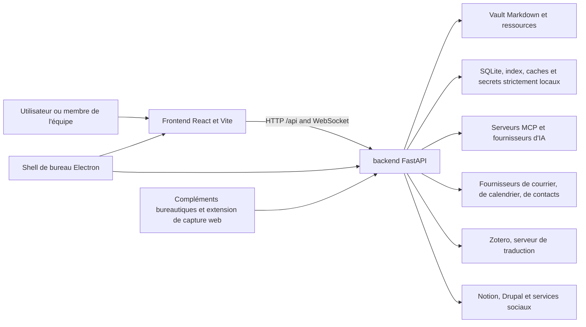

# Contexte du système

## Vue des conteneurs

## Frontière du frontend

Le frontend est une application React à page unique. `app/App.tsx` gère
l'authentification et le shell global ; `app/routes.tsx` compose les routes,
le périmètre du Vault, les redirections et le chargement différé des pages,
tandis que Home est chargé au démarrage. `app/bootstrap.tsx` prépare le routage
et la langue ; `app/AppProviders.tsx` conserve l'ordre
StrictMode → API → router → authentification. Le déplacement place l'entrée CSS
et l'appel à bootstrap dans `app/main.tsx`, avec les styles ordonnés dans
`app/styles/index.css`. Vite relaie `/api` et WebSocket en développement natif.

### Répartition des modules

Le déplacement révisé attribue la composition, la navigation et l'intégration
globale à `app/` ; les domaines du produit à `features/` ; l'infrastructure,
l'UI, les enregistrements, le routage et les adaptateurs API réutilisables à
`shared/` ; et les contrats générés à `generated/`. Ces contrats sont régénérés,
jamais modifiés à la main. Le fournisseur d'authentification appartient à
`features/auth/context/AuthProvider.tsx` et son contexte réutilisable à
`shared/auth/auth-context.ts`.

Le manifeste `frontend/feature-public-entries.json` recense les chemins
publics exacts révisés et leurs justifications. Les entrées `index` à la racine
des features restent autorisées ; un module voisin non répertorié reste privé.
Les consommateurs utilisent directement une entrée racine ou explicitement
révisée, avec des imports différés distincts, sans introduire d'agrégateur
chargé au démarrage. Le manifeste décrit l'accès ; il n'importe aucun module.

Les dépendances peuvent aller d'`app` vers les features et l'infrastructure
partagée. Les features ne dépendent pas d'`app` ; `shared` ne dépend ni des
features ni d'`app`, même pour les imports de types. Déplacer la prévisualisation
Markdown/wikilink dans l'infrastructure partagée ne résout pas son cycle interne.
Le déplacement doit préserver chargement différé, styles, routes et payloads ;
la structure seule ne prouve pas que l'intégration ou la release est terminée.

Les composants appellent le backend via les adaptateurs API typés de `shared/api/`.
Le backend reste responsable des autorisations des utilisateurs, workspaces,
vaults et opérations destructrices.

## Frontière du backend

`backend/server.py` crée l'application FastAPI et enregistre les routeurs des domaines. Les modules de routes traduisent les contrats HTTP en appels de services. La logique métier réside dans `backend/services/`, les entités relationnelles persistées dans `backend/models/`, l'orchestration IA dans `backend/agent/` et les tâches planifiées dans `backend/scheduler/` et les compétences d'exécution.

Le cycle de vie de l'application démarre l'infrastructure partagée, construit les capacités de l'agent, précharge les index pouvant l'être sans risque, lance les workers IDLE du courrier, puis ferme ces ressources. Le démarrage des intégrations facultatives est isolé : l'indisponibilité d'un fournisseur n'interrompt pas tout le serveur.

## Limites de stockage

Le vault et les données locales ont délibérément des propriétés différentes de durabilité et de synchronisation :

- Vault : contenu utilisateur portable, sur disque local ou chez un fournisseur de fichiers cloud.
- Données locales : SQLite, index, caches, secrets, journaux, points de contrôle et sorties ; jamais synchronisés dans le cloud.
- Configuration : fusion des valeurs par défaut de l'application, des paramètres utilisateur ou du vault, des valeurs prioritaires de l'environnement et des magasins locaux d'identifiants.

Consultez [données et stockage](data-and-storage.md) pour les responsabilités et les règles de reconstruction.

## Systèmes externes

Tous les services externes sont des dépendances de domaine optionnelles. OAuth et les identifiants sont gérés localement. Les adaptateurs normalisent le comportement spécifique de fournisseur pour Google, Microsoft, IMAP/SMTP, CalDAV, Notion, Drupal, fournisseurs d'IA, réseaux sociaux, fournisseurs de fichiers et traduction Zotero.

## Navigation vers la mise en œuvre

- [Catalogue API](../generated/api-catalog.md)
- [Catalogue Frontend](../generated/frontend-catalog.md)
- [Catalogue des modules du backend](../generated/backend-modules.md)
- [Catalogue de configuration](../generated/configuration.md)
