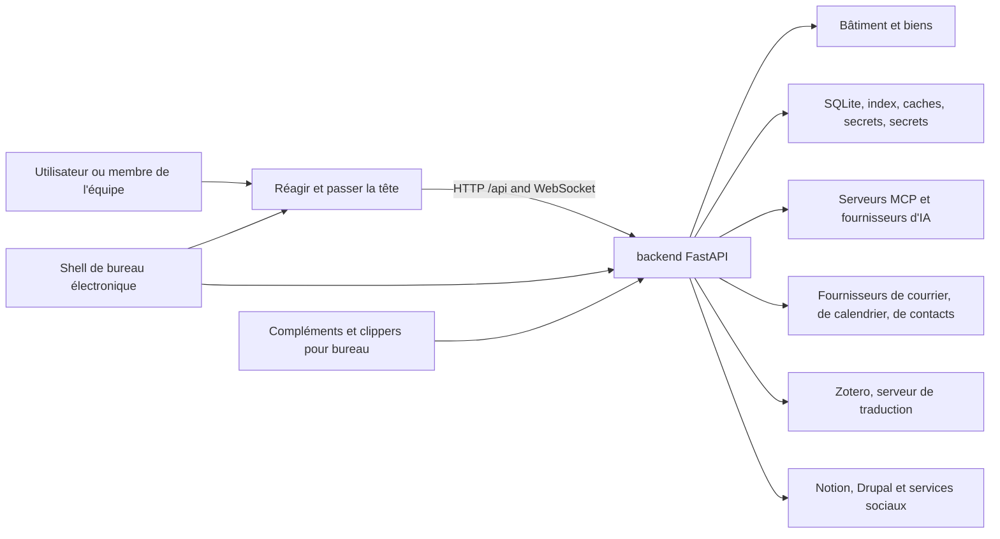

# Contexte du système

## Vue du conteneur

## Frontière

La façade est une application React à une seule page. `App.jsx` possède les routes de navigateur de haut niveau, portail d'authentification, shell global, chargement de route paresseux, toasts, chat agent, palette de commandes, enregistreur de réunion, rappels, et avis de mise à jour de bureau. `/api` et le trafic WebSocket vers le backend pendant le développement natif.

Les pages composent des composants réutilisables; les composants appellent le moteur par des aides partagées ou des appels directs de recherche. Le frontend n'est pas fiable pour autoriser un espace de travail, un coffre, un utilisateur ou une opération destructrice.

## Limites de l'arrière-pays

`backend/server.py` crée l'application FastAPI et enregistre les routeurs de domaine. Les modules de route traduisent les contrats HTTP en appels de service. `backend/services/`; les entités relationnelles persistantes vivent dans `backend/models/`; L'orchestration de l'IA vit dans `backend/agent/`; vie professionnelle prévue dans `backend/scheduler/` et des compétences en cours d'exécution.

La durée de vie de l'application démarre l'infrastructure partagée, construit des capacités d'agent, réchauffe des index de sécurité, démarre les travailleurs IDLE du courrier, et ferme plus tard ces ressources.

## Limites de stockage

La voûte et les données locales ont délibérément différentes propriétés de durabilité et de synchronisation:

- Vault: contenu portable de l'utilisateur; peut être installé sur un disque local ou un fichier nuage
Le fournisseur.
- Données locales : SQLite, index, caches, secrets, journaux, points de contrôle et sorties;
jamais synchronisé dans le nuage.
- Configuration : fusionné à partir des paramètres par défaut de l'application, utilisateur ou coffre,
les surcharges d'environnement et les magasins locaux de titres de compétence.

Voir [données et stockage](data-and-storage.md) pour la propriété et la reconstruction des règles.

## Systèmes externes

Tous les services externes sont des dépendances de domaine optionnelles. OAuth et les identifiants sont gérés localement. Les adaptateurs normalisent le comportement spécifique de fournisseur pour Google, Microsoft, IMAP/SMTP, CalDAV, Notion, Drupal, fournisseurs d'IA, réseaux sociaux, fournisseurs de fichiers et traduction Zotero.

## Navigation vers la mise en œuvre

- [Catalogue API](../generated/api-catalog.md)
- [Catalogue Frontend](../generated/frontend-catalog.md)
- [Catalogue du module de l'arrière-pays](../generated/backend-modules.md)
- [Catalogue de configuration](../generated/configuration.md)
