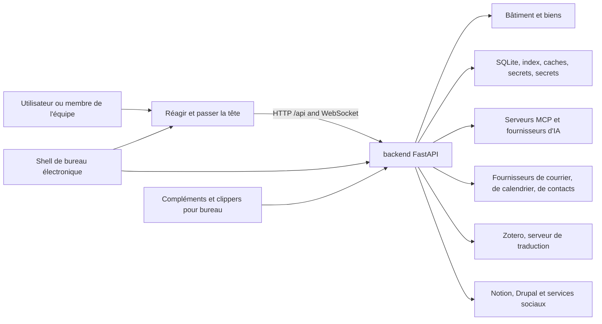

# Contexte du système

## Vue du conteneur

## Frontière du frontend

Le frontend est une application React à page unique. `app/App.tsx` gère
l'authentification et le shell global ; `app/routes.tsx` compose les routes,
le périmètre du Vault, les redirections et le chargement différé des pages,
tandis que Home est chargé au démarrage. `app/bootstrap.tsx` prépare le routage
et la langue ; `app/AppProviders.tsx` conserve l'ordre
StrictMode → API → router → authentification. Le déplacement place l'entrée CSS
et l'appel à bootstrap dans `app/main.tsx`, avec les styles ordonnés dans
`app/styles/index.css`. Vite relaie `/api` et WebSocket en développement natif.

### Répartition des modules

Le déplacement révisé attribue la composition, la navigation et l'intégration
globale à `app/` ; les domaines du produit à `features/` ; l'infrastructure,
l'UI, les enregistrements, le routage et les adaptateurs API réutilisables à
`shared/` ; et les contrats générés à `generated/`. Ces contrats sont régénérés,
jamais modifiés à la main. Le fournisseur d'authentification appartient à
`features/auth/context/AuthProvider.tsx` et son contexte réutilisable à
`shared/auth/auth-context.ts`.

Le manifeste `frontend/feature-public-entries.json` recense les chemins
publics exacts révisés et leurs justifications. Les entrées `index` à la racine
des features restent autorisées ; un module voisin non répertorié reste privé.
Les consommateurs utilisent directement une entrée racine ou explicitement
révisée, avec des imports différés distincts, sans introduire d'agrégateur
chargé au démarrage. Le manifeste décrit l'accès ; il n'importe aucun module.

Les dépendances peuvent aller d'`app` vers les features et l'infrastructure
partagée. Les features ne dépendent pas d'`app` ; `shared` ne dépend ni des
features ni d'`app`, même pour les imports de types. Déplacer la prévisualisation
Markdown/wikilink dans l'infrastructure partagée ne résout pas son cycle interne.
Le déplacement doit préserver chargement différé, styles, routes et payloads ;
la structure seule ne prouve pas que l'intégration ou la release est terminée.

Les composants appellent le backend via les adaptateurs API typés de `shared/api/`.
Le backend reste responsable des autorisations des utilisateurs, workspaces,
vaults et opérations destructrices.

## Limites de l'arrière-pays

`backend/server.py` crée l'application FastAPI et enregistre les routeurs de domaine. Les modules de route traduisent les contrats HTTP en appels de service. `backend/services/`; les entités relationnelles persistantes vivent dans `backend/models/`; L'orchestration de l'IA vit dans `backend/agent/`; vie professionnelle prévue dans `backend/scheduler/` et des compétences en cours d'exécution.

La durée de vie de l'application démarre l'infrastructure partagée, construit des capacités d'agent, réchauffe des index de sécurité, démarre les travailleurs IDLE du courrier, et ferme plus tard ces ressources.

## Limites de stockage

La voûte et les données locales ont délibérément différentes propriétés de durabilité et de synchronisation:

- Vault: contenu portable de l'utilisateur; peut être installé sur un disque local ou un fichier nuage
Le fournisseur.
- Données locales : SQLite, index, caches, secrets, journaux, points de contrôle et sorties;
jamais synchronisé dans le nuage.
- Configuration : fusionné à partir des paramètres par défaut de l'application, utilisateur ou coffre,
les surcharges d'environnement et les magasins locaux de titres de compétence.

Voir [données et stockage](data-and-storage.md) pour la propriété et la reconstruction des règles.

## Systèmes externes

Tous les services externes sont des dépendances de domaine optionnelles. OAuth et les identifiants sont gérés localement. Les adaptateurs normalisent le comportement spécifique de fournisseur pour Google, Microsoft, IMAP/SMTP, CalDAV, Notion, Drupal, fournisseurs d'IA, réseaux sociaux, fournisseurs de fichiers et traduction Zotero.

## Navigation vers la mise en œuvre

- [Catalogue API](../generated/api-catalog.md)
- [Catalogue Frontend](../generated/frontend-catalog.md)
- [Catalogue du module de l'arrière-pays](../generated/backend-modules.md)
- [Catalogue de configuration](../generated/configuration.md)
