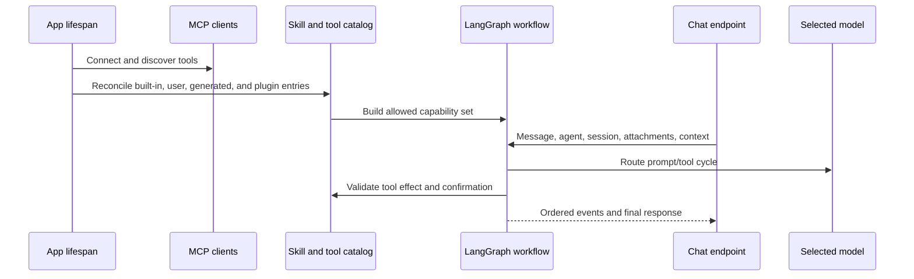

# Agents IA, modèles, outils et compétences

## Responsabilité de la conversation côté frontend

`features/agent` gère la composition des conversations, les sessions, les confirmations,
les actions sur les messages et la présentation du flux. Son point d'entrée public
exporte `AgentChat` et le contrat complet de ses propriétés. L'application charge
ce point d'entrée dynamiquement ; les carnets importent le même composant dans
leur module de route optionnel. Aucun appelant n'accède aux modules privés de
conversation ni ne convertit le composant vers un type plus restreint.

Les tableaux de références de contexte restent en lecture seule dans toute
l'interface et ne sont copiés qu'à la construction de la requête HTTP existante.
Cela préserve les métadonnées des sources, le périmètre des carnets, les charges
utiles, la relecture du flux et les clés de persistance. Les adaptateurs HTTP et
NDJSON génériques restent dans `shared/api` ; les tests combinant les retours
utilisateur et le transport appartiennent à la fonctionnalité agent, afin que
le code partagé ne dépende pas des détails internes de l'interface.

## Modèle de capacités

Gnosi distingue les modèles, les agents, les compétences et les outils :

- Modèle : une route vers un fournisseur, avec des capacités, des limites, des
  métadonnées de coût, des informations de fiabilité et des identifiants d'accès.
- Agent : des instructions, une sélection de modèle, une politique de mémoire
  et de points de contrôle, ainsi que des compétences attribuées.
- Compétence : un ensemble documenté de capacités qui fournit des instructions
  et restreint les outils compatibles.
- Outil : une opération appelable, classée selon ses effets et son origine.
- Source de contexte : un Vault, une table, un fichier ou du contenu externe
  sélectionné par l'utilisateur et ajouté à une conversation, avec des règles
  explicites de confinement et de taille.

La boîte à outils de connaissance du Vault conserve les objets LangChain
`StructuredTool` à la frontière d'enregistrement et n'en extrait les fonctions
typées que pour composer les outils en interne. La création de pages s'enregistre
auprès du composant canonique responsable du Vault, la recherche dans le Vault
obtient explicitement son magasin dédié à chargement différé, et la lecture de
chemins et de PDF conserve ses règles de confinement et les plafonds de taille
définis par le serveur.

Le flux Artificial Analysis constitue une interface de comparaison typée côté
serveur. Il garde les identifiants d'API privés, valide chaque réponse paginée,
complète uniquement les métadonnées absentes du catalogue, préserve les métriques
vérifiées en cache et se replie sur un cache périmé ou models.dev en indiquant
explicitement la provenance.

## Démarrage et traitement des requêtes

Les imports historiques d'Agent restent disponibles au moyen de façades de
compatibilité ciblées, tandis que le paquet de domaine gère la mise en
correspondance et le stockage du contexte, la répartition des appels aux outils
internes, les contrats de preuves et de citations, l'état du flux, les
confirmations, les sessions et la composition des routes. Les routes du catalogue
et de la gouvernance des agents suivent le même modèle dans le domaine de
configuration, en préservant l'ordre des routes et les identifiants d'opération.

Le routeur de modèles détermine les combinaisons fournisseur/modèle, les limites
de contexte, la prise en charge des outils, les plafonds de dépenses et la
politique de repli. Les identifiants d'accès proviennent du stockage local des
secrets ou de la migration prise en charge depuis l'environnement ; ils ne sont
pas exposés au frontend. Les causes d'échec sont enregistrées séparément des
réponses destinées à l'utilisateur, afin que les opérateurs puissent distinguer
les dépassements de délai, les refus du fournisseur, les identifiants invalides,
les dépassements de contexte et les incompatibilités d'outils.

Le client hybride historique reste disponible pour la rédaction de publications
sociales, de courriels et les anciens analyseurs du pipeline, à travers une
interface de compatibilité strictement typée. Il précise les types des mappings
YAML dynamiques de fournisseurs, exige une URL de fournisseur concrète avant tout
appel réseau, valide les enveloppes de réponse compatibles OpenAI, écrit
atomiquement son cache indexé par hachage des prompts sous le répertoire de
données propre à l'appareil et préserve le comportement établi : fournisseur
principal, puis solution de repli, sans exposer les identifiants d'accès.

La transcription locale Whisper expose un protocole de modèle et une structure
de résultat typés ; l'audio reste sur l'appareil et le cache du modèle, téléchargé
à la demande, se trouve sous `GNOSI_DATA_DIR`, indépendamment du fournisseur.
L'import optionnel non typé de `faster-whisper` est limité à cet adaptateur.
La conversion monétaire précise de même les types du JSON distant et en cache
avant les calculs de budget, conserve les replis sur des taux réels périmés et
des valeurs statiques, et renvoie toujours un taux typé positif exprimé en unités
par USD.

Le routeur normalise les métadonnées inconnues du registre avant de les parcourir,
compare les quotas de jetons et les fenêtres de contexte sous forme d'entiers et
encapsule son registre d'utilisation dans des interfaces typées de résolution de
chemin, de chargement et de sauvegarde atomique. Les plafonds monétaires
distinguent explicitement l'absence de plafond d'un plafond nul, préservant la
politique existante à l'approche du plafond et le repli sur les modèles gratuits,
tout en réinitialisant le registre à vide lorsque les données persistées sont
malformées.

L'observabilité des agents, la relecture, les journaux de flux, les réservations
de tours, la qualité validée, la mémoire personnelle et sémantique, les évaluations
de modèles, l'audit et l'état de santé des capacités constituent un état
opérationnel propre à chaque appareil. Leurs magasins SQLite/JSON résolvent leur
emplacement directement via `GNOSI_DATA_DIR` ; ils ne le déduisent jamais d'un
Vault ni d'un fournisseur cloud. Les tests injectent ce même résolveur canonique,
et les clés de chiffrement des flux restent dans le sous-répertoire `secrets`
du répertoire local de données.

La sélection du modèle à l'exécution relève du profil de l'agent. `pinned`
utilise uniquement le fournisseur et le modèle attribués ; `resilient` commence
par ceux-ci et n'autorise un basculement qu'en cas d'erreur transitoire ;
`adaptive` peut choisir parmi le modèle principal et la liste explicitement
autorisée du profil. Chaque alternative doit être une entrée activée du registre,
avec la même localité, locale ou distante ; les identifiants d'accès et les
valeurs par défaut du catalogue n'élargissent jamais la liste autorisée. Les
erreurs d'authentification, de politique et de contenu ne provoquent jamais de
basculement. Le modèle de repli sélectionné est indiqué dans les métadonnées du
message et dans le compte rendu du flux, de sorte qu'un modèle local ne puisse
pas envoyer inopinément du contexte privé à un fournisseur distant.

Le client MCP stdio valide les objets aux frontières JSON-RPC, type explicitement
les requêtes asynchrones en attente et achemine les appels d'outils à travers un
cache actualisé uniquement si l'entrée recherchée est absente. Les catalogues
d'outils malformés échouent localement au lieu de laisser des valeurs non vérifiées
se propager dans l'environnement d'exécution de l'agent.

Les paramètres IA conservent les identifiants des fournisseurs, les marqueurs de
suppression de connexion, le registre des modèles et les routes de budget et
d'utilisation dans une façade de compatibilité strictement typée. La génération
et la correction de l'éditeur résident dans le domaine IA de configuration ;
le chargement validé des mappings YAML et les métadonnées explicites des réponses
historiques préservent exactement les contrats HTTP et OpenAPI existants.

## Gouvernance des outils

Les descripteurs d'outils déclarent leurs effets : lecture, écriture, effets
externes ou destructifs. Les outils générés passent une validation fondée sur
l'AST et s'exécutent dans un environnement restreint. Le validateur bloque les
capacités dangereuses telles que l'écriture de fichiers sans restriction,
l'accès à l'environnement, le parcours dynamique des attributs à double trait
de soulignement et les imports non sûrs.

Les actions nécessitant une confirmation créent des enregistrements persistants
en attente. La confirmation lie l'utilisateur, la session, l'outil, les arguments,
l'effet et l'expiration ; accepter une action périmée ou modifiée n'autorise pas
une autre invocation. La maintenance fait expirer et supprime les enregistrements
indépendamment du trafic de conversation.

Les types des métadonnées de capacités versionnées sont précisés à partir des
entrées sous forme de modèles ou de mappings avant validation. Les contrats de
version 2 refusent toute exécution tant que les politiques de délai,
d'idempotence, de confidentialité, de sortie réseau et de résultat durable ne
sont pas complètes et valides ; les descripteurs historiques de version 1 restent
compatibles. L'annulation coopérative encapsule tout objet Python pouvant être
attendu dans un futur annulable, afin que les adaptateurs de fournisseurs fondés
sur des coroutines ou des futurs partagent la même sémantique de jeton.

## Compétences et plugins

Les compétences intégrées à l'exécution résident dans `pipeline/skills/`.
Les paquets utilisateur et les plugins sont validés et intégrés au catalogue en
préservant leur origine, leur activation, leur compatibilité et la distinction
entre champs gérés et champs appartenant à l'utilisateur. La réconciliation des
plugins est idempotente : désactiver un plugin suspend sa contribution gérée sans
supprimer les personnalisations de l'utilisateur.

La compétence de traduction de lignes conserve le routage des fournisseurs et le
cycle de vie local d'OPUS-MT dans son propre paquet consolidé. Les types des
enveloppes JSON externes sont précisés avant utilisation, le classement des
langues suit un ordre typé déterministe et le cache OPUS à chargement différé
ne stocke que des protocoles minimaux de segmentation en jetons et de modèle.
Les types génériques concrets de Transformers ne se propagent pas dans le contrat
de routage et ne modifient pas l'ordre de repli établi : Softcatalà, Apertium,
OPUS, DeepL, puis substituts.

La réconciliation des plugins peut aussi s'exécuter avant la composition des
routes FastAPI. Elle déduit le répertoire `.gnosi` du contexte canonique du Vault
actif et lit l'état via `backend/domains/configuration/plugin_state.py` ;
elle n'importe jamais une route du Vault pour simplement résoudre des chemins
ou la configuration. Avant la création du magasin partagé par le processus, le
même normaliseur et le même mécanisme d'écriture atomique fonctionnent sous un
verrou d'amorçage ; après la composition, la réconciliation réutilise le magasin
partagé et les verrous de mutation.

La façade historique de mémoire Chroma conserve son chargement différé et son
typage strict pour la compatibilité des imports. Son import crée uniquement le
répertoire de stockage configuré ; il ne charge aucun modèle de plongement
vectoriel. En l'absence de représentations vectorielles, les lectures renvoient
des résultats vides et les écritures échouent explicitement, tandis que la mémoire
personnelle canonique soumise aux règles de gouvernance reste dans le service
SQLite du domaine Agent, avec son périmètre propre.

## Contexte et mémoire

L'état de la conversation est limité à un agent et à une session. L'ordre des
messages dans l'interface repose sur des identifiants stables, et non sur la seule
heure d'arrivée. Les pièces jointes et les sources de contexte font l'objet de
validations des chemins, de la taille, du type de fichier et du périmètre de
l'espace de travail ou du Vault. Les sources externes volumineuses utilisent des
représentations interrogeables au lieu d'injecter du texte brut sans limite dans
chaque tour.

Le point de contrôle durable reste le journal d'audit complet, mais les prompts
envoyés aux fournisseurs utilisent une projection bornée. Les anciens messages
utilisateur et les réponses finales de l'assistant restent dans la mémoire de
conversation, tandis que les groupes historiques d'appels d'outils et les charges
utiles brutes des outils sont omis. Le tour en cours conserve les groupes complets
du protocole appel/résultat, et l'ensemble de la projection conversationnelle
possède un plafond strict de caractères, même lorsque le modèle sélectionné
annonce une fenêtre de contexte bien plus grande.

La mémoire personnelle validée est un magasin local distinct et explicite,
limité au Vault et à l'agent. Dans les paramètres, les utilisateurs peuvent créer,
modifier, désactiver, faire expirer et supprimer des faits ou des préférences
dont les révisions sont suivies. La recherche est lexicale et limitée à cinq
éléments ; le prompt présente le résultat comme des données qui ne peuvent
modifier ni la politique, ni les outils, ni les autorisations. Les points de
contrôle de conversation et les associations de vocabulaire conservent leurs
cycles de vie distincts.

La navigation dans le Vault fournit un contexte de page, de table et de vue active
limité au tour. Le serveur transforme un tableau de bord contenant une seule vue
intégrée en la vue de table canonique, réapplique ses filtres et son tri et expose
une requête exacte et bornée sur les lignes, avec décompte et pagination. Les
lectures exactes de pages et de tables sont des appels d'outils construits par le
serveur ; après un résultat complet, la synthèse s'exécute sans outils associés,
afin qu'un modèle enclin à utiliser des outils ne puisse pas répéter l'appel
jusqu'à la limite de récursion du graphe.

La demande canonique portant sur les ressources dont l'utilisateur est l'auteur
est elle aussi routée par le serveur. Gnosi exécute exactement une fois la vue
enregistrée relative à l'auteur et met en forme son décompte et sa liste bornée
d'enregistrements directement à partir du résultat soumis aux règles de
gouvernance. Ce chemin ne fait aucun appel de modèle après la réussite de l'outil.
Les demandes nécessitant une interprétation ou une génération continuent de
passer par la synthèse normale du modèle.

Le même contrat déterministe s'applique désormais à tout inventaire d'un Vault
joint, plutôt qu'à des sujets ou tables particuliers. Avant de sélectionner les
outils, le serveur classe l'opération comme conversation, recherche, inventaire,
analyse ou action soumise à gouvernance. Les demandes d'inventaire reçoivent un
parcours structuré exhaustif avec un décompte exact, les identifiants canoniques
des enregistrements, la résolution des types à partir du registre actif, le
regroupement par type, certaines métadonnées de provenance et une pagination par
décalage. Le sujet est une donnée de requête : ajouter un sujet ou une table
n'ajoute pas de branche de traitement des intentions. La première page et les
pages suivantes sont mises en forme directement à partir du résultat de l'outil
soumis aux règles de gouvernance, sans appel de modèle.

Le mode de requête empêche aussi la pièce jointe Knowledge par défaut de détourner
le traitement de demandes sans rapport. Le mode conversation ne lit aucune source
et n'associe aucun outil passif. Les demandes explicites concernant le courrier,
le calendrier, les contacts, Reader, la météo, le Web, Notion ou Zotero excluent
les outils du Vault par défaut, sauf si la même demande nomme aussi un objet du
Vault ; la compétence attribuée pertinente reste disponible.

Chaque requête transmet désormais au graphe un plan universel de tour effectivement
appliqué. Ce plan combine le mode d'opération, les domaines de données explicites,
les descripteurs d'exécution actifs, les preuves requises, les autorisations
encadrées, la localité du fournisseur, la stratégie d'exécution et la stratégie
de réponse. Cet état est propre à la requête et remplace les données de points de
contrôle des tours précédents. Le nœud Brain calcule l'intersection de la sélection
normale à l'exécution avec les noms d'outils du plan, de sorte que les métadonnées
affichées à l'utilisateur décrivent les outils réellement accessibles, et non
une classification indicative.

La confidentialité est elle aussi définie pour chaque requête. Le plan distingue
le traitement local, les preuves privées traitées par le modèle distant configuré,
les lectures externes et la conversation ordinaire. Les données du Vault joint
ne sont pas comptées comme utilisées lorsqu'une demande explicite portant sur
Mail, Reader, Notion, le Web ou un autre domaine exclut ses outils. L'interface
n'indique que ce régime de confidentialité et le nombre de sources ; le contenu
des sources, les prompts, les secrets et le raisonnement caché ne figurent jamais
dans les métadonnées de transparence.

Les réponses finales du modèle passent par un vérificateur déterministe. Celui-ci
contrôle uniquement les résultats d'outils du tour en cours et la politique des
effets, bloque toute affirmation selon laquelle une action soumise à gouvernance
a abouti sans résultat d'outil réussi, bloque les réponses dépendant de sources
qui omettent les preuves obligatoires, consigne les échecs d'outils comme des
limites et fournit les nombres de preuves et d'outils. Les réponses d'inventaire
utilisent le même vérificateur, même si leur texte est produit par le serveur.
La vérification ne fait jamais appel à un second modèle.

Les réponses dépendant de sources comportent aussi des citations étayant les
affirmations, validées par le serveur. Les résultats des outils définissent les
seuls identifiants de source valides pour le tour en cours. Les inventaires
déterministes associent chaque ligne de la liste à son enregistrement canonique
du Vault et les affirmations sur le décompte global, le regroupement, la pagination
et la méthode au manifeste exact du résultat de l'outil. La synthèse par modèle
peut émettre des marqueurs `[[cite:SOURCE_ID]]` ; le vérificateur retire les
marqueurs valides du texte visible, rejette les identifiants absents des preuves
du tour en cours et signale comme limite tout étayage incomplet. La conversation
affiche une correspondance bornée entre affirmations et sources, avec des liens
sûrs vers Vault, Reader ou HTTP(S), et ne persiste jamais d'extraits ni de chemins
du système de fichiers dans les métadonnées de citation.
Chaque source citée porte aussi une courte empreinte de version dérivée de sa
révision, de son etag, de son horodatage de mise à jour ou du manifeste exact de
l'outil pour le tour en cours. L'interface distingue les versions exactes des
versions fondées uniquement sur l'identité, sans exposer le contenu des sources
ni les secrets des connecteurs.

La recherche dans le Vault utilise un classement hybride déterministe :
expansion lexicale multilingue, priorité aux titres exacts, priorité selon le
rôle d'index et score vectoriel reconstructible. Les résultats sont brièvement
mis en cache selon Brain/query/k uniquement ; le cache est borné et ne conserve
ni prompts ni contenus de sources sans limite de taille. Les extraits renvoyés
sont délimités en tant que preuves non fiables et les instructions ressemblant
à des injections sont signalées ; le prompt de Brain traite chaque source,
connecteur, pièce jointe et résultat Web comme des données et non comme des
instructions.

Les inventaires exhaustifs réutilisent les index de documents analysés et de
liens persistés localement. Les identifiants de relation sont enrichis avec les
titres indexés de leurs cibles, de sorte qu'un enregistrement lié à un projet ou
à une source correspondant à la recherche reste découvrable sans rouvrir chaque
document synchronisé dans le cloud. Les écritures ordinaires de Gnosi mettent
ces index à jour ; leur maintenance périodique réconcilie les modifications
externes. Les enregistrements absents du cache font l'objet d'une lecture directe
bornée. La recherche sémantique des k meilleurs résultats reste la voie de
découverte des preuves pour les recherches et analyses, et n'est jamais présentée
comme un inventaire complet.

Les charges utiles d'inventaire indiquent aussi l'âge de construction de l'index
de liens, la couverture du cache, les lectures directes de repli et l'état des
données périmées servies pendant leur revalidation. Un index périmé ou absent
déclenche une demande de réconciliation encadrée en arrière-plan sans retarder la
réponse ; le message conserve cette limite au lieu de laisser entendre que
l'index vient d'être reconstruit.

L'analyse de l'ensemble d'une collection Reader est admise comme opération en
arrière-plan via la façade des tâches de capacités, indépendante du fournisseur.
Le serveur construit l'appel d'outil de tâche de manière déterministe, renvoie
un identifiant de tâche dans l'espace de noms `reader:` et expose l'état, la
disponibilité du résultat, la reprise après échec ou interruption et l'annulation
coopérative dans les détails du message. Cette même façade reste extensible
à d'autres fournisseurs de traitement durable propres aux sources ; les demandes
non prises en charge restent au premier plan et ne sont jamais présentées comme
un travail durable.

Les outils Reader de l'agent exigent un Vault actif concret avant toute analyse
ou persistance de page, exposent des charges utiles de périmètre typées et ne
conservent un décorateur identité que pour les environnements allégés sans
LangChain. Les lectures et mutations d'articles précisent les types des
descripteurs ORM historiques à une frontière unique, tout en préservant les
noms des outils, leurs effets et les réponses sérialisées.
Les outils de contexte Reader joint appliquent la même protection et réutilisent
un seul Vault résolu pour l'autorisation d'accès à l'état et la récupération des
résultats, empêchant toute dérive de contexte entre Vaults au sein d'un appel
d'outil. L'encapsulation des contenus non fiables et les limites de sortie
restent inchangées.
Les fournisseurs et les répartiteurs de file enregistrent des contrats versionnés
déclarant le type de tâche, l'idempotence, le bail, les budgets de tentatives et
d'appels de modèle, les résultats, la reprise et l'annulation. Les types de
tâches inconnus échouent de façon visible au lieu d'entrer dans une branche de
traitement codée en dur.

Les tâches Reader persistent une politique de récupération bornée à côté de leurs
points de contrôle. Un dépassement de délai transitoire, une panne temporaire du
réseau ou du service, ou une limitation de débit entraîne un état d'attente
annulable avant nouvelle tentative, avec temporisation exponentielle plafonnée.
Les tentatives et les appels de modèle consomment des budgets persistés distincts
avant tout nouvel appel. Un minuteur démon gère les nouvelles tentatives normales
au sein du processus ; la réconciliation des listes et états de tâches déclenche
une tentative en retard après un redémarrage du backend. Les échecs permanents,
les annulations, les données malformées et les budgets épuisés restent des états
terminaux visibles. La reprise manuelle utilise les mêmes budgets et ne peut
donc pas contourner la limite de la boucle.

Les autres tours en lecture seule disposent d'un budget indépendant de trois
résultats : si le modèle continue à demander des outils, l'invocation suivante de
Brain reçoit les preuves accumulées sans outils associés et doit synthétiser la
réponse. Le plafond de récursion du graphe reste ainsi un dernier filet de
sécurité plutôt qu'un mécanisme ordinaire de contrôle du déroulement.

Le plan universel contient aussi un budget opérationnel immuable pour chaque
tour : délai HTTP, nombres maximaux d'appels de modèle, d'appels d'outils et de
résultats de lecture. Les tours de conversation reçoivent un budget court sans
outil ; les tours de recherche et d'inventaire, des budgets de lecture bornés ;
les analyses et actions soumises à gouvernance, un budget plus important mais
fini. Le graphe applique ces valeurs avant l'invocation suivante d'un fournisseur
ou d'un outil, et le flux expose les mêmes valeurs ainsi que l'atteinte éventuelle
d'une limite. Un budget d'outils nul est une déclaration de mode, pas un
contournement d'autorisation : les lectures de contexte obligatoires construites
par le serveur suivent toujours leur chemin explicite. Les outils de contexte
dynamiques ne sont pas sélectionnés pour une question générale, sauf si
l'utilisateur a effectivement fourni une source de contexte.

Les automatisations de capacités persistent leur périmètre, leur révision, leur
planification et leurs budgets par exécution dans leur propre base SQLite migrée,
sous le répertoire local de données canonique. La réservation des exécutions est
transactionnelle, refuse les travaux qui se chevauchent ou dépassent le budget,
récupère les baux périmés et enregistre un état terminal même si l'exécution de
l'agent échoue. Une configuration de données absente ou un échec de vérification
par écriture puis relecture provoque un arrêt explicite, au lieu de signaler une
automatisation qui n'a pas été enregistrée.

Le ToolNode conserve l'ensemble de l'environnement d'exécution des compétences
actives pour l'exécution et les contrôles de politique, tandis que chaque
invocation de modèle n'associe que les outils de lecture passifs et les outils
protégés explicitement autorisés par la requête en cours. Les profils automatiques
historiques restreignent aussi les lectures passives aux correspondances
multilingues entre requête et domaines, ainsi qu'à l'opération exacte requise pour
le contexte, avec un maximum borné ; les compétences au périmètre explicite
conservent leur ensemble déjà restreint de lectures attribuées. Les lectures
obligatoires de contexte n'associent que l'outil source requis pour leur première
étape. Cette association propre à chaque tour est dérivée de l'état de la requête
et n'est jamais réutilisée comme autorisation en cache.

La conversation mesure chaque réponse depuis l'envoi de la requête jusqu'à la fin
du flux. Un compteur en secondes entières actualisé en direct est remplacé par la
durée enregistrée sur la réponse terminée. Le flux indique aussi les durées de
préparation du serveur, de routage, d'outils, de modèle, la durée résiduelle et la
durée totale, ainsi que les nombres d'appels de modèle et d'outils et de jetons ;
les détails du message conservent cette ventilation diagnostique bornée. Chaque
message visible permet aussi de revenir en arrière dans la conversation : après
confirmation, le serveur tronque le point de contrôle canonique du périmètre
concerné à la frontière d'un tour complet et renvoie sa projection publique.
Le retour en arrière ne modifie que la mémoire de conversation ; les
confirmations achevées et les effets externes ne sont jamais présentés comme
annulés.

Pendant l'exécution, le flux émet un marqueur de phase borné pour le routage, la
génération du modèle ou l'exécution d'outils. La conversation affiche la phase
active à côté du compteur de secondes écoulées et la réinitialise à la fin du
tour. Des codes stables d'échec transitoire (`agent_loop_exhausted`, dépassement
de délai, service indisponible et variantes de limitation de débit) comprennent
des métadonnées indicatives de récupération. Le client propose une nouvelle
tentative délibérée de la requête initiale après examen par l'utilisateur ;
le serveur ne réexécute jamais automatiquement un tour ayant échoué, car une
action soumise à gouvernance peut déjà avoir été préparée. Les erreurs permanentes
de configuration ou d'autorisation invitent plutôt à modifier la requête ou les
paramètres d'exécution.

Le flux possède un jeton d'annulation opaque. L'action explicite Annuler appelle
un endpoint authentifié propre au flux et atteint le pont d'annulation asynchrone
du fournisseur. Une déconnexion accidentelle du navigateur ou d'un proxy n'annule
pas le tour accepté et borné : un producteur indépendant continue, et ses
événements restent disponibles pour une reprise. Les graphes de traitement en
cache ne capturent pas les événements propres à la requête, et les jetons sont
libérés après la fin du producteur. Les défaillances des fournisseurs utilisent
un disjoncteur borné, local au processus et indexé par fournisseur/modèle, tandis
que les erreurs d'authentification et de politique restent terminales. Les
descripteurs d'outils exposent aussi un état de santé peu coûteux à obtenir
(opérationnel, indisponible ou temporairement en quarantaine), afin que les
identifiants, noms ou gestionnaires manquants et les adaptateurs échouant à
répétition ne puissent pas être annoncés comme capacités exécutables. Deux échecs
dans la fenêtre de santé bornée placent brièvement un outil en quarantaine ;
un appel ultérieur réussi efface l'historique des échecs consécutifs.

Le transport délimité par des sauts de ligne est encapsulé dans la version 1 du
protocole. Chaque événement porte un identifiant opaque de flux, un identifiant
d'événement, un numéro de séquence monotone, un identifiant de trace et un
identifiant de tour optionnel. Une opération de fournisseur en attente reste
active pendant l'émission d'un signal périodique de présence, afin qu'un
fournisseur lent mais opérationnel ne soit pas annulé par le maintien de la
connexion de transport. Le client ignore les numéros de séquence en double.
Les événements sont chiffrés dans un journal local lié au périmètre pendant au
plus une heure, et le navigateur reprend à partir de son dernier numéro de
séquence pendant toute la durée maximale du tour. La relecture ne répète aucun
appel de modèle ou d'outil, ni aucune action soumise à gouvernance ; elle
réapplique uniquement l'enveloppe de l'événement original.

Les prompts longs conservent le point de contrôle complet comme journal d'audit,
mais ajoutent à la projection destinée au fournisseur un condensé déterministe
borné des tours utilisateur/assistant omis. Ce condensé ne contient que de courts
extraits et des hachages opaques ; les charges utiles brutes des outils et les
contenus de sources sans limite de taille ne sont jamais reportés.

Chaque tour diffusé en continu reçoit un `trace_id` opaque propagé dans la
planification, la sélection du modèle, l'état de santé de l'exécution, les
messages, les erreurs, les métriques et les événements de fin. Les journaux
distribués et l'interface disposent ainsi d'une clé de corrélation commune, sans
persistance des prompts, des identifiants d'accès ni du texte des sources.
La disponibilité MCP est brièvement mise en cache par serveur, et des instantanés
des fournisseurs et connecteurs sont inclus dans le compte rendu d'exécution.

La recherche de Brain combine le score vectoriel reconstructible avec une
expansion lexicale multilingue normalisant les accents, des priorités de titre
et d'index, un cache borné et des preuves signalant les injections. Les tests HTTP
réels de tables et de corbeille nécessitent une activation explicite et s'exécutent
en CI sur un Vault jetable et un port distinct ; la suite hermétique pointe
toujours vers un port fermé, afin de ne pas modifier accidentellement le backend
natif d'un développeur.

Les entrées modifiables du registre des modèles sont complétées à partir du
catalogue canonique avant d'atteindre les paramètres ou le routage à l'exécution.
Les mises à jour partielles de budget et de paramètres fusionnent avec les
métadonnées existantes de capacités, de fenêtre de contexte, de coût et de qualité.
Les changements de fournisseur ou de modèle invalident les graphes en cache,
afin que la prise en charge des outils et les identifiants d'accès prennent effet
au tour suivant. L'en-tête de conversation indique le modèle sélectionné, le
nombre exact d'outils et les raisons de toute dégradation de l'exécution,
permettant d'y remédier.

Les détails du message fournissent une explication opérationnelle bornée : mode,
route, exécution au premier ou à l'arrière-plan, outils effectivement utilisés,
nombre de preuves, régime de confidentialité, état du vérificateur, fraîcheur de
l'index, état de la tâche durable le cas échéant et durées. Il s'agit d'un compte
rendu d'exécution, et non d'une chaîne de pensée.

Ce même compte rendu comprend une interprétation sémantique expurgée (opération,
confiance, concepts et stratégie de recherche), la décision du courtier de
capacités (nombres d'outils candidats et protégés) et le périmètre du point de
contrôle. Les condensés de requêtes, le contenu des sources, les charges utiles
historiques d'outils, les prompts et le raisonnement caché sont exclus des
métadonnées envoyées au client.

Les métriques du tour comprennent une estimation en USD fondée sur le catalogue
du fournisseur, en plus des nombres de jetons et des mesures de latence.
Le registre persistant des dépenses reste la source de vérité ; l'estimation
est une métadonnée d'affichage bornée et n'est jamais utilisée seule comme
autorisation. La suite d'évaluation déterministe vérifie aussi que chaque plan
respecte le plafond de latence de 120 secondes.

Le corpus déterministe situé sous `backend/agent/evals/` couvre tous les modes
de requête, les quatre langues de l'interface, le confinement par domaine, le
traitement privé local et distant, les actions soumises à gouvernance et
l'admission de tâches Reader durables. Il s'exécute avant la suite de tests backend
pour les demandes de fusion concernées, ainsi que quotidiennement ; tout cas en
échec produit un code de sortie non nul, sans appeler de fournisseur ni consommer
de jetons.

Les erreurs en production et les évaluations par pouce des réponses de l'assistant
alimentent une boucle locale et authentifiée d'amélioration de la qualité.
`POST /api/chat/feedback` n'accepte que des métadonnées opérationnelles bornées
et rejette explicitement le contenu des réponses. Les erreurs de flux sont
enregistrées par le serveur avec des codes stables. Le magasin SQLite local
conserve des identités de tour, de session et d'agent hachées, les champs du plan
et du vérificateur, les noms d'outils et des tranches de durée ; il ne possède
aucune colonne de prompt, réponse, source, titre, chemin, URL, extrait, pièce
jointe ou charge utile brute d'outil. Les retours négatifs et les erreurs créent
ou mettent à jour de façon déterministe des cas candidats d'évaluation
synthétiques, sans doublons. Les administrateurs peuvent les lister, les accepter,
les rejeter, les rouvrir et les exécuter via `/api/ai/evals/candidates*`.
Les cas locaux acceptés restent distincts du corpus CI versionné tant qu'un
responsable ne décide pas explicitement de les y intégrer.

Les administrateurs peuvent aussi lancer explicitement une évaluation payante
avec le modèle réel principal attribué à un agent. Elle utilise trois prompts
synthétiques couvrant le multilinguisme et les schémas, et ne stocke que l'identité
de la route, le score, la latence, les nombres de jetons et des codes d'échec stables.
Les prompts et les réponses ne sont jamais persistés. Les scores validés peuvent
influencer l'ordre de sélection `adaptive`, mais ne peuvent ajouter ni modèle
autorisé ni capacité.

## Qualité adaptative et découverte des capacités

L'état de santé des outils survit aux redémarrages du backend dans un magasin
SQLite local borné. Chaque capacité conserve des compteurs de réussites et
d'échecs, une fenêtre d'échecs consécutifs, un état de quarantaine temporaire et
une latence d'invocation agrégée. La construction du catalogue d'exécution lit
ces entrées en un seul instantané de cache de courte durée, au lieu d'ouvrir la
base de données pour chaque outil. Une invocation ultérieure réussie lève la
quarantaine tout en conservant des totaux bornés à l'échelle du service pour les
diagnostics.

La recherche d'inventaire dans le Vault combine expressions exactes, unités
lexicales normalisées, similarité prudente entre caractères, métadonnées, contenu
textuel en cache et relations canoniques, tout en conservant un parcours exhaustif
du périmètre autorisé. Les utilisateurs peuvent ajouter ou supprimer des
associations de vocabulaire validées via `/api/ai/semantic-associations`.
Le magasin local hache le périmètre du Vault et ne contient que des paires de
termes bornées et une identité d'auteur hachée ; il ne stocke jamais de prompts,
de réponses, de contenus de sources, de chemins, d'identifiants d'accès ni de
texte exécutable.

Le vérificateur déterministe final publie désormais un score de qualité de réponse
portant sur la sortie visible, les preuves requises, la réussite des outils, les
affirmations étayées d'achèvement, les citations, la pagination de l'inventaire et
la gestion des contradictions. Des faits structurés portant sur le même
enregistrement et le même champ, mais avec des valeurs incompatibles dans le
tour en cours, produisent un compte rendu de conflit borné contenant les noms
de provenance, mais pas les valeurs privées. La réponse visible reçoit un
avertissement localisé au lieu de fusionner silencieusement les faits. Un corpus
de réponses sans fournisseur complète le corpus de routage et exerce ces
contrats de réponse finale en CI.

Les preuves provenant des outils et des pièces jointes sont analysées pour
détecter les tentatives de remplacement des instructions, d'usurpation d'autorité,
de contrainte sur les outils et d'exfiltration de secrets. Seules des catégories
bornées de contamination atteignent les métadonnées de réponse ; le texte source
reste une donnée non fiable, et le compte rendu indique toujours que
l'autorisation n'a pas changé. Le corpus de réponses adversariales vérifie cette
frontière.

Chaque plan expose un seuil souple de passage à la synthèse avant le délai maximal
strict du tour. Une fois la réserve atteinte et les preuves requises disponibles,
Brain retire les outils associés et synthétise le résultat le mieux étayé ;
le flux émet une étape de proximité de l'échéance, afin que le client puisse
montrer cette transition. Si des preuves requises manquent encore, leur exigence
reste prioritaire et aucune réponse non étayée n'est produite.

La découverte des capacités fait partie du plan de tour effectivement appliqué.
Pour chaque domaine explicite, elle signale une capacité utilisable, une capacité
attribuée mais protégée, ou une connexion ou compétence manquante. La découverte
ne peut ni installer de logiciel, ni accorder une permission, ni autoriser une
action protégée. Paramètres → IA → Qualité affiche, uniquement sous forme de
métadonnées, les nombres de tours, les tranches de latence, les résultats de
vérification, les erreurs, les cas candidats d'évaluation, l'état persistant de
santé des capacités et l'éditeur réversible de vocabulaire, via
`/api/ai/quality/dashboard`.

Les contrats de capacités peuvent opter pour la version 2 du schéma au moyen des
métadonnées du descripteur. La version 2 refuse toute exécution tant que le délai,
l'idempotence, la confidentialité, la sortie réseau et le comportement des
résultats durables ne sont pas valides. Les outils et compétences historiques de
version 1 restent visibles comme historiques ou partiels dans les paramètres
pendant leur migration ; les métadonnées de conformité ne rendent jamais un
gestionnaire exécutable.

## Configuration de LLM Wiki

`backend/domains/configuration/llm_wiki.py` valide la table Brain, les tables
sources, les dimensions catégorielles, les champs de fichier et d'URL, les valeurs
fixes et les cibles des relations avant toute mutation du schéma. Il met ensuite
en place les rôles canoniques et les relations de sources, revalide les champs
d'index admissibles, persiste atomiquement et actualise les pages système par
des ports de façade à résolution tardive.
La façade de configuration par Vault précise les types des mappings de
propriétés, de sources et de dimensions sous forme d'objets typés, tout en
conservant délibérément les fonctions de chemins et de tables de référence de
`vault_routes`, résolues tardivement ; les tests sur Vaults jetables et les
intégrations existantes peuvent ainsi remplacer ces points de substitution
historiques sans dupliquer leur état mutable.
Sa frontière HTTP précise une seule fois le type du routeur historique à
résolution tardive comme `APIRouter`, afin que les endpoints de désignation de
Brain et de configuration de LLM Wiki restent strictement typés, sans modifier
les permissions, les schémas de charges utiles, l'ordre des routes ni la sortie
OpenAPI.
L'adaptateur de routes importe directement les services canoniques de
configuration, de schéma et d'enregistrements, évitant la consultation de façades
partiellement initialisées lors du démarrage autonome d'Agent. Les opérations du
Vault remplaçables à l'exécution restent des ports explicites, notamment le port
typé `VaultActionsPort` utilisé par les actions de traitement de Brain.
La frontière de traitement utilise le même routeur typé pour l'ingestion durable,
l'interrogation périodique, les preuves, la maintenance, les diagnostics, l'examen
des suggestions, la dictée et l'apprentissage du glossaire ; les services à
résolution tardive et les erreurs HTTP récupérables restent inchangés.
`backend/domains/configuration/llm_wiki_schema.py` gère séparément la réparation
idempotente des champs de Brain et la consolidation d'une relation source
canonique unique, y compris les alias historiques, les métadonnées de page et les
vues contextuelles intégrées.
`backend/domains/configuration/llm_wiki_records.py` normalise les notes gérées
existantes, les libellés des sources et les titres localisés des index de
ressources, sans gérer de routes HTTP.
L'extraction des sources est répartie entre
`backend/domains/llm_wiki/documents.py`, pour les adaptateurs typés de documents
et de médias, et `origins.py`, pour l'identité déterministe des preuves, la
déduplication et le découpage. Le service historique reste une façade de
compatibilité compacte, afin que les contrats des carnets et plugins conservent
leurs symboles actuels.
Les entrées des extracteurs portent désormais des mappings explicites de
métadonnées et de configuration, et passent par les utilitaires historiques de
pièces jointes et de données locales sous forme de valeurs `Path` concrètes.
L'import optionnel de `yt-dlp` est le seul adaptateur tiers non typé, isolé
localement ; les vérifications d'URL publiques, les empreintes, l'ordre des
sources et la provenance restent stables.
Le traitement est également réparti entre `planning.py` pour les prompts,
l'analyse syntaxique et les plans étayés, `dimensions.py` pour la correspondance
des champs fixes, issus de sources ou de l'IA, `ingestion.py` pour le traitement
bloquant et `writing.py` pour la persistance idempotente.
`index_rendering.py` gère les pages de ressources, de dimensions et les pages
générales sous gestion automatique, tandis que `search_index.py` gère les index
JSON, FTS5 et vectoriels reconstructibles. `backend/services/llm_wiki.py` et
`backend/services/llm_wiki_indices.py` restent des façades de compatibilité à
résolution tardive, afin que les imports existants et les points de substitution
des tests et plugins continuent à être résolus au moment de l'appel.
`backend/domains/llm_wiki/legacy_ports.py` précise les types des composants
collaborateurs chargés des chemins, des tables, de l'analyse des pages et de la
persistance, sans introduire d'imports immédiats de routes. Le mécanisme
d'écriture JSON reste exposé par la façade, car il constitue un point de
substitution historique ; les chemins de reconstruction et d'ajout ou mise à jour
incrémentale conservent leur comportement d'invalidation du cache.
Le même port de chemins à résolution tardive gère la résolution du Vault, de
`.gnosi` et des données locales pour le glossaire personnel de dictée, la file
de connexions, les tâches durables de Brain, les instantanés, les manifestes et
les fichiers auxiliaires synchronisés des pages. Les parcours de file et de
diagnostic utilisent le port de pages de tables à résolution tardive, préservant
les substitutions existantes à l'exécution.
Ce port d'entrée renvoie encore des pages typées dynamiquement ; son contrat de
métadonnées reste une dette de typage distincte.
La façade d'ingestion utilise les mêmes ports à résolution tardive pour énumérer
les pages Brain, rechercher les tables et mettre à jour l'état de traitement.
Le remplacement par des plugins à l'exécution est préservé, mais les annotations
larges `Any` de ces ports ne prouvent pas que le typage est complet.

Le diagnostic déterministe de Brain est réparti en contrôles bornés : notes
orphelines, révisions périmées, renvois manquants, clés de provenance dupliquées,
notes gérées conservées, citations de preuves rompues, retraitement et dérive des
index de ressources. La structure du rapport et les limites du nombre de constats
restent stables et ne nécessitent aucun fournisseur de modèle.

`backend/domains/llm_wiki/lint_contracts.py` définit la projection normalisée des
notes, les huit catégories de constats, les décomptes et le rapport complet au
niveau de leur producteur. Ce sont des dictionnaires ordinaires dotés de types
statiques précis, et non des modèles d'exécution ni des schémas supposés valides
sur des métadonnées stockées arbitraires. La route HTTP peut ajouter des totaux
optionnels de suggestions ; le diagnostic pur n'en émet pas. L'ordre de sortie,
le traitement des dates, le décodage des citations et la troncature restent
inchangés. La frontière historique d'entrée des pages et la composition des
routes nécessitent encore un travail de typage distinct.

Les citations PDF étayées utilisent une frontière de persistance déterministe
distincte. Elle résout la géométrie des citations en utilisant un seul accès au
document, conservé en cache par pièce jointe, ajoute ou met à jour des surlignages
gérés stables dans une transaction unique, préserve les annotations manuelles et
ne supprime que les entrées obsolètes gérées par Gnosi.

## Invariants de gestion des échecs et de sécurité

- Une défaillance de fournisseur ne redirige pas silencieusement vers un modèle
  plus coûteux ou moins protecteur de la vie privée hors de la politique configurée.
- Un outil indisponible pour le modèle ou la compétence sélectionnés ne peut pas
  être invoqué par son seul nom.
- Les effets destructifs ou externes exigent le respect de leur politique déclarée.
- Le code généré ne peut accéder ni aux secrets ni au système de fichiers sans
  restriction.
- L'échec d'un serveur MCP ne retire pas les serveurs opérationnels du catalogue.
- Une sortie partielle du modèle n'est pas présentée comme une action confirmée
  achevée.
- Une sortie dépendant de sources ne peut passer la vérification sans preuves
  issues de sources du tour en cours.
- Les identifiants de citation ne peuvent être résolus que si le même tour a
  renvoyé cette source exacte.
- Les métadonnées de transparence ne peuvent contenir ni contenus de sources,
  ni prompts, ni charges utiles brutes d'outils.
- La récupération automatique et manuelle de tâches ne peut dépasser les budgets
  persistés de tentatives ou d'appels de modèle.
- La télémétrie de qualité ne peut accepter ni conserver le contenu des prompts
  ou des réponses.
- Les preuves issues d'index périmés sont signalées et actualisées hors du tour
  exécuté au premier plan.
- Les messages restent isolés par agent et par session au fil des rechargements.
- Le routage adaptatif ne peut sortir de la liste de modèles explicitement
  autorisés de l'agent sélectionné ni de sa frontière de confiance locale/distante.
- La contamination des preuves et la mémoire personnelle ne peuvent accorder
  d'outils ni modifier les autorisations.

## Points à vérifier

Exécuter les vérifications du routage des modèles, de la suppression des
fournisseurs, de la fiabilité, des délais, des nouvelles tentatives et de la
résilience MCP, du catalogue, de l'exécution et de l'API des compétences, de la
validation des outils générés, du confinement du contexte, des accès concurrents
et de l'expiration des confirmations, de l'ordre des messages et des parcours
de conversation dans le navigateur.

## Environnement universel d'exécution des agents

Gnosi fait passer chaque tour par un contrat borné indépendant du fournisseur.
Avant la sélection des capacités, l'interpréteur sémantique normalise l'intention
multilingue, enregistre un score de confiance et peut s'abstenir lorsqu'une
demande n'a pas de sujet. Le résultat est inclus dans le plan du tour sans
stocker le prompt original.

Les capacités en arrière-plan utilisent la file durable SQLite locale. Une tâche
possède une clé d'idempotence, un budget de tentatives, un bail et un signal
périodique de présence ; un bail expiré peut être repris après le redémarrage
d'un processus ou lorsqu'un second processus de traitement est actif. L'analyse
Reader conserve ses instantanés JSON et ses points de contrôle par lot, tandis
que la file fait autorité pour l'orchestration.

Chaque opération de modèle ou d'outil émet un segment de trace borné corrélé au
`trace_id` du tour. Les noms d'attributs de ces segments sont soumis à une liste
autorisée ; les appelants ne doivent pas placer de prompts, de sources, d'arguments
ni de sorties brutes du fournisseur sous ces noms autorisés. Ce filtre ne
recherche pas de secrets dans un texte arbitraire. Les appels d'outils passent
aussi par la validation de la taille des arguments, les délais des descripteurs,
les limites de sortie et la politique existante de rôles et de confirmation.

La recherche de Brain conserve son cache de compatibilité JSON ainsi qu'un
index auxiliaire FTS5. Cet index réduit les candidats lexicaux avant le classement
hybride vectoriel déterministe et expose des métadonnées de fraîcheur pour les
diagnostics. Si l'index auxiliaire est indisponible, le cache JSON reste une
solution de repli sûre.

Les identifiants explicites de tour sont réservés durablement dans le périmètre
espace de travail/utilisateur/session. Une requête en double est rejetée au lieu
d'exécuter deux fois la même action ou tâche en arrière-plan. Le flux NDJSON émet
des événements `progress` contenant le nœud, la phase, le temps écoulé et des
compteurs d'appels bornés, afin que les clients puissent afficher une progression
réactive sans lire les prompts internes.

Les frontières de sécurité restent prudentes : les outils générés sont revalidés
au chargement, les URL des connecteurs peuvent utiliser la politique de sortie
réseau vers les hôtes publics, et les identifiants d'accès courants sont masqués
avant la persistance des diagnostics ou des messages d'outils. Le registre des
outils générés ne déclare son chemin SQLite local qu'à travers une interface
d'initialisation idempotente ; les migrations et la création des répertoires
parents s'achèvent avant qu'une requête de recherche, d'approbation, de rejet ou
de statistiques puisse ouvrir la base de données. Les fichiers sources
synchronisés dans le cloud restent séparés de cet état local. La protection du
mode simulation préserve les signatures des fonctions encapsulées, génère des
identifiants d'attente résistants aux collisions et n'invoque jamais de fonction
d'écriture externe avant confirmation. Confirmer et annuler ne consomment que
l'enregistrement en attente visé ; les opérations sans effet externe conservent
leur exécution normale.

L'environnement d'exécution des outils générés conserve aussi des frontières
typées depuis les enregistrements du registre jusqu'aux caches de chargement,
aux schémas JSON dynamiques, aux résultats de la boucle d'apprentissage et aux
fonctions de rappel liées aux ressources du bac à sable. Les types des charges
utiles de schéma non fiables sont précisés avant la création des modèles
Pydantic ; ces annotations documentent le contrat de sous-processus existant
sans affaiblir la validation ni déplacer l'exécution dans le processus de
l'application.
Le fournisseur du registre d'approbation construit directement des instances
validées de `ToolDescriptor` et expose une fonction à chargement différé qui
préserve la signature, afin que la politique du catalogue et le chargement
à l'exécution partagent une même frontière d'enregistrement typée. Les
gestionnaires d'approbation et de rejet valident également leurs réponses de
mutation avec Pydantic, tout en conservant les structures historiques des
dictionnaires et d'OpenAPI.
Les contributions de plugins tiers utilisent le même contrat de descripteur après
avoir précisé les types des schémas de manifeste et résolu le Vault actif via
l'adaptateur de domaine typé. Leurs gestionnaires restent des fonctions
exécutables dans un bac à sable Node, avec exactement le sous-ensemble déclaré
de permissions ; le typage n'importe pas le Python des plugins dans FastAPI.
La prise en charge des outils natifs de Gnosi précise de même les types des ports
de façade historiques restants pour l'analyse du frontmatter, la gestion des
versions de pages, l'actualisation des index et les révisions des vues de tables.
Ces adaptateurs conservent le typage des instantanés de confirmation et des
contrôles de concurrence optimiste sans modifier leurs formats persistés.
Les outils d'administration du Vault utilisent ces ports au moyen de signatures
d'appel explicites pour le registre, les lignes de tables, l'actualisation des
métadonnées et l'index de pages. La découverte de tables, les vues enregistrées
par auteur, le filtrage déterministe et le déplacement de pages dans le périmètre
autorisé conservent ainsi leur contrat JSON d'outil existant sous typage strict.
Les outils de contacts lient chaque opération à une session de gestion typée et
à un `ContactsService` limité à l'espace de travail. La détection des doublons,
les mises à jour bornées et les fusions destructives ferment toujours la session
de façon déterministe, tandis que l'absence de l'enregistrement principal après
une mise à jour concurrente suit désormais le chemin existant de résultat
d'erreur.
Les outils de tâches indépendants du fournisseur résolvent un Vault actif concret
avant de lister, d'estimer, de lire, de reprendre ou d'annuler des travaux
durables. Un contexte de requête absent provoque un échec à cette frontière
d'adaptation, tandis que les identifiants de tâches avec espace de noms et
toutes les charges utiles de résultats persistées restent inchangés.
La construction des outils MCP précise les types de chaque descripteur tiers et
schéma JSON avant de créer son modèle dynamique d'arguments Pydantic. Les champs
obligatoires et optionnels préservent leur sémantique d'appel antérieure, les
entrées malformées restent isolées et le routage qualifié par serveur continue
de passer par le client MCP existant.
Les outils de courrier utilisent directement le contrat d'outils LangChain
installé et typent la frontière bornée de sérialisation des messages exacts, des
fils de discussion et des dossiers. Les comportements distants de lecture, de
marquage par étoile, de réponse et de traitement par lot, le confinement au
compte et les effets de confirmation restent inchangés.
Les adaptateurs restants soumis à gouvernance pour la traduction, le contexte
Web public, le calendrier, la publication sociale, le clonage Notion et la
planification de projets utilisent des signatures d'outils concrètes et les
routes canoniques des domaines. Les récupérations Web rendent aussi explicite
l'état sans réponse, autrement inaccessible, après le traitement borné des
redirections ; les contrôles SSRF, les limites de charge utile, la politique de
compte et les effets de confirmation restent inchangés.
Les sources de contexte de l'agent exposent désormais un protocole typé de source
interrogeable pour le BOE et exigent des chemins concrets de Vault actif avant
d'ouvrir l'état de Reader ou de planification. L'état des plugins est lu via le
domaine canonique de configuration du Vault, tandis que le petit graphe de
compatibilité LangGraph utilise un type de clé d'API portant un secret sans
modifier ses réponses de repli.
Les composants de support à l'exécution typent désormais les jetons de contexte
de confirmation et exigent que le répertoire local de données soit configuré
avant d'ouvrir leur base d'audit. La mémoire et la recherche dans le Vault
utilisent leurs accesseurs explicites de magasins à chargement différé, tandis
que les types du JSON du catalogue de modèles, des identifiants de modèles, du
classement de fiabilité et des métadonnées d'évaluation sont précisés à leurs
frontières d'entrée sans modifier les éléments justifiant le routage.
Les frontières de l'intégration Notion typent désormais les réponses MCP hébergées,
les arbres Markdown, les fonctions de rappel de localisation des pièces jointes
et la configuration de vérification des clones. Une primitive atomique et
idempotente de suppression des clés d'intégration retire les identifiants OAuth
irrémédiablement expirés au lieu de réessayer sans cesse un jeton inutilisable ;
les schémas des clones, les contenus des pages, les vues et les marqueurs de
pièces jointes conservent leurs formats.
Les contributions aux traitements IA fondamentaux utilisent une spécification
interne typée pour l'identité, l'activation, les exigences de sources, les outils
et les instructions. La création de descripteurs ne peut donc pas confondre des
champs textuels avec des séquences de sources ou d'outils, tandis que le schéma
et l'ordre du catalogue publié restent inchangés.
Les lecteurs de contexte joint préservent désormais directement les contrats
concrets de chaînes des enveloppes d'URL, de sources externes et d'enregistrements
internes. Aucune conversion dynamique ne masque une incompatibilité de
fournisseur à ces frontières de contenu non fiable.
Les lecteurs de cache d'inventaire conservent les points historiques de
substitution dynamique du Vault via un adaptateur typé ciblé. Cela préserve la
compatibilité des plugins et des tests sans laisser des fonctions réexportées
dynamiquement se propager dans le domaine de l'agent.
Les répartiteurs de pages et de tables confirmées appliquent la même règle aux
points de substitution des mutations du Vault : le type de chaque gestionnaire
réexporté dynamiquement est précisé au site d'appel, tandis que la détection des
conflits, le signalement des résultats partiels, le retour arrière et le nettoyage
en arrière-plan conservent leur comportement historique.
Le stockage de contexte et le catalogue intégré de LLM Wiki précisent aussi
localement les types de leurs lecteurs historiques du Vault. La vérification
du cycle de vie des plugins associe un Vault actif concret, y compris dans les
tests isolés, avant de résoudre la configuration stockée dans le système de
fichiers.
Les outils MCP admissibles sont matérialisés en instances validées de
`ToolDescriptor` à la frontière de contribution, avec une origine MCP explicite
et un schéma d'entrée normalisé. Les annotations de lecture seule et de
destruction déterminent toujours l'admission exactement comme auparavant.
Les preuves de référence exigent un Vault actif concret avant la résolution ou
la lecture des chemins, et le type du point de substitution des pages de tables
est précisé localement. Les enveloppes de preuves des carnets renvoient
directement leurs chaînes typées de contenu non fiable pour les opérations de
recherche, de lecture exacte et d'analyse complète.
L'enregistrement du catalogue intégré sépare les variables de descripteurs
d'outils et de compétences, afin que la validation statique ne puisse propager
un type d'outil dans la boucle suivante des compétences ; l'ordre d'enregistrement
et la révision du catalogue qui en résulte restent stables.

Le répartiteur d'exécution réveille désormais la file durable au démarrage de
l'application, afin de récupérer les travaux Reader sans requête d'état. Les
mises à jour FTS de Brain sont incrémentales et portent un marqueur explicite de
péremption. Les outils générés approuvés sont chargés sous forme de mandataires
adossés à des sous-processus avec des limites de ressources ; les schémas JSON
des descripteurs sont vérifiés avant et après l'exécution, avec d'éventuelles
opérations de compensation validées pour les échecs partiels. Un endpoint de
relecture limité aux métadonnées expose des événements bornés de plan, d'erreur,
de durée et de vérification par identifiant de trace. Les demandes ambiguës
s'arrêtent à l'interpréteur sémantique, qui demande le sujet manquant dans la
langue de la requête au lieu de deviner une capacité.

La vérification utilise le corpus déterministe de tours universels, les tests
ciblés de la deuxième phase, la suite complète `backend/tests` et le contrôle
de conformité documentaire.

## Contrats des segments de trace des diagnostics locaux

`agent_observability.py` accepte des valeurs d'attribut arbitraires et un
conteneur de contexte mutable. Le `SpanRecord` qu'il produit associe des clés
textuelles aux primitives `SpanValue` : chaînes, entiers, flottants et booléens.
Ce contrat n'est pas un schéma d'événement rigide : les attributs autorisés
peuvent remplacer le statut et la durée. Le typage préserve les conversions de
valeurs existantes, le comportement des exceptions et l'identité partagée des
enregistrements.

Le service examine les 32 premières entrées avant le filtrage par `SAFE_KEYS`.
Les espaces des chaînes sont normalisés et celles-ci sont limitées à
240 caractères ; les booléens et les valeurs numériques conservent leur
représentation existante. Les clés inconnues sont ignorées. Le filtrage par nom
ne masque pas le contenu : ne dissimulez jamais de contenu privé sous une clé
autorisée de fournisseur, de modèle ou de statut.

Le tampon en mémoire contient au plus 2 000 segments de trace ; une requête en
renvoie au plus 200 et partage les dictionnaires stockés. Cela ne constitue pas
une limite de taille ou de rétention du fichier `agent_spans.jsonl`, alimenté
uniquement par ajout. Une `OSError` lors de l'ajout ne bloque pas l'opération
et ne supprime pas l'enregistrement en mémoire ; les autres exceptions conservent
leur propagation normale. Les erreurs du gestionnaire de contexte enregistrent
la classe de l'exception, pas son message.

Les tests utilisent des journaux jetables, des horloges contrôlées et des threads
qui leur appartiennent. L'enveloppe réelle de politique est exercée avec un
modèle inerte pour vérifier l'identité des réponses et des exceptions ainsi que
l'absence du contenu synthétique des prompts et des erreurs dans les diagnostics.
Ces vérifications ne nécessitent aucun appel de fournisseur ni aucun journal
réel d'utilisateur.
