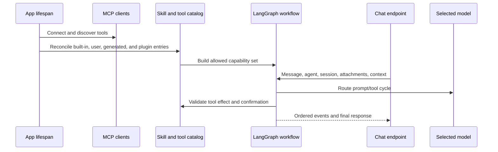

# Agents, modèles, outils et compétences de l'IA

## Modèle de capacité

Gnosi sépare les modèles, les agents, les compétences et les outils :

- Modèle : une route du fournisseur avec des capacités, des limites, des métadonnées de coûts, de la fiabilité,
et des pouvoirs.
- Agent : instructions, sélection de modèles, politique de mémoire/point de contrôle, et assigné
compétences.
- Compétence : un ensemble de capacités documenté qui fournit des instructions et
limite les outils compatibles.
- Outil: une opération calable classée par effet et origine.
- Source du contexte : bulle sélectionnée par l'utilisateur, table, fichier ou matériel externe ajouté
à une conversation avec un comportement de confinement explicite et de taille.

## Démarrage et flux de requête

Le routeur modèle résout les combinaisons fournisseur/modèle, les limites de contexte, le support des outils, les plafonds de dépenses et la politique de repli. Les pouvoirs sont obtenus à partir de stockage secret local ou de migration d'environnement supporté, non exposés à la frontend. Les raisons de défaillance sont enregistrées séparément des réponses orientées vers l'utilisateur afin que les opérateurs puissent distinguer le temps de fermeture, le rejet du fournisseur, les pouvoirs non valides, le débordement de contexte et l'incompatibilité des outils.

Un délai transitoire, une défaillance de connexion, une limite de fréquence ou 5xx peuvent se déplacer vers un autre modèle configuré avec la même localité locale/remote; les erreurs d'authentification, de politique et de contenu ne le font jamais. Le retour sélectionné est marqué dans les métadonnées des messages et dans le reçu du flux, de sorte qu'un modèle local ne peut pas envoyer de contexte privé inattendu à un fournisseur distant.

## Gouvernance des outils

Les descripteurs d'outils déclarent des effets de lecture/écriture/externe/destructrice. Les outils générés passent la validation et l'exécution basées sur les AST dans un environnement restreint. Le validateur bloque les capacités dangereuses telles que les écrits de fichiers sans restriction, l'accès à l'environnement, les dunders dynamiques traversant et les importations dangereuses.

Les actions nécessitant une confirmation créent des dossiers en suspens durables. La confirmation lie l'utilisateur, la session, l'outil, les arguments, l'effet et l'expiration; accepter une action entachée ou modifiée n'autorise pas une autre invocation. La maintenance expire et supprime les dossiers indépendamment du trafic de chat.

## Compétences et plugins

Les compétences en cours d'exécution intégrées vivent dans `pipeline/skills/`. Les paquets utilisateur et plugin sont validés dans un catalogue tout en préservant l'origine, l'activation, la compatibilité et les champs gérés-versus-utilisateurs. La conciliation des plugins est idempotent : désactiver un plugin suspend sa contribution gérée sans supprimer les surcharges utilisateur.

## Contexte et mémoire

L'état de conversation est défini par l'agent et la session. L'ordre de message de l'interface utilisateur utilise des identifiants stables plutôt que l'heure d'arrivée seule. Les pièces jointes et les sources de contexte valident les chemins, la taille, le type de fichier et l'espace de travail/espace de vault.

Le point de contrôle durable reste l'enregistrement complet de l'audit, mais le fournisseur demande d'utiliser une projection limitée. Les messages précédents de l'utilisateur et de l'assistant final restent comme mémoire de conversation, tandis que les groupes d'appels d'outils historiques et les charges utiles d'outils bruts sont omis. Le tour actuel conserve les groupes complets du protocole d'appel/résultat, et la projection globale de conversation a un plafond de caractères dur même lorsque le modèle sélectionné annonce une fenêtre de contexte beaucoup plus grande.

La navigation par vault contribue au contexte de la page, de la table et de la vue active. Le serveur élargit un tableau de bord avec une vue intégrée à la vue de table canonique, réapplique ses filtres et tri, et expose une requête exacte avec le nombre et la pagination. Les pages exactes et les lectures de table sont des appels d'outils auteurs de serveur; après un résultat complet, la synthèse fonctionne sans fixations d'outils afin qu'un modèle outil-faisant ne puisse répéter l'appel jusqu'à la limite de récurrence du graphique.

La requête de ressources auto-authentifiées canoniques est également enroulée par le serveur. Gnosi exécute la vue d'authentification enregistrée exactement une fois et forme sa liste de compte et de records limités directement à partir du résultat régi. Ce chemin ne fait aucun appel de modèle après que l'outil réussit. Les demandes nécessitant une interprétation ou une génération continuent par la synthèse normale du modèle.

Avant de sélectionner un outil, le serveur classe l'opération comme conversation, recherche, inventaire, analyse ou action régie. Les demandes d'inventaire reçoivent une analyse structurée exhaustive avec un nombre exact, des ids d'enregistrement canoniques, une résolution de type de registre en direct, un groupement de type, des métadonnées de provenance sélectionnées et une pagination offset. Le sujet est des données de requête : l'ajout d'un sujet ou d'une nouvelle table n'ajoute pas une branche intention. La première page et les pages de suite sont formatées directement à partir de l'outil régie sans appel modèle.

Le mode requête empêche également la pièce jointe par défaut à la connaissance de détourner des travaux non liés. Le mode conversation ne lie pas de source et ne lie pas d'outils passifs. Messagerie explicite, calendrier, contacts, lecteur, météo, web, notion, ou Zotero requêtes omettent les outils par défaut Vault à moins que la même requête ne nomme également un objet Vault; la compétence attribuée pertinente reste disponible.

Chaque requête comporte maintenant un plan de virage universel efficace dans le graphique. Le plan combine le mode d'exploitation, les domaines de données explicites, les descripteurs de temps d'exécution en direct, les preuves requises, les subventions gardées, la localité du fournisseur, la stratégie d'exécution et la stratégie de réponse. C'est l'état de la requête qui surprime les données des points de contrôle des virages précédents. Le noeud du cerveau intersectionne la sélection normale du temps d'exécution avec les noms des outils du plan, de sorte que les métadonnées affichées à l'utilisateur décrit la surface réelle de l'outil plutôt qu'un classificateur de conseils.

La confidentialité est également étendue à la demande. Le plan distingue le traitement local, les preuves privées traitées par le modèle distant configuré, les lectures externes et la conversation ordinaire. Les données jointes à la boîte ne comptent pas comme utilisées lorsqu'un Mail, Lecteur, Notion, Web ou autre domaine explicite exclut ses outils. L'interface utilisateur ne signale que cette posture et ce compte source; les corps sources, les insinuations, les secrets et le raisonnement caché ne saisissent jamais les métadonnées de transparence.

Les réponses finales du modèle passent par un vérificateur déterministe. Il vérifie uniquement les résultats de l'outil de virage courant et la politique d'effet, bloque les allégations qu'une action régie complétée sans un résultat d'outil réussi, bloque les réponses dépendantes de la source qui ont sauté les preuves obligatoires, enregistre les erreurs de l'outil comme limitations, et émet des preuves / compte d'outils. Les réponses de l'inventaire utilisent le même vérificateur même si leur texte est rendu par le serveur.

Les réponses dépendantes de la source portent également des citations de revendications validées par le serveur. Les résultats de l'outil définissent les seuls ids source valides pour le virage actuel. Les inventaires déterministes cartographient chaque ligne listée à son enregistrement canonique de la valle et cartographient le nombre agrégé, le regroupement, la pagination et les instructions de méthode au manifeste exact des résultats de l'outil. `[[cite:SOURCE_ID]]` marqueurs; le vérificateur supprime les marqueurs valides de la prose visible, rejette les ids absents des données de virage courant et marque le fondement incomplet comme une limitation. Le chat rend la cartographie de revendication/source limitée avec des liens sécurisés Vault, Reader ou HTTP(S) et ne persiste jamais dans des extraits ou des chemins de système de fichiers comme métadonnées de citation.

La recherche par vault utilise un rang hybride déterministe : termes lexiques multilingues élargis, boosts exacts de titre, boosts index-role et score vectoriel reconstructable. Les résultats sont mis en cache brièvement par Brain/query/k seulement; le cache est limité et ne conserve pas les invites ou les corps source non liés. Les extraits retournés sont délimités comme des preuves non fiables et des instructions de type injection sont signalées; le prompt Brain traite chaque source, connecteur, pièce jointe et résultat web comme des données plutôt qu'une instruction.

Les inventaires exhaustifs réutilisent les index de documents et de liens analysés localement. Les ids de relation sont élargis aux titres de cibles indexés, de sorte qu'un enregistrement lié à un projet ou source correspondant reste découvreable sans rouvrir chaque document OneDrive. Normal Gnosi écrit mettre à jour ces index; la maintenance périodique de l'index réconcilie les éditions externes. Les enregistrements absents du cache retombent dans une lecture directement délimitée. La recherche sémantique de haut en k reste le chemin de découverte d'évidences pour les recherches et analyses et n'est jamais présentée comme un inventaire complet.

Les charges utiles de l'inventaire indiquent également l'âge de construction de l'index de lien, la couverture de cache, les lectures de repli direct et l'état de revalidation de l'état de faille. Un index de faille ou manquant demande une réconciliation de fond gardée sans retarder la réponse; le message conserve la limitation au lieu d'impliquer que l'index a été récemment reconstruit.

L'analyse du lecteur de collection entière est admise comme une opération de fond à travers la façade de la capacité-job du fournisseur neutre. Le serveur crée l'appel d'outil de travail de façon déterministe, retourne un espace de nom `reader:` l'identification du travail, et expose le statut, la disponibilité du résultat, la reprise après l'échec ou l'interruption, et l'annulation coopérative dans les détails du message. La même façade reste extensible pour d'autres fournisseurs durables appartenant à la source; les demandes non soutenues restent en première ligne et ne sont jamais représentés comme un travail durable.

Les tâches du lecteur persistent dans une politique de récupération limitée à côté de leurs points de contrôle. Un délai transitoire, une défaillance temporaire du réseau/service ou une limite de taux entre dans un état annulable de ré-essai avec un recul exponentiel plafonné. Les tentatives et les appels de modèle consomment des budgets persistants distincts avant tout nouvel appel. Un minuteur démon permet de gérer les réessais en cours de processus normaux; la conciliation de la liste des tâches/de l'état commence une réessai en retard après un redémarrage de la boucle. Les défaillances permanentes, annulées, malformées ou épuisées par le budget restent terminales et visibles.

D'autres tours en lecture seule ont un budget indépendant à trois résultats : si le modèle continue à demander des outils, la prochaine invocation du cerveau reçoit les preuves accumulées sans fixations d'outils et doit synthétiser la réponse. Le plafond de récursion graphique reste donc un filet de sécurité final plutôt que un contrôle de débit normal.

Le plan universel comporte également un budget opérationnel immuable pour chaque tour : le temps de sortie HTTP, les appels de modèles maximums, les appels d'outils maximums et les résultats de lecture maximums. Les tours de conversation reçoivent un budget sans outil court; les tours de recherche et d'inventaire reçoivent des budgets de lecture limités; les analyses et les actions régies reçoivent un budget plus grand mais fini. Le graphique fait respecter ces valeurs avant l'invocation du fournisseur ou de l'outil suivant, et le flux expose les mêmes valeurs et si une limite a été atteinte. Un budget d'outils zéro est une déclaration de mode, pas un contournement d'autorisation : le contexte obligatoire écrit par le serveur suit toujours leur chemin explicite. Les outils de contexte dynamique ne sont pas sélectionnés pour une question générale à moins que l'utilisateur n'ait fourni une source de contexte.

Le ToolNode conserve le temps d'exécution actif complet pour les contrôles d'exécution et de politique, tandis que chaque invocation de modèle ne lie que les outils de lecture passifs plus les outils gardés explicitement autorisés par la requête actuelle. Les profils automatiques de l'héritage restreignent également les lectures passives aux correspondances multilingues entre les requêtes et les domaines et une opération de contexte exactement requise, avec un maximum limité; les compétences explicitement étendues conservent leur surface de lecture déjà petite. Le contexte obligatoire lit lier uniquement l'outil source requis pour leur première étape. Ce lien par tour est dérivé de l'état de la requête et n'est jamais réutilisé comme autorisation cachée.

Le chat mesure chaque réponse à partir de la demande d'expédition jusqu'à l'achèvement du flux. Un compteur en direct de toute la seconde est remplacé par le temps écoulé enregistré sur la réponse complétée. Le flux signale également la configuration du serveur, le routage, l'outil, le modèle, le résiduel et la durée totale, ainsi que les appels de modèle/outil et les compteurs de jetons; les détails du message conservent cette défaillance diagnostique limitée. Chaque message visible expose également le rebond de conversation : après confirmation, le serveur tronque le point de contrôle canonique visionné à la limite complète du tour et retourne sa projection publique. Rembond change la mémoire de conversation seulement; les confirmations terminées et les effets secondaires externes ne sont jamais présentés comme inversés.

Pendant l'exécution, le flux émet un marqueur de phase limité pour l'acheminement, la génération de modèles ou l'exécution d'outils. Le chat montre la phase active à côté du compteur des secondes écoulées et la réinitialise à la fin du virage.`agent_loop_exhausted`Le client propose une réessai délibérée de la requête originale après l'examen par l'utilisateur; le serveur ne rejoue jamais automatiquement un virage échoué parce qu'une action régie peut déjà avoir été préparée. Les erreurs de configuration ou d'autorisation permanentes invitent plutôt à modifier la requête ou les paramètres d'exécution.

Si le client se déconnecte, il signale le jeton et le graphique quitte sans commencer à travailler; les appels de modèle utilisent un pont d'annulation asynchrone lorsque le fournisseur le prend en charge, de sorte qu'une tâche du fournisseur en vol est annulée plutôt que de simplement empêcher le noeud suivant. Les flux de travail cachés ne capturent pas les événements spécifiques à la demande, et les jetons sont libérés après la fin du flux. Les défaillances du fournisseur utilisent un disjoncteur local de processus limité claqué par le fournisseur/le modèle, tandis que les erreurs d'authentification et de politique demeurent terminales. Les descripteurs d'outils exposent en outre un état de santé bon marché (santé, indisponible ou temporairement mis en quarantaine) de sorte que les ids, noms, gestionnaires et adaptateurs manquants ne peuvent pas être annoncés comme des capacités exploitables. Deux défaillances à l'intérieur de la quarantaine de fenêtre de santé limitée un outil brièvement; un appel réussi plus tard élimine l'enregistrement consécutif.

Le transport délimité par la nouvelle ligne est enveloppé dans la version 1 du protocole. Chaque événement comporte un id de flux opaque, un id d'événement, une séquence monotonique, un id de trace et un id de tour optionnel. Une opération de fournisseur en cours reste en vie pendant qu'un battement du cœur est émis, donc un fournisseur lent mais en bonne santé n'est pas annulé par le transport keep-live. Le client ignore les nombres de séquences dupliqués, et une fin inattendue devient `stream_incomplete` Le réapprovisionnement n'est pas annoncé tant que le replay ne peut être prouvé pour ne pas répéter une action régie.

Les longues insinuations conservent le point de contrôle complet comme dossier de vérification, mais ajoutent un digest déterministe limité des virages humains/assistants abandonnés à la projection du fournisseur. Le digest contient de courts extraits et des hachés opaques seulement; les charges utiles brutes des outils et les corps sources non liés ne sont jamais reportés.

Chaque tour en flux reçoit un opaque `trace_id` Les données sont transmises par la planification, la sélection de modèles, la santé d'exécution, les messages, les erreurs, les mesures et les événements de fin d'exécution. Ceci donne aux journaux distribués et à l'interface utilisateur une clé de corrélation sans persister des instructions, des identifiants ou du texte source.

La récupération du cerveau combine le score vectoriel reconstituable avec l'expansion lexique multilingue et normalisée, les boosts de titre/index, le cachement limité et les preuves marquées par l'injection. Les tests HTTP de table/déchet sont acceptés et exécutés en CI contre une valle de jet et un port séparé; la suite hermétique pointe toujours un port fermé afin que le moteur natif d'un développeur ne puisse pas être muté accidentellement.

Les lignes réglables du modèle sont hydratées du catalogue canonique avant d'atteindre les paramètres ou le routage en temps de fonctionnement. Les mises à jour partielles du budget/configuration se fondent avec les métadonnées existantes, la fenêtre de contexte, le coût et la qualité. Les modifications apportées par le fournisseur ou le modèle invalident les graphiques cachés afin que le support et les identifiants des outils entrent en vigueur au tour suivant. L'en-tête du chat signale le modèle sélectionné, le nombre exact d'outils et les raisons utilisables pour tout temps de fonctionnement dégradé.

Les détails du message fournissent une explication opérationnelle limitée : mode, itinéraire, exécution avant-plan/arrière-plan, outils réellement utilisés, compte de preuves, posture de confidentialité, état du vérificateur, fraîcheur de l'index, état du travail durable lorsque présent, et les moments.

Le même reçu comprend une interprétation sémantique édictée (opération, confiance, concepts et stratégie de récupération), la décision du courtier en capacités (dénombrement des outils de candidature et de surveillance) et la portée des points de contrôle.

Les mesures de tours comprennent une estimation USD basée sur le catalogue du fournisseur, aux côtés des jetons et des comptes de latence. Le registre des dépenses persistant reste la source de la vérité; l'estimation est limitée aux métadonnées d'affichage et n'est jamais utilisée comme autorisation par elle-même. La suite d'évaluation déterministe affirme également que chaque plan reste dans le plafond de latence de 120 secondes.

Le corpus déterministe en vertu de l'article `backend/agent/evals/` couvre tous les modes de requête, les quatre langues d'interface utilisateur, le confinement de domaine, le traitement local et à distance privé, les actions régies et l'admission durable du lecteur. Il fonctionne avant la suite de test backend sur les requêtes de tirage correspondant et tous les jours; tout cas échoué sort non zéro sans appeler un fournisseur ou passer des jetons.

Les erreurs de production et les commentaires des pouces assistants alimentent une boucle de qualité locale et authentifiée. `POST /api/chat/feedback` Les erreurs de flux sont enregistrées par le serveur avec des codes stables. Le magasin local SQLite conserve les identités de virage/session/agent haché, les champs de plan et de vérification, les noms d'outils et les seaux de timing; il n'a pas d'invite, de réponse, de source, de titre, de chemin, d'URL, d'extrait, d'annexe ou de colonnes de charge d'outils brutes. `/api/ai/evals/candidates*`. Les affaires locales acceptées restent séparées du corpus de CI versionné jusqu'à ce qu'un responsable les encourage délibérément.

## Invariants de défaillance et de sécurité

- L'échec du fournisseur ne conduit pas silencieusement à une situation plus coûteuse ou moins privée
modèle en dehors de la politique configurée.
- Un outil non disponible pour le modèle/compétence sélectionné ne peut être invoqué par son nom
Tout seul.
- Les effets destructivs ou externes exigent leur politique déclarée.
- Le code généré ne peut pas accéder aux secrets ou à l'état du système de fichiers sans restriction.
- Un serveur MCP échoué ne supprime pas les serveurs sains du catalogue.
- La production partielle du modèle n'est pas présentée comme une action confirmée.
- La sortie dépendante de la source ne peut pas passer la vérification sans la source de virage courant
des preuves.
- Les ids de citation ne peuvent se résoudre que si le même tour a retourné la source exacte.
- Les métadonnées de transparence ne peuvent pas contenir de corps sources, de prompts ou d'outil brut
des charges utiles.
- La récupération automatique et manuelle d'emploi ne peut dépasser les tentatives ou les appels-modèles persistants
les budgets.
- La télémétrie de qualité ne peut pas accepter ou conserver le contenu prompt/réponse.
- Les indices de stampe sont étiquetés et rafraîchis en dehors du virage de premier plan.
- Les messages des agents restent isolés par agent et par session à travers les recharges.

## Aspects de vérification

Exécutez le routage de modèle, la suppression du fournisseur, la fiabilité, les délais, MCP réessaye et résilience, le catalogue de compétences/cours/API, la validation des outils générés, le confinement du contexte, la course de confirmation/expiration, la commande de chat et les flux de chat du navigateur.
# Exécution de l'agent universel

Avant de sélectionner les capacités, l'interprète sémantique normalise l'intention multilingue, enregistre une note de confiance et peut s'abstenir lorsqu'une demande n'a pas de sujet. Le résultat est inclus dans le plan de tour sans stocker l'invite originale.

Les capacités de base utilisent la file d'attente SQLite locale. Un travail a une clé idempotence, budget de tentative, location et battement du cœur; un bail expiré peut être récupéré après un redémarrage du processus ou quand un second travailleur est actif. L'analyse du lecteur conserve ses instantanés JSON et les points de contrôle des lots, tandis que la file d'attente est la source de vérité pour l'orchestration.

Chaque opération de modèle et d'outil émet un étalon délimité corrélé par le virage `trace_id`Les attributs de l'échelle sont autorisés et édités; les instructions, les sources, les arguments et la sortie brute du fournisseur ne sont jamais maintenus comme télémétrie. Les appels à outils passent également par la validation de la taille des arguments, les délais de décompte des descripteurs, les limites de sortie et la politique de rôle/confirmation existante.

La recherche du cerveau maintient son cache de compatibilité JSON plus un sidecar FTS5. Le sidecar rétrécit les candidats lexiques avant le classement des hybrides vectoriels déterministes et expose les métadonnées de fraîcheur pour le diagnostic. Si le sidecar n'est pas disponible, le cache JSON reste un remède sûr.

Les identifiants de virage explicites sont revendiqués durablement dans l'espace de travail/utilisateur/session. Une demande en double est rejetée au lieu d'exécuter la même action ou la même tâche de fond deux fois. Le flux SSE émet `progress` les événements avec un nœud, une phase, un temps écoulé et des compteurs d'appels limités afin que les clients puissent rendre des progrès réactifs sans lire les instructions internes.

Les limites de sécurité restent conservatrices : les outils générés sont revalidés au moment de la charge, les URLs de connecteur peuvent utiliser la politique d'évacuation des hôtes publics, et les identifiants communs sont édités avant que les diagnostics ou les messages d'outils ne persistent.

Le dispéditeur d'exécution réveille maintenant la file d'attente durable au démarrage de l'application, de sorte que le travail du lecteur est récupéré sans demande d'état. Les mises à jour de Brain FTS sont incrémentales et portent un marqueur d'arrêt explicite. Les outils générés approuvés sont chargés comme des proxies sous-process-backed avec des limites de ressources; les schémas de descripteur JSON sont vérifiés avant et après exécution, avec des compensateurs revus en option pour des défaillances partielles. Un endpoint de replay uniquement des métadonnées expose le plan, l'erreur, le timing et les événements de vérification par trace id. Les demandes ambiguës s'arrêtent à l'interprète sémantique et demandent le sujet manquant dans la langue de la demande au lieu de de deviner une capacité.

La vérification utilise le corpus déterministe universel-tour, les tests de phase 2 ciblés, le complet `backend/tests` Suite et la porte de documentation.
