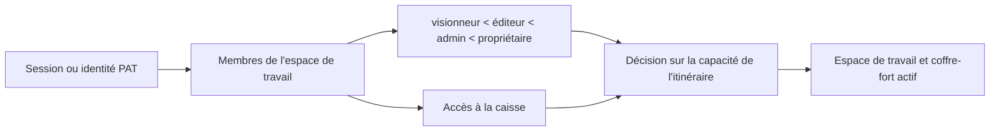

# Authentification, espaces de travail et partage

## Modes de fonctionnement

`personal` mode est l'expérience par défaut locale à un seul utilisateur. L'authentification est contournée à moins que la politique efficace ne l'exige. `org` mode nécessite l'appartenance à l'identité et à l'espace de travail. Les déploiements exposés peuvent forcer l'authentification indépendamment de l'étiquette de mode amical.

La porte frontale sélectionne l'interface d'accès ou d'application, mais toute autorisation est appliquée dans les dépendances et services backend.

## Authentification de session et de jetons

Le login email/password vérifie un hash de mot de passe et émet un JWT signé dans un cookie HttpOnly, SameSite=Lax. Les clients API acceptés peuvent également envoyer un `Authorization` Les jetons d'accès personnel utilisent un format opaque distinct; seul un hash SHA-256 et un préfixe d'affichage sont stockés.

Le secret de signature doit être solide sur les déploiements exposés. Le moteur refuse de commencer par le recul du développement public lorsque le déploiement efficace nécessite une protection.

La frontière des routes d'authentification est strictement typée et conserve les
schémas de réponse gelés. Les descripteurs Column de SQLAlchemy legacy ne sont
resserrés qu'à la frontière ORM ; la revendication de compte, la rotation du mot
de passe, le profil et les cookies conservent validation et transactions.

## Modèle d'autorisation

Les rôles fournissent des capacités de base ordonnées. VaultAccess réduit ou permet l'accès à un coffre-fort enregistré. Un espace de travail, utilisateur ou ID de coffre-fort fourni par la demande n'est jamais fiable sans résoudre l'identité authentifiée et les membres.

Bootstrap est sûr de la concurrence, donc les premières demandes simultanées ne créent pas de doubles espaces de travail par défaut, utilisateurs ou membres. Les comptes Placeholder et auto-provisory sont explicitement marqués; l'enregistrement ne peut pas les revendiquer par courriel comme une preuve d'identité faible.

La résolution du contexte d'espace de travail conserve la dépendance FastAPI
publique, tandis que des fonctions distinctes gèrent l'appartenance, le filtrage
des coffres accessibles, le chemin de stockage et les capacités. Les décisions
d'autorisation restent ainsi explicites sans modifier les en-têtes, les codes
d'état ni le comportement du coffre actif.

## Partage du public

Un lien de partage est une ligne opaque qui lie la page, l'espace de travail, le coffre, le créateur, la permission, l'expiration et la révocation. `/s/:token` est intentionnellement en dehors du shell frontal authentifié. Le résolveur public utilise l'identité du coffre-fort stocké parce qu'une requête anonyme n'a ni cookie ni en-tête actif.

La révocation est soft, donc le système conserve un dossier de vérification. Les liens expirés ou révoqués ne révèlent aucun contenu de page. La résolution des actifs publics hérite de la même portée de partage plutôt que d'accepter un chemin arbitraire.

## API public

Les routes authentifiées par PAT appliquent des champs de visions symboliques plus une autorisation normale d'espace de travail/vault. Le texte plain s'affiche uniquement lors de la création. La révocation empêche l'utilisation future sans avoir à supprimer sa ligne d'audit.

## Invariants

- Identité, appartenance à un espace de travail, rôle, accès au coffre-fort et fonctionnement demandé
tous participent à l'autorisation.
- Les cookies sont HttpUniquement; la fenêtre n'a pas besoin de lire le JWT.
- Le mot de passe et les hachés de jetons sont des valeurs à sens unique.
- Un client fourni `X-User-ID` ne peut devenir une création de comptes ou un privilège
chemin d'escalade.
- Le contenu de partage public est limité à la portée de la page ou de la valle stockée.
- La commodité du mode personnel ne peut pas affaiblir un déploiement multi-utilisateurs exposé.

## Aspects de vérification

Exécutez des tests de porte centrale, de flag d'exécution, de compte, de placeholder, de cas de courriel, de mot de passe, de PAT, de surface publique, de course d'espace de travail, d'adhésion et de partage.
