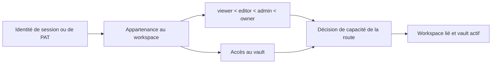

# Authentification, espaces de travail et partage

## Modes de fonctionnement

Le mode `personal` est l'expérience locale par défaut pour un seul utilisateur. L'authentification est contournée sauf si la politique effective l'exige. Le mode `org` exige une identité et une appartenance à un espace de travail. Les déploiements exposés peuvent imposer l'authentification quel que soit le libellé convivial du mode.

Le contrôle du frontend sélectionne l'écran de connexion ou l'application, mais toutes les autorisations sont appliquées dans les dépendances et services du backend.

Le shell importe le formulaire de connexion via l'entrée publique de
`features/auth`. La validation de connexion et d'inscription, les sessions
et la politique du backend conservent leur comportement. Les paramètres du
compte et du workspace restent distincts de ce formulaire ; déplacer l'entrée
n'autorise pas l'accès à un espace de travail.

La fonctionnalité de partage expose sa page en lecture seule via une entrée
publique à chargement différé. La route `/s/:token` reste hors du contrôle
d'authentification et du shell. Son déplacement n'élargit pas les accès : le
backend résout toujours le jeton et les liens expirés ou invalides conservent
leur affichage d'erreur.

La résolution du workspace valide les racines configurées du projet et des
vaults avant tout amorçage ou choix de chemin. L'amorçage personnel résiste aux
accès concurrents et confirme l'appartenance retenue après un conflit d'unicité.
Le mode organisation précise les types des rôles et capacités JSON avant de
construire le contexte. Les montages absents n'entraînent un repli que si la
compatibilité du mode personnel l'autorise explicitement, sans jamais inventer
un vault d'organisation.

## Authentification de session et de jetons

La connexion par adresse e-mail et mot de passe vérifie le hachage du mot de passe et émet un JWT signé dans un cookie HttpOnly, SameSite=Lax. Les clients API acceptés peuvent également envoyer un jeton bearer dans `Authorization`. Les Personal Access Tokens utilisent un format opaque distinct ; seuls un hachage SHA-256 et un préfixe d'affichage sont stockés.

Le secret de signature doit être robuste sur les déploiements exposés. Le backend refuse de démarrer avec la valeur publique de développement lorsque la protection est requise par le déploiement effectif.

La frontière des routes d'authentification est strictement typée et conserve les
schémas de réponse gelés. Les modèles de gestion partagent une
`DeclarativeBase` SQLAlchemy typée ; les types des descripteurs de colonnes ne
sont précisés qu'à la frontière ORM. La revendication de compte, la rotation
du mot de passe, la mise à jour du profil et les cookies conservent validation
et transactions. Les objets Pydantic de permissions préservent leurs valeurs
par défaut historiques et leur représentation OpenAPI exacte.

Le service d'authentification type les sessions de gestion, les générateurs
du cache de politique, l'identité HTTP/WebSocket, la recherche de PAT et le
décodage du sujet JWT à leurs frontières. Les stubs `python-jose` sont verrouillés
dans le groupe de dépendances de développement ; la mutation historique restante
des horodatages ORM est isolée avec `setattr` jusqu'au passage complet des
déclarations de colonnes à `Mapped[]`.

Le WebSocket de collaboration importe le même service d'identité typé que HTTP.
La politique d'authentification, et non la disponibilité de modules facultatifs,
décide si un identifiant est requis : le mode personnel reste simple, tandis
que le mode organisation et les clients PAT partagent un résolveur. Une fermeture
avant acceptation signale toujours une violation de politique, et les clés des
salons conservent leur espace de noms par vault.

## Modèle d'autorisation

Les rôles fournissent des capacités de base hiérarchisées. VaultAccess restreint ou accorde l'accès à un vault enregistré. Un identifiant de workspace, d'utilisateur ou de vault fourni par la requête n'est jamais considéré comme fiable sans résolution de l'identité authentifiée et de ses appartenances.

L'amorçage des workspaces résiste aux accès concurrents : des premières requêtes simultanées ne créent pas de doublons d'espaces, d'utilisateurs ou d'appartenances par défaut. Les comptes provisoires et provisionnés automatiquement sont explicitement marqués ; l'inscription ne peut pas les revendiquer sur la seule base d'une adresse e-mail, preuve d'identité insuffisante.

La résolution du contexte d'espace de travail conserve la dépendance FastAPI
publique, tandis que des fonctions distinctes gèrent l'appartenance, le filtrage
des vaults accessibles, le chemin de stockage et les capacités. Les décisions
d'autorisation restent ainsi explicites sans modifier les en-têtes, les codes
d'état ni le comportement du vault actif.

L'identité du vault, son slug, son éventuel chemin historique et sa date de
création utilisent des mappings SQLAlchemy typés, sans changer les colonnes ni
les migrations. Le middleware canonique résout un identifiant ou slug en chaîne
concrète avant de publier le contexte. L'export de modèles revalide le chemin
historique nullable à la frontière du système de fichiers et renvoie la réponse
habituelle de ressource introuvable au lieu de construire un `Path` à partir
d'une configuration absente.

L'API d'administration du workspace convertit les rôles historiques et
descripteurs de permissions JSON en valeurs concrètes à la frontière ORM.
Les mutations des rôles et accès aux vaults utilisent des affectations locales
compatibles avec les descripteurs, en conservant les contrôles d'appartenance,
la normalisation des invitations et les schémas de payloads existants.

## Partage public

Un lien de partage est un enregistrement opaque liant page, workspace, vault, créateur, permission, expiration et révocation. `/s/:token` est volontairement hors du shell authentifié du frontend. Le résolveur public du backend utilise l'identité du vault stockée, car une requête anonyme n'a ni cookie ni en-tête de vault actif.

La révocation est logique afin de conserver une trace d'audit. Les liens expirés ou révoqués ne révèlent aucun contenu de page. La résolution des ressources publiques hérite du périmètre du partage et n'accepte pas un chemin arbitraire.

La frontière des routes de partage type la sérialisation, la résolution des
chemins de vault, les mutations ORM et chaque réponse. Des modèles Pydantic
nommés valident les mappings d'appels directs avant sérialisation ; les routes
de compatibilité désactivent explicitement la publication des modèles de
réponse pour préserver OpenAPI. Les identifiants multivaults stockés sont résolus
en chemins concrets avant l'activation du contexte de page. Une configuration
absente conserve le repli récupérable et la réponse de service indisponible.

Les paramètres d'identité du vault utilisent des modèles Pydantic distincts
pour les requêtes et les lectures historiques. Les champs historiques inconnus
survivent aux lectures, les écritures atomiques préservent la structure du profil
et les réponses réussies sont validées avant de renvoyer leur mapping directement
indexable.

Le listing, la création, le renommage et la suppression personnels multivaults
construisent des modèles de réponse Pydantic imbriqués explicites. Les slugs,
valeurs historiques nullables, sélection active et reçus de suppression
conservent leur structure de dictionnaire ; le confinement des chemins, la
protection du vault principal et le nettoyage des artefacts restent inchangés.

## API publique

Les routes authentifiées par PAT appliquent les périmètres du jeton en plus des
autorisations ordinaires de workspace et de vault. Le jeton en clair n'est affiché
qu'à sa création. Sa révocation empêche toute utilisation ultérieure sans
supprimer sa ligne d'audit.
La façade publique typée actualise les horodatages ORM via la frontière des
descripteurs, confine les écritures Markdown historiques au vault actif et
achemine les enregistrements Web Clipper configurés vers la création normale
des pages. Les résultats de jetons, ping, pages, configuration du clipper et
captures passent par des modèles Pydantic nommés puis conservent leur structure
historique de dictionnaire ou de liste. L'enregistrement explicite
`response_model=None` préserve les schémas FastAPI octet par octet jusqu'à la PR
coordonnée du contrat OpenAPI/client.

## Invariants

- L'identité, l'appartenance, le rôle, l'accès au vault et l'opération demandée participent tous à l'autorisation.
- Les cookies sont HttpOnly ; le frontend n'a pas besoin de lire le JWT.
- Les hachages des mots de passe et des jetons sont irréversibles.
- Un `X-User-ID` fourni par le client ne peut pas permettre la création d'un compte ou une élévation de privilèges.
- Le contenu du partage public est limité au périmètre de la page et du vault stockés.
- La commodité du mode personnel ne peut pas affaiblir un déploiement multi-utilisateurs exposé.

## Aspects de vérification

Exécutez les tests de contrôle central, d'authentification imposée, de compte,
de compte provisoire, de casse des e-mails, de mots de passe, de PAT,
d'interfaces publiques, de réponses typées directes, de concurrence à
l'amorçage des workspaces, d'appartenance et de partage. La QA dans le navigateur
vérifie connexion et déconnexion, mises à jour du compte, changement de workspace
et accès anonyme aux partages dans une session vierge.
