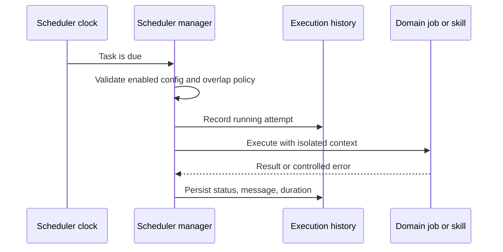

# Automatisation et planification

## Responsabilité

Le programmeur exécute des tâches récurrentes et uniques configurées, enregistre l'historique, expose l'état opérationnel et coordonne les tâches de domaine telles que la synchronisation, la publication, l'ingestion, la maintenance et la planification de rafraîchissement.

Les métadonnées des tâches, l'état d'exécution persistant et la frontière de
notification facultative sont strictement typés dans des modules dédiés. Le
gestionnaire reste sous la limite de taille et valide les dictionnaires de
tâches hérités avant de construire les tâches d'exécution.

## Modèle de tâche

Une définition de tâche a une identité stable, un état activé, un calendrier, une opération, une configuration et une politique d'exécution. Les enregistrements de l'historique de tâche commencent, complètent, occupent le statut, le message et la durée. Les définitions et les paramètres de connexion sont alignés avant l'exécution, de sorte qu'une tâche ne peut pas utiliser accidentellement une intégration supprimée ou différente.

## Flux d'exécution

Les fonctions de la tâche doivent être idempotentes lorsque la répétition est possible. Le gestionnaire protège les instances qui se chevauchent selon la politique de la tâche et utilise des contextes de base de données ou de fournisseur nouveaux. Un redémarrage du processus concilie les horaires de configuration persistante au lieu de ne faire confiance qu'à l'état de mémoire.

Le gestionnaire conserve le cycle de vie du planificateur, la persistance, le
contrôle des chevauchements et l'historique. `task_handlers.py` contient la
politique de répartition et les tâches opérationnelles importantes, y compris
la maintenance bornée, sans les coupler au fil du planificateur.

## Automatisations des vannes

Les règles d'automatisation des vaults combinent déclencheurs, conditions et actions. Les formules de champ dérivées et les groupures sont une évaluation déterministe, et non une exécution arbitraire de code. Les actions externes ou destructrices utilisent les mêmes limites d'autorisation et de confirmation que les actions interactives.

## Travail autonome de qualité

Les boucles de maintenance et de qualité sont des tâches opérationnelles limitées. Elles peuvent diagnostiquer, générer des rapports ou appliquer des modifications dans leur champ d'application déclaré. Elles ne gagnent pas de système de fichiers plus large, secret, Git, ou autorité de publication parce qu'elles sont programmées.

## Génération audio quotidienne

Le service de podcast du Reader utilise une sélection typée du modèle et de la
langue, des travailleurs TTS bornés par phrase et un remplacement atomique du
MP3. La génération en arrière-plan capture explicitement le Vault sélectionné et
refuse de démarrer sans Vault actif, afin d'éviter tout chemin local ambigu.

## Invariants

- Les tâches désactivées ou invalides ne sont pas exécutées.
- Une tâche a un résultat historique durable.
- Les rétractations ne font pas double emploi avec les effets externes sans stratégie d'idempuissance.
- Suppression ou réaffectation de la connexion met à jour les horaires dépendants.
- Le calendrier utilise une sémantique explicite du fuseau horaire.
- Les exceptions au travail sont isolées de la boucle de planification.
- Les travaux de base ne réutilisent pas les séances de base de données à demande.

## Aspects de vérification

Testez la résilience de la configuration, l'alignement de la connexion, les calendriers de planification, l'historique des tâches, la prévention des chevauchements, les fuseaux horaires, la réessai/idémpuissance et le scouter d'automatisation Playwright.
