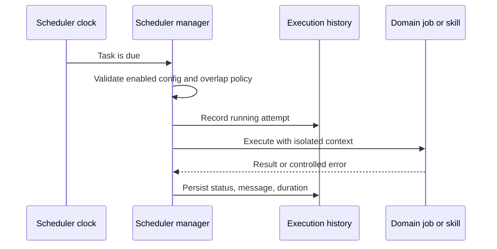

# Automatisation et planification

## Responsabilité

Le planificateur exécute les tâches configurées, conserve leur historique et
expose l'état opérationnel de la synchronisation, publication, ingestion,
maintenance et mise à jour de la planification.

La fonctionnalité d'automatisation contient l'écran du planificateur et la
conversion des intervalles. Le centre de contrôle contient le tableau de bord,
l'historique, les membres et les dialogues de directives. Les routes sont
chargées à la demande ; les adaptateurs partagés préservent identifiants, unités,
permissions et payloads. Déplacer un écran n'active aucune tâche ni aucun travail.

Les métadonnées, l'état persistant et la frontière de notification facultative
ont des contrats typés. Le gestionnaire valide les définitions héritées avant de
construire les tâches et respecte la limite de taille du code.

## Modèle de tâche

Chaque définition possède une identité stable, un état activé, une
planification, une opération, une configuration et une politique d'exécution.
L'historique enregistre début, fin, état, message et durée. Les définitions sont
alignées sur les connexions avant l'exécution afin d'éviter une intégration
supprimée ou incorrecte.

## Flux d'exécution

Les opérations doivent être idempotentes lorsqu'elles peuvent être répétées.
Le gestionnaire contrôle les chevauchements selon la politique de tâche et
utilise de nouveaux contextes de base de données ou de fournisseur. Après un
redémarrage, il réconcilie la configuration persistante.

Le démarrage natif active le planificateur par défaut. Les tests déterministes
et les diagnostics sur des données locales peuvent définir
`GNOSI_DISABLE_SCHEDULER=1` pour vérifier API et interface sans déclencher
d'intégrations en attente. Ce réglage ne modifie pas la configuration enregistrée.

Le gestionnaire conserve cycle de vie, persistance, contrôle des chevauchements
et historique. `task_handlers.py` contient la répartition et les opérations
importantes, dont la maintenance, sans les coupler au fil du planificateur.

Les notifications passent par une frontière de plateforme indépendante du
fournisseur. La persistance en base de données et Markdown fonctionne sur tous
les hôtes ; les alertes natives macOS sont facultatives. Les journaux Markdown
résident sous `GNOSI_DATA_DIR`, jamais dans un Vault OneDrive, Google Drive,
Nextcloud, Dropbox ou d'un autre fournisseur. L'échec d'un canal ne bloque pas les
autres. L'ancien chemin de la compétence de notification est une façade compatible.

## Synchronisation académique et mise à jour des revues

`academic_repository_sync` est un travail persistant et reprenable pour les index
OAI locaux. Curseur, compteurs, erreur, annulation et dernière synchronisation
réussie sont conservés hors de la requête. Un administrateur lance la première
collecte ; ensuite, la tâche incrémentale quotidienne reprend au dernier point
complet et applique les marqueurs de suppression OAI.

Les stratégies enregistrées peuvent planifier `academic_review_update`. Chaque
exécution rejoue la stratégie versionnée, enregistre activité et erreurs
partielles par source et n'ajoute que les candidats ayant une identité nouvelle
pour cette revue. La prochaine exécution est enregistrée avec sa configuration.

La file exige une racine `LOCAL_DATA` explicite et échoue avant d'ouvrir SQLite
si la configuration manque. Les adaptateurs valident les payloads avant leur
répartition et refusent les inscriptions sans fonction exécutable. La
synchronisation des contacts transmet explicitement base de données, workspace
et intégration pour ne pas confondre les arguments.

Les travaux académiques résolvent le Vault actif avant d'accéder à la littérature.
Sans Vault, ils enregistrent une omission structurée avec zéro travail au lieu
de construire `Path(None)`. La récupération de la file du Reader vérifie
l'existence du document associé ; les entrées orphelines ne créent pas de fils
voués à échouer répétitivement.

## Automatisations du Vault

Les règles combinent déclencheurs, conditions et actions. Les formules et
rollups sont évalués de manière déterministe, pas comme du code arbitraire. Les
actions externes ou destructrices gardent les mêmes limites d'autorisation et
de confirmation que les actions interactives.

## Travail autonome de qualité

Les tâches planifiées peuvent diagnostiquer, produire des rapports ou appliquer
des changements dans leur périmètre. La planification n'élargit pas leurs droits
sur les fichiers, secrets, Git ou publications.

## Périmètre de maintenance par appareil

`system_maintenance` vide le cache mémoire de l'application et tronque uniquement
le fichier ordinaire `logs/gnosi.log`, avec un seul lien physique, sous le
`GNOSI_DATA_DIR` canonique, seulement s'il s'agit du `LOG_FILE` configuré.
Il conserve l'inode pour le logger actif. Ni les
répertoires ni le fichier ne peuvent être des liens symboliques. Si le chemin est
invalide ou si la plateforme ne propose pas d'opérations sûres relatives à un
répertoire, le nettoyage du disque est omis.

Il ne nettoie ni code source, bytecode, journaux configurés ailleurs, boîtes
privées du workspace, bases de données, secrets, documents du Vault, ni dossiers
synchronisés. Les anciens compteurs de boîte, fichiers temporaires et bytecode
restent présents avec la valeur zéro. Retirer d'anciens checkouts est une
opération distincte et revue du workspace, pas une tâche de l'application.

## Génération audio quotidienne

Le service de podcast du Reader utilise des contrats typés pour choisir modèle
et langue, limite les travailleurs TTS par phrase et remplace le MP3 atomiquement.
Il capture le Vault sélectionné avant de commencer et refuse de démarrer sans
Vault actif.

## Invariants

- Les tâches désactivées ou invalides ne s'exécutent pas.
- Chaque exécution possède un résultat persistant dans l'historique.
- Les nouvelles tentatives ne dupliquent pas les effets sans stratégie d'idempotence.
- Supprimer ou réaffecter une connexion met à jour les planifications dépendantes.
- Les fuseaux horaires ont une sémantique explicite.
- Les exceptions n'interrompent pas la boucle du planificateur.
- Les travaux ne réutilisent pas les sessions de base de données d'une requête.
- Annuler une collecte OAI conserve son curseur pour la reprendre.
- Répéter une revue ne duplique pas les résultats déjà identifiés.

## Vérification

Vérifiez configuration, connexions, intervalles, historique, chevauchements,
fuseaux horaires, nouvelles tentatives, reprise et annulation OAI, marqueurs de
suppression, détection des nouveaux résultats et confinement de la maintenance.
Exécutez aussi les tests Playwright d'automatisation et une intégration
représentative de bout en bout sur des données synthétiques ou un compte de test.
