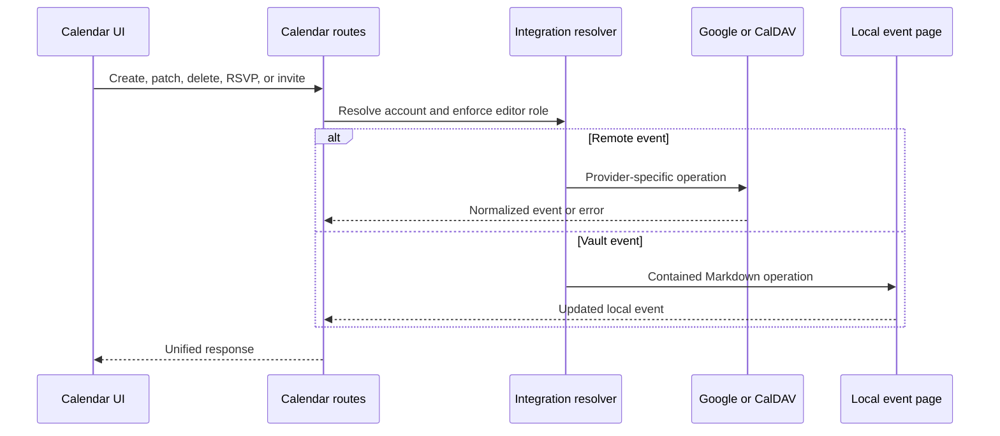

# Calendrier et réunions

## Responsabilité

Calendrier regroupe les événements locaux de Vault avec les comptes Google Caldav et connectés. Il prend en charge la sélection de calendrier, l'événement CRUD, les invitations, RSVPs, les requêtes libres/obusy, le géocodage, les rappels, l'état d'événement caché, l'exportation ICS, l'enregistrement de réunion, la transcription et les notes générées par l'IA.

La frontière HTTP est strictement typée tout en conservant le contrat de
réponse existant. La normalisation des libellés Photon, le rejet des URL, la
validation des résultats et la déduplication appartiennent au domaine de
géocodage Calendar plutôt qu'au module de routes ; les payloads fournisseur
sont validés à cette frontière d'adaptation.

## Agrégation des événements

Le calque d'itinéraire résout le contexte de l'espace de travail et les intégrations sélectionnées, puis normalise les événements du fournisseur et les événements de Markdown locaux en une réponse partagée. Les identifiants du fournisseur restent jumelés à leur origine compte/calendaire; un ID à lui seul n'est pas assez unique à l'échelle mondiale pour la mutation.

Les événements cachés sont des enregistrements de superposition locaux. Le cachement ne supprime pas un événement du fournisseur. Unshide supprime la superposition de sorte que l'agrégation suivante l'inclut à nouveau.

## Débit de la mutation

## Rappels et notes de réunion

Les paramètres de rappel sélectionnent le délai et le comportement. La collection fusionne les événements à venir et déduplique les requêtes concurrentes afin que les rappels en double ne soient pas créés. Le regardeur frontal affiche les rappels actifs et peut naviguer vers le calendrier ou les rejeter.

L'enregistrement de réunion charge l'audio limité à un workflow de fond. Le sondage d'état sépare l'enregistrement, la transcription, la synthèse, la création de notes, la fin et l'échec. Les notes générées sont écrites par des opérations Vault-safe et conservent le contexte événement/source.

## Invariants

- L'identité de l'événement du fournisseur comprend le contexte de compte et de calendrier.
- Calendrier écrit nécessite un contexte éditeur-capable.
- Les événements locaux basés sur le chemin restent à l'intérieur du coffre-fort actif.
- La cachette est locale et réversible; la suppression utilise le fournisseur faisant autorité.
- Les rappels sont sûrs de course et ne sont pas dupliqués pour le même événement/fenêtre.
- Les fournisseurs de transcription ou d'IA manquants échouent au travail de réunion, pas au calendrier.
- La sortie ICS utilise des fuseaux horaires normalisés et ne dévoile pas les lettres de créance privées.

## Aspects de vérification

Testez le confinement local du chemin, la normalisation des événements, la récurrence, l'état caché, les courses de rappel, la sélection de compte, les fuseaux horaires et les flux de création/édition/suppression de Playwright.
