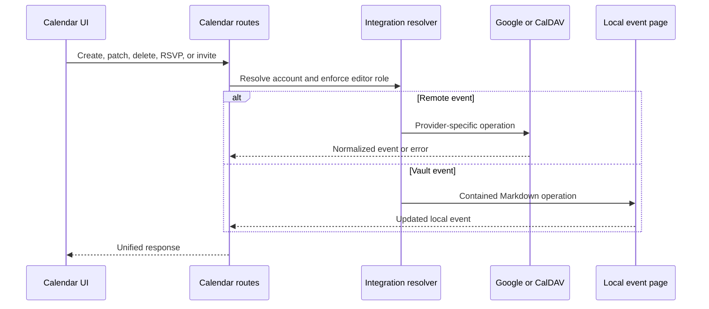

# Calendrier et réunions

## Responsabilité

Calendrier regroupe les événements locaux du vault et ceux des comptes Google Calendar et CalDAV connectés. Il prend en charge la sélection des calendriers, le CRUD des événements, les invitations, les réponses RSVP, les requêtes de disponibilité, le géocodage, les rappels, les événements masqués, l'export ICS, l'enregistrement des réunions, leur transcription et les notes générées par IA.

Le frontend strictement typé `features/calendar/` gère la page de calendrier,
la sélection des sources, la recherche, la coordination des récurrences et
les dialogues de page. Son entrée publique conserve le chargement différé
d'origine. Les composants de rendu aussi utilisés par Vault et Mail restent
partagés hors de cette fonctionnalité ; les adaptateurs de fournisseurs, la
surveillance des rappels et les payloads d'événements sont inchangés.

`features/meetings/` gère l'enregistreur flottant, son contrôleur de capture et
de téléversement, ainsi que l'affichage des rappels. Son entrée publique charge
les modules d'enregistrement et de rappels indépendamment à la demande. Le shell
les monte avec les mêmes contrôles de plugins ; le déplacement ne change ni
les permissions d'enregistrement, ni les interrogations périodiques, ni la
navigation, ni les payloads.

La frontière HTTP est strictement typée tout en conservant le contrat de
réponse existant. La normalisation des libellés Photon, le rejet des URL, la
validation des résultats et la déduplication appartiennent au domaine de
géocodage Calendar plutôt qu'au module de routes ; les payloads fournisseur
sont validés à cette frontière d'adaptation.

Le service hybride des fournisseurs est strictement typé et conserve Google
comme adaptateur aux côtés du CalDAV générique. La détection CalDAV prend ainsi
en charge Nextcloud, iCloud, Fastmail, Radicale et les serveurs compatibles via
des URL configurées, sans comportement lié au fournisseur de stockage.

La route hybride interroge directement les fournisseurs externes. L'ouverture
du calendrier ne déclenche pas un second miroir du fournisseur vers le vault ;
les actualisations de l'index des pages ne peuvent donc ni dupliquer ni retarder
les lectures Google et CalDAV. Le Markdown existant sous `Calendar/External`
reste une donnée utilisateur que cette transition ne supprime jamais, mais le
web ne rafraîchit plus ce miroir hérité.

## Agrégation des événements

La couche de routes résout le contexte du workspace et les intégrations sélectionnées, puis normalise les événements des fournisseurs et les événements Markdown locaux dans une réponse commune. Les identifiants restent associés au compte et au calendrier d'origine ; un identifiant seul n'est pas suffisamment unique globalement pour effectuer une mutation.

Le masquage des événements est une surcouche locale. Il ne supprime pas l'événement chez le fournisseur. Le réaffichage retire cette surcouche pour que l'agrégation suivante inclue à nouveau l'événement.

## Flux de mutation

## Rappels et notes de réunion

Les paramètres des rappels définissent le délai d'anticipation et le comportement. La collecte fusionne les événements à venir et déduplique les requêtes concurrentes pour éviter les doublons. Le mécanisme de surveillance du frontend affiche les rappels actifs et permet d'ouvrir le calendrier ou de les fermer.

La persistance des rappels précise les types de l'état JSON en paramètres,
clés déjà notifiées et objets de rappels actifs explicites. Les dates des
fournisseurs sont analysées à une frontière unique, les libellés des participants
sont normalisés en chaînes et la sortie IA est convertie avant stockage. Le
verrou couvrant tout le cycle et la fusion avec l'état récent restent la
référence pour les accès concurrents du planificateur et de l'API.

L'enregistrement téléverse un audio de taille limitée vers un traitement en
arrière-plan. L'interrogation de l'état distingue enregistrement, transcription,
synthèse, création de note, réussite et échec. Les notes utilisent les opérations
sûres du vault et conservent le contexte d'événement et de source. Le service
normalise la réponse historique des routes du vault en mapping concret avant
de lire l'identifiant de page créée ; les gestionnaires dynamiques de compatibilité
ne se propagent pas à la frontière typée du travail. Les réponses d'enregistrement
et de suivi passent par des modèles Pydantic dédiés, tout en renvoyant les mêmes
dictionnaires directement indexables aux appelants existants.

## Invariants

- L'identité de l'événement du fournisseur comprend le contexte de compte et de calendrier.
- Les écritures du calendrier exigent un contexte disposant des droits d'édition.
- Les événements locaux identifiés par chemin restent dans le vault actif.
- Le masquage est local et réversible ; la suppression utilise le fournisseur faisant autorité.
- Les rappels résistent aux accès concurrents et ne sont pas dupliqués pour le même événement et la même fenêtre.
- Un fournisseur de transcription ou d'IA absent fait échouer le traitement de la réunion, pas le calendrier.
- L'export ICS utilise des fuseaux horaires normalisés et n'expose pas d'identifiants secrets.

## Aspects de vérification

Testez le confinement des chemins locaux, la normalisation des événements, les récurrences, le masquage, la concurrence des rappels, le choix de compte, les fuseaux horaires et les parcours Playwright de création, modification et suppression. La QA des réunions doit enregistrer ou téléverser un fichier de test, suivre l'état du traitement et vérifier la page produite dans le vault.
