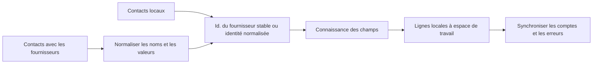

# Contacts

## Responsabilité

Contacts fournit un carnet d'adresses normalisé local sur les enregistrements manuels et connectés Google, CardDAV, et des sources compatibles. Il fournit la recherche et destinataire / participant autocompléter à Mail et Calendrier.

Les routes HTTP et la frontière des fournisseurs de synchronisation sont
strictement typées. Les identifiants d'intégration sont validés avant de
construire un fournisseur Google ou CardDAV, et les compteurs et erreurs
hétérogènes conservent un contrat explicite sans modifier le payload public.

## Modèle de données

Un contact a une identité locale stable, espace de travail, type, nom d'affichage, courriel primaire et téléphone, champs d'organisation, notes, courriels structurés multi-valeurs, téléphones et adresses, identifiants de fournisseur, source, photo, balises, timestamps, et état de synchronisation.

Les charges utiles spécifiques aux fournisseurs sont normalisées avant la fusion. Le traitement de vCard déploie des lignes de continuité, décode des valeurs et évade des séparateurs sans modifier les données de l'utilisateur.

## Synchronisation et fusion

La règle de fusion critique est la préservation de l'enrichissement local seulement. Une synchronisation à distance peut mettre à jour les valeurs appartenant au fournisseur, mais ne doit pas vider les étiquettes, notes, valeurs ajoutées manuellement, ou l'identité d'un autre fournisseur simplement parce que la charge utile actuelle les omet.

## Utilisation croisée des domaines

Les contacts de messagerie pour les destinataires et les liens entre les entités. Le calendrier recherche les contacts pour les participants. Ces consommateurs reçoivent des données d'affichage normalisées et n'ont pas accès aux identifiants du fournisseur ou aux charges utiles de synchronisation brute.

## Invariants

- Chaque requête et mutation est spectralisée dans l'espace de travail.
- Les identifiants à distance sont espacés par le fournisseur/source.
- Les synchronisations répétées ne créent pas de duplicates pour le même enregistrement du fournisseur.
- L'enrichissement local survit au rafraîchissement du fournisseur.
- Les champs multi-valeurs conservent les étiquettes de type et les valeurs préférées.
- La suppression des contacts et la suppression à distance sont des effets séparés à moins qu'un
la politique bidirectionnelle est sélectionnée.

## Aspects de vérification

Exécutez des tests de fusion, de déploiement/évasion de vCard, de normalisation du fournisseur, d'emails insensibles aux cas et d'espace de travail. Playwright vérifie la liste, le détail, la création/modification, la recherche et la navigation croisée sans dépendre d'un compte de fournisseur réel.
