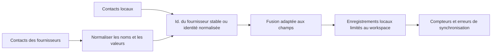

# Contacts

## Responsabilité

Contacts fournit un carnet d'adresses local normalisé à partir d'enregistrements manuels et de sources Google, CardDAV ou compatibles connectées. Il alimente la recherche et l'autocomplétion des destinataires de Mail et des participants de Calendrier.

Le frontend strictement typé `features/contacts/` gère la page du carnet
d'adresses, le catalogue d'intégrations et les composants de liste, de détail
et de formulaire. L'application utilise son entrée publique à chargement
différé ; les adaptateurs API partagés restent indépendants de l'écran. Le
déplacement préserve l'identité des sources, les champs des contacts et la
synchronisation sans conserver de composants dupliqués aux anciens emplacements.

Les routes HTTP et la frontière des fournisseurs de synchronisation sont
strictement typées. Les identifiants d'intégration sont validés avant de
construire un fournisseur Google ou CardDAV, et les compteurs et erreurs
hétérogènes conservent un contrat explicite sans modifier le payload public.

## Modèle de données

Un contact possède une identité locale stable, un workspace, un type, un nom
d'affichage, un e-mail et un téléphone principaux, des champs d'organisation,
des notes, des listes structurées d'e-mails, de téléphones et d'adresses, des
identifiants de fournisseurs, une source, une photo, des étiquettes, des
horodatages et un état de synchronisation.
Le modèle SQLAlchemy utilise des déclarations `Mapped[]` pour chaque colonne
et sa relation de workspace. Les affectations des services, routes et
synchronisations sont donc vérifiées contre le schéma persisté. Les modèles
Pydantic de requête et de réponse conservent leurs valeurs historiques par
défaut et leur représentation OpenAPI identique octet par octet.

Les payloads propres aux fournisseurs sont normalisés avant fusion. Le traitement vCard déplie les lignes de continuation, décode les valeurs et échappe les séparateurs sans modifier les données utilisateur.

## Synchronisation et fusion

La règle essentielle de fusion est de préserver l'enrichissement strictement local. Une synchronisation distante peut actualiser les valeurs gérées par le fournisseur, mais ne doit pas effacer les étiquettes, notes, valeurs ajoutées manuellement ou identités d'autres fournisseurs simplement parce que le payload actuel les omet. La politique de suppression est propre au fournisseur et ne se déduit pas d'une liste partielle.

## Utilisation croisée des domaines

Mail recherche les contacts pour les destinataires et les liens entre entités. Calendrier les recherche pour les participants. Ces consommateurs reçoivent des données d'affichage normalisées et n'accèdent ni aux identifiants secrets des fournisseurs ni aux payloads bruts de synchronisation.

## Invariants

- Chaque requête et mutation est limitée à son workspace.
- Les identifiants distants sont placés dans un espace de noms par fournisseur et source.
- Les synchronisations répétées ne créent pas de doublons pour le même enregistrement du fournisseur.
- L'enrichissement local survit au rafraîchissement du fournisseur.
- Les champs multi-valeurs conservent les étiquettes de type et les valeurs préférées.
- La suppression locale des contacts et la suppression distante sont des effets distincts, sauf sélection d'une politique bidirectionnelle explicite.

## Aspects de vérification

Exécutez les tests de fusion, de dépliage et d'échappement vCard, de normalisation des fournisseurs, de comparaison des e-mails sans distinction de casse et d'isolation des workspaces. Playwright vérifie la liste, le détail, la création et la modification, la recherche et la navigation entre domaines sans dépendre d'un compte réel de fournisseur.
