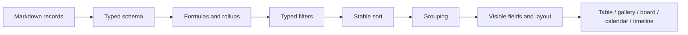

# Vues de bases de données et planification de projets

## Modèle de connaissances structurées

Une base de données Gnosi est une couche de schéma et de vues appliquée aux
pages, généralement ancrée dans un dossier du Vault. Le frontmatter des pages
contient les valeurs des enregistrements. Les données du registre définissent
les types de champs, les configurations des vues, les formules, les agrégations
rollup, les relations, les options, les paramètres d'affichage et les actions.

Chaque Vault actif est associé à un moteur SQLite stocké localement et à une
fabrique de sessions typée. Le registre des moteurs est indexé par chemin de
Vault, utilise une base déclarative SQLAlchemy typée, exécute la migration du
schéma avant la première connexion et libère les connexions du pool lors de
la suppression du Vault. Les fichiers SQLite restent hors du stockage du Vault
synchronisé dans le cloud.

La présence d'au moins une vue principale est un invariant. Les mécanismes de
réparation au démarrage et à la lecture la restaurent lorsque des écritures
anciennes ou interrompues laissent une table sans vue valide.

## Création de groupes de bases de données

Le bouton de création d'une base de données de l'accueil et le contrôle
correspondant de la barre latérale partagent une seule action. Tous deux créent
un groupe dans le registre via `/api/vault/databases`, actualisent le registre
et laissent les documents de page intacts. Les espaces superflus du nom sont
supprimés ; annuler ou laisser le nom vide n'écrit rien, et un échec conserve
le dialogue du groupe pour permettre une nouvelle tentative.

Une table est un objet distinct, créé dans un groupe sélectionné avec sa vue
principale. L'API des pages prend toujours en charge les anciennes pages
marquées `is_database: true` ; l'action d'accueil ne les convertit, ne les
supprime et ne les réinterprète pas automatiquement.

## Dates d'audit système

Chaque table possède des propriétés de création et de dernière modification
en lecture seule. Les nouvelles tables traduisent leurs libellés à partir de
la langue de la requête ou de la langue courante de l'interface définie dans
les paramètres, et conservent ces deux propriétés à la fin du schéma. La
création d'un enregistrement horodate les deux valeurs ; les sauvegardes
ultérieures préservent la date de création et actualisent celle de modification.

La migration idempotente ne reconnaît que les types système explicites et les
anciens libellés connus : les champs `date` sans rapport et les métadonnées
internes `created_at` ou `last_edited_at` restent donc intacts. Les clones
Notion déterministes peuvent compléter les horodatages d'audit faisant
autorité en établissant la correspondance entre les UUID de bases de données
et de pages configurés, sans correspondance par titre. L'index Notion complet
est récupéré avant les écritures, et une copie de sauvegarde est créée pour
chaque fichier de registre ou Markdown modifié.

## Normalisation des noms de tables et de vues

Les libellés des tables du registre et des vues enregistrées sont normalisés
aux frontières de chargement et d'écriture. Les emojis décoratifs et les
symboles pictographiques sont supprimés, tandis que les accents et la
ponctuation porteuse de sens sont conservés. La vue principale verrouillée
porte toujours exactement le nom de la table à laquelle elle appartient, et
son marqueur `is_main` fait toujours autorité.

## Hiérarchie de navigation des tables

La barre latérale du Vault présente chaque table comme un nœud parent avec
deux groupes enfants indépendants : `Content` contient les enregistrements de
la table et `Views` contient ses vues enregistrées. Les deux groupes sont
repliés par défaut, tout comme les nœuds des tables et les sections de
navigation de premier niveau, afin qu'une table comportant de nombreux
enregistrements ou vues reste facile à parcourir. Déplier un groupe ne doit
pas déplier implicitement l'autre ; chaque section conserve son propre état
persistant et tous les libellés passent par le catalogue de localisation du
frontend.

## Chaîne de traitement des vues

`VaultTable.tsx` délègue au contrôleur et à la mise en page typés de
`vault-table`. L'adaptateur de table partagé de `VaultViewBody` préserve
l'identité des tableaux de lignes valides, les extensions de métadonnées
inconnues et les fonctions de rappel de sélection. L'édition des cellules, la
navigation au clavier, les lignes virtualisées et les mises à jour des options
du schéma restent dans des modules distincts couverts par des tests de
régression. `SchemaConfigModal.tsx` délègue l'édition du schéma et la sauvegarde
automatique à `schema-config`, en conservant les identifiants des champs, les
couleurs des options et les valeurs par défaut. Ces changements internes ne
modifient ni les vues enregistrées ni les métadonnées portables des pages.

Les valeurs typées doivent être comparées selon le type déclaré de leur champ.
Une simple saisie textuelle ne peut pas représenter toutes les valeurs de
filtre ; les champs de date, de case à cocher, de nombre, de relation, de
sélection et à valeurs multiples sont normalisés par des opérateurs adaptés
à chaque champ.

L'évaluation des champs dérivés suit un ordre explicite. Les formules qui
dépendent de valeurs brutes sont exécutées avant les rollups qui agrègent les
relations, et les formules dépendantes sont résolues sans permettre aux cycles
de produire une récursion infinie. Les représentations du backend et du
frontend doivent s'accorder sur l'interprétation booléenne des cases à cocher,
les pourcentages, les valeurs vides et les identifiants des options.

Les champs virtuels calculés à la lecture utilisent des projections de graphe
et des contextes de calcul typés. Les arêtes structurelles excluent les nœuds
non résolus et les nœuds de propositions sémantiques ; le type des métriques
NetworkX est précisé à leur entrée dans le cache partagé, tandis que les
valeurs de degré, de hub, d'orphelin et de progression inverse des tâches
exposent des résultats primitifs stables. La clé canonique du frontmatter
reste le nom de la propriété du registre, sans conversion en slug.

Le comportement canonique des bases de données est réparti par responsabilité.
`tables/rules/` gère l'évaluation des formules, des rollups, des recherches
lookup et des automatisations ; `tables/catalogs/` gère la normalisation des
options, les rôles sémantiques et le catalogue global des statuts ; les petits
modules de `vault/views/` gèrent la syntaxe des instantanés, leur
matérialisation, les filtres, le tri et les jointures. Les imports historiques
`rule_engine.py`, `option_catalogs.py` et `view_snapshot.py` restent de fines
façades de compatibilité, y compris les points de substitution à liaison
tardive pour les tests des chemins et de l'enrichissement des relations.

La frontière HTTP des tables consomme directement ces contrats stricts de
collections, de cycle de vie, de schémas, d'options, de vues et de chemins
confinés. Elle n'effectue plus de conversions de type sur leurs résultats :
chaque module de domaine reste ainsi seul responsable de son type de retour,
tandis que l'inventaire historique à plat des routes et le document OpenAPI
demeurent inchangés.

Le graphe transitoire de composition des tables injecte désormais des listes
d'options concrètes, des définitions de jointures typées et un composant de
rematérialisation Markdown conforme au protocole. L'adaptateur préserve
l'enrichissement historique à liaison tardive tout en rejetant un résultat
d'instantané non textuel au lieu de le laisser atteindre la persistance.

Les modifications entre enregistrements sont sérialisées par table par
`tables/formula_recalculation.py`. Les requêtes concurrentes sont regroupées
dans une passe en attente ; chaque ligne visible est recalculée, le Markdown
modifié est écrit, et l'index des pages ainsi que le cache des réponses ne sont
actualisés qu'après la réussite des écritures.

Les critères de tri des vues enregistrées sont appliqués dans l'ordre du
tableau avec une comparaison stable à plusieurs clés. Les valeurs de
propriétés vides suivent toujours les valeurs renseignées, dans les deux sens
de tri, croissant et décroissant, conformément à la sémantique des vues Notion
importées. Les vues du frontend et les instantanés Markdown du backend
utilisent la même règle afin que l'ordre de leurs enregistrements ne puisse
pas diverger.

Lorsque `VaultDashboard` affiche un onglet de table, il transmet les
fonctionnalités activées du registre de la table à `VaultTable` via
`VaultViewBody`. L'onglet de table, la table autonome, le volet partagé et la
vue intégrée exposent donc les mêmes actions de lignes configurées. Omettre
cette chaîne de propriétés masque une action même lorsque le registre et
l'API l'indiquent correctement comme activée.

## Évolution du schéma et concurrence

Les révisions du schéma empêchent un client d'enregistrer une ancienne liste de
champs par-dessus une version plus récente. Le renommage d'un champ met à jour
les filtres, les tris, les formules, les actions et les références des vues
enregistrées. Le renommage d'une table détecte les collisions de noms de
fichiers dans un dossier plat avant de déplacer le contenu.

Les registres sont écrits atomiquement et actualisés après les modifications
de métadonnées en lot. Les instantanés en cache sont invalidés lorsque les
enregistrements sources ou la révision du schéma changent.

Les routes de vues par page valident la racine du registre, la table source,
le champ de filtre et l'identité de la page sur disque avant toute mutation.
Leur cycle de lecture-modification-écriture partage le verrou canonique du
registre et actualise le cache de la façade après une sauvegarde atomique ;
la synchronisation facultative des sections Obsidian reste un adaptateur typé
qui fonctionne au mieux sans garantie de réussite. L'identifiant stable
`view_id` a priorité sur les titres lors d'une insertion ou mise à jour, afin
que des intégrations parallèles ne puissent pas s'écraser mutuellement. Les
résultats de lecture, d'insertion ou mise à jour et de suppression passent par
des modèles Pydantic dédiés avant de renvoyer les mêmes dictionnaires
historiques ; le schéma de requête et le document OpenAPI figé restent
inchangés.

Les modifications de champs en lot, la promotion de Zotero Extra et
l'application de modèles partagent un service typé unique de mutation des
pages. Chaque cible est isolée, vérifie un ETag facultatif, actualise l'index
des pages après écriture et signale les éléments ignorés, les conflits et les
erreurs sans interrompre le traitement des lignes restantes.

Les éditeurs de propriétés de pages utilisent des contrôles adaptés aux
champs. Les champs `select` et `status` sont rendus sous forme de sélecteurs
d'options à valeur unique ; les catalogues de statuts sont stricts et ne
proposent pas la création ni la suppression d'options directement dans le
contrôle. La grille de la table et le panneau des propriétés de page doivent
préserver le même type de champ et la même sémantique des options.

Les valeurs de statut introduites par les règles d'action sont persistées de
manière idempotente par le domaine des tables. Les échecs du registre sont
journalisés, mais ne transforment jamais la règle d'origine en une action
utilisateur échouée.
La frontière pure des règles résout les champs par identifiant, nom actuel ou
alias, évalue les prérequis déclarés sans interpréter l'absence de données
comme un refus, préserve la clé du frontmatter déjà utilisée et initialise
les options de statut manquantes de manière déterministe. Les règles de
boutons restent distinctes des automatisations déclenchées par des changements.

La frontière HTTP de Planning est strictement typée tout en préservant son
contrat OpenAPI figé. La résolution du Vault actif échoue explicitement
lorsqu'aucun Vault n'est sélectionné, et la matérialisation des récurrences
consomme de manière bornée les itérateurs d'occurrences RRULE tout en
préservant les identifiants stables des tâches et les vérifications ETag.

## Planification de projets

Le frontend strictement typé `features/planning/` gère la page de planification
et ses tests de comportement derrière un point d'entrée public à chargement
différé. Le composant de rendu de la chronologie reste partagé avec les vues
du Vault. La responsabilité des routes ne modifie ni les requêtes de
planification, ni la création de références initiales, ni les journaux de
travail, ni l'approbation explicite des propositions de nivellement.

La planification consomme les champs structurés des tâches et produit un
échéancier faisant autorité, plutôt que de dupliquer la logique de
planification dans l'interface. Le moteur normalise les dépendances, les
calendriers, les durées, les contraintes, les ressources, les échéances,
l'avancement et le sens de planification. Il calcule ensuite les dates, les
marges, les tâches critiques, les avertissements et les affectations de
ressources.

Le moteur déterministe sépare désormais la normalisation des faits, la
planification en avant d'une tâche, les diagnostics de contraintes,
l'indexation des successeurs, la passe en arrière des marges, le placement
ALAP et la sérialisation du payload. Cela maintient les faits persistés
immuables tout en préservant les échéanciers partiels et les diagnostics en
cas d'erreurs récupérables du graphe.

L'ordonnanceur qui regroupe les demandes maintient l'analyse Markdown, la
sauvegarde et les vérifications ETag derrière un port Vault restreint à liaison
tardive, avec des enregistrements sources typés pour chaque écriture candidate.
Il valide la structure de l'état des plugins avant de lire les paramètres et
n'écrit que les bornes automatiques dont l'ETag source n'a pas changé. Les
types de l'historique des tarifs des ressources et des dérogations
d'affectation sont précisés à la frontière du stockage de planification :
les calculs d'affectation et de nivellement restent ainsi strictement typés,
sans modifier les nombres persistés ni la sémantique de l'échéancier.

Les durées des périodes conservent à la fois leur valeur numérique et l'unité
configurée (`hours`, `days` ou `years`). Les années civiles sont ajoutées sous
forme de décalages en années civiles : une année de début augmentée de huit
ans aboutit ainsi à l'année de fin correspondante, y compris pour les années
négatives. L'éditeur de propriétés supprime les champs redondants de dates
réelles, recalcule la fin chaque fois que le début, la durée ou le prédécesseur
change et utilise un sélecteur multiple avec recherche pour les prédécesseurs.
Les anciennes valeurs `durationDays` restent disponibles pour assurer la
compatibilité avec les anciens enregistrements et instantanés d'échéanciers.

Le frontend affiche le résultat et les contrôles d'édition. Il ne recalcule
pas indépendamment la sémantique du chemin critique. Les échéanciers en cache
sont indexés par l'état pertinent des entrées et résident dans les données
locales, pas dans les enregistrements sources du Vault.

## Comportement en cas d'échec

- Les formules non valides renvoient une erreur de champ contrôlée au lieu
  d'interrompre la réponse de la table.
- Les relations rompues restent visibles sous forme de valeurs non résolues
  lorsque c'est possible.
- Les vues manquantes déclenchent une réparation déterministe de la vue
  principale.
- Les cycles de planification, les contraintes impossibles ou les calendriers
  manquants produisent des diagnostics et des résultats partiels lorsque cela
  ne présente pas de risque.
- Une révision du schéma obsolète renvoie un conflit et nécessite un
  rechargement ou une fusion.

## Points de vérification

Testez la parité des filtres typés, les conflits de révisions du schéma, le
renommage des champs et des tables, l'ordre d'évaluation des formules et des
rollups, la synchronisation des relations, le tri des instantanés, les actions
des catalogues d'options, les contraintes de planification, les chemins
critiques et le rendu E2E des tableaux de bord.
