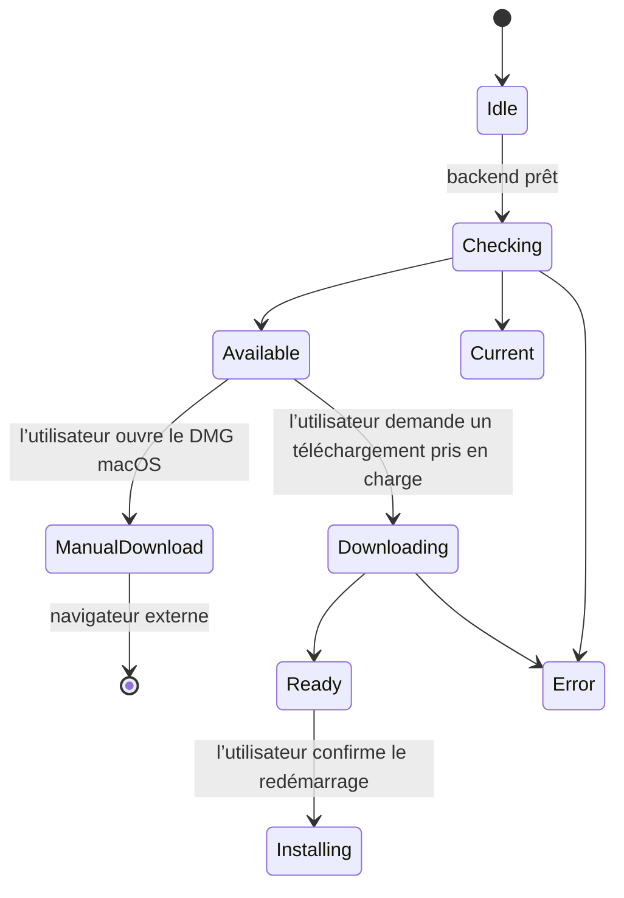

# Clients de bureau et clients complémentaires

## Responsabilités et modes de développement

Electron regroupe le frontend React et le backend Python dans une seule
application de bureau. Son processus principal gère le processus enfant du
backend, les fenêtres, le protocole de l’application, l’état des mises à jour
et les actions privilégiées. Le processus de rendu utilise une API de
préchargement limitée, jamais un accès sans restriction à Node.js ou au système
de fichiers.

Le développement natif dans le navigateur et le développement avec Electron
ont des points d’entrée distincts :

| Mode | Frontend | Responsable du backend |
| --- | --- | --- |
| Navigateur natif | Vite sur `http://localhost:5173` | `pnpm dev` depuis la racine démarre Vite et uvicorn |
| Développement avec Electron | Vite démarré séparément sur `http://localhost:5173` | `pnpm desktop:dev` démarre son propre processus enfant uvicorn sur le port 5002 |
| Electron empaqueté | Frontend intégré à `app://gnosi/index.html` | `python/cervell_backend` inclus dans le paquet, ou `cervell_backend.exe` sous Windows |

Ne lancez pas le backend natif en parallèle du développement avec Electron :
le superviseur de bureau n’adoptera pas un autre processus sur le port 5002.
Le mode de développement d’Electron ne démarre pas Vite et ne demande pas le
rechargement d’uvicorn. Lancez-le avec
`uv run --frozen --no-sync pnpm desktop:dev` après avoir synchronisé
l’environnement Python, afin que `python3`, ou `python` sous Windows, soit
résolu dans cet environnement. L’origine de confiance en développement est
HTTP localhost:5173 ; définissez `VITE_DEV_HTTPS=false` pour cette session
Vite. Une session HTTPS du complément Word relève d’une configuration distincte
et ne constitue pas une origine interchangeable pour le client de bureau.

Le [README de l’application de bureau](https://github.com/ismigar/Gnosi/blob/main/desktop/README.md)
contient les instructions de configuration et de récupération. Les liaisons
des menus avec React et l’avis de mise à jour relèvent de
`frontend/src/app/desktop/` ; la présentation des notes de version relève de
la fonctionnalité du centre de contrôle. Une réorganisation de ces
responsabilités internes ne doit modifier ni les noms IPC, ni les actions de
mise à jour, ni les destinations de téléchargement.

## Démarrage, fenêtres et IPC

Avant d’ouvrir Chromium ou de démarrer les services, `profile-startup.js`
obtient le verrou d’instance unique et prépare le profil existant. Un conflit
ou un état de récupération ambigu interrompt le démarrage ; cela n’autorise
pas la suppression de fichiers.

Chaque lancement du backend fournit une nouvelle valeur de
`GNOSI_DESKTOP_INSTANCE`. Le superviseur exige que son propre processus enfant
soit actif et que la réponse de santé soit complète, de taille limitée et
réussie, avec l’en-tête `x-gnosi-desktop-instance` correspondant. Cet en-tête
permet de relier la réponse au processus ; il n’authentifie pas l’utilisateur
et ne modifie pas le JSON public de santé. Les délais dépassés, redirections,
réponses mal formées, arrêts prématurés et réponses HTTP 200 d’un autre processus
font échouer le démarrage et entraînent l’arrêt et la récupération du processus
enfant géré par le superviseur. Si l’exécutable empaqueté manque, le Python du
système n’est jamais utilisé comme solution de repli.

Nouvelle fenêtre, Paramètres, l’activation depuis le Dock et l’affichage différé
des fenêtres ne peuvent contourner l’attente du backend ni l’arrêt de
l’application. Fermer la dernière fenêtre macOS ne quitte pas l’application ;
quitter l’application arrête son backend. Sur les autres plateformes, fermer
toutes les fenêtres quitte l’application. Les messages d’échec au démarrage
sont disponibles en anglais, catalan, espagnol et français avant le chargement
de React ; les détails techniques restent dans les journaux.

Les fenêtres principales utilisent `contextIsolation: true`, `sandbox: true`
et `nodeIntegration: false`. Seul le cadre principal actuel d’une fenêtre
enregistrée, sur l’origine de confiance du développement ou du paquet, peut
invoquer des opérations IPC privilégiées. La navigation et les redirections ne
peuvent conserver ce pont sur une autre origine. Les liens HTTP(S) demandés
dans une nouvelle fenêtre s’ouvrent à l’extérieur de l’application.

Le protocole du paquet sert les ressources du frontend et relaie `/api/` vers
le backend local. Il valide le composant d’autorité de l’URL de l’application,
empêche de sortir des répertoires autorisés et utilise le magasin de cookies de
la session au lieu de transmettre les en-têtes bruts de cookies du processus
de rendu. Préservez ce comportement lors de la modification du routage ou des
adaptateurs de diffusion en continu.

Sept gestionnaires extraits disposent de contrats de requête et de réponse
vérifiés. Le huitième, consacré au remplissage de formulaires, reste dans
`main.js` et valide son émetteur IPC avant d’ouvrir une fenêtre distincte sans
pont de préchargement. N’en déduisez pas que tout le processus principal
bénéficie d’un typage strict ni que des destinations arbitraires sont
autorisées pour les formulaires. Les abonnements de préchargement renvoient des
fonctions de désinscription idempotentes ; les méthodes de suppression
compatibles restent disponibles pour les anciens processus de rendu.

## Données locales et récupération du profil

Le backend empaqueté sélectionne la première valeur non vide dans cet ordre :
`GNOSI_DATA_DIR`, `GNOSI_LOCAL_DATA`, `LOCAL_DATA_DIR`, puis le répertoire
`userData` existant d’Electron. Il définit la variable canonique et préserve
tout alias de compatibilité existant. La solution de repli de l’application de
bureau ne correspond pas nécessairement au chemin par défaut de Python natif
sur la plateforme et ne déplace pas une ancienne installation. Utilisez des
chemins absolus pour les réglages explicites et préservez à la fois le profil
Electron et tout répertoire de données distinct du backend avant une mise à jour.

Le nom de paquet avec espace de noms `@gnosi/desktop` est de nouveau associé
au nom historique d’exécution `gnosi` ; les emplacements explicites du profil
et de la session restent utilisés. L’identifiant du paquet reste
`com.gnosi.cervell-digital`.

La protection des profils préserve les répertoires obsolètes `databases` sous
forme d’octets opaques dans
`.<profile-name>.gnosi-electron-recovery/databases.saved`, à côté de chaque
profil. Les déplacements atomiques sans remplacement et les journaux
d’opérations empêchent l’écrasement d’une destination existante. Les profils
distincts de données utilisateur et de session sont vérifiés. Des primitives
du système de fichiers non prises en charge, des modules natifs manquants,
des chemins de données qui se chevauchent ou des journaux ambigus interrompent
le démarrage. Cela préserve les octets, pas la fonctionnalité WebSQL supprimée.
Ne restaurez pas cette arborescence sous son ancien nom pendant l’exécution
d’une version plus récente d’Electron et ne supprimez pas les journaux pour
forcer le démarrage.

Pour les schémas de cookies connus 19–22, la migration prépare uniquement la
base de cookies, vérifie son intégrité, son schéma, son nombre de lignes et une
empreinte des données projetées qui respecte leur représentation en octets,
puis active le schéma 23 avant que Chromium ne l’ouvre. L’original exact est
conservé dans `.Cookies.gnosi-cookie-recovery/original.sqlite`, à côté de
`Cookies`. Si le magasin est inconnu, corrompu, conflictuel ou doté d’un
chiffrement personnalisé, l’opération est bloquée par sécurité. Aucun profil
complet n’est copié, aucune clé de déchiffrement n’est devinée et aucun repli
en texte clair n’est utilisé.

Le retour arrière explicite des cookies exige que les clients soient arrêtés
et que la migration initiale soit terminée. Il préserve les cookies les plus
récents dans `rollback.current.sqlite`, restaure un original vérifié à l’aide
de son propre journal d’opérations et empêche une nouvelle migration
automatique. Conservez tous les fichiers de récupération jusqu’à l’acceptation ;
ne forcez jamais les numéros de version du schéma et ne supprimez jamais les
bases de cookies. Le README décrit la récupération après interruption et les
tests isolés de la séquence ancienne → cible → cible. La réussite de tests sur
des données synthétiques ne prouve pas la migration réelle du profil, du
magasin de secrets du système d’exploitation ou de la base de données de
l’application sur une autre machine.

## Mises à jour et actions de l’utilisateur

`update-policy.js` sélectionne l’installation manuelle sur macOS et la voie de
téléchargement et d’installation automatiques sur les autres plateformes. En
développement, la recherche de mises à jour est désactivée. En production,
elle a lieu après un démarrage réussi, mais `autoDownload` et
`autoInstallOnAppQuit` sont tous deux à faux : la disponibilité d’une version
ou la fermeture de l’application ne déclenche pas d’installation non sollicitée.

Sur macOS, l’action explicite ouvre l’URL du DMG officiel correspondant à
l’architecture. L’empaquetage actuel utilise une signature ad hoc ; le
redémarrage avec installation automatique reste désactivé dans l’attente d’une
configuration stable et revue de Developer ID et de notarisation. La réussite
de la vérification `codesign` ne suffit pas à valider le système de mise à jour.
De même, la politique Windows/Linux ne prouve pas que l’installation fonctionne
pour tous les formats d’artefacts ; testez la cible réellement installée.

Le processus principal conserve le dernier état de mise à jour pour les
processus de rendu qui s’abonnent tardivement. Les vérifications en arrière-plan
n’ouvrent pas l’historique des versions. L’utilisateur l’ouvre explicitement
depuis le Centre de contrôle ; les changements de version ne l’ouvrent pas au
démarrage.

## Chaîne d’outils et limites de l’empaquetage

L’espace de travail fixe Node 22.22.2 et pnpm 11.19.0. Les dépendances de
l’application de bureau fixent actuellement Electron 43.4.1,
electron-builder 26.15.3 et ASAR 4.3.0. L’environnement Node intégré à Electron
est distinct de celui utilisé pour la compilation de l’espace de travail.
La commande explicite `install:runtime` installe son binaire ; n’activez pas
tous les scripts d’installation des dépendances pour remédier à l’absence de
cet environnement d’exécution.

Compilez le frontend avant d’empaqueter l’application de bureau.
`build-python.sh` exige exactement Python 3.11, accepte `GNOSI_PYTHON_CMD`
lorsqu’il est configuré explicitement et crée un environnement temporaire unique
à partir du `uv.lock` figé de la racine et du groupe de dépendances `desktop`.
Il génère une spécification PyInstaller, valide l’analyse et le paquet, copie
le résultat vérifié dans `desktop/dist-python/` et exécute le test de bon
fonctionnement isolé du backend empaqueté. Il n’utilise ni fichier de
dépendances distinct ni environnement existant du développeur.

La politique de ressources lit le code source sans importer l’application.
Elle préserve les ressources Alembic, les instructions de l’agent, les skills
de traduction dynamique, les plugins d’exemple et les styles bibliographiques.
Elle rejette les ressources manquantes, modifiées, non examinées ou dangereuses
au lieu d’inclure récursivement les vaults, bases de données, configurations,
secrets ou outils générés. Le hook `afterPack` vérifie l’ASAR réel et les
ressources Python avant la signature. Les ressources graphiques se trouvent
dans `desktop/assets/` ; les paquets générés, dans `desktop/dist/` et
`desktop/dist-python/`.

| Cible configurée | Architecture de l’exécuteur | Installateurs et artefacts de mise à jour |
| --- | --- | --- |
| macOS arm64 | macOS ARM64 sur infrastructure propre | `Gnosi-<version>-arm64.dmg`, ZIP, `latest-mac.yml` |
| macOS x64 | macOS X64 sur infrastructure propre | `Gnosi-<version>-x64.dmg`, ZIP, `latest-mac.yml` |
| Linux arm64 | Linux ARM64 sur infrastructure propre | AppImage, DEB, `latest-linux-arm64.yml` |
| Windows x64 | Windows X64 sur infrastructure propre | `Gnosi-<version>-Setup.exe`, `latest.yml` |

L’architecture du backend gelé doit correspondre à celle de la cible. Les
cibles macOS ne doivent pas empaqueter silencieusement les deux architectures
avec un seul backend natif de la machine de compilation. Linux passe
`--arm64` ; Windows utilise NSIS x64. Ces jobs ne fixent pas de version de
macOS et ne couvrent ni Linux x64 ni Windows arm64. Les deux jobs macOS
s’exécutent en série ; Windows attend macOS, tandis que Linux peut s’exécuter
en parallèle. La concurrence est limitée par référence Git, et non par un
verrou global garantissant la capacité de la machine hôte.

Windows bénéficie d’une dérogation à la politique d’exécution de PowerShell
limitée au job et prépare Git avant l’extraction du code si nécessaire ;
n’affaiblissez pas la politique de l’ensemble de la machine. La compilation du
backend passe les arguments de l’interpréteur entre guillemets, utilise des
structures d’environnements virtuels temporaires propres à chaque plateforme
et tente de les nettoyer dans la mesure du possible. Le manifeste Python
limite actuellement `cryptography` à la série 48.x sur macOS x86_64 ;
l’invocation actuelle d’uv n’impose pas une installation exclusivement binaire.
Vérifiez la provenance des paquets wheel et leur ABI sur l’exécuteur réel,
sans supposer que cette restriction est appliquée ni remplacer son Python/OpenSSL.

Tous les scripts de compilation de l’application de bureau, y compris les
alias racine `package:desktop` et `build:desktop`, désactivent la publication
par electron-builder avec `--publish never`. Ils préparent des artefacts
locaux ; ils ne certifient ni ne publient une version.

## Préparation des versions et distribution limitée aux candidats

L’historique intégré à l’application se trouve dans
`frontend/src/features/control-center/releases/releases.json`.
Les manifestes de la racine, du frontend et de l’application de bureau, les
métadonnées Python, les fichiers de verrouillage, les notes localisées et le
journal des modifications doivent concorder avant la sortie.
`sync-release-version.cjs` prépare les quatre entrées avant de modifier
uniquement leurs champs de version. Les entrées illisibles, les affectations
non prises en charge et les doublons ambigus échouent avant toute écriture.
Les versions imbriquées dans les objets JSON, les commentaires et les fins
de ligne sont conservés ; une version identique ne réécrit aucun fichier.
Le localisateur TOML accepte `[project].version` entre guillemets sur une seule
ligne, mais ne valide pas l’ensemble du TOML. L’actualisation du fichier de
verrouillage doit encore valider le projet Python. Les écritures séparées ne
forment pas une transaction résistante aux interruptions : une erreur
d’entrée/sortie ou une interruption peut laisser des modifications partielles.
Examinez les différences avec la base enregistrée de la branche de préparation
avant de réessayer. La validation du catalogue et du journal des modifications
ainsi que la révision des fichiers de verrouillage actualisés restent requises.

`desktop/release.sh` prépare les versions et les artefacts locaux. Il ne crée
pas de tag et ne publie pas de version. Utilisez une branche de préparation
explicite et excluez-en les modifications sans rapport. De nouvelles corrections
d’empaquetage exigent un nouveau tag revu, et non la publication d’un code
différent sous un ancien tag. N’ajoutez les liens de téléchargement par
plateforme qu’une fois les artefacts publics immuables correspondants
effectivement disponibles.

`Build Release Candidate` vérifie que le tag demandé existe et que sa
résolution jusqu’au commit correspond exactement au `github.sha` extrait,
aussi bien pour les envois de tags que pour les déclenchements manuels.
Une entrée mal formée, un tag manquant, une cible qui n’est pas un commit ou
une divergence interrompt le processus avant l’installation des dépendances.
L’outil de vérification d’identité utilise Git local et ne déplace pas de
références ni n’en récupère de lui-même. La protection des tags distants reste
une exigence distincte.

Le workflow appelle ensuite la CI existante sur le même commit sans hériter
des secrets. Les compilations par architecture exigent sa réussite. La CI
comprend la documentation, le frontend, le backend, les tests de bon
fonctionnement natifs et les compilations d’images Docker. La documentation
des PR est vérifiée par rapport à leur base exacte ; les candidats vérifient
les catalogues actuels et tous les portails linguistiques en mode strict à
leur propre SHA, et non au moyen d’une revue fictive de l’impact d’une PR.

La collecte ne télécharge que les quatre artefacts d’architecture nommément
désignés, en excluant les candidats précédents lors des nouvelles tentatives.
Elle installe les dépendances verrouillées du collecteur avec les scripts de
cycle de vie désactivés, vérifie la version, les références et les empreintes
SHA-512, rejette les fichiers manquants ou en conflit et fusionne les deux
manifestes de mise à jour macOS. La génération des index, le rendu des notes
de version et le dépôt du candidat suivent la validation.

L’artefact Actions final est `candidate-<tag>-<sha>-<attempt>`, conservé pendant
cinq jours. Il contient les installateurs, les métadonnées de mise à jour, les
index et les notes de version. Ce n’est pas un stockage confidentiel et il ne
doit jamais contenir de données utilisateur ni de secrets. Le workflow dispose
de permissions en lecture seule sur le dépôt et ne crée pas de brouillons
GitHub, ne publie pas de versions et ne modifie ni les artefacts publics
existants ni les canaux de mise à jour.

La distribution publique reste désactivée jusqu’à l’acceptation complète du
mode natif, de Docker, des installateurs et des mises à niveau depuis 2.x, ainsi
qu’à l’examen distinct d’une voie de publication. Un candidat réussi n’autorise
pas la publication de 3.0.0.

## Clients web et bureautiques

L’extension de capture web envoie `POST /api/public/clip` avec un jeton d’accès
personnel et lit la configuration des champs demandés et de la destination depuis
`GET /api/public/clip/config`. Le backend choisit le vault de destination ;
l’extension n’obtient pas d’accès arbitraire au système de fichiers. Son jeton
et l’URL du backend sont conservés dans le stockage local de l’extension.
L’empaquetage pour les navigateurs et l’acceptation dans leurs boutiques sont
distincts de l’acceptation de l’installateur de bureau.

Le volet de tâches Word se trouve dans `frontend/public/word-addin/` et utilise
Office.js. Ses appels API utilisent l’origine du volet et un jeton bearer
configuré explicitement ; une réponse correcte d’un point d’accès public ne
prouve pas que l’accès aux citations est autorisé. L’origine HTTPS du manifeste
et le certificat de confiance doivent correspondre au déploiement. Les outils
dans `extensions/office/word-cite/` modifient des références du document ou du
paquet, ou le modèle Word de l’utilisateur, pour permettre la persistance
facultative du volet. Ce sont des modifications explicites de documents ou de
configuration, pas une action normale du démarrage de Gnosi.

Le client LibreOffice est un gestionnaire de protocole Python/UNO qui utilise
`urllib` de la bibliothèque standard. Il lit `api_token` dans sa propre
configuration ou dans `GNOSI_API_TOKEN` ; ne supposez pas qu’il partage la
session du navigateur. Les deux clients utilisent les points d’accès de mise
en forme des citations du vault et le traitement Pandoc/CSL du backend.
La mise en forme sensible au contexte exige les clés du document dans l’ordre,
y compris les citations répétées. L’actualisation de Writer parcourt les
tableaux imbriqués ; les en-têtes et pieds de page contribuent aux clés
bibliographiques, mais ne sont pas réécrits par l’actualisation ordonnée.
Le comportement de l’application bureautique hôte doit être testé dans
l’application réellement prise en charge, et non déduit de tests de parcours
sur des données synthétiques.

## Acceptation et dépannage

Le test de bon fonctionnement du backend empaqueté exige une réponse de santé
HTTP 200 de taille limitée avec `status: ok`, `mode: FastAPI` et sa nouvelle
identité de test dans `gnosi_mode`. Il utilise des chemins de données et de
vaults jetables, désactive l’automatisation opérationnelle et récupère son
processus enfant en cas de réussite comme d’échec. `GNOSI_VALIDATION_ROOT`
valide tous les sélecteurs et bloque les fichiers d’environnement locaux et
partagés ainsi que l’accès au magasin d’identifiants. La génération OpenAPI
utilise le même isolement. Ne définissez jamais cette option pour le
développement normal ou les applications installées.

Les contrats vérifiés dans le code source, les environnements hôtes simulés
et une exécution de FastAPI depuis les sources ne prouvent pas le bon
fonctionnement d’un installateur intégrant le backend gelé ni d’une mise à
niveau réelle. Avant toute distribution publique, vérifiez sur chaque cible
réelle l’installation, le premier lancement, les IPC, la préservation des
cookies et du profil, l’intégrité de la base de données, la voie de mise à jour
et la récupération, ainsi que les parcours authentifiés dans le navigateur et
le démarrage et la persistance de Docker. Une réussite locale sur macOS ne
peut pas certifier une autre cible.

| Symptôme | Points à examiner ensuite | À ne pas faire |
| --- | --- | --- |
| Electron reste vide en développement | Origine HTTP de Vite, PATH de l’environnement Python figé et journal de démarrage du backend propre à Electron | Démarrer un second backend sur le port 5002 |
| La protection du profil interrompt le démarrage | Erreur exacte, chemins d’origine et de récupération, clients arrêtés | Supprimer les journaux d’opérations, les cookies ou les anciennes données |
| Le backend empaqueté manque | Résultat de PyInstaller et politique des ressources finales | Se rabattre sur le Python du système |
| macOS propose un DMG | Politique actuelle d’installation manuelle et architecture | Considérer la vérification de signature comme une validation de la mise à jour automatique |
| Office accède au point de santé, mais les citations échouent | Jeton bearer, origine de l’API et réponse réelle de la ressource protégée | Désactiver l’authentification pour masquer un échec du client |

Exécutez les tests de contrats de bureau du dépôt, la vérification stricte des
IPC, la validation documentaire et les commandes pertinentes de tests de bon
fonctionnement isolés. Examinez le résultat dans le navigateur et l’application
de bureau, ainsi que les journaux, et pas seulement les codes de sortie.
Distinguez les preuves obtenues sur les plateformes cibles des tests synthétiques.
