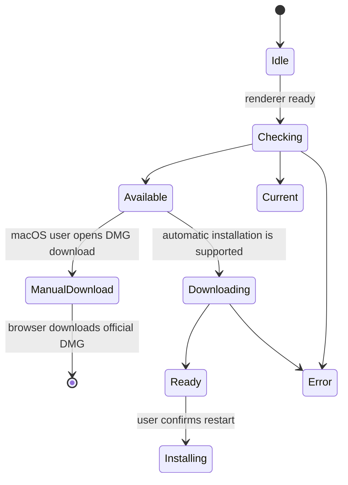

# Clients de bureau et de compagnie

## Bureau électronique

Electron paquete Gnosi comme une application de bureau. Le processus principal possède le démarrage de backend, le nettoyage de processus, le cycle de vie de fenêtre, les chemins de ressources empaquetés, les contrôles de mise à jour, la livraison de l'installateur, l'installation et les actions de bureau privilégié. Le render reçoit une API de précharge étroite plutôt que l'accès direct à Node.js.

Le moteur Python groupé doit être prêt avant que le render ne traite l'application comme utilisable. Les défaillances de démarrage sont révélées avec des diagnostics et le nettoyage empêche les processus de moteur orphelins après la sortie de la fenêtre.

## Mise à jour de la machine d'état

Les fichiers sont désactivés dans le développement. Les téléchargements ne commencent jamais simplement parce qu'une version existe. L'avis de rendu compact n'ouvre pas l'historique de version et les modifications de version n'ouvrent pas cet historique lors du démarrage de l'application. Les utilisateurs peuvent toujours ouvrir les notes de version explicitement depuis le Centre de contrôle. Sur macOS, les signatures ad-hoc actuelles ne fournissent pas l'exigence désignée stable requise par Squirrel.Mac, donc l'action explicite ouvre directement le DMG officiel spécifique à l'architecture. Windows et Linux conservent la machine automatique de téléchargement et d'installation. Le processus principal stocke l'état de dernier updater afin qu'un render qui s'abonne tard peut le récupérer via IPC.

Le redémarrage et l'installation de macOS sans soudure doivent rester désactivés jusqu'à ce que les versions utilisent une signature et une notarisation stables d'Apple Developer ID. Cette politique empêche un installateur qui passe autonome `codesign` la vérification d'être offert comme automatiquement instable lorsque son hash de répertoire de code ad-hoc par-build ne peut pas correspondre à l'application actuellement installée.

Les objets de sortie incluent les installateurs et les métadonnées de mise à jour pour macOS, Windows et Linux. La préparation de la version maintient les manifestes de frontend et d'Électron alignés; les balises sont créées uniquement à partir de revues `main` s'engage.

Les paquets de flux de travail de relâchement privé macOS Intel et Apple Silicon dans des tâches matricielles séparées. Chaque travail fonctionne sur l'architecture macOS 15 correspondante et construit un backend natif PyInstaller avant d'invoquer le constructeur d'électrons pour cette même cible. Cela empêche un exécutable natif de Python d'être copié dans l'application de l'autre architecture. Les corners de relâchement sont épinglés au lieu d'utiliser un exécutable hôte-natif Python. `macos-latest`, dont la migration vers macOS 26 a changé la création DMG en APFS et a brisé la phase de montage et de personnalisation du constructeur d'électrons. Chaque travail de relâchement passe également la commande Python fournie par `actions/setup-python` explicitement au constructeur de backend. Cela garde les extensions binaires et leurs bibliothèques OpenSSL collectées sur un interprète ABI au lieu de permettre à un nouveau niveau de coureur Python de surpasser l'environnement de sortie. `cryptography` 49 et plus tard ne plus publier macOS x86_64 roues, le paquet Intel utilise la ligne universelle2 compatible finale (`48.0.1`) tandis que les autres plates-formes conservent le plancher de dépendance actuel. L'installateur de flool-backend nécessite un `cryptography` distribution; il doit échouer plutôt que de compiler contre un coureur OpenSSL qui peut s'entrer en collision avec la bibliothèque collectée de PyInstaller.

La liste des fichiers constructeurs d'Electron est une limite explicite de temps d'exécution. `afterPack` crochet inspecte la finale `app.asar` et rejette un paquet qui omet le processus principal, précharge, native-menu, backend-launch ou module update-policy. Cette vérification d'artefact installé complète les tests de source et empêche un arbre source valide de produire une application qui échoue avant l'ouverture de sa première fenêtre.

Le chemin de l'arrière-paquet se résolve à l'exécutable PyInstaller lui-même sur macOS et Linux, et à son `.exe` Le processus principal est le résultat de la résolution directe du fichier; il ne traite jamais l'exécutable comme un autre niveau de répertoire. La construction propre installe les exigences canoniques d'exécution E2E, y compris les dépendances du fournisseur et de l'API, puis démarre l'exécutable congelé comme un test de fumée multiplateforme avant que le paquet de bureau puisse continuer.

Les fournitures de processus de bureau installées `GNOSI_LOCAL_DATA` sous le répertoire des données des applications par utilisateur d'Electron, à moins qu'il n'existe un surchargement explicite. Cela éloigne les paquets natifs de Docker uniquement `/app/data`. Le sondage de la disponibilité utilise le non-authentifié `/api/health` Endpoint de démarrage donc ne pas attendre sur un endpoint d'application protégé. Les backends congelés désactivent l'observateur de rechargement du système de fichiers d'Uvicorn; le développement de source native conserve le comportement de recharge.

Le catalogue de sortie, les notes localisées, le changelog généré, Electron manifeste, frontend manifeste, et le fichier de verrouillage monorepo forment une unité versionnée. Le synchroniseur déterministe ne met à jour les trois champs de version qu'après la validation du catalogue et du changelog.

## Marque de demande

`frontend/public/favicon.svg` définit la marque d'application Gnosi : un G blanc centré avec une marge bleue claire à l'intérieur d'un dégradé bleu arrondi. Le générateur d'icônes Electron produit les variantes PNG, ICNS et ICO des mêmes proportions visuelles, de sorte que le navigateur, macOS, Windows et Linux clients ne présentent pas un glyphe différent ou bord à bord. Régénérer ces ressources dérivées chaque fois que la marque canonique change; ne pas éditer un paquet d'applications emballés.

## Préparation de la libération

`frontend/src/content/releases.json` est l'historique de libérations groupées canonique. Le synchroniseur de version maintient le manifeste frontal, le manifeste Electron et l'entrée d'espace de travail frontal dans le fichier de verrouillage monorepo identique. `downloadUrl`; ce champ n'est ajouté qu'après l'existence de la balise immuable et de ses objets de plateforme. Comme la version frontale manifeste est une limite de bureau à impact élevé, chaque requête de tirage de la version préparée rafraîchit également ce contrat révisé et ses miroirs localisés, même lorsque le patch ne change pas le comportement d'exécution. Avant de préparer le patch stable suivant, l'entrée stable précédente doit déjà lier à sa version publiée de sorte que l'historique groupé reste complet sur les mises à jour séquentielles. Les notes de patch ne comprennent que les corrections fusionnées après cette balise précédente; elles ne répètent pas les modifications déjà publiées.

Avant de marquer, la version PR doit passer la validation frontale, les tests backend, la QA du navigateur natif et la porte de documentation technique. Après fusion, la version révisée doit atteindre le dépôt public par le workflow de synchronisation et passer la disponibilité de la version. Le flux de travail source privé est le seul propriétaire de balises officielles, d'artefacts de plate-forme croisée, de catalogues signés, de notes de publication et de la version dans le dépôt public. Le flux de travail public synchronisé est manuellement pour valider l'emballage sans course ou duplication d'une construction officielle de balises. Les artefacts macOS, Windows et Linux résultant sont inspectés avant publication.

La préparation de la v2.0.0 respecte cette limite : les notes localisées
incluses et le changelog généré sont livrés avec les manifestes synchronisés,
tandis que le tag immuable et le lien de téléchargement de chaque plateforme
ne sont ajoutés qu’après la réussite du workflow officiel de release pour le
commit révisé de main.

Le correctif v2.0.1 conserve des dépendances canoniques complètes pour le
backend gelé et envoie les tags officiels vers la matrice de runners locaux
configurée. Le workflow valide ainsi les environnements qui produisent les
artefacts.

## Récupérateur Web

L'extension du navigateur extrait le titre de la page actuelle, l'URL, le contenu sélectionné ou lisible, et les métadonnées supportées, puis envoie une requête limitée à l'API de Gnosi. Le moteur d'accès effectue l'authentification, la désinfectation, la déduplication et les écrits de Vault. L'extension ne reçoit pas un accès arbitraire au système de fichiers de Vault.

## LibreOffice et les clients de citation Word

L'extension LibreOffice enregistre un gestionnaire de protocole et appelle les paramètres de citation de Gnosi du processus de bureau. L'aide Word maintient l'état task-pane/add-in requis pour accéder au même service local. Les deux clients traitent l'insertion de citation et la bibliographie rafraîchissante comme des mutations explicites de documents.

Les API spécifiques à un bureau sont isolées derrière les aides à la traversée et à l'insertion afin que les tests puissent falsifier la limite de l'UNO ou de l'ajout sans exiger l'application complète du bureau pour chaque test d'unité.

## Invariants

- Le code de render n'a pas de capacité de système de fichiers sans restriction.js.
- IPC expose les opérations nommées avec des entrées validées.
- Mise à jour du téléchargement, ouverture de l'installateur et installation nécessitent des actions explicites de l'utilisateur.
- Les chemins de ressources combinés diffèrent des chemins de développement et sont résolus à
C'est l'heure de la course.
- Les clients de l'entreprise se font authentifier sur le moteur et restent dans leur étroite
la portée de la capture ou de la citation.
- Les ébauches de publication sont inspectées avant leur publication.

## Aspects de vérification

Exécutez des contrôles de syntaxe/construction d'Electron, des tests de fumée de backend, des tests d'état de mise à jour, une validation de construction d'extension, des tests de citation transversale et des tests de plate-forme CI.
