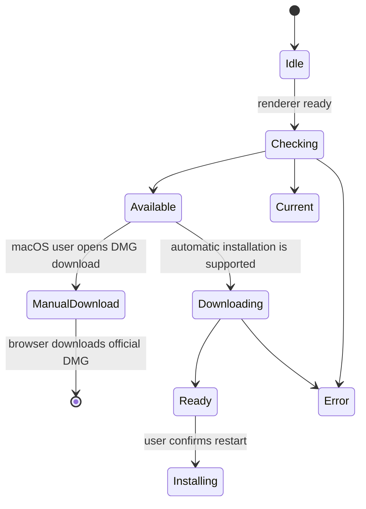

# Application de bureau et clients complémentaires

## Application de bureau Electron

Electron distribue Gnosi sous forme d’application de bureau. Le processus principal gère le démarrage et l’arrêt du backend, les fenêtres, les ressources du paquet, les mises à jour et les actions privilégiées. L’interface utilise une API de preload limitée, sans accès direct à Node.js.

Les menus et l’avis de mise à jour de l’interface appartiennent à `app/desktop/`. Les notes de version relèvent de la fonctionnalité du centre de contrôle et utilisent le même JSON de releases. Les méthodes de preload, les événements et les destinations de téléchargement sont conservés.

## Démarrage du processus dédié et ressources vérifiées

Le lanceur attend le processus qu’il a créé, pas un service quelconque sur le
port 5002. Chaque démarrage remplace `GNOSI_DESKTOP_INSTANCE` par un nouveau
marqueur. `/api/health` le renvoie dans `x-gnosi-desktop-instance` uniquement si
la réponse réussit ; le JSON et l’API publique restent inchangés. Ce marqueur
identifie le processus, sans authentifier l’utilisateur. Un processus actif
et une réponse complète, limitée et correspondante sont exigés. Redirections,
réponses HTTP 200 étrangères, JSON incorrect, délais dépassés ou sorties
prématurées font échouer le démarrage et arrêter le processus dédié. Si
l’exécutable du paquet manque, le Python du système n’est pas utilisé.

L’activation, Nouvelle fenêtre, Paramètres et les recherches de mises à jour ne
peuvent contourner cette attente ou l’arrêt. Quitter pendant le démarrage ne
peut ouvrir une fenêtre tardive. Le dialogue précédant React fournit les
instructions en anglais, catalan, espagnol et français selon la langue du
système ; les détails techniques restent dans le journal de l’application.

Sept gestionnaires IPC disposent de contrats de requête et de réponse vérifiés
et valident l’émetteur avant de lire les arguments ou d’effectuer une action
privilégiée. Le gestionnaire de remplissage de formulaires reste dans
`main.js` : cette extraction ne garantit pas le typage du processus principal
dans son ensemble.

`backend_resources.py` sélectionne les fichiers de runtime vérifiés et découvre
les modules Python sans importer l’application. Il conserve les migrations et
modèles Alembic, instructions de l’agent, outils de traduction dynamiques,
extensions d’exemple et styles bibliographiques. Il ne copie pas récursivement
la configuration locale, les vaults, bases de données, secrets ou outils
générés. Les ressources manquantes ou modifiées, fichiers non examinés dans les
arbres sélectionnés, chemins dangereux ou contenus interdits bloquent le paquet.

La politique vérifie l’analyse réelle de PyInstaller avant la collecte, le
résultat avant et après copie et les ressources `python/` finales d’Electron
avant signature. Les chemins contenant des espaces restent des arguments
distincts. Ces contrôles ne certifient pas les installateurs : le démarrage
gelé, l’installation et la mise à niveau depuis 2.x doivent être testés sur
chaque plateforme, ainsi que la matrice native et Docker, avant publication.

Le générateur OpenAPI active également `GNOSI_VALIDATION_ROOT` avant d’importer
la configuration de l’application. Les mêmes chemins temporaires validés
empêchent la lecture des fichiers d’environnement, de la configuration locale
du dépôt et des identifiants pendant cette étape du build ; la génération du
schéma ne doit pas consulter de données personnelles.

## Machine à états des mises à jour

Les fichiers sont désactivés dans le développement. Les téléchargements ne commencent jamais simplement parce qu'une version existe. L'avis de rendu compact n'ouvre pas l'historique de version et les modifications de version n'ouvrent pas cet historique lors du démarrage de l'application. Les utilisateurs peuvent toujours ouvrir les notes de version explicitement depuis le Centre de contrôle. Sur macOS, les signatures ad-hoc actuelles ne fournissent pas l'exigence désignée stable requise par Squirrel.Mac, donc l'action explicite ouvre directement le DMG officiel spécifique à l'architecture. Windows et Linux conservent la machine automatique de téléchargement et d'installation. Le processus principal stocke l'état de dernier updater afin qu'un render qui s'abonne tard peut le récupérer via IPC.

Le redémarrage et l'installation de macOS sans soudure doivent rester désactivés jusqu'à ce que les versions utilisent une signature et une notarisation stables d'Apple Developer ID. Cette politique empêche un installateur qui passe autonome `codesign` la vérification d'être offert comme automatiquement instable lorsque son hash de répertoire de code ad-hoc par-build ne peut pas correspondre à l'application actuellement installée.

Les objets de sortie incluent les installateurs et les métadonnées de mise à jour pour macOS, Windows et Linux. La préparation de la version maintient les manifestes de frontend et d'Électron alignés; les balises sont créées uniquement à partir de revues `main` s'engage.

Les paquets de flux de travail de relâchement privé macOS Intel et Apple Silicon dans des tâches matricielles séparées. Chaque travail fonctionne sur l'architecture macOS 15 correspondante et construit un backend natif PyInstaller avant d'invoquer le constructeur d'électrons pour cette même cible. Cela empêche un exécutable natif de Python d'être copié dans l'application de l'autre architecture. Les corners de relâchement sont épinglés au lieu d'utiliser un exécutable hôte-natif Python. `macos-latest`, dont la migration vers macOS 26 a changé la création DMG en APFS et a brisé la phase de montage et de personnalisation du constructeur d'électrons. Chaque travail de relâchement passe également la commande Python fournie par `actions/setup-python` explicitement au constructeur de backend. Cela garde les extensions binaires et leurs bibliothèques OpenSSL collectées sur un interprète ABI au lieu de permettre à un nouveau niveau de coureur Python de surpasser l'environnement de sortie. `cryptography` 49 et plus tard ne plus publier macOS x86_64 roues, le paquet Intel utilise la ligne universelle2 compatible finale (`48.0.1`) tandis que les autres plates-formes conservent le plancher de dépendance actuel. L'installateur de flool-backend nécessite un `cryptography` distribution; il doit échouer plutôt que de compiler contre un coureur OpenSSL qui peut s'entrer en collision avec la bibliothèque collectée de PyInstaller.

La matrice macOS est fermée par architecture : chaque runner local transmet une
seule architecture en ligne de commande et les cibles macOS partagées
d'electron-builder ne doivent pas déclarer de liste d'architectures. Cela évite
d'intégrer un backend Python gelé natif de l'hôte dans une application Electron
destinée à l'architecture opposée.

Les releases manuelles extraient le commit de l'exécution (`github.sha`) ; la
balise demandée fournit uniquement la version sémantique et la destination de
la release publique. Les binaires incluent ainsi les correctifs d'empaquetage
fusionnés après la préparation de la version sans déplacer une balise immuable.
Le job Windows expose l'installation standard `Program Files\\Git\\cmd` avant
le checkout lorsque le service du runner ne l'hérite pas via `PATH`, ce qui
évite le fallback vers l'archive ZIP REST.
Les scripts générés du job utilisent une dérogation à la stratégie d'exécution
PowerShell limitée au job. Les paramètres restrictifs du service ne peuvent
donc pas refuser les fichiers `.ps1` éphémères, sans affaiblir la stratégie
globale de la VM.

La release Linux est également limitée à une seule architecture : le runner
local et son backend PyInstaller sont ARM64, et electron-builder reçoit
explicitement `--arm64`. Ce runner ne doit jamais produire un paquet étiqueté
x64, car il contiendrait un exécutable backend de l'architecture opposée.

La liste des fichiers constructeurs d'Electron est une limite explicite de temps d'exécution. `afterPack` crochet inspecte la finale `app.asar` et rejette un paquet qui omet le processus principal, précharge, native-menu, backend-launch ou module update-policy. Cette vérification d'artefact installé complète les tests de source et empêche un arbre source valide de produire une application qui échoue avant l'ouverture de sa première fenêtre.

Le chemin de l'arrière-paquet se résolve à l'exécutable PyInstaller lui-même sur macOS et Linux, et à son `.exe` Le processus principal est le résultat de la résolution directe du fichier; il ne traite jamais l'exécutable comme un autre niveau de répertoire. La construction propre installe les exigences canoniques d'exécution E2E, y compris les dépendances du fournisseur et de l'API, puis démarre l'exécutable congelé comme un test de fumée multiplateforme avant que le paquet de bureau puisse continuer.

L’application de bureau utilise `GNOSI_DATA_DIR` dans le dossier de données de l’utilisateur d’Electron par défaut ; `GNOSI_LOCAL_DATA` reste un alias compatible pendant la série 3.x. Les réglages explicites sont conservés. Le chemin Docker `/data` n’est pas le défaut des paquets natifs. La disponibilité est vérifiée via `/api/health`, sans authentification. Le backend gelé désactive le rechargement de fichiers d’Uvicorn ; le développement natif conserve la prise en charge du rechargement.

Le catalogue des releases, les notes traduites, le changelog, les manifestes racine, frontend et desktop, les métadonnées Python et les locks pnpm/uv forment une unité versionnée. L’outil déterministe ne modifie les versions qu’après validation du catalogue et du changelog.

## Marque de demande

`frontend/public/favicon.svg` définit la marque d'application Gnosi : un G blanc centré avec une marge bleue claire à l'intérieur d'un dégradé bleu arrondi. Le générateur d'icônes Electron produit les variantes PNG, ICNS et ICO des mêmes proportions visuelles, de sorte que le navigateur, macOS, Windows et Linux clients ne présentent pas un glyphe différent ou bord à bord. Régénérer ces ressources dérivées chaque fois que la marque canonique change; ne pas éditer un paquet d'applications emballés.

## Préparation de la libération

`frontend/src/features/control-center/releases/releases.json` est l'historique de libérations groupées canonique. Le synchroniseur de version maintient le manifeste frontal, le manifeste Electron et l'entrée d'espace de travail frontal dans le fichier de verrouillage monorepo identique. `downloadUrl`; ce champ n'est ajouté qu'après l'existence de la balise immuable et de ses objets de plateforme. Comme la version frontale manifeste est une limite de bureau à impact élevé, chaque requête de tirage de la version préparée rafraîchit également ce contrat révisé et ses miroirs localisés, même lorsque le patch ne change pas le comportement d'exécution. Avant de préparer le patch stable suivant, l'entrée stable précédente doit déjà lier à sa version publiée de sorte que l'historique groupé reste complet sur les mises à jour séquentielles. Les notes de patch ne comprennent que les corrections fusionnées après cette balise précédente; elles ne répètent pas les modifications déjà publiées.

Avant de créer le tag, la PR de release doit réussir les validations du frontend, les tests backend, les contrôles natifs dans le navigateur et la validation documentaire. Après intégration, le workflow public canonique construit le commit examiné. Le workflow de release est seul responsable des tags officiels, artefacts multiplateformes, catalogues signés, notes et brouillons. Aucun synchroniseur de dépôts n’intervient. Les artefacts macOS, Windows et Linux sont examinés avant publication.

La préparation de la v2.0.0 respecte cette limite : les notes localisées
incluses et le changelog généré sont livrés avec les manifestes synchronisés,
tandis que le tag immuable et le lien de téléchargement de chaque plateforme
ne sont ajoutés qu’après la réussite du workflow officiel de release pour le
commit révisé de main.

Le correctif v2.0.1 conserve des dépendances canoniques complètes pour le
backend gelé et envoie les tags officiels vers la matrice de runners locaux
configurée. Le workflow valide ainsi les environnements qui produisent les
artefacts.

La préparation de la v2.0.5 ajoute un contrôle obligatoire des métadonnées
avant l'empaquetage par plateforme. Un tag est refusé si les manifestes
Electron et frontend, le fichier de verrouillage du monorepo, les quatre
catalogues de version localisés et le journal généré ne décrivent pas la même
version.

## Récupérateur Web

L'extension du navigateur extrait le titre de la page actuelle, l'URL, le contenu sélectionné ou lisible, et les métadonnées supportées, puis envoie une requête limitée à l'API de Gnosi. Le moteur d'accès effectue l'authentification, la désinfectation, la déduplication et les écrits de Vault. L'extension ne reçoit pas un accès arbitraire au système de fichiers de Vault.

## LibreOffice et les clients de citation Word

L'extension LibreOffice enregistre un gestionnaire de protocole et appelle les paramètres de citation de Gnosi du processus de bureau. L'aide Word maintient l'état task-pane/add-in requis pour accéder au même service local. Les deux clients traitent l'insertion de citation et la bibliographie rafraîchissante comme des mutations explicites de documents.

Les API spécifiques à un bureau sont isolées derrière les aides à la traversée et à l'insertion afin que les tests puissent falsifier la limite de l'UNO ou de l'ajout sans exiger l'application complète du bureau pour chaque test d'unité.

## Invariants

- Le code de render n'a pas de capacité de système de fichiers sans restriction.js.
- IPC expose les opérations nommées avec des entrées validées.
- Mise à jour du téléchargement, ouverture de l'installateur et installation nécessitent des actions explicites de l'utilisateur.
- Les chemins de ressources combinés diffèrent des chemins de développement et sont résolus à
C'est l'heure de la course.
- Les clients de l'entreprise se font authentifier sur le moteur et restent dans leur étroite
la portée de la capture ou de la citation.
- Les ébauches de publication sont inspectées avant leur publication.

## Validation locale de la distribution

Le test du backend empaqueté exige une réponse HTTP 200 de `/api/health`
avec `status: ok`, `mode: FastAPI` et l'identité unique du test dans `gnosi_mode`.
Un processus vivant, un port occupé, une redirection ou une autre instance de
Gnosi ne suffisent pas. Le test utilise des répertoires temporaires, un port
local et un environnement filtré ; il désactive les tâches planifiées, puis
arrête et attend le processus enfant, même en cas d'échec. `GNOSI_VALIDATION_ROOT`
est réservé à ces tests : tous les chemins de données doivent rester sous cette
racine ; les fichiers d'environnement et tout accès aux gestionnaires de secrets
sont désactivés. Ne pas le définir pour une installation ou un développement normal.

Les tests synthétiques et l'exécution de FastAPI depuis les sources valident ce
contrat, mais ne certifient ni le binaire empaqueté ni son installateur. Chaque
plateforme doit encore réussir ses propres contrôles réels.

Le contrôle documentaire des PR utilise les dépendances verrouillées, vérifie
sans régénération les catalogues par rapport au commit de base exact et conserve
des permissions de lecture seule. Il ne déploie rien ; la publication reste
séparée sur main.

## Aspects de vérification

Avant publication, le workflow installe les dépendances de production de desktop
selon le verrou, sans scripts d'installation, télécharge chaque architecture
dans un répertoire distinct, puis exécute `release-artifacts.cjs collect`.
Cette étape vérifie la correspondance du tag avec la version du code, les
références et empreintes SHA-512, rejette les fichiers manquants ou en collision
et rassemble les deux architectures Mac dans un seul `latest-mac.yml`.
Les index publics et la publication ne démarrent qu'après validation. Les tests
locaux synthétiques ne remplacent pas les constructions et mises à jour réelles
de la matrice des plateformes.

Exécutez des contrôles de syntaxe/construction d'Electron, des tests de fumée de backend, des tests d'état de mise à jour, une validation de construction d'extension, des tests de citation transversale et des tests de plate-forme CI.
