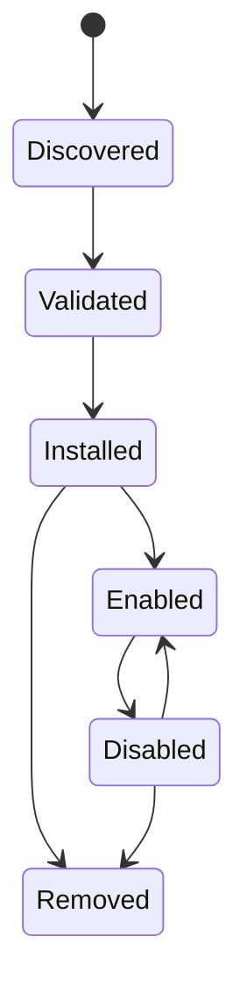

# Intégrations et plugins

## Responsabilité

Les intégrations connectent les comptes utilisateur et les systèmes externes. Les plugins étendent Gnosi par des contributions déclaratives et des comportements exécutables bornés. Les serveurs MCP fournissent des outils aux agents via une frontière de protocole distincte.

La frontière HTTP des intégrations est strictement typée sans modifier les
payloads publics. Les tests de connexion Mail et DAV valident les identifiants
textuels requis avant d'ouvrir des sockets. Les URL DAV peuvent viser des
réseaux privés auto-hébergés comme Nextcloud, mais les adresses loopback,
link-local, multicast, réservées et non spécifiées restent bloquées.

## Persistance de l'intégration

Le gestionnaire d'intégrations stocke la configuration non secrète des comptes et les références aux secrets dans les données locales. Chaque machine reconnecte ses comptes indépendamment. Les API de paramètres affichent l'état des connexions avec secrets masqués, valident la configuration, testent la connectivité, choisissent les valeurs par défaut et déconnectent les fournisseurs sans exposer les jetons bruts.

Les callbacks Google et Microsoft OAuth créent ou mettent à jour des enregistrements de fournisseurs. IMAP, SMTP, CalDAV, Drupal, Notion et adaptateurs similaires normalisent leurs propres paramètres dans le registre d'intégration commun si possible.

Google OAuth conserve les vérificateurs PKCE en attente dans une table d'états
bornée avec expiration et rejette les callbacks sans état valide avant l'échange
de jetons. Les payloads de configuration et de compte sont typés à la frontière
de l'adaptateur. Les dictionnaires d'état et de santé sont validés par Pydantic
avant de retrouver leur mapping historique ; les redirections ont des types
de réponse explicites. `response_model=None` conserve les schémas OpenAPI
octet par octet, et les exceptions de typage restent limitées aux appels non
typés du SDK Google.

L'adaptateur Google People convertit les réponses de découverte en contacts
Gnosi typés, rafraîchit et persiste les jetons via le gestionnaire d'intégrations,
préserve les mises à jour avec ETag et normalise noms principaux, adresses,
organisations, photos et horodatages du fournisseur. Les objets SDK non typés
restent confinés à cet adaptateur, sans franchir ses fonctions de service typées.

Microsoft OAuth applique la même règle d'état borné : les états d'autorisation
générés expirent après dix minutes et sont consommés avant l'échange de jetons.
Le JSON des jetons et profils Graph est typé à la frontière de l'adaptateur de
routes ; le mapping d'état est validé par Pydantic et les redirections sont
explicitement typées. Une configuration obsolète est ainsi bloquée avant les
appels réseau ; la structure historique du compte de courrier est persistée
sans modifier les redirections ou OpenAPI.

Le MCP Notion hébergé utilise l'enregistrement dynamique de clients OAuth 2.1
et PKCE. Sa frontière typée valide les objets de découverte et d'enregistrement,
exige un identifiant client retourné, préserve l'origine du frontend initiateur
et stocke les valeurs d'accès, de rafraîchissement, de client et d'état en attente
uniquement via les opérations d'IntegrationManager qui prennent en charge les
secrets. La déconnexion efface les trois enregistrements OAuth de Notion.

## Responsabilités du backend et compatibilité

Le domaine de configuration gère les 23 opérations HTTP des plugins intégrés
et tiers. `backend/domains/configuration/api/plugins.py` traduit les requêtes
HTTP, `plugin_lifecycle.py` gère l'activation tenant compte des dépendances et
les transitions d'exécution, `plugin_models.py` porte les contrats Pydantic et
`plugin_state.py` est l'unique responsable des verrous du processus et du magasin
d'état normalisé par vault.

Le paquet typé `backend/domains/plugins/` prend en charge la validation des
manifestes, le confinement des chemins d'installation, la préparation et la
restauration des ZIP, l'export déterministe, la normalisation des autorisations
et le sandbox Node en JSON délimité par lignes. Les modules historiques
`backend/services/plugin_system.py` et `plugin_sandbox.py` restent des façades
minces. Ils sont les seuls propriétaires des constantes de compatibilité, du
registre injecté des gestionnaires hôte, du chemin du runner et des points de
substitution tardive ; l'état du cycle de vie et du sandbox n'est pas dupliqué
entre les couches.

L'intégration Notion appartient à `backend/domains/notion`. Ses modules typés
séparent la conversion de l'import REST, la recréation des vues intégrées, les
phases du clone exact, la découverte du workspace, la persistance des fichiers
et du registre au niveau des routes, et la vérification des clones en lecture seule.
`backend/api/notion_routes.py` conserve la traduction HTTP et l'état de
progression du clone. Les trois chemins historiques
`backend/services/notion_{importer,clone,view_recreator}.py` sont des façades de
compatibilité explicites : les imports, variables globales et points de monkeypatch à
résolution tardive restent disponibles, tandis que l'implémentation canonique
réside dans le paquet du domaine. Les préférences d'import Notion exigent la
racine `LOCAL_DATA` configurée ; les dépendances de clonage et de vérification
utilisent directement l'accesseur typé du vault actif facultatif sans reconvertir
son résultat à chaque route. L'ordre, les méthodes, chemins,
payloads, descriptions et le document OpenAPI de Notion restent identiques
octet par octet.

`backend/api/vault_routes.py` reste une façade temporaire de composition pour
les imports historiques. Elle injecte les collaborateurs de chemins, persistance,
runtime, sélection de modèles et verrous de mutation, et réexporte les modèles
et gestionnaires historiques. Les points de chargement, sauvegarde, cycle de
vie, modèle de résumé et verrouillage restent remplaçables dynamiquement pour
les plugins et tests. Certains modules de pages extraits importent encore
dynamiquement cette façade, et les frontières des pages et du registre conservent
des échappatoires de typage. La suppression de ces dépendances historiques reste
inachevée ; un contrôle de typage strict réussi ne prouve pas une séparation
typée complète. L'ordre des routes, les chemins, méthodes, codes d'état, schémas de payloads, identifiants
d'opérations et le contrat OpenAPI généré restent figés durant cette migration.

Le domaine des plugins et le dispatcher partagent un contrat typé de gestionnaire
hôte à deux arguments : arguments bornés et identifiant du plugin appelant.
La façade historique du sandbox conserve son annotation publique introspectable
à un argument pour compatibilité et l'adapte une seule fois au point d'injection
interne. Les tests de contrat figent cette signature. Les RPC du vault importent
à la demande les propriétaires canoniques des pages, du registre et de la
configuration, évitant les cycles et les appels à la façade dynamique.

Le web clipper intégré conserve une logique pure de correspondance des champs.
Les colonnes de destination sont résolues par identifiant immuable, nom actuel
ou alias historique ; un refus explicite reste distinct de la détection
automatique des rôles. Seuls les champs stockés pouvant faire l'objet d'une
saisie sont acceptés. Les valeurs de l'extension sont converties selon le type
du schéma, et les colonnes obsolètes ou dérivées sont écartées avant l'écriture
normale dans le vault.

## Cycle de vie des plugins

Les paquets de plugins déclarent identité, version, compatibilité, permissions,
contributions et informations d'intégrité. L'installation valide les chemins,
la structure du manifeste, les signatures lorsqu'elles sont requises et les
effets déclarés. L'activation réconcilie de manière idempotente les paramètres,
profils IA, compétences ou outils gérés. La désactivation suspend les
contributions gérées en préservant les personnalisations de l'utilisateur.

La composition de configuration du vault utilise directement les types de
retour stricts des services d'état, de cycle de vie et de résumé des plugins.
Elle conserve les points de façade résolus tardivement pour les tests et
extensions, mais ne convertit plus un état déjà typé : les contrats de persistance
et d'actualisation du runtime ont un seul propriétaire. Les transitions des
plugins intégrés ne résolvent pas de chemin de fichiers. La validation d'un
manifeste tiers résout le répertoire de plugins du vault courant à la demande,
uniquement après avoir identifié une cible externe ; la sélection par requête
du vault et les appels isolés de cycle de vie restent déterministes.

Les capacités secondaires intégrées utilisent le même cycle de vie par vault.
Le registre de référence déclare les dépendances, routes, interfaces et
destinations des paramètres. Le schéma version 2 de `.gnosi/plugins.json`
enregistre les listes explicites `enabled_builtin` et `enabled_third_party`
tout en gardant `disabled` pour les anciens clients. La migration depuis un
schéma ancien ou absent est atomique et idempotente : chaque capacité facultative
démarre désactivée, et tous les paramètres, permissions et enregistrements
inconnus compatibles avec les versions futures sont conservés.

Les changements de cycle de vie utilisent le contrat général
`POST /api/vault/plugins/{id}/lifecycle`. Un changement avec des prérequis ou
des dépendants activés renvoie d'abord un conflit structuré ; un administrateur
confirme ensuite l'activation groupée ou la cascade. Les routes désactivées
échouent avant d'exécuter leur implémentation, et les tâches externes planifiées
consultent le même registre. La maintenance centrale, Markdown, les vues
calendrier des bases de données, les champs de contacts, les pièces jointes
médias et les dessins ne dépendent pas de ces plugins.

Les paramètres des plugins gèrent installation, activation, autorisations,
mises à jour et suppression. La configuration des capacités actives apparaît
sous Connexions, Connaissances ou Avancé. L'action de configuration ouvre
directement cette destination ; une capacité sans configuration globale ne
crée pas de page vide.

Le code des plugins s'exécute dans un bac à sable avec un environnement restreint
et un délai d'expiration. Les plugins ne reçoivent ni l'environnement complet
de l'hôte ni un accès arbitraire aux secrets.

L'accès réseau direct reste désactivé dans les deux runtimes de plugins. Une
capacité `network` accordée n'expose que le RPC de l'hôte, qui rejette les
destinations privées et borne méthodes, redirections, durée et taille des
réponses. Les cadres UI conservent `connect-src 'none'` ; le parent appelle la
même frontière du backend après avoir vérifié les permissions déclarées et
accordées du plugin.

Les plugins tiers peuvent déclarer la permission supplémentaire `ui:settings`
et appeler `gnosi.registerSettingsPanel(...)`. Les panneaux actifs et autorisés
apparaissent dans le groupe dynamique Extensions, dans l'iframe à origine opaque
du sandbox existant, et disparaissent dès la désactivation, révocation ou
suppression du plugin. Lire ou écrire la configuration du plugin exige en plus
la permission existante `settings`. L'API hôte reste à la version majeure 2.

Le pont UI est réparti entre un hôte typé, des adaptateurs de méthodes contrôlés
par permissions, la gestion du cycle de vie des cadres et un runtime sandbox
TypeScript autonome. Le runtime n'est sérialisé qu'après compilation ; les
tests exécutent aussi la sortie Vite minifiée pour éviter que des dépendances
de l'hôte capturées ne cassent l'iframe. Les deux côtés vérifient la fenêtre
émettrice, pas seulement le marqueur du message ou l'origine opaque. Les réponses
de cadres retirés ou de générations précédentes du document sont ignorées ;
les mutations ne sont jamais rejouées dans un document de remplacement.

Déplacer une iframe active par insertion DOM ordinaire recharge son document.
L'hôte des paramètres utilise un déplacement préservant l'état lorsqu'il est
disponible, sinon attend le réenregistrement du panneau demandé avant rendu.
Le nettoyage du montage appartient à une seule instance de panneau ; les mises
à jour de l'instantané des contributions ne remontent pas un panneau inchangé.
Les tests couvrent les deux déplacements, les refus de permissions, les réponses
obsolètes et les enregistrements répétés. La QA en navigateur réel doit aussi
vérifier ouverture, fermeture, réouverture et remplacement du plugin contre
une API de test isolée.

## Distribution via le catalogue

L'index officiel des plugins et sa signature détachée sont publiés comme
ressources GitHub Release. L'installation depuis le catalogue distant exige
un index signé de confiance ; chaque paquet exige une intégrité SHA-256 et une
signature Ed25519 détachée de confiance. La provenance installée enregistre
l'URL source, la somme de contrôle et l'éditeur vérifié. L'installation de ZIP
locaux reste disponible pour le développement, mais démarre désactivée et
sans aucune permission accordée.

Le JSON du catalogue, l'état par vault, les autorisations et le magasin local
de confiance sont normalisés à leurs frontières dynamiques avant d'atteindre
les services typés de cycle de vie et de signature. Les champs inconnus prévus
pour la compatibilité future restent intacts ; des mappings de clés malformés
se replient sur une collection vide de clés utilisateur sans remplacer la
confiance intégrée.

Les plugins installés peuvent être exportés en ZIP déterministes. La soumission
publique est une opération d'administrateur envoyée à un intermédiaire de
modération explicitement configuré ; Gnosi n'intègre jamais de jeton d'écriture
GitHub. L'intermédiaire met le paquet en quarantaine et ne le publie qu'après
la CI et une revue humaine.

## Frontière MCP

Les serveurs MCP configurés sont des processus indépendants ou des endpoints
distants. Le démarrage découvre leurs schémas d'outils et les normalise dans
le catalogue de l'agent. Les nouvelles tentatives et le traitement de
`Retry-After` sont bornés. Un serveur en échec est signalé sans supprimer les
outils des serveurs opérationnels.

## Exemples et intégrations complémentaires

Le dépôt comprend des exemples de paquets de plugins, un proxy MCP Drupal,
l'extension de citations LibreOffice et un assistant de citations Word. Ces
clients distincts ont des contrats limités avec le backend ; ils ne partagent
pas automatiquement son système de fichiers ni son accès aux identifiants secrets.

## Invariants

- Les secrets des intégrations restent hors de Git et du vault synchronisé.
- La déconnexion supprime ou révoque de manière cohérente la référence locale aux identifiants et les sélections par défaut.
- Les valeurs gérées par les plugins et celles gérées par l'utilisateur restent distinguables.
- Les chemins d'extraction et de plugin d'archives ne peuvent pas échapper à leur racine d'installation.
- La compatibilité et la validation des autorisations se produisent avant l'activation.
- Les index officiels et les paquets distants sont refusés si les métadonnées d'intégrité manquent.
- Les sockets directs des plugins et les connexions du navigateur ne contournent jamais le RPC hôte.
- Une capacité désactivée ne peut pas démarrer une nouvelle route, synchronisation, automatisation ou effet externe.
- Désactiver ou migrer ne supprime jamais les données, paramètres, identifiants ou profils du plugin.
- L'origine et l'effet de l'outil MCP restent visibles après la normalisation du catalogue.

## Aspects de vérification

Exécutez les tests de manifestes, signatures, sandbox, concurrence de l'état,
contributions IA, routage MCP, nouvelles tentatives et connecteurs. Un test
d'intégration réel utilise un compte dédié et ne doit pas modifier
involontairement des données de production.
