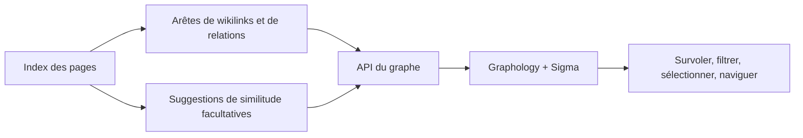

# Graphe de connaissances

## Responsabilité

`backend/domains/graph/` gère l'analyse, les nœuds, les arêtes, la projection,
les adaptateurs et l'orchestration. `graph_service.py` est la façade stable
utilisée par l'API, l'agent et le planificateur.

Le graphe projette les relations explicites entre connaissances et les suggestions sémantiques facultatives dans un réseau interactif. Il permet la navigation et la découverte ; il est dérivé du vault et ne constitue pas une source de vérité distincte.

La feature strictement typée `features/graph/` gère l'état des routes, les filtres et la
composition des pages via une entrée publique à chargement différé.
Les panneaux et modèles internes restent privés. `shared/graph/` gère le
renderer, la minicarte, la géométrie, le clavier, les arêtes et la couche
sémantique réutilisables. Les routes de graphes et les graphes intégrés au Vault
importent directement le même renderer, sans agrégateur chargé au démarrage.
Le déplacement révisé place les filtres de graphes réutilisables dans
`shared/graph/filtering/` et les filtres du Vault dans `shared/filtering/`.
Le code partagé ne dépend ni des features ni d'app, même par des imports de
types. Projections, configuration, navigation, contrôles de caméra et styles
restent inchangés ; le déplacement exige une vérification d'intégration.

## Construction du graphe

Les nœuds proviennent des pages indexées. Les arêtes proviennent des wikilinks, relations, étiquettes ou autres métadonnées configurées, ainsi que des résultats facultatifs de similarité. Les lectures du service de graphe privilégient les métadonnées de l'index et protègent l'accès direct aux fichiers : un répertoire indisponible produit ainsi un graphe partiel plutôt qu'un échec total.

Les cibles wikilink non résolues restent représentables comme des nœuds distincts. Elles ne sont pas silencieusement rejetées ou fusionnées par l'étiquette d'affichage, car cela dissimulerait des relations de connaissance rompues.

## Couche sémantique

Les suggestions sémantiques comparent les représentations des documents et produisent des candidats avec un score. Elles forment une couche supplémentaire : accepter ou matérialiser une relation exige un flux explicite d'écriture du contenu. L'indisponibilité du modèle désactive cette couche sans modifier le graphe explicite.

## Rendu du frontend

`GraphViewer` transmet les données du graphe à Graphology et Sigma. Les réglages de disposition contrôlent la simulation de forces, la répulsion, l'attraction, la gravité, l'évitement des collisions, les seuils d'affichage des libellés, l'épaisseur des arêtes, les couleurs des groupes et le placement des nœuds isolés.

La mise en évidence au survol est volontairement limitée aux voisins à un saut. L'étendre à plusieurs sauts rend les graphes denses illisibles et masque le voisinage sélectionné. Les nœuds isolés disposent d'un espacement suffisant et d'une position stable pour rester visibles.

## Invariants

- L'identité du noeud utilise une identité de page stable, pas un titre seul.
- Les étiquettes d'affichage peuvent entrer en collision; les identifiants ne peuvent pas.
- Les arêtes sémantiques dérivées se distinguent des relations explicites.
- L'état de mise en page ne peut pas modifier le contenu de Vault.
- Les scans partiels sont étiquetés et ne sont pas mis en cache comme complets.
- Les erreurs `EDEADLK` et `EAGAIN` au niveau des répertoires sont isolées.

## Aspects de vérification

Testez les nœuds non résolus et isolés, la cohérence de la légende des groupes, le repli du frontmatter, les seuils de suggestions sémantiques, les erreurs des répertoires cloud, le survol limité à un saut et la navigation du graphe vers la bonne page.
