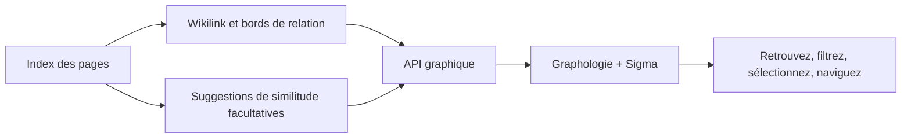

# Graphique des connaissances

## Responsabilité

`backend/domains/graph/` gère l'analyse, les nœuds, les arêtes, la projection,
les adaptateurs et l'orchestration. `graph_service.py` est la façade stable
utilisée par l'API, l'agent et le planificateur.

Le graphique projette des relations explicites de connaissances et des suggestions sémantiques optionnelles en réseau interactif. Il supporte la navigation et la découverte; il est dérivé de la Vault et n'est pas une source distincte de vérité.

La feature typée `features/graph/` gère l'état des routes, les filtres et la
composition des pages via une entrée publique à chargement différé.
Les panneaux et modèles internes restent privés. `shared/graph/` gère le
renderer, la minicarte, la géométrie, le clavier, les arêtes et la couche
sémantique réutilisables. Les routes de graphes et les graphes intégrés au Vault
importent directement le même renderer, sans agrégateur chargé au démarrage.
Le déplacement révisé place les filtres de graphes réutilisables dans
`shared/graph/filtering/` et les filtres du Vault dans `shared/filtering/`.
Le code partagé ne dépend ni des features ni d'app, même par des imports de
types. Projections, configuration, navigation, contrôles de caméra et styles
restent inchangés ; le déplacement exige une vérification d'intégration.

## Construction graphique

Les noeuds proviennent de pages indexées. Les bords proviennent de wikilinks, de relations, de balises ou d'autres métadonnées configurées, et des résultats de similarité optionnels. Le service graphique se lit comme suit : préfèrez les métadonnées index et gardez l'accès direct aux fichiers, de sorte qu'un répertoire non disponible produit un graphique partiel au lieu d'un échec total.

Les cibles wikilink non résolues restent représentables comme des nœuds distincts. Elles ne sont pas silencieusement rejetées ou fusionnées par l'étiquette d'affichage, car cela dissimulerait des relations de connaissance rompues.

## Survêtement sémantique

Les suggestions sémantiques permettent de comparer les représentations des documents et de produire des candidats notés. Les suggestions sont une superposition : accepter ou matérialiser une relation doit utiliser un flux explicite de composition de contenu. L'indisponibilité du modèle désactive la superposition sans modifier le graphique explicite.

## Rendu frontal

`GraphViewer` Simplifier la force de contrôle des réglages de configuration, la répulsion, l'attraction, la gravité, l'évitement de collision, les seuils d'étiquette, l'épaisseur des bords, les couleurs des clusters et le placement des noeuds isolés.

L'accent mis sur le hop est limité intentionnellement à un hop. L'accent mis sur le hop multi rend les graphiques denses illisibles et obscurcit le quartier sélectionné. Les noeuds isolés reçoivent suffisamment de rembourrage et de positionnement stable pour rester visibles.

## Invariants

- L'identité du noeud utilise une identité de page stable, pas un titre seul.
- Les étiquettes d'affichage peuvent entrer en collision; les identifiants ne peuvent pas.
- Les bords sémantiques dérivés sont distinguables des relations explicites.
- L'état de mise en page ne peut pas modifier le contenu de Vault.
- Les scans partiels sont étiquetés et ne sont pas mis en cache comme complets.
- Niveau des répertoires `EDEADLK` et `EAGAIN` les échecs sont isolés.

## Aspects de vérification

Testez les noeuds non résolus, les noeuds isolés, la cohérence de la légende du cluster, le repli de la matière avant, les seuils de suggestion sémantique, les échecs des répertoires nuageux, le comportement de hover à un seul coup et la navigation graphique retour à la bonne page.
