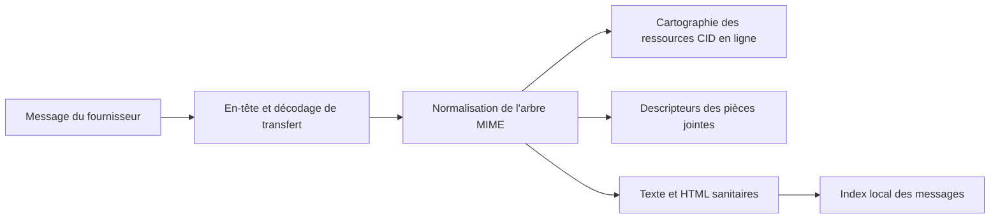

# Courrier

## Responsabilité

Le courrier intègre les comptes IMAP/SMTP, l'indexation locale des messages, les dossiers, la recherche, les balises, les vues enregistrées, les brouillons, les pièces jointes, les réponses, la recherche de contact, la rédaction d'IA et l'extraction d'entités.

## Synchronisation

Les intégrations de comptes décrivent les références protocole et OAuth/crédentiel. Une synchronisation complète ou incrémentale lit les messages du fournisseur, normalise les identifiants et le contenu MIME et écrit des lignes d'index locales. Les travailleurs d'IMAP IDLE détiennent une connexion par compte éligible et déclenchent un rafraîchissement incrémental lorsque le serveur annonce des changements.

Les adaptateurs Google et Microsoft exposent les mêmes frontières typées pour
les messages, pièces jointes, brouillons, libellés et envois. Les payloads
dynamiques des SDK sont validés dans chaque adaptateur ; les seules exceptions
locales concernent les appels tiers exacts sans stubs, jamais l'API Gnosi.

L'ingestion par lots utilise des savepoints afin qu'un message malformé ne puisse pas retourner les messages précédents. L'identité du message et du thread doit rester stable sur les synchronisations répétées. Les noms de dossiers sont des valeurs de fournisseur; l'interface utilisateur traduit les dossiers sémantiques connus sans modifier les valeurs de comparaison persistantes.

## MIME et sécurité du contenu

HTML est sainisé avant le rendu. Les images CID sont résolues contre la partie MIME correcte et préservées lorsque le contenu cité est inclus dans les réponses. Les images et pièces jointes à distance restent des ressources explicites plutôt que l'accès HTML arbitraire aux chemins locaux.

La frontière des images inline utilise des descripteurs MIME typés et une racine
`Message` commune aux arbres texte, related et mixed. Elle n'accepte que les
payloads décodés en octets, normalise les types de contenu optionnels et conserve
les URL des assets sans Vault actif ou fichier matérialisé.

## Composer et envoyer

L'éditeur de blocs crée une représentation préliminaire qui est convertie en HTML et texte sécurisés par courrier. L'identité de l'expéditeur, les destinataires, les en-têtes de réponse, les citations, les pièces jointes et le compte du fournisseur sont validés côté serveur.

## État relationnel local

La base de données de courriel stocke les messages, les balises, les associations de balises de message et les vues enregistrées. Les vues enregistrées contiennent des champs visibles, des filtres dactylographiés, de la logique, du regroupement, du tri et des actions disponibles comme JSON dans les lignes SQLite.

## Invariants

- Sync est idempotent pour un identifiant de message du fournisseur.
- Un message échoué utilise un point d'enregistrement et n'interrompt pas le lot de compte.
- Les étiquettes et les vues enregistrées sont l'état d'application locale, pas les étiquettes du fournisseur à moins que
une cartographie explicite existe.
- Répondre en-têtes conservent l'identité du thread.
- Les références CID indiquent la partie correcte en ligne après avoir cité ou envoyé.
- La suppression ou le transfert d'un message du fournisseur nécessite le compte authentifié et
une cible de dossier/message validée.
- Les valeurs secrètes ne saisissent jamais les lignes de message ou les réponses de configuration frontale.

## Aspects de vérification

Test de décodage MIME, désinfectation HTML, rendu et réponses CID, points d'enregistrement d'ingestion, balises, filtres de vue, brouillons, résolution d'identité, et un véritable ou un fournisseur de brouillage envoyer. Playwright vérifie le comportement de la colle, compose et cite la réponse.
