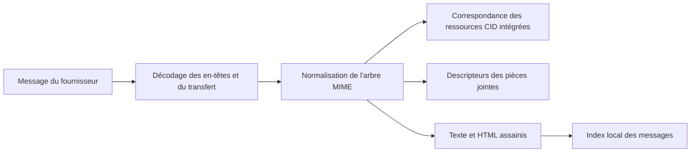

# Courrier

## Responsabilité

Le courrier intègre les comptes IMAP/SMTP, l'indexation locale des messages, les dossiers, la recherche, les étiquettes, les vues enregistrées, les brouillons, les pièces jointes, les réponses, la recherche de contacts, la rédaction assistée par IA et l'extraction d'entités. Les identifiants des fournisseurs restent locaux à chaque machine.

Le domaine strictement typé `frontend/src/features/mail/` gère la composition
de la page de courrier, les composants, les hooks d'étiquettes et de vues
enregistrées, ainsi que leurs tests. Les routes utilisent son entrée publique
à chargement différé sans charger immédiatement la boîte ou le compositeur.
Les adaptateurs HTTP partagés conservent les contrats API existants. L'éditeur
de courrier BlockNote et son adaptateur appartiennent à ce domaine. Les paramètres
utilisent l'éditeur via son entrée publique explicitement révisée ; il n'y a
ni copies d'implémentation ni façades de compatibilité. Le déplacement ne change ni
l'envoi, ni les brouillons, ni l'identité des dossiers, ni la confidentialité,
ni les opérations des fournisseurs.

## Synchronisation

Les intégrations de comptes décrivent le protocole et les références OAuth ou d'identifiants secrets. Une synchronisation complète ou incrémentale lit les messages du fournisseur, normalise les identifiants et le contenu MIME, puis écrit les lignes de l'index local. Les workers IMAP IDLE maintiennent une connexion par compte admissible et déclenchent une actualisation incrémentale lorsque le serveur annonce des changements.

Les adaptateurs Google et Microsoft exposent les mêmes frontières typées pour
les messages, pièces jointes, brouillons, libellés et envois. Les payloads
dynamiques des SDK sont validés dans chaque adaptateur ; les seules exceptions
locales concernent les appels précis de découverte des bibliothèques tierces
non typées, jamais l'API de service consommée par Gnosi.
Le rafraîchissement OAuth n'accepte qu'un jeton concret non vide avant de le
persister. Le constructeur d'identifiants et l'appel de rafraîchissement Google
non typés sont isolés et documentés dans cet adaptateur ; IMAP et SMTP reçoivent
les types de connexion de la bibliothèque standard à la frontière XOAUTH2.

L'ingestion par lots utilise des points de sauvegarde transactionnels pour qu'un
message malformé n'annule pas les précédents. L'identité des messages et des fils
doit rester stable lors des synchronisations répétées. Les métadonnées d'interface
de chaque fil sont persistées dans un objet JSON validé sous la frontière locale
des secrets et données. Les lectures-modifications-écritures partagent un verrou
afin que des onglets concurrents ne perdent pas leurs champs respectifs. Les
racines ou entrées de fils malformées sont refusées sans affecter les données
valides. Les noms de dossiers sont des valeurs du fournisseur ; l'interface
traduit les dossiers sémantiques connus sans modifier les valeurs persistées
utilisées pour les comparaisons.

L'exporteur historique de Gmail vers le vault précise les types des payloads
de découverte à sa frontière de service, exige un répertoire Mail configuré
avant tout accès aux fichiers et déduplique par identifiant de message du
fournisseur. Le texte multipart, le HTML, les catégories, les libellés et la
présence de pièces jointes conservent leur représentation Markdown/frontmatter
historique. Un vault absent provoque un refus sans création de fichiers ailleurs.
Chaque note synchronisée conserve `database_table_id: mail`, et le frontmatter
est sérialisé par `yaml.dump` plutôt que par un échappement manuel de chaînes.

## MIME et sécurité du contenu

Le HTML est assaini avant rendu. Les images CID intégrées sont résolues vers la bonne partie MIME et préservées lorsque du contenu cité est inclus dans les réponses. Les images distantes et pièces jointes restent des ressources explicites, sans donner au HTML un accès arbitraire aux chemins locaux.

La frontière des images inline utilise des descripteurs MIME typés et une racine
`Message` commune aux arbres texte, related et mixed. Elle n'accepte que les
payloads décodés en octets, normalise les types de contenu optionnels et conserve
les URL des assets sans Vault actif ou fichier matérialisé.
Les mêmes contrats `MimeAsset` et `InlineImage` circulent sans changement dans
les expéditeurs Gmail, Microsoft Graph et SMTP. Les ressources citées deviennent
des images intégrées en renseignant explicitement tous les champs requis et
en générant un nouveau Content-ID.

## Composer et envoyer

L'éditeur de blocs crée un brouillon converti en HTML et texte adaptés au courrier. L'identité de l'expéditeur, les destinataires, les en-têtes de réponse, les citations, les pièces jointes et le compte du fournisseur sont validés côté serveur. Enregistrer un brouillon et envoyer sont des effets distincts ; l'envoi franchit une frontière externe et renvoie les diagnostics du fournisseur en cas d'échec.

## État relationnel local

La base de courrier stocke les messages, étiquettes, associations entre messages
et étiquettes, et vues enregistrées. Les vues contiennent les champs visibles,
filtres typés, logique, regroupements, tris et actions disponibles sous forme
JSON dans les lignes SQLite. Les schémas de création et de mise à jour partielle
restent des contrats Pydantic distincts : une mise à jour peut omettre le nom
sans affaiblir cette exigence à la création. Leurs structures HTTP et OpenAPI
restent compatibles avec les clients 2.x.

## Invariants

- La synchronisation est idempotente pour un identifiant de message du fournisseur.
- Un message en échec utilise un point de sauvegarde transactionnel et n'interrompt pas le lot du compte.
- Les étiquettes et vues enregistrées sont un état applicatif local, pas des libellés du fournisseur sauf correspondance explicite.
- Les en-têtes de réponse préservent l'identité du fil.
- Les références CID désignent la bonne partie intégrée après citation ou transfert.
- Supprimer ou déplacer un message chez le fournisseur exige le compte authentifié et une cible de dossier ou de message validée.
- Les secrets ne figurent jamais dans les lignes de messages ou les réponses de configuration du frontend.

## Aspects de vérification

Testez le décodage MIME, l'assainissement HTML, le rendu et les réponses CID,
les points de sauvegarde de l'ingestion, les étiquettes, les filtres des vues,
les brouillons, la résolution d'identité et un envoi via un fournisseur réel
ou simulé. Playwright vérifie le collage, la composition et les réponses citées.
