# Carnets fondés sur les sources

## Responsabilité

`backend/domains/notebooks/` gère désormais le dépôt, le catalogue, les sources,
l'ingestion, les preuves, l'analyse, le chat et l'état. Le service historique
reste une façade compatible pour l'API et les workers existants.

Les carnets fondés sur les sources fournissent un espace `/notebooks` dédié aux
questions portant sur les pièces jointes et les URL des enregistrements
sélectionnés dans la table Références configurée. Ils réunissent une bibliothèque
de carnets interrogeable, un panneau de sources paginé, les paramètres et le même
transport de conversation en streaming que l'assistant flottant.

Le corps, le titre, les étiquettes et les autres métadonnées de l'enregistrement
ne constituent pas des preuves. Gnosi ne lit les métadonnées que pour localiser
les champs définis par le schéma comme pièce jointe/fichier ou URL. Un carnet ne
modifie ni ne supprime jamais l'enregistrement source, la pièce jointe ou l'URL
d'origine.

La première version ne comprend ni résumés audio, ni Studio, ni notes générées,
ni édition des sources.

## Acteurs et accès

| Acteur | Carnet privé | Carnet d'espace de travail |
| --- | --- | --- |
| Créateur | Découvrir, lire, converser, gérer les sources et les paramètres | Découvrir, lire, converser, gérer les sources et les paramètres |
| Éditeur de l'espace de travail | Non visible | Découvrir, lire et converser |
| Lecteur de l'espace de travail | Non visible | Découvrir et lire la conversation et les sources |

Chaque requête est également limitée au Vault et à l'espace de travail actifs.
L'accès privé ne s'étend pas implicitement aux administrateurs ayant un autre
principal utilisateur. Seul le créateur peut modifier les membres, les
paramètres ou supprimer le carnet.

## Source et flux de révision

```mermaid
flowchart LR
    Selection["Table Références configurée\nidentifiants sélectionnés"] --> Fields["Champs pièce jointe et URL\nuniquement"]
    Fields --> Fingerprint["Empreintes de l'enregistrement\net des sources"]
    Fingerprint --> Queue["Tâche durable\nd'ingestion"]
    Queue --> Extract["Extracteurs sécurisés\nexistants"]
    Extract --> Draft["Révision SQLite\ninactive"]
    Draft --> Index["FTS5 et vecteurs locaux\ndéterministes"]
    Index --> Switch["Activation atomique\nde la révision"]
    Switch --> Tools["Outils du carnet\nen lecture seule"]
    Tools --> Chat["Réponse fondée\navec citations"]
```

La création d'un carnet mémorise l'identité de la table Références active à ce
moment-là. Les créations et ajouts de sources ultérieurs utilisent la table
actuellement configurée, tandis qu'un carnet existant reste lié à sa table
d'origine.

L'ouverture d'un carnet, une question fondée sur celui-ci ou un rafraîchissement
manuel compare les valeurs actuelles des sources à la révision active. La file
durable fusionne les déclencheurs répétés. Les sources inchangées réutilisent
leurs fragments; seules les sources modifiées sont extraites à nouveau. Une
révision incomplète n'est jamais rendue visible. Après la première révision
réussie, la conversation continue d'utiliser la dernière révision complète
pendant le rafraîchissement.

Les sources URL ne sont revalidées qu'après
`GNOSI_NOTEBOOK_URL_REFRESH_TTL_SECONDS` (six heures par défaut). Gnosi envoie
les validateurs ETag et Last-Modified enregistrés via le même téléchargeur
protégé contre le SSRF et validant les redirections. Si le serveur ne fournit
pas de validateurs, un hachage borné du contenu est comparé. Une vérification
sans changement est enregistrée, mais n'active pas de nouvelle révision de
preuves.

YouTube, Vimeo et les autres adaptateurs de streaming compatibles effectuent
une vérification des métadonnées sans télécharger le contenu. Gnosi compare une
empreinte déterministe de l'identité, de la durée, des horodatages, de l'état
en direct et de la taille; le média n'est téléchargé et transcrit à nouveau que
si elle change. Une nouvelle tentative par Ressource force uniquement la cible
et copie les autres preuves depuis la révision active.

Retirer une Ressource supprime immédiatement son appartenance au carnet. La
recherche et l'analyse globale vérifient l'ensemble actuel des membres; les
preuves retirées sont donc exclues avant même qu'une nouvelle révision soit prête.

## Persistance et reprise

L'état des carnets est local à l'instance dans
`LOCAL_DATA/system/notebooks.sqlite3`. Le dépôt contient les définitions, les
ACL, l'appartenance des Ressources, les révisions, les sources, les fragments,
les lignes FTS5, les analyses durables et les principaux de conversation de
chaque mode. Les lignes sont isolées par un hachage du chemin du Vault et par
l'identifiant de l'espace de travail.

Le worker durable enregistre les handlers `notebook_ingest` et
`notebook_analysis`. Les tâches en attente ou dont le bail a expiré reprennent
après le redémarrage du processus. L'activation d'une révision est
transactionnelle. Si le rafraîchissement d'une source déjà indexée échoue, sa
dernière version valide reste disponible avec l'état `stale`; une nouvelle
source en échec est signalée et exclue.

Le nettoyage conserve la révision active, les trois dernières révisions
complètes et les vingt derniers résultats d'audit par défaut, toutes les
révisions épinglées par une conversation et celles utilisées par les analyses
durables. Les révisions antérieures à cette politique sont protégées de façon
conservatrice. Les limites se règlent avec
`GNOSI_NOTEBOOK_COMPLETED_REVISION_RETENTION` et
`GNOSI_NOTEBOOK_AUDIT_REVISION_RETENTION`.

Les pièces jointes réutilisent la matérialisation, le préchargement OneDrive, le
confinement des chemins, les limites de taille et les extracteurs de documents,
d'OCR et de médias existants. La récupération web conserve la protection SSRF,
valide chaque redirection et traite le contenu des pages comme des données non
fiables, jamais comme des instructions pour le modèle.

## Récupération, analyse et citations

La barre de contexte permet de choisir des pièces jointes ou URL précises dans
le carnet actuel et d'ajouter d'autres carnets accessibles. Un carnet ajouté
apporte toutes ses sources disponibles, tandis que le carnet actuel reste
propriétaire de l'historique partagé ou privé.

Chaque tour épingle côté serveur une révision positive et complète de chaque
carnet sélectionné. Les identifiants de source sont validés par rapport à la
révision immuable, l'appartenance actuelle, l'état, le Vault, l'espace de travail
et l'ACL. Cette limite s'applique à l'inspection, la recherche, la lecture des
preuves et l'analyse durable. Le workflow du carnet n'expose que les opérations
contextuelles suivantes :

- inspecter des métadonnées de source bornées;
- rechercher des fragments avec FTS5 et le vecteur local déterministe existant;
- lire une preuve exacte à partir d'un identifiant de fragment stable;
- lancer, inspecter et lire une analyse hiérarchique durable sur la révision
  épinglée.

Les questions dépendantes des sources doivent effectuer une véritable recherche
dans le carnet avant que le modèle puisse synthétiser une réponse. Le workflow
ne reçoit aucun outil de mutation du Vault ou des compétences, aucun MCP et
aucune action externe. L'analyse hiérarchique traite des lots de preuves bornés,
puis réduit leurs résumés au lieu de placer des centaines de sources dans un
seul prompt.

Les citations incluent la Ressource, la révision, la source, le fragment et le
localisateur. Chaque affirmation étayée du chat relie son `chunk_id`, validé par
le serveur, à un lien visible. Les pièces jointes utilisent `gnosi-cite` et
l'endpoint autorisé de la révision épinglée afin d'ouvrir la pièce jointe, la
page ou le fragment exacts même après une actualisation ultérieure. Les anciens
liens de pièces jointes sont mis à niveau lors de leur lecture afin
que les carnets existants ne nécessitent pas de réindexation. Les preuves web
renvoient vers l'URL d'origine validée.

## Espaces de noms de conversation

Le mode privé par membre dérive un principal de checkpoint par utilisateur. Le
mode partagé dérive un principal autorisé commun au carnet et sérialise les
tours concurrents avec le verrou de thread existant. Les messages partagés
incluent leur auteur et l'historique est append-only; seul le créateur peut le
vider. Un changement de mode ne fusionne pas les historiques : revenir à un
mode précédent restaure son espace de noms.

La suppression d'un carnet énumère tous ses principaux dérivés et supprime leurs
threads de checkpoint avant la suppression en cascade des index, révisions et
analyses. Les données originales du Vault restent hors de cette limite.

## Contrats HTTP

| Point final | Objet |
| --- | --- |
| `GET/POST /api/notebooks` | Bibliothèque paginée et création à partir d'identifiants de Ressources |
| `GET/PATCH/DELETE /api/notebooks/{id}` | Détail, paramètres et suppression des données dérivées |
| `GET /api/notebooks/resources` | Sélecteur paginé alphabétique avec facettes de type, auteur et étiquettes de la table Références configurée |
| `GET/POST /api/notebooks/{id}/sources` | Inspecter ou ajouter des Ressources |
| `GET /api/notebooks/{id}/chat-sources` | Choix autorisés de sources et de carnets pour le contexte de conversation |
| `DELETE /api/notebooks/{id}/sources/{resource_id}` | Exclure immédiatement une ressource |
| `POST /api/notebooks/{id}/sources/{resource_id}/refresh` | Réessayer uniquement une Ressource |
| `POST /api/notebooks/{id}/refresh` | Rafraîchissement explicite fusionné du carnet |
| `POST /api/notebooks/{id}/refresh/cancel` | Annuler coopérativement l'ingestion active |
| `GET /api/notebooks/{id}/evidence/{chunk_id}?revision={revision}` | Résoudre une citation autorisée dans sa révision immuable |
| `GET /api/notebooks/{id}/conversation` | Conversation canonique du mode actif |
| `POST /api/chat` | Conversation en streaming avec un contexte de carnet autorisé |

La conversation fondée sur un carnet ignore toute tentative du client de choisir
la révision, le principal de checkpoint ou l'espace de noms de session. Le
serveur dérive les trois après autorisation. Il accepte jusqu'à seize carnets
autorisés, conserve le carnet de la page comme propriétaire de la conversation
et rejette les contextes autres que des carnets, les pièces jointes, les
mentions et les surcharges de compétences.

## Comportement de l'interface utilisateur

L'action de sélection multiple n'apparaît que si l'identité de la table ouverte
correspond à celle de la table Références configurée. Elle n'est jamais activée
par un nom ou un identifiant fixe. La boîte de dialogue accepte un titre, une
visibilité, un mode de conversation et jusqu'à mille identifiants de Ressources.
Les sélecteurs de création et d'ajout trient tout le catalogue par ordre
alphabétique avant pagination et proposent des filtres de type, d'auteur et
d'étiquettes dérivés du schéma. Ces métadonnées servent uniquement à la
sélection et n'entrent jamais dans les preuves. Les pages marquées comme
modèles de table sont exclues du sélecteur, de la validation des requêtes et
des instantanés d'ingestion.

Les enregistrements sans pièce jointe ni URL HTTP publique sont également
exclus; le sélecteur indique combien ont été omis au lieu de proposer un choix
inutilisable.

Sur ordinateur, les sources, la conversation intégrée et les paramètres sont
affichés ensemble. Sur mobile, ces panneaux deviennent des onglets. L'interface
ne sonde que le carnet actif et visible : un intervalle court suit l'ingestion
tant qu'une tâche est active, et un intervalle borné actualise la conversation
collaborative. Les carnets inactifs ne sont pas interrogés.

La progression indique la Ressource en cours et permet au créateur d'annuler
l'indexation. Chaque Ressource affiche la dernière vérification et la raison
bornée de l'erreur; les sources en échec affichent aussi leur propre raison. La
nouvelle tentative individuelle est désactivée lorsqu'une autre révision est
active.

Les lecteurs de l'espace de travail voient la conversation canonique dans un
chat clairement en lecture seule, sans zone de saisie ni actions de nouvelle
tentative, de modification ou de retour en arrière. Seuls les éditeurs peuvent
envoyer un tour, et seul le créateur voit le rafraîchissement manuel et les
autres contrôles de gestion.

## Comportement et opérations en cas de défaillance

La première conversation reste bloquée jusqu'à ce qu'une révision active
complète contienne au moins une source. Les états par Ressource et par source
sont `pending`, `indexing`, `available`, `stale` et `error`; le rafraîchissement
manuel permet une nouvelle tentative. Une erreur ne remplace jamais une
révision active complète.

L'annulation est coopérative et durable : le worker vérifie l'état avant chaque
Ressource et avant l'activation atomique. La transaction en cours est annulée
et la dernière révision complète reste disponible; si la première ingestion
est annulée, la conversation reste bloquée jusqu'à la réussite d'un nouveau
rafraîchissement.

Les opérateurs peuvent inspecter le dépôt SQLite et la file de tâches durable
sous `LOCAL_DATA`, mais ne doivent jamais les déplacer dans un Vault partagé.
Le code backend se recharge en développement natif; les changements de
dépendances exigent toujours un redémarrage du LaunchAgent backend. Les mêmes
chemins dérivés de la configuration fonctionnent en déploiement natif et Docker.

## Limites de vérification

Les tests unitaires prouvent l'exclusion des champs non sources, la réutilisation
incrémentale, le retrait immédiat des membres, l'identité des citations,
l'isolation des ACL, les espaces de noms de checkpoint, la validation positive
des révisions, les outils en lecture seule et l'analyse durable épinglée. Ils
couvrent également PDF, URL, OCR, grands fragments, reprise des baux expirés,
validation web conditionnelle et ingestion réelle de 300 Ressources. Vitest et
Playwright vérifient les permissions en lecture seule, l'exclusion des
Ressources vides, la conversation fondée, une citation navigable et le
rafraîchissement automatique. La validation de livraison exige aussi un
démarrage backend propre, le build frontend et un parcours navigateur sur
ordinateur et mobile.

Les limites actuelles sont de mille Ressources par requête de création ou
d'ajout, deux cents lignes de sélection par page, cinquante résultats de
recherche et des lots d'analyse bornés. La configuration des carnets et les
index dérivés restent locaux à une instance Gnosi et ne sont pas synchronisés
entre installations.
