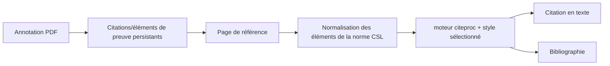

# Lecteur, références et citations

Les routes, le stockage, l'analyse et les sources du Reader résident désormais
dans `backend/domains/reader/`; les dépôts, la recherche, la synchronisation et
le stockage bibliographique dans `backend/domains/literature/`. Les anciens
modules restent des façades compatibles.

## Responsabilité

Ce domaine combine lecture de flux/bulletins avec un gestionnaire de référence compatible avec Zotero, rendu de citations CSL, identificateur et importation web, lecture PDF/EPUB, et annotations qui peuvent devenir des preuves de citation.

## Ingestion de référence

Crossref, Open Library, arXiv, PubMed et les métadonnées HTML possèdent des
normalisateurs typés distincts dans
`backend/domains/vault/citations/normalizers/`. Ils préservent les payloads
Zotero canoniques et le comportement de fonction pure, tandis que
`backend/services/lookup_normalizers.py` reste la façade compatible.

Les références entrent par DOI, ISBN, arXiv, PMID, BibTeX, RIS, fichiers ou URLs web. Les résolveurs d'identification et le serveur de traduction Zotero produisent des métadonnées spécifiques au fournisseur. Les normalisateurs les mapent dans le schéma de référence configuré, génèrent une clé de citation stable, dédouplient les candidats et écrivent un enregistrement de Vault.

`backend/services/references_io.py` est la frontière typée et déterministe de
BibTeX/RIS. Ses petits assistants d'analyse, de normalisation, de mappage des
champs et de sérialisation préservent l'ordre, l'échappement, la résolution du
type et le contrat public d'import/export, sans persistance ni réseau cachés.

L'orchestration de recherche, strictement en lecture seule, réside dans le domaine
des citations, conserve la priorité DOI → arXiv → PMID → ISBN → URL et fait passer
les URL utilisateur par le téléchargeur protégé contre les SSRF avant toute suggestion.
La table Ressources désignée provient d'une configuration canonique unique ; seuls
les anciens vaults jamais configurés peuvent adopter automatiquement la première
table dotée d'une Citation Key, sous le même verrou que les réglages.

Le serveur de traduction est un sidecar optionnel. L'opération native peut fonctionner sans lui; les résolveurs spécifiques à l'identifiant et les références existantes continuent de fonctionner. Les erreurs de traduction Web retournent des erreurs résiliables plutôt qu'un enregistrement vidé réussi.

`citations/pdf_fallback.py` dérive une référence citable des métadonnées PDF
lorsque la résolution échoue. `citations/web_capture.py` sélectionne et mappe les
résultats Zotero, tandis que `platform/translation_server.py` gère le transport HTTP.

## Découverte académique fédérée

`/literature` exécute chaque connecteur sélectionné indépendamment afin qu'une
erreur de quota ou de fournisseur ne supprime pas les résultats déjà obtenus.
`backend/domains/literature/connectors/` possède le transport HTTPS borné,
l'audit des requêtes, la normalisation canonique, OAI-PMH et JSON personnalisé,
les graphes de citations et les adaptateurs par famille de fournisseurs.
`backend/services/academic_connectors.py` reste uniquement une façade de
compatibilité. Le port typé résout ses collaborateurs à chaque appel afin que
les tests et intégrations puissent remplacer le transport, la validation, les
parseurs et le dispatch sans dupliquer l'état mutable.

## Parcours de citation

Les valeurs CSL sont dérivées de la matière avant de référence à l'aide de cartes explicites de champs. Listes de noms, dates, types d'éléments, échappés BibTeX/LaTeX, et Zotero `extra` Les métadonnées nécessitent une normalisation. Le schéma épinglé protège les types d'éléments et les champs compatibles de la dérive en amont.

`backend/domains/vault/citations/exporting.py` gère le nettoyage Markdown, le
sous-ensemble de citations, les marqueurs de bibliographie, l'exécution de
Pandoc et l'empaquetage du téléchargement. La route de compatibilité conserve
sa signature publique et injecte les ports de fichiers, CSL et processus.

## Lecteur et annotations

Le lecteur Zotero groupé affiche le contenu PDF et EPUB. Gnosi possède le pont qui localise les fichiers, sert des plages d'octets sécurisées, reçoit des annotations et relie les éléments d'information sélectionnés aux enregistrements de Vault. Les lignes d'annotation incluent l'URI source, la page, le type, la géométrie, le texte, le commentaire, les balises, la clé gérée stable et les horloges.

Les endpoints des fichiers valident le confinement et manipulent l'hydratation du nuage. Les identificateurs d'annotation persistants empêchent une soumission générée de doubler chaque fois qu'un document est rouvert.

## Flux d'information et bulletins d'information

Les modèles de lecteur stockent les sources, les articles, l'état de lecture, le contenu complet extrait et un compte de newsletter. L'ingestion de flux utilise des points de sauvegarde de transaction afin qu'une entrée malformée ne puisse pas faire reculer l'ensemble du lot.

## Invariants

- Les clés de citation restent stables à moins que l'utilisateur ne modifie explicitement les données d'identité.
- L'importation est dédoublée par des identifiants faisant autorité et des métadonnées normalisées.
- Les chemins de fichiers lecteurs ne peuvent pas échapper aux racines autorisées.
- L'identité de document et la géométrie de page d'une annotation survivent à des redémarrages.
- Les internaux de lecteurs vendus sont traités comme code amont; intégration locale
les modifications sont explicites et reproductibles.
- Les mots de passe de la configuration de newsletters anciennes sont traités comme des secrets même
quand un ancien modèle expose encore un champ de compatibilité.

## Aspects de vérification

Exécutez la clé de citation, PubMed, le type d'élément, le style CSL, BibTeX s'échapper, référence I/O, annotation, chemin-contenu, déduplication d'importation et tests de savepoint d'alimentation. La validation du navigateur doit ouvrir un document de fixation réel et exercer une citation ou un voyage aller-retour annotation.
