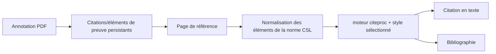

# Lecteur, références et citations

Les domaines frontend strictement typés `features/reader/` et
`features/literature/` gèrent leurs pages, composants locaux, états et tests.
Chacun expose une entrée publique différée, afin de charger indépendamment
la lecture des flux et la recherche bibliographique. Les styles de Literature
conservent leur ordre de cascade dans la fonctionnalité. Les adaptateurs de
requêtes partagés, l'intégration Zotero, la configuration des fournisseurs et
le rendu des citations ne sont pas dupliqués dans ces domaines.

Les routes, le stockage, l'analyse et les sources du Reader résident désormais
dans `backend/domains/reader/`; les dépôts, la recherche, la synchronisation et
le stockage bibliographique dans `backend/domains/literature/`. Les anciens
modules API et de services restent des façades de compatibilité aux contrats
publics inchangés.

L'analyse Reader dépendant du vault, l'accès aux résultats, la reprise,
l'annulation, le complément des articles et la génération de podcasts passent
par un contrôle unique du vault actif. L'absence de contexte renvoie une réponse
récupérable de service indisponible avant toute création de tâche ou de thread ;
les chemins valides et les payloads des routes restent stables. La génération
de podcasts utilise directement le générateur canonique typé des sessions de
base de données et le ferme dans le bloc `finally` existant, sans cast ni
fabrique de sessions dupliquée entre orchestration et persistance.

Les routes HTTP, les modèles canoniques et les services de revue systématique
sont strictement typés. Le comptage PRISMA, les transitions de sélection, les
preuves d'accès ouvert et les exports CSV/JSON/Markdown/SVG résident dans le
domaine pur `review_logic.py` ; les fonctions historiques restent des façades.

## Responsabilité

Ce domaine combine la lecture de flux et de newsletters avec un gestionnaire de références compatible Zotero, le rendu des citations CSL, l'import par identifiant ou depuis le web, la lecture PDF/EPUB et les annotations pouvant servir de preuves citables.

## Ingestion des références

Crossref, Open Library, arXiv, PubMed et les métadonnées HTML possèdent des
normalisateurs typés distincts dans
`backend/domains/vault/citations/normalizers/`. Ils préservent les payloads
Zotero canoniques et le comportement de fonction pure, tandis que
`backend/services/lookup_normalizers.py` reste la façade compatible.

Les références entrent par DOI, ISBN, arXiv, PMID, BibTeX, RIS, fichiers ou URL web. Les résolveurs d'identifiants et le translation-server de Zotero produisent des métadonnées propres aux fournisseurs. Les normalisateurs les convertissent vers le schéma de référence configuré, génèrent une clé de citation stable, dédupliquent les candidats et écrivent un enregistrement dans le vault.

`backend/services/references_io.py` est la frontière typée et déterministe de
BibTeX/RIS. Ses petits assistants d'analyse, de normalisation, de mappage des
champs et de sérialisation préservent l'ordre, l'échappement, la résolution du
type et le contrat public d'import/export, sans persistance ni réseau cachés.
Le déduplicateur pur d'import utilise des structures explicites de métadonnées
et d'index d'identifiants ; sa priorité reste clé de citation, DOI, ISBN puis
titre normalisé. Un élément créé plus tôt dans le même import est ajouté de
manière idempotente aux mêmes index. Les entrées du catalogue CSL et le mapper
déclaratif de Zotero vers Recursos exposent des contrats sérialisables explicites,
tout en conservant les champs supplémentaires arbitraires des fournisseurs à
la frontière JSON externe. Les surlignages de citations gérés par Brain utilisent
les mappings typés SQLAlchemy ; l'unique exception non typée est isolée dans
l'adaptateur facultatif `pypdfium2`, qui ne publie pas de marqueur `py.typed`.

L'orchestration de recherche, strictement en lecture seule, réside dans le domaine
des citations, conserve la priorité DOI → arXiv → PMID → ISBN → URL et fait passer
les URL utilisateur par le téléchargeur protégé contre les SSRF avant toute suggestion.
La table Ressources désignée provient d'une configuration canonique unique ; seuls
les anciens vaults jamais configurés peuvent adopter automatiquement la première
table dotée d'une Citation Key, sous le même verrou que les réglages.

Le serveur de traduction est un service auxiliaire facultatif. Le mode natif peut fonctionner sans lui ; les résolveurs propres aux identifiants et les références existantes continuent de fonctionner. Les échecs de traduction web renvoient des erreurs permettant d'agir, pas un enregistrement vide présenté comme réussi.

`citations/pdf_fallback.py` dérive une référence citable des métadonnées PDF
lorsque la résolution échoue. `citations/web_capture.py` sélectionne et mappe les
résultats Zotero, tandis que `platform/translation_server.py` gère le transport HTTP.

## Découverte académique fédérée

Le plugin intégré Resources gère la configuration des dépôts, tandis que
`/api/vault/reference-table` reste la source de vérité unique de la table
Resources cible. `/literature` exécute chaque connecteur sélectionné indépendamment
et diffuse des résultats partiels. Une erreur de quota ou de fournisseur est
associée à sa source sans supprimer les résultats des sources opérationnelles.
`backend/domains/literature/connectors/` possède le transport HTTPS borné,
l'audit des requêtes, la normalisation canonique, OAI-PMH et JSON personnalisé,
les graphes de citations et les adaptateurs par famille de fournisseurs.
`backend/services/academic_connectors.py` reste uniquement une façade de
compatibilité. Le port typé résout ses collaborateurs à chaque appel afin que
les tests et intégrations puissent remplacer le transport, la validation, les
parseurs et le dispatch sans dupliquer l'état mutable.

`AcademicWork` est le contrat canonique des connecteurs. Les unions déterministes
utilisent, dans l'ordre, le DOI normalisé, le PMID ou PMCID, l'identifiant arXiv
sans version, l'ISBN-13 puis le titre normalisé avec l'année et le nom du premier
auteur. Une similarité approximative de titre n'est qu'un avertissement. Les
travaux fusionnés conservent chaque occurrence de source, emplacement ouvert,
compteur de citations propre au fournisseur, provenance des champs et variante
contradictoire.

L'aperçu est en lecture seule. Ajouter le texte intégral en pièce jointe est
une action manuelle distincte, proposée uniquement pour un emplacement ouvert
vérifié. L'import convertit le travail fusionné via le mapper Resources partagé
compatible Zotero et répète la recherche d'identité sous verrou atomique.
Si un enregistrement Resources correspond déjà, l'API le renvoie au lieu de
créer un doublon.

L'adaptateur d'import précise les types des objets imbriqués des fournisseurs
— publication, identifiants, dates, emplacements en accès ouvert et champs Zotero
supplémentaires — via une frontière de mapping unique avant conversion. Les
payloads des créateurs restent volontairement hétérogènes uniquement à la
frontière Zotero ; les clés déterministes, l'injection des clés de citation,
l'appartenance aux carnets et la réutilisation des doublons restent inchangées.

## Revues de littérature

L'état des revues systématiques réside dans quatre tables du vault gérées de
manière idempotente : `Literature Reviews`, `Literature Activities`,
`Literature Candidates` et `Literature Decisions`, cette dernière ne recevant
que des ajouts. Les stratégies, requêtes exactes aux fournisseurs, erreurs
partielles, opérations IA, décisions de sélection et exports restent ainsi
auditables et synchronisés avec le vault principal.

La sélection par un seul évaluateur et celle en double aveugle partagent les
mêmes phases. En mode aveugle, la décision d'un évaluateur est masquée jusqu'à
la soumission des deux décisions ; les conflits exigent un consensus explicite.
L'IA peut proposer des requêtes modifiables, reclasser, présélectionner ou
synthétiser les métadonnées obtenues, mais ne peut exclure un candidat ni
prétendre disposer de preuves au-delà du titre, résumé ou texte intégral
effectivement fourni. Le repli par chevauchement de tokens et le reclassement
facultatif par embeddings locaux partagent une structure typée d'enregistrement
de classement, préservant le score et l'ordre du rang initial.

Les index OAI et états temporaires de recherche sont reconstructibles et résident
sous `LOCAL_DATA` ; protocoles, historiques, candidats, décisions et artefacts
d'audit restent dans le vault principal. Les identifiants des dépôts utilisent
le Keychain natif ou l'environnement de déploiement, jamais le vault ou l'état
des plugins. Les lignes OAI filtrées conservent la liste canonique typée du
connecteur sans cast a posteriori. L'OCR PDF et l'analyse EPUB facultatifs
limitent leurs exceptions de typage aux imports précis `pypdfium2` et `ebooklib`,
dont les paquets ne publient pas de `py.typed` ; les objets dynamiques ne sortent
pas de l'adaptateur de documents.

## Parcours de citation

Les valeurs CSL sont dérivées du frontmatter des références avec des correspondances explicites de champs. Les listes de noms, dates, types d'éléments, échappements BibTeX/LaTeX et métadonnées Zotero `extra` nécessitent une normalisation. Le schéma épinglé protège les types et champs compatibles contre les évolutions divergentes en amont.

`backend/domains/vault/citations/exporting.py` gère le nettoyage Markdown, le
sous-ensemble de citations, les marqueurs de bibliographie, l'exécution de
Pandoc et l'empaquetage du téléchargement. La route de compatibilité conserve
sa signature publique et injecte les ports de fichiers, CSL et processus.

## Lecteur et annotations

Le lecteur Zotero intégré affiche les PDF et EPUB. Gnosi gère le pont qui localise les fichiers, sert des plages d'octets sûres, reçoit les annotations et relie les preuves sélectionnées aux enregistrements du vault. Les annotations contiennent l'URI source, la page, le type, la géométrie, le texte, le commentaire, les étiquettes, une clé gérée stable et les horodatages.

Les endpoints de fichiers vérifient le confinement et gèrent l'hydratation cloud. Les identifiants persistants des annotations empêchent de dupliquer une citation générée à chaque réouverture du document.

## Flux et newsletters

Les modèles de Reader stockent les sources, articles, états de lecture, contenus
intégraux extraits et un compte de newsletter. L'ingestion utilise des points de
sauvegarde transactionnels pour qu'une entrée malformée n'annule pas tout le lot.
Les extraits et l'extraction du texte intégral sont distincts ; une troncature à
l'ingestion ne doit pas supprimer définitivement un contenu source récupérable.

## Invariants

- Les clés de citation restent stables à moins que l'utilisateur ne modifie explicitement les données d'identité.
- L'importation est dédoublée par des identifiants faisant autorité et des métadonnées normalisées.
- L'échec d'une source fédérée ne peut invalider les résultats déjà renvoyés par les autres.
- La similarité approximative ne fusionne jamais automatiquement des travaux académiques.
- Les métriques de citations restent séparées par fournisseur et ne sont jamais additionnées.
- Les suggestions IA ne deviennent jamais des décisions finales de sélection sans action humaine.
- Les chemins de fichiers lecteurs ne peuvent pas échapper aux racines autorisées.
- L'identité de document et la géométrie de page d'une annotation survivent à des redémarrages.
- Les composants internes du lecteur tiers intégré sont traités comme du code amont ; les modifications locales d'intégration sont explicites et reproductibles.
- Les mots de passe de la configuration de newsletters anciennes sont traités comme des secrets même
quand un ancien modèle expose encore un champ de compatibilité.

## Aspects de vérification

Exécutez les tests de clés de citation, PubMed, types d'éléments, styles CSL,
échappement BibTeX, entrées-sorties de références, annotations, confinement des
chemins, déduplication d'import et points de sauvegarde des flux. Ajoutez les
tests de normalisation des connecteurs, jetons et marqueurs de suppression OAI,
SSRF/XML, erreurs partielles, masquage entre évaluateurs, imports concurrents
et comptages PRISMA. Dans le navigateur, ouvrez un document de test réel et
vérifiez un aller-retour de citation ou d'annotation, puis une recherche
bibliographique progressive, sa provenance et l'import d'un résultat dédupliqué.
