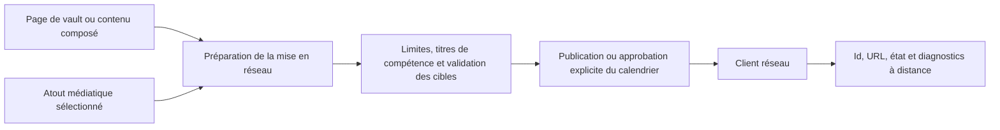

# Édition sociale et médias

## Responsabilité

Ce domaine prépare, programme, publie et observe le contenu sur les réseaux sociaux configurés. Le centre de médias fournit des actifs visuels et des métadonnées réutilisables. L'édition est toujours un effet externe.

## Adaptateurs réseau

Les clients de service isolent Mastodon, Bluesky, Telegram et d'autres sémantiques de réseau configurées : authentification, limites de texte, téléchargement de médias, identifiants de poste, threads, normalisation des réponses et notification d'erreurs.

L'API expose les réseaux configurés, les flux, les actions de publication et les paramètres connexes. Les onglets d'interface utilisateur sont claqués par des identifiants de réseau stables tandis que les noms d'affichage et les étiquettes utilisent des chaînes localisées.

Le JSON des fournisseurs est validé et normalisé à la frontière de
l'adaptateur. Les routes HTTP sont strictement typées tout en conservant le
contrat OpenAPI existant ; le JSON des messages stockés est décodé par des
helpers typés avant d'utiliser aperçus, URL ou publications planifiées.

## Écoulement des publications

La préparation peut traduire ou remodeler le contenu mais ne publie pas par elle-même. La publication immédiate nécessite une action explicite de l'utilisateur; la publication planifiée nécessite un calendrier stocké dont la politique d'exécution autorise la même cible.

## Traitement des médias

Chargement valider le type de fichier, la taille, les racines autorisées et les noms générés. Les médias visualisent les actifs d'index sans traiter les caches ou les miniatures comme des originaux. Une miniature manquante peut être régénérée; la perte de l'actif source ne peut pas.

## Invariants

- Un certificat de réseau est résolu uniquement dans le backend au moment de l'exécution.
- L'aperçu/la préparation et la publication sont des états distincts.
- Les limites de texte et de support sont validées par cible avant l'appel externe.
- Une défaillance partielle multiréseau rapporte chaque résultat et ne prétend pas globale
succès.
- La publication programmée et interactive utilise le même contrat d'adaptateur.
- Les identifiants de poste distant et les URL sont stockés pour les actions d'audit et de suivi.

## Aspects de vérification

Testez le confinement du chargement des médias, l'alignement de la programmation/connexion, la normalisation de la réponse au réseau, les limites de réessai, une défaillance partielle multi-cible, et une boîte de sable ou une publication tapote.
