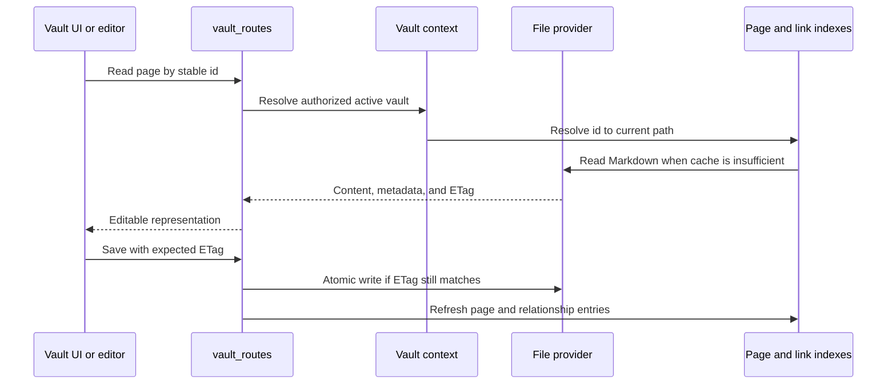

# Vault et fichiers

## Responsabilité

Le domaine de Vault cartographie le marquage portable et les actifs sur les pages, dossiers, pièces jointes, recherches, schémas, histoires, ordures, exportations, citations et sélection multi-vault. C'est le plus grand domaine et le principal propriétaire de la souveraineté des données.

## Cycle de vie de la page

L'identité de la page est séparée du titre et du chemin. La matière avant est normalisée aux limites de l'écriture tandis que les clés autorisées par l'utilisateur sont préservées. `.gnosi` les sidecars lorsqu'ils le déposent devant la matière pollueraient ou déstabiliseraient le contenu portable.

## Index et caches

L'index de page accélère la liste, la résolution d'identification, l'accès au front-mate et la recherche. L'index wikilink résout les liens entrants afin que les renoms de page puissent mettre à jour les références. Les caches de corps et de documents analysés évitent les lectures répétées. Chaque cache est dérivée et doit tolérer une reconstruction froide.

Démarrer charge d'abord des instantanés de disque valides, puis démarre le travail de rafraîchissement. Un scan partiel du fournisseur de fichiers est marqué de manière partielle et ne peut remplacer un cache complet connu. Les défaillances par fichier sont isolées de sorte qu'un marqueur de place en ligne ou orphelin ne supprime pas le reste de la voûte d'une réponse.

## Fournisseurs de fichiers

L'abstraction du fournisseur sélectionne le comportement local, OneDrive, iCloud Drive, Google Drive ou Nextcloud-aware. `Path`; l'adaptateur ajoute la détection de marqueur de place, l'hydratation, la disponibilité et la cartographie de chemin.

Opération Native OneDrive déléguée hydratation à une session GUI `open` Les déploiements de Docker peuvent utiliser un paramètre d'échauffement de l'hôte parce que le conteneur lit traverser une autre limite.

## Pièces jointes et propriétés évaluées par fichier

Les écritures choisissent une cible autorisée sous le coffre-fort actif, normalisent les noms, évitent les collisions et retournent des métadonnées portables. Les liens de fichiers sont re-arrachés à l'heure de lecture pour l'hôte actuel. Téléchargez et supprimez les opérations validez le confinement; un chemin fourni par le client n'est jamais une autorisation suffisante.

## Déchets et opérations de destruction

Suppression ordinaire est récupérable : les pages et les actifs connexes passent par le modèle de corbeille de Vault. Purge est distinct et supprime le contenu ainsi que les métadonnées dérivées et les relations inverses. Suppression du registre de Vault supprime la ligne de registre logique par défaut ; suppression physique du dossier nécessite un signal explicite séparé et des contrôles de confinement plus forts.

## Modèles de value

Le dépôt de template est un catalogue d'exécution signé; les actifs du paquet ne sont pas suivis dans le dépôt de l'application Git. Créer à partir d'un modèle vérifie la signature d'index détaché, le paquet SHA-256, signature de l'éditeur, manifeste, inventaire de fichiers, limites d'archives, chemins, types de fichiers et liens avant l'écriture. L'extraction se produit dans un répertoire de mise en scène de frères sous la racine de Vaults. Le répertoire complété est déplacé en place atomiquement et seulement alors enregistré dans la base de données de gestion, de sorte qu'un échec ne peut pas exposer un Vault partiel.

L'exportation est basée sur la liste et déterministe. `.gnosi`, plugins, magasins de confiance, courrier, ordure, historique, contenu exécutable, fichiers d'environnement, liens, fichiers illisibles et contenu surdimensionné. Un aperçu liste chaque fichier inclus et exclu et scanne les fichiers texte limités pour des valeurs de type de certification. Les résultats nécessitent une reconnaissance explicite. Les plugins recommandés sont des identifiants dans le manifeste; le code exécutable du plugin ne voyage jamais dans un modèle de Vault.

La soumission publique est distincte de l'exportation et nécessite l'accès de l'administrateur. Elle utilise un courtier de modération optionnel plutôt qu'un certificat GitHub intégré dans Gnosi.

## Invariants de monnaie

- Stale ETags rejette les écrasements.
- Le registre et la création de notes quotidiennes utilisent des contrôles de sécurité de course.
- Les mises à jour de page, de registre, d'index de lien et de sidecar demeurent cohérentes après une
renommer ou supprimer.
- Les chemins absolus reçus d'un client sont réglés sous des racines approuvées.
- Les liens Sym et le chemin traversé ne peuvent pas échapper à la limite de la voûte sélectionnée.
- L'extraction de template ne peut pas publier un répertoire partiel ou l'enregistrer tôt.
- Les exportations de modèles ne peuvent pas inclure l'état d'exécution ou le contenu du plugin exécutable.
- Les voyages aller-retour Markdown préservent le contenu sensible à l'évasion et la syntaxe wikilink.

## Frontière

`VaultDashboard` possède l'historique de navigation et sélectionne les pages, tables, dessins, galeries, tableaux, calendriers, chronologies, flux ou surfaces de lecteurs. `VaultShell` fournit le frame; composants spécialisés implémentent des éditeurs et des vues. Le frontend cache l'état d'interaction mais traite le contenu de la page de backend et les ETags comme faisant autorité.

## Aspects de vérification

Exécutez la concurrence ETag, le confinement de chemin, l'E/S sûr, la course de registre, le renomme, la poubelle/purge, la numérotation des pièces jointes, la relation, l'index rafraîchissement, et les flux représentatifs de Playwright Vault. Les incidents avec le fournisseur de nuages nécessitent également une réelle lecture de marqueur de place parce que les tests locaux de fixation ne peuvent pas reproduire le comportement du fournisseur de fichiers.
