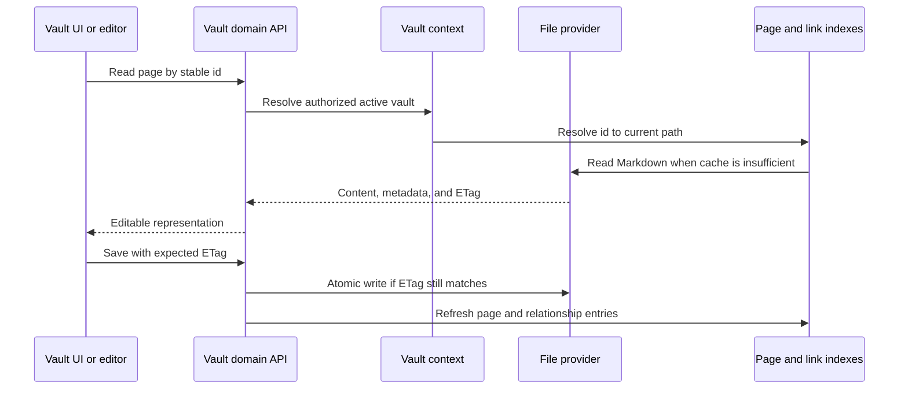

# Vault et fichiers

## Responsabilité

Le domaine de Vault cartographie le marquage portable et les actifs sur les pages, dossiers, pièces jointes, recherches, schémas, histoires, ordures, exportations, citations et sélection multi-vault. C'est le plus grand domaine et le principal propriétaire de la souveraineté des données.

## Cycle de vie de la page

L'identité de la page est séparée du titre et du chemin. La matière avant est normalisée aux limites de l'écriture tandis que les clés autorisées par l'utilisateur sont préservées. `.gnosi` les sidecars lorsqu'ils le déposent devant la matière pollueraient ou déstabiliseraient le contenu portable.

`pages/markdown_writer.py` est la frontière canonique de sérialisation: il
récupère ou crée l'identifiant stable, transforme les clés de schéma, retire les
champs virtuels, stocke l'état interne dans le sidecar, décore les relations
portables et matérialise les vues avant l'écriture atomique.

`pages/save_helpers.py` prend en charge la préparation des métadonnées des
enregistrements complets, le choix de la destination, la réutilisation des
fichiers par ID et la création d'une version avant écriture.
`pages/patch_helpers.py` prend en charge les lectures avec ETag, la préparation
des métadonnées PATCH, le déplacement des fichiers et la mise à jour coordonnée
des caches de pages, de corps, de citations et de documents analysés. Les huit
noms privés historiques restent des façades de compatibilité minces, et chaque
collaborateur remplaçable ou cache mutable est résolu par un port typé
late-bound.

## Limites de l'arrière-pays

Page lit et écrit, prévisualise, duplication, historique, et les déchets sont implémentés sous `backend/domains/vault`. Ce paquet sépare les schémas de requête stricts, les adaptateurs de route, les services d'application, les dépôts, et le propriétaire unique des caches et verrous de page. Le nouveau comportement de Vault appartient à cette limite de domaine.

`backend/api/vault_routes.py` Il injecte les opérations de plate-forme existantes et les réexportations supportées par les symboles Python, mais il ne possède pas les gestionnaires de pages extraits. La migration préserve les chemins HTTP, les codes d'état, les charges utiles, les dépendances, les rappels d'arrière-plan et le document déterministe OpenAPI. Chaque extraction doit réduire l'allocation de garde-fonte de la façade; il ne peut jamais ajouter une nouvelle exception pour le code sous `backend/domains`.

Le cycle de vie des traductions appartient à
`backend/domains/vault/translation` : le chargement facultatif des
fournisseurs, la récupération des fichiers cloud, la traduction des lignes et
des pages, les effets minimaux de métadonnées et la propagation de l'obsolescence
sont des services typés séparés. La publication des lignes vers Drupal
appartient à `backend/domains/vault/drupal`, qui sépare le mappage des champs et
de l'identité, la préparation des médias locaux, la conversion de Markdown et
des wikilinks, les caches de langues, la correspondance par titre et la
synchronisation idempotente des nœuds. La façade conserve les décorateurs et
docstrings FastAPI d'origine ainsi que les seams Python résolus tardivement,
tandis que le connecteur Drupal reste la frontière de transport externe. Les
routes, payloads, codes d'état, tâches d'arrière-plan et l'ordre des routes ne
changent pas.

## Index et caches

L'index de page accélère la liste, la résolution d'identification, l'accès au front-mate et la recherche. L'index wikilink résout les liens entrants afin que les renoms de page puissent mettre à jour les références. Les caches de corps et de documents analysés évitent les lectures répétées. Chaque cache est dérivée et doit tolérer une reconstruction froide.

`links/document_inventory.py` gère l'inventaire TTL par vault des liens globaux.
Il exclut l'historique et la corbeille, isole les fichiers illisibles, inclut les
tableaux de bord JSON et parcourt le disque si l'index fournisseur est indisponible.
`links/document_cache.py` gère les caches persistants du corps Markdown et du
frontmatter analysé, invalidés par mtime. La façade injecte uniquement les
chemins actifs, le parseur et l'écriture JSON sûre ; le comportement reste
indépendant du fournisseur de fichiers.

Démarrer charge d'abord des instantanés de disque valides, puis démarre le travail de rafraîchissement. Un scan partiel du fournisseur de fichiers est marqué de manière partielle et ne peut remplacer un cache complet connu. Les défaillances par fichier sont isolées de sorte qu'un marqueur de place en ligne ou orphelin ne supprime pas le reste de la voûte d'une réponse.

`pages/index_entries.py` est responsable des lectures bornées du frontmatter,
des nouvelles tentatives lors des verrous du fournisseur et de la normalisation
des entrées de cache. `pages/index_service.py` gère la découverte, le
rafraîchissement, la table inverse des identifiants et les instantanés
dédoublonnés. `pages/resolver.py` résout les identifiants stables, les UUID
canoniques, les titres indexés et les analyses à froid bornées.
`pages/tags.py` agrège les étiquettes du frontmatter et des colonnes sémantiques
des tables, dédupliquées par page. La façade
injecte les ports du coffre actif, du registre, du calendrier et du cache; ces
services n'importent pas les routes HTTP.

## Fournisseurs de fichiers

L'abstraction du fournisseur sélectionne le comportement local, générique de macOS File Provider, OneDrive, iCloud Drive, Google Drive, Nextcloud ou Dropbox-aware. `Path`; l'adaptateur ajoute la détection, l'hydratation, la disponibilité et la cartographie des chemins. `GNOSI_FILES_PROVIDER` explicitement lorsque la détection automatique du chemin est ambiguë.

Le temps d'exécution des fichiers sur demande est neutre pour le fournisseur. Google Drive, iCloud et Nextcloud n'héritent pas du comportement de récupération OneDrive; seulement `OneDriveProvider` peut redémarrer le client OneDrive après une défaillance d'hydratation limitée. Les fournisseurs macOS natifs utilisent une session GUI `open` Les déploiements Docker peuvent utiliser un helper d'hôte configuré parce que le conteneur lit traverser une autre limite.

Les chemins du fournisseur de fichiers Dropbox sont détectés explicitement. Un service inconnu sous macOS `~/Library/CloudStorage` utilise le produit sans effet secondaire `fileprovider` adaptateur; tout dossier entièrement synchronisé ou monté ordinaire utilise `local`. Un nouvel adaptateur nommé n'est nécessaire que pour un signal différent de marqueur de place ou un mécanisme d'hydratation spécifique au fournisseur. `GNOSI_DATA_DIR` reste local, indépendamment du fournisseur de coffre.

Seuls le Markdown portable et les pièces jointes du coffre peuvent résider dans
une arborescence synchronisée. Les bases SQLite, les verrous, les caches
dérivés, les secrets et `GNOSI_DATA_DIR` restent dans le stockage local de
l'application. Un dossier Nextcloud entièrement synchronisé fonctionne comme
`local`; les fichiers virtuels exigent l'adaptateur correspondant ou
`fileprovider`. WebDAV et les API cloud directes sont des transports d'import,
d'export ou de sauvegarde, pas un stockage actif pour SQLite. La destination
des sauvegardes est indépendante du fournisseur du coffre.

## Pièces jointes et propriétés évaluées par fichier

Les écritures choisissent une cible autorisée sous le coffre-fort actif, normalisent les noms, évitent les collisions et retournent des métadonnées portables. Les liens de fichiers sont re-arrachés à l'heure de lecture pour l'hôte actuel. Téléchargez et supprimez les opérations validez le confinement; un chemin fourni par le client n'est jamais une autorisation suffisante.

## Déchets et opérations de destruction

Suppression ordinaire est récupérable : les pages et les actifs connexes passent par le modèle de corbeille de Vault. Purge est distinct et supprime le contenu ainsi que les métadonnées dérivées et les relations inverses. `trash/purge.py` gère le passage irréversible sur les fichiers et le nettoyage de l'historique, des métadonnées latérales et des commentaires via des ports injectés. Suppression du registre de Vault supprime la ligne de registre logique par défaut ; suppression physique du dossier nécessite un signal explicite séparé et des contrôles de confinement plus forts.

## Modèles de value

Le dépôt de template est un catalogue d'exécution signé; les actifs du paquet ne sont pas suivis dans le dépôt de l'application Git. Créer à partir d'un modèle vérifie la signature d'index détaché, le paquet SHA-256, signature de l'éditeur, manifeste, inventaire de fichiers, limites d'archives, chemins, types de fichiers et liens avant l'écriture. L'extraction se produit dans un répertoire de mise en scène de frères sous la racine de Vaults. Le répertoire complété est déplacé en place atomiquement et seulement alors enregistré dans la base de données de gestion, de sorte qu'un échec ne peut pas exposer un Vault partiel.

L'exportation est basée sur la liste et déterministe. `.gnosi`, plugins, magasins de confiance, courrier, ordure, historique, contenu exécutable, fichiers d'environnement, liens, fichiers illisibles et contenu surdimensionné. Un aperçu liste chaque fichier inclus et exclu et scanne les fichiers texte limités pour des valeurs de type de certification. Les résultats nécessitent une reconnaissance explicite. Les plugins recommandés sont des identifiants dans le manifeste; le code exécutable du plugin ne voyage jamais dans un modèle de Vault.

La soumission publique est distincte de l'exportation et nécessite l'accès de l'administrateur. Elle utilise un courtier de modération optionnel plutôt qu'un certificat GitHub intégré dans Gnosi.

## Invariants de monnaie

`daily/service.py` gère, indépendamment du fournisseur, la découverte par
dossier ou table, la normalisation des dates, les modèles, la liste et la
création atomique des notes quotidiennes. La façade conserve les décorateurs
FastAPI publics et injecte les commandes de page résolues tardivement.

- Stale ETags rejette les écrasements.
- Le registre et la création de notes quotidiennes utilisent des contrôles de sécurité de course.
- Les mises à jour de page, de registre, d'index de lien et de sidecar demeurent cohérentes après une
renommer ou supprimer.
- Les chemins absolus reçus d'un client sont réglés sous des racines approuvées.
- Les liens Sym et le chemin traversé ne peuvent pas échapper à la limite de la voûte sélectionnée.
- L'extraction de template ne peut pas publier un répertoire partiel ou l'enregistrer tôt.
- Les exportations de modèles ne peuvent pas inclure l'état d'exécution ou le contenu du plugin exécutable.
- Les voyages aller-retour Markdown préservent le contenu sensible à l'évasion et la syntaxe wikilink.

## Frontière

`VaultDashboard` possède l'historique de navigation et sélectionne les pages, tables, dessins, galeries, tableaux, calendriers, chronologies, flux ou surfaces de lecteurs. `VaultShell` fournit le frame; composants spécialisés implémentent des éditeurs et des vues. Le frontend cache l'état d'interaction mais traite le contenu de la page de backend et les ETags comme faisant autorité.

## Aspects de vérification

Exécutez la concurrence ETag, le confinement de chemin, l'E/S sûr, la course de registre, le renomme, la poubelle/purge, la numérotation des pièces jointes, la relation, l'index rafraîchissement, et les flux représentatifs de Playwright Vault. Les incidents avec le fournisseur de nuages nécessitent également une réelle lecture de marqueur de place parce que les tests locaux de fixation ne peuvent pas reproduire le comportement du fournisseur de fichiers.
